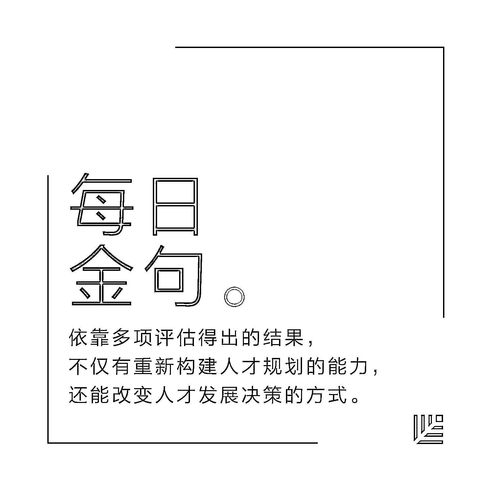
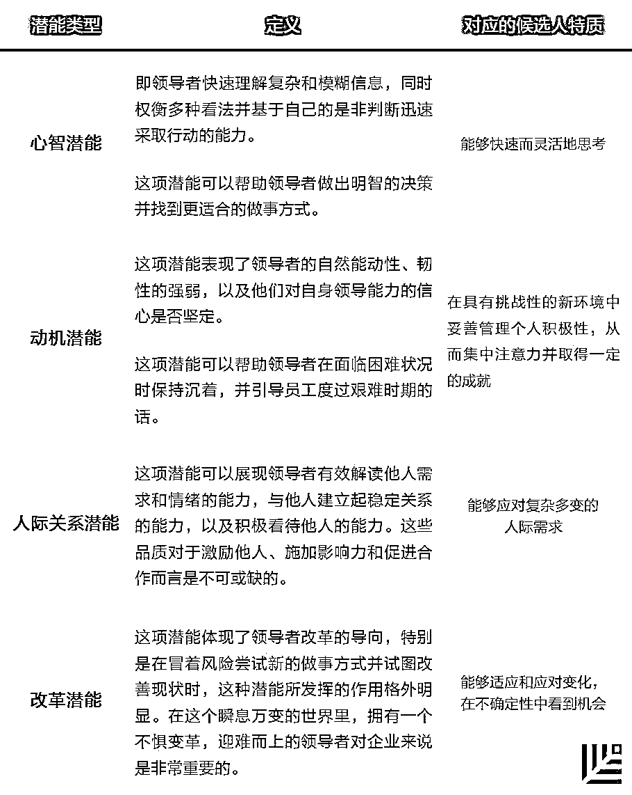

# 注意：在选拔公司管理层时，让数据说话｜首席人才官·选

> 原文：[`mp.weixin.qq.com/s?__biz=MzAwODE5NDg3NQ==&mid=2651223327&idx=1&sn=abf07923ea51c7ff54d9a25ceac9b66b&chksm=80804b4bb7f7c25ded04db5fc8ed9eddddd3893ca0409e517c97028a2fd01ad6a21f83780ce0&scene=21#wechat_redirect`](http://mp.weixin.qq.com/s?__biz=MzAwODE5NDg3NQ==&mid=2651223327&idx=1&sn=abf07923ea51c7ff54d9a25ceac9b66b&chksm=80804b4bb7f7c25ded04db5fc8ed9eddddd3893ca0409e517c97028a2fd01ad6a21f83780ce0&scene=21#wechat_redirect)

公司是如何选拔管理层员工的？按照传统的方法，领导人会依靠主观意识做出判断，他们也许会认为：

此候选人熟练掌握了某一项技巧，那么他应该也能出色地完成其他类型的任务；

此候选人善于雄辩、性格外向；

此候选人看起来具备领导力；

......

不难发现，“主观判断法”难免会掺杂偏见，为保证晋升的公平性和多样性，是时候以数据为导向来挖掘和晋升领导者了。

德勤咨询的两位专家 Dr. Stacey Philpot 和 Dr. Kelly Monahan 基于多年的研究成果，近日在《斯隆管理评论》上撰文，为公司管理层的选拔制定了科学的“潜能指标”，并就如何在领导选拔过程中使用“数据驱动法”提出了建设性意见。以下是部分要点摘录：

*   高层管理者与中层管理者的差异，其实主要表现在人格、逻辑推理、业务和领导能力方面；

*   基于数据的评估方法，有助于指导管理人员了解员工的经验差异，以及员工是否有能力承担起与以往有所不同的新职责；

*   “潜能指标”得分高，且同时表现出恰当行为能力，这样的领导者往往可以获得很大成就；

*   依靠多项指标得出的结果，不仅有助于重新构建人才规划能力，还能改变人才发展决策的方式。

**在**如今的商业环境中，薄弱的领导力会成为企业面临的最大障碍。因此，拥有强大的人才库是企业成功的关键。

尽管增强领导层的多样性是促进公司内部达成高绩效的要诀，但在绝大多数企业中，级别层次越高，领导层的多样性反而越低，高层管理人员结构的单一化十分严重。为什么会这样？

许多高管都认为自己善于发现领导才能，然而，当被问及决策方法时，他们往往声称自己凭借的是直觉或“本能”，而不是规则或数据。

科学研究结果表明，仅依靠个人主观力量很难准确判断谁会成为高效的领导者。而在招聘员工时，管理者总是倾向于寻找并选择那些讨人喜欢，极富魅力又与自己有相似之处的求职者。

此外，他们还趋向于认为：如果某个人熟练掌握了某种技巧，那他应该也可以出色地完成其他任务，甚至是与该技能毫不相关的任务。这种“光环效应”解释了多种偏见的成因，例如，那些善于雄辩的人常常会被认为具有成为领袖人物的潜质，但这只是一厢情愿的想法。

**发现领导潜能**

为提高晋升的公平性和多样性，很多公司会采用一些方法来改善决策，比如“九宫格”。这是在人力资源领域常用的一种方法，它可以帮助管理人员对员工的绩效进行排名，以衡量员工成为未来领导者的潜能。

然而，这种方法仍无法摆脱主观偏见的影响，对潜能的评估仍具有高度的主观性。

我们的研究团队耗费 20 多年时间，与来自 40 个国家的高级领导者进行了合计超过 10 万小时的访谈，并完成了 2.2 万多次领导心理评估，试图探索出一种更客观、可衡量性更强的个人领导潜能评估方法。

除专项访谈外，我们还使用了人格调查问卷，即霍根人格发展调查方法（一种衡量 11 种绩效“脱轨”因素的性格调查问卷）和一般性的心智能力测试来测量个体差异。

为了检测出不同经验和职责的领导人之间存在的差异，以及更好地理解有些人晋升的速度为何更快，我们从 2016 年的数据库中抽取了两个分组进行比较：高层管理者和中层管理者。这些调查对象来自多种不同行业，曾在跨国公司的多个职能部门任职。

**我们发现高层管理者与中层管理者的差异，主要表现在人格、逻辑推理、业务和领导能力方面。具体来说，高层管理者实现目标的积极性通常比中层管理者更高，且管理压力的能力更强。此外，高层管理者分组的成员更善于进行分析性和创造性思考。**

通过这个研究，我们总结出了四种特定类型的潜能，这些潜能可以预测一个人成长为领导并承担起更多责任的速度。

在心智、动机、社交和情感能力，以及变革驾驭能力方面获得高分的领导者晋升的速度更快。当然，这些结果剔除了性别、地区和行业因素。

**领导潜能的四种类型**

不同类型的潜能可以当作具体的衡量指标，来评估一个人成长为领导并承担起更多责任的速度。

来源：德勤会计师事务所

举例来说：

▌心智潜能高的人能够快速评估并衡量复杂和模糊的信息，并进一步做出正确的决策。

▌动机潜能高的人会表现出强大的韧性以及对自己的领导能力拥有坚定的信心；而这一方面得分较低的人在面对新出现的未知情形时可能很难坚持下去。

▌人际关系潜能强大的人都很善解人意，且比那些得分更低的人更善于建立人际关系。

▌变革潜能高的领导者敢于走出舒适区进行创新，并勇于承担风险；那些更厌恶变化的人则难以对抗现状。

**使用数据驱动的评估方法**

这些发现是否意味着那些在潜能指标上得分较低的人不能成为领导者？并非如此。

研究表明那些得分较低的人可能只是需要更多时间来进行领导力的培养。同样地，我们发现仅仅在领导潜能上得高分也并不能完全保证成功。

从长远来看，领导者想要获得成功的话，就必须具备良好的商业判断力、设定方向的能力以及激励和影响他人的能力。**潜能指标得分高，且同时表现出恰当行为能力的领导者往往可以取得更大的成就。**

增强职场的多样性和包容性需要的不仅仅是理解偏见，还需要纠正偏见。实现这一目标的最佳方式是：应用始终如一的潜能定义，并利用清晰的数据驱动评估手段来找出未来的领导者。就如同企业利用数据和控制手段来做财务决策一样。

以数据为基础的潜能评估方法有很多。例如，人们经常通过可观察的行为来评估人们的积极性，比方说观察他们上班时来得有多早或留得有多晚。然而，已经有人证明了这种方法并不是特别可靠，而且也不是什么有效的积极性预测手段。

**评估一个人的领导效率时，行为式面试或心理测量调查的结果往往可以提供更准确的信息。**

 **寻找隐藏的宝藏**

在选拔领导者的过程中，如何以数据为基础进行评估？

我们建议使用那些拥有大批受众的筛选工具。例如，在线测评。它不仅能用来衡量员工在心智、动机、情绪能力以及高度不确定性应对方面的能力，而且成本相对较低，可以大规模使用。

我们之前合作过的一个公司希望提高领导力发展培训的回报率，并以“九宫格”的方式进行评估；而我们曾服务过的另一个公司考虑到“九宫格”本身不够完善，打算严格化管理新一代领导者的甄选流程，但由于大多数员工在分支机构工作，管理层很难直接观察领导者候选人的情况。

这两个组织面临着不同的挑战，但最终获得的结果是一样的：他们的人才库缺乏多样性，而且领导者对他们的领导能力缺乏信心。

为了改善这一局面，我们建议他们使用测评工具来审查领导潜能。现在，这两个公司的管理人员以我们研究中确定的四个维度：心智、动机、情感能力和应对变化的能力为基础，引入了在线测评的方法来评估他们的团队成员，然后把测评生成的得分与常见的绩效考核数据相结合，再应用到继任规划的谈话中。

测评还有另一项优点：为公司提供了剔除种族、性别或民族因素后的具体领导潜能定义，保持了定义的一致性。

在这些方法的帮助下，管理层已经发现自己获得了找出“隐藏宝石”的能力，识别默默无闻或领导潜能待挖掘的员工。除此之外，也能更好地获得那些在行事低调部门里工作的分支机构员工的情况。

最为重要的一点是，**这些方法有助于指导管理人员了解员工的经验差异，以及员工是否有能力承担起与以往不同的新职责。统一的定义可以给员工带来更强的公平感。**

 **采用数据驱动的方法**

在选拔领导者的过程中，如何使用以数据驱动的方法？对此，我们提供两条建议。

▌首先，要赋予领导潜能连贯而严谨且适用于整个组织的定义。

组织可能会因评估潜能的标准过于主观或相互矛盾而错误地淘汰潜力股，这样的例子不胜枚举。而明确、连贯的领导潜能定义可以减少产生偏见的可能性，增强多样性，并确保组织把握时机，在高潜能员工的职业生涯早期就进行投资，从而节省人才培养的成本。另外，把当前的表现与未来的领导潜能相混淆是一种常见的错误。

▌其次，使用多个时间点的数据。

尽管只要有人参与的评估，就会受到主观看法的影响，但如果有好的数据，我们关注的焦点就会随之变化。我们建议使用基于数据的评估方法，而不是在多个时间点上都使用相同的标准来衡量人才。依靠多项评估得出的结果，不仅有重新构建人才规划的能力，还能改变人才发展决策的方式。

**点击文末“阅读原文”查看**

**红杉资本中国基金**

**成员企业 2018 校园招聘**

