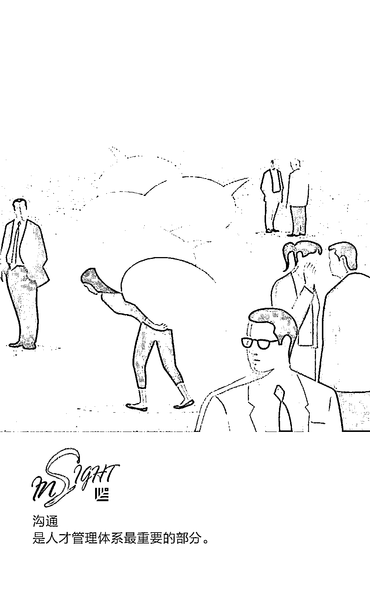

# 留不住、招不到？可能是人才管理体系出了问题｜首席人才官

> 原文：[`mp.weixin.qq.com/s?__biz=MzAwODE5NDg3NQ==&mid=2651225209&idx=1&sn=e2efb78e284660702acf8d8e73c61ced&chksm=8080422db7f7cb3b11cd972b42e94767a9dfe49f16d7e3552ab1787c88585937ce8134191599&scene=21#wechat_redirect`](http://mp.weixin.qq.com/s?__biz=MzAwODE5NDg3NQ==&mid=2651225209&idx=1&sn=e2efb78e284660702acf8d8e73c61ced&chksm=8080422db7f7cb3b11cd972b42e94767a9dfe49f16d7e3552ab1787c88585937ce8134191599&scene=21#wechat_redirect)

人才管理体系旨在帮助企业吸引、培养和留用最拔尖的人才。若想最大程度激发团队成员的才能并吸引更多优秀人才加入你的团队，就需要构建一个健全的人才管理体系。

在打造人才管理体系前，我们应该抱着这样的心态：员工是企业的重要组成部分，他们赋予企业热情，塑造企业性格，并通过辛勤工作为企业创造独特的资产。而非把员工当成工作机器，并认为他们可以随意更换。

只有充分认识员工的才华，关注他们独特的优势与兴趣，企业管理者才能更好地研究如何依靠这些人才为公司谋求更好的发展。

那么如何打造人才管理体系？本文提出了具体方式以及需要解决的 8 个核心问题。

“如今的员工希望他们是因为能胜任这个岗位才被聘用，也希望得到企业持续栽培，不断取得进步，实现自我突破，”国际教练联合会（ICF）认证企业高管教练员 Michael Cauley 如是说。“他们希望自己的努力被认可、付出得到回报，同时获得更好的成长和发展空间，因此他们更愿意去人才管理体系非常健全的企业。”

Cauley 把人才管理比作谈恋爱。例如在确定关系前，人们总喜欢在另一半身上找到某些自己欣赏的特质，才会忠诚于斯，患难与共。只要双方都为这段关系付出努力，相互尊重，就可以一直保持良好的关系，相互遵守承诺。

雇主和员工的关系也是如此。人才管理体系的存在是为了支持员工更好地工作和成长，而不是试图改变他们。这对每个企业来说都至关重要。然而，根据《美国快报》（American Express）的研究发现，只有 23%的企业高管把人才管理看作是一项重要的工作。这就足以解释为什么有些企业人员流动率高、参与度低。

如果你希望发挥现有员工的最大才能，并持续吸引新人才的加入，就需要采用一套高效的人才管理体系。以下是具体方式：

**利用企业愿景与价值观**

**打造人才管理体系**

North Highland 咨询公司人才管理与企业发展能力部的经理 Kevin Zobel 认为，人才管理体系最重要的部分就是沟通。

Zobel 说道，“建立体系的第一步就是要确保公司内部有期望值建设、培训、双向反馈的渠道，以促成可持续且完整的人才管理和绩效发展闭环。”

透明度是其中关键。金钱奖励、高大上的办公环境都是十分诱人的刺激因素，但这并非员工们真正想要的。他们更希望与公司拥有共同的愿景和价值观。这就是为什么，在企业创立初期就明确使命如此重要的原因。

“企业必须明确自己的定位。想获得什么？在发展过程中想成为什么样子？”Cauley 说，“这可能就要企业提出自己的使命宣言、企业目标以及一系列坚定的价值观。”

“考虑到现在的劳动力市场供需关系十分紧张，你的企业或团队能够为一个最终会与你并肩作战的潜在候选人提供不一样的体验就变得非常重要，”Monster.com 的首席营销官 Jonathan Beamer 补充道。“若想提供不一样的体验，可以从分享企业价值观开始，讲述这些价值观背后的故事。但你所说的一切要在候选人入职后兑现，不能只是耍耍嘴皮子。”

Cauley 还说，企业愿景和价值观会全方位影响人才管理体系，包括聘、用、留以及员工发展等等。例如，候选人经验丰富且极具才华，但你们的目标不一致，那么即使你聘用了 Ta，Ta 也不会按照你需要的方式来服务公司。又或者说，一位现有员工的工作方式不能很好地完成企业使命，那么通过人才管理体系，管理者就能帮助企业和那位员工解决这个问题。

Cauley 补充说，“利用企业愿景与价值观来打造整个人才管理体系，就能实现一个和谐的工作环境，让所有部门和员工都专注于同一个目标上。”

**人才管理体系需要解决的**

**核心问题**

Zobel 列举了在打造人才管理体系的过程中需要解决的一些核心问题，处理好这些问题有助于你构建良好的人才管理体系：

▨ **组织与职位设计  **

哪些技能、能力与绩效能更好地帮助你实现目标？

▨ **全员规划  **

明确了你所需团队成员的能力后，如何帮助他们不断提升自己的能力？其中哪些关键能力需要通过招聘新人弥补？哪些可以通过培训和指导获得？

▨ **人才获取**

如何才能接触、筛选和聘用到技能、能力和性格等方面都让你称心如意的人才？

▨ **迎新和入职培训**

迎新准备工作如何？入职培训包括什么？如何保证高效进行既定的期望值设定、团队融合以及企业文化的同化？

▨ **学习和培养**

为了确保每一位员工与企业目标方向保持一致，如何为他们量身打造培养方案？如何把这样的培养融入到员工日常的表现、管理、反馈和指导？

▨ **绩效管理**

如何持续为员工提供绩效回顾、评估、反馈和规划的机会？如何确保员工已经清晰地明白了公司对他们的期待，并在公司树立一种注重指导和绩效的文化？

▨ **领导力发展**

如何评估员工的绩效和潜力？如何培养高潜人才，让他们为未来担任领导职位做好准备？

▨** 员工参与度**

如何持续测量员工参与度？如何让员工的工作与公司的愿景、目标、信仰、角色和价值观保持一致？

“对于小企业而言，想要探索如何建立起高效的人才管理体系，很重要的一点就是去关注那些对团队或企业影响最大的因素和条件。”Zobel 说。

Zobel 建议人们在评估现实与理想的差距之前，首先关注学习与发展、绩效管理、领导力发展以及员工参与度。但他也补充道，如果企业正经历一段快速发展时期，应该更多地关注那些关乎企业基础的部分。

** 推荐阅读**

壹

[爆款的诞生：健康的产品要满足哪些指标？](http://mp.weixin.qq.com/s?__biz=MzAwODE5NDg3NQ==&mid=2651225205&idx=1&sn=f1f4b328f5ff80db9953bbb86ab06837&chksm=80804221b7f7cb37a32599eae59767be28b65e6262e3b7fd6d6ec6b13d029eb075b2fbc4ddd0&scene=21#wechat_redirect)

贰

[告别传统 HR 部门，谷歌们的用意是？](http://mp.weixin.qq.com/s?__biz=MzAwODE5NDg3NQ==&mid=2651225174&idx=1&sn=41ac3b708e1f7b858f8a496531c3e162&chksm=80804202b7f7cb14812a94f5179492ea3c31f05a0c11622e6883ac316b8d88a2ff9cb8db1eaf&scene=21#wechat_redirect)

叁

[创业企业都应该学习的亚马逊 14 条领导力原则](http://mp.weixin.qq.com/s?__biz=MzAwODE5NDg3NQ==&mid=2651225184&idx=1&sn=1911ebd5e4704cf4105b59bf273d1207&chksm=80804234b7f7cb22800ca9f3db8690c6f99554d5cea57e4a3a93ba0e691ca561920f83c23d0a&scene=21#wechat_redirect)

肆

[毛大庆说世界杯：把每天都当做人生的淘汰赛](http://mp.weixin.qq.com/s?__biz=MzAwODE5NDg3NQ==&mid=2651225190&idx=1&sn=b4a9a269676fde2669664252def2715a&chksm=80804232b7f7cb2414a4dcb8bb3722c2885976fcd13b5b6f40ae548bedc2cbee8cb3d60455e3&scene=21#wechat_redirect)

伍

[专属修习 ▎博学笃志、切问近思，与“耶鲁大师”面对面](http://mp.weixin.qq.com/s?__biz=MzAwODE5NDg3NQ==&mid=2651225201&idx=1&sn=fca74dccaf7336e78d954cb028f6ba7d&chksm=80804225b7f7cb3304f25e03ffd3545bdf300c85c0504f1a3dcf293bed1c01848dcbf86698df&scene=21#wechat_redirect)

