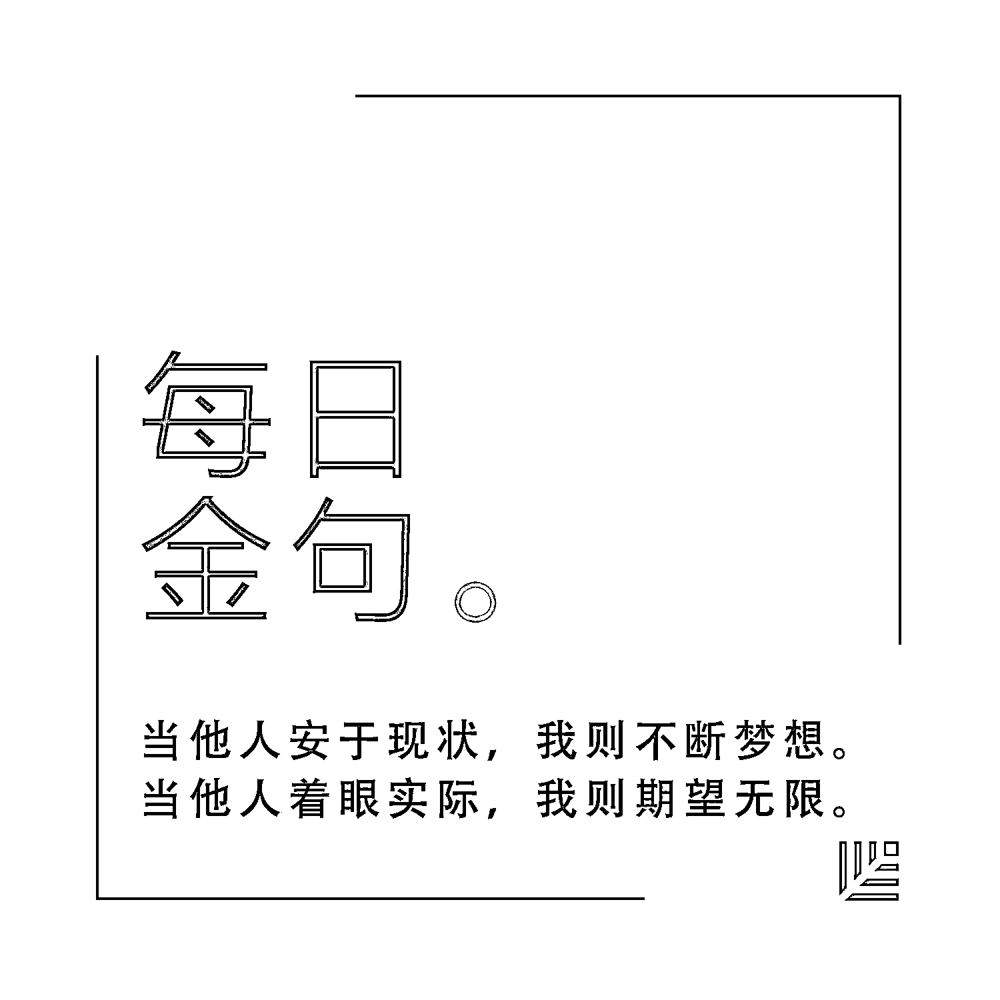
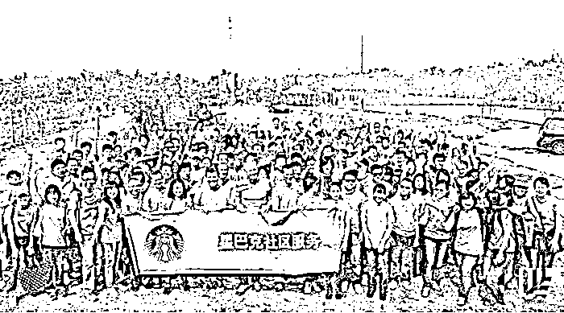

# 星巴克的员工为什么挖不走？| 首席人才官·留

> 原文：[`mp.weixin.qq.com/s?__biz=MzAwODE5NDg3NQ==&mid=2651223256&idx=1&sn=ea075526123e0520158f849376fb708a&chksm=80804a8cb7f7c39a0c6aea32b4aff9640401b97d1e957ac316a66c657f4aeac8000b1d28a2eb&scene=21#wechat_redirect`](http://mp.weixin.qq.com/s?__biz=MzAwODE5NDg3NQ==&mid=2651223256&idx=1&sn=ea075526123e0520158f849376fb708a&chksm=80804a8cb7f7c39a0c6aea32b4aff9640401b97d1e957ac316a66c657f4aeac8000b1d28a2eb&scene=21#wechat_redirect)

“星巴克的员工为什么挖不走”成了某段时间的网络热搜词。当被问及这个问题时，星巴克中国区人力资源副总裁余华说：“也有猎头公司的人常常问我，我们看上了办公室楼下的星巴克店经理，但死活就是挖不走。你们星巴克的人为什么这么难挖？”

想要知道这背后的秘诀，就要更深入地了解星巴克的文化理念。领英对星巴克中国区人力资源副总裁余华进行了专访，部分要点摘录如下：

*   人文精神不仅是我们不懈努力的核心目标，也是驱动我们一路向前的动力；

*   星巴克独特的“伙伴文化”不仅仅贯穿在公司日常的宣传和称谓中，更是通过点点滴滴的行动将公司的诚意注入每一位伙伴的心中；

*   星巴克坚信，要顾客满意，首先是要员工满意；

*   星巴克在实现盈利的同时，始终与星巴克伙伴以及所在社区共同分享成功，也是公司对员工敬业、热情及创新精神的认可。

**2**017 年 4 月 11 日，星巴克董事会执行主席霍华德·舒尔茨宣布：自今年 6 月 1 日起，所有在星巴克中国自营市场工作满两年且父母年龄低于 75 周岁的全职伙伴（员工）都将享受到一项全新的“父母关爱计划”——由公司全资提供的父母重疾保险。

这一计划可能每年要付出数百万美元，为什么星巴克要做如此巨大的投入？舒尔茨表示：“我们始终相信，最好的成功是与彼此分享。我很高兴能够亲自向中国的伙伴们宣布这项面向他们父母的关爱计划，这不仅是向中国传统家文化的致敬，更是基于星巴克一直以来珍视伙伴价值的企业理念。”

星巴克将人文精神作为企业文化的核心，正如舒尔茨所说：“自始至终，引领我们不断前行的使命就是一切从人文视角出发，将星巴克打造成一家值得尊敬和信任的公司。**人文精神不仅是我们不懈努力的核心目标，也是驱动我们一路向前的动力**。”

**我们的伙伴**

星巴克独特的“伙伴文化”就是将心注入每位伙伴。余华认为，星巴克的“伙伴”不愿意离开，是因为他们确实非常热爱公司。

自从 1999 年 1 月，星巴克在北京开出第一家门店以来，星巴克已在中国大陆开设超过 1500 家门店。而只用了短短十几年时间，星巴克在中国就成了一个“时尚”的代名词。它所标志的不只是一杯咖啡，更是一个品牌和一种文化。

星巴克喜欢将自己比作社会学家雷·欧登伯格所说的“第三空间”（Third Place），也就是除了家和公司之外的第三个去处。他们认为自己卖的从来不仅仅是一杯咖啡，更是一种体验。

**星巴克坚信，要顾客满意，首先是要员工满意**。星巴克为员工同样提供了不同的体验。

一位新员工即将加入星巴克，在没入职前他就已经收到了店经理的欢迎邮件。入职后，还会收到来自公司的欢迎礼包。新员工入职第一天，还需要和经理一起品尝咖啡，让新伙伴通过咖啡来了解这家公司……

这些无微不至的细节在星巴克已经成为规范，而所有这些，都是为了让新员工尽快融入星巴克。星巴克中国的 25000 多名员工当中，恐怕每个人都有过类似的待遇。不过他们自己并不将自己称作“店员”或“员工”，余华说，我们都叫“伙伴”（Partner）。

作为星巴克的标志性文化之一，“伙伴文化”一直都广受好评。“这种关系让人们感觉到每个人之间的彼此尊重，”余华介绍说，“**我们的使命宣言不但代表着工作任务，也是一份激情，促使我们在一起拥抱多元化，创造出一个相互尊重、相互包容的环境**。”

“我相信，从长远的角度来看，如果一家公司能够和自己的员工， 和社会、社区分享成功，就会取得更大的成功，也就是说**人文精神才是星巴克品牌的奠基石**。”余华说。

**咖啡豆股票**

“我们始终致力于在中国将星巴克打造成为一家与众不同的公司，持续为伙伴创造最佳体验是我们的首要任务。在过去的 16 年里，我们的薪资福利体系体现了我们关爱伙伴和伙伴家人的承诺。”余华表示。

为了给伙伴打造一个良好的雇主环境，星巴克也想尽了各种办法。余华介绍，在星巴克，每一位员工都能享受到公司的“咖啡豆股票”，甚至是兼职伙伴。正是由于这项咖啡豆股票计划，在星巴克内部，每一个员工被称为“伙伴”。

所谓的“咖啡豆股票”，就是针对全体员工发放限制性股票（RSU），使每个员工都持股，都成为公司的股东之一。该举措证明了**星巴克在实现盈利的同时，始终与星巴克伙伴以及所在社区共同分享成功，也是公司对员工敬业、热情及创新精神的认可**。

星巴克霍华德·舒尔茨的父亲 1988 年去世。在舒尔茨的企业传记《将心注入》中，他回忆说，父亲一生勤奋却一无所成，并且得不到雇主的尊重。因此，舒尔茨一直希望当自己能够决定局势时，创建一家让员工感到尊重和信任的企业。

从 1991 年开始，星巴克向全体员工推出了 “咖啡豆股票”，目标就是与员工共享成功。这一计划也在中国推行。“星巴克在中国的每一位员工，包括财年累计贡献 360 小时以上工作时间的兼职伙伴，都有机会持有星巴克的咖啡豆股票。 第二年这个股票就能够兑现。”余华说。

余华坦诚，股票计划最初在中国推广的难度很大。很多中国“伙伴”甚至连股票都没买过，让他们忽然成为一个美国公司的股东，确实在操作上和技术上存在难度。星巴克中国公司在与相关部门沟通协调后，终于将这一计划在中国落地。每年，星巴克都会花一定的时间教伙伴们如何使用和兑现咖啡豆股票。到如今，已经形成了一套完善的体系。

**除了咖啡豆股票计划，星巴克还为所有全职或兼职的伙伴都提供了具有竞争力的保险、医疗等方面的福利，以保障伙伴的健康福利**。星基金（CUP Fund）用于为伙伴在重要关头或紧急需要时提供必要的经济援助。此外，星巴克还为伙伴设立了一套完整的发展体系，坚定不移地专注于伙伴投资，与他们分享公司的成功，帮助他们实现卓越的未来。“星巴克伙伴中一般每年 20% 的员工得到晋升。”余华介绍。

Johnny，2006 年加入星巴克，时任华南区某家门店的值班主管。加入公司 10 个月后就从入职时一家门店的值班主管升任为运营管理八家门店的区域经理。如今，他已经成长为负责运营管理七十多家星巴克门店的华南地区运营总监。

回想起在星巴克如此快速的成长经历，Johnny 非常感激星巴克对伙伴的信任，正是这份信任让年轻的他敢想敢为，也正是这份信任给了他更广阔的平台去施展自己的才华。

**寻找“黑围裙”**

在星巴克，最常见的是“绿围裙”。如果下次你看到有店员穿着“黑围裙”，你可以尝试让他（她）帮你做一杯咖啡。

在星巴克内部，“黑围裙”代表着“咖啡大师”这一身份。目前，在全国超过 1500 家门店的 25000 多名伙伴当中，这样的“黑围裙”一共有 4000 多位。

在星巴克，所有的伙伴都可以走上通往咖啡大师的道路。咖啡大师在星巴克的整个系统当中，是关于咖啡的知识和技能方面的进阶学习项目。因此，“黑围裙”意味着更加优秀的咖啡知识和咖啡制作技巧。每条黑围裙上都会绣上伙伴的名字。

除了“黑围裙”，星巴克还有一种段位更高的“咖啡围裙”。余华颇有些神秘地说，可能很少有人能见到这类“伙伴”，因为他们是星巴克的“咖啡公使”，是“大师中的大师，数量很少”。

要成为咖啡公使，候选人需要通过区域范围内严格的咖啡知识与技能的综合考核和评定，层层闯关，最终进入全国决赛，由星巴克咖啡专家们组成的评委团当场评议，选拔出的最终获胜者将获得任期两年的“星巴克中国咖啡公使”的荣誉称号。

从星级咖啡师（绿围裙）到咖啡大师（黑围裙）再到咖啡公使（咖啡围裙）——这是星巴克为不断提升咖啡造诣提供的咖啡师成长阶梯。问鼎棕围裙，是每位咖啡师的至高荣耀，**每一步成长都凝聚着无比热忱和不断追求卓越的高度专业精神**。

除了“围裙评比”，星巴克在中国的人才培养平台“星巴克中国大学”还会不定期地组织“咖啡起源地之旅”，探访位于印尼苏门答腊的咖啡起源地，了解咖啡是怎么种植、采摘、加工的。

通过这样的一系列活动，让伙伴更好地感受咖啡的魅力。而其他类似“星未来”畅想挑战大赛、“伙伴识天下”等活动，帮助伙伴们发挥自己的智慧才智，并给予员工出国体验的机遇，这也留住了不少伙伴的心。

Lisa 是星巴克成都的一名伙伴。源于对咖啡和星巴克文化的热爱，Lisa 在星巴克一干就是 9 年。因为家庭关系，作为姐姐的 Lisa 在过去几年里还承担着“小家长”的责任，支持她的妹妹和弟弟分别完成了他们的学业。或许是受到了 Lisa 的影响，2010 年妹妹大学毕业后，也加入了星巴克，并已经从一名星级咖啡师成长为一名店经理。

9 年来，Lisa 和她的伙伴们一起参与了小学的支教、汶川地震和绵竹地震的灾后重建等各种志愿者活动中，在帮助他人的同时，也收获了个人成长，丰富了人生历练。

回想自己和家人成长的点滴，如今已在星巴克区域市场部工作的 Lisa 十分感慨，她说：“入职星巴克的 9 年，既是非常珍贵的经历，也是充满意义的人生旅程，给我的工作和生活带来了丰富的色彩。”

“我们的文化已经深深地植根于每个伙伴的心中。”余华说。

在星巴克 CEO 舒尔茨的《将心注入》中，舒尔茨写道：“**当他人安于现状，我则不断梦想。当他人着眼实际，我则期望无限**。”

原标题 / 星巴克的员工为什么挖不走？

来源 / 高绩效 HR（ID：Excellent-HR）

