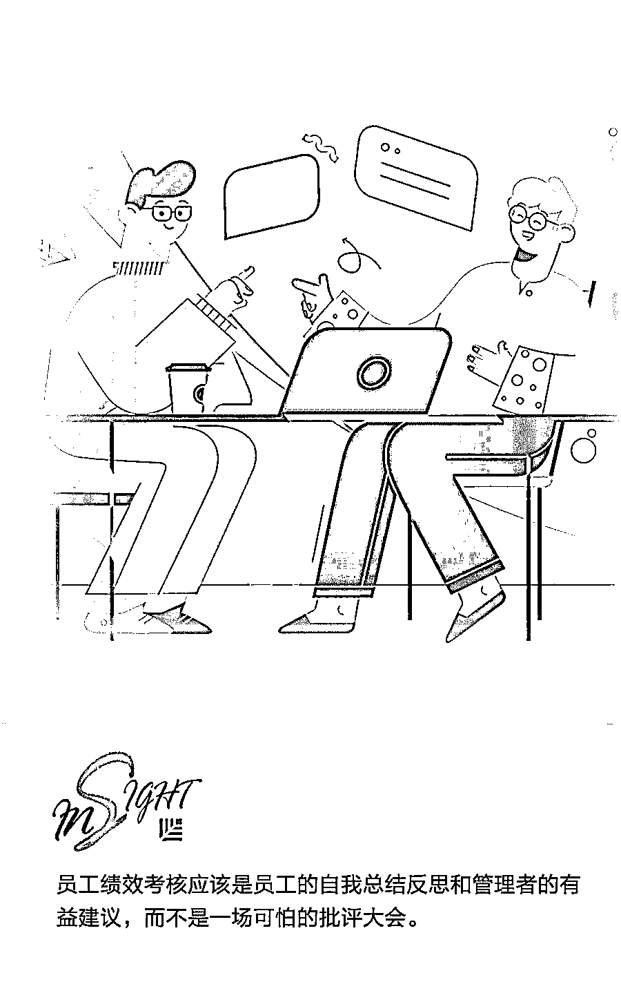
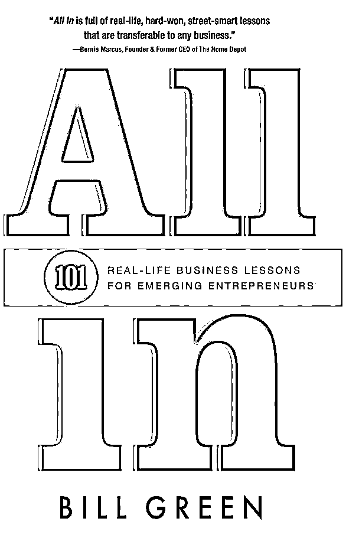

# 绩效考核前，管理者需要向员工讲明 7 件事 | 首席人才官

> 原文：[`mp.weixin.qq.com/s?__biz=MzAwODE5NDg3NQ==&mid=2651226054&idx=1&sn=d749c185096d02d2ac3f85e28b17eb36&chksm=80804192b7f7c884a759377054f7fac249c6671a0f24914df4caaee1049a778d100ed5e29356&scene=21#wechat_redirect`](http://mp.weixin.qq.com/s?__biz=MzAwODE5NDg3NQ==&mid=2651226054&idx=1&sn=d749c185096d02d2ac3f85e28b17eb36&chksm=80804192b7f7c884a759377054f7fac249c6671a0f24914df4caaee1049a778d100ed5e29356&scene=21#wechat_redirect)

初创公司一般把产品的迭代、业务的快速发展、公司规模的扩张放在首要位置，而绩效考核往往因为落地难度大沦为纸上谈兵，或者一年到头，只在年底那几天才被提上日程。那么员工绩效考核一年一次够不够？应该如何让绩效考核发挥作用？

 “**员工绩效考核并不是件一劳永逸的事情，它应该定期进行，目的是为了提升员工的业务能力。**”Bill Green 这样认为。

Bill Green 是一位拥有几十年管理经验的企业家，他一手创立了 Interline Brands，25 年来，一直担任首席执行官，把它从一家小型零售店发展成为该国最大的工业分销公司之一。此外，他还创立了多家成功企业，是房地产私人贷款机构 LendingOne 的创始人兼首席执行官，Crestar 集团公司的常务董事。

在他的著作《全力以赴：给创业者的 101 条宝贵经验》（All In: 101 Real-Life Business Lessons for Emerging Entrepreneurs）一书中，他分享了**40 年**的商业生涯中收集的**101 个**对于创业者来说至关重要的经验和教训。本文为他总结的管理者在绩效考核之前需要告诉员工的 7 件事，或许能帮你让绩效考核不再只是“例行公事”。

员工绩效考核不应该一年一次，或者一个季度一次。员工应该时刻知道他们所处的水平，以及如何做好阶段性的工作。

因为一年一次或者一季度一次绩效考核，无论是对于员工个人和整个公司来说，效果都不是很好，会出现以下两种状况：

▨ **第一，不能及时指出员工的问题**

若员工表现不佳，他们要等到下次绩效考核时才能知道自己的表现不好。这样就会出现问题：员工以为自己做得不错，实际上并非如此，然后整个公司都会跟着遭殃。

▨ **第二，不能及时肯定员工的贡献**

若员工工作认真，为公司做出很大贡献，但是没人给出积极的肯定，员工可能会思考他们的努力是否有人看见。因此，他们工作的热情可能会消退；他们会失落，甚至可能会辞职，而这仅仅就是因为没有得到及时的反馈。

关于考核这一点我感触颇深，而且在《全力以赴：给创业者的 101 条宝贵经验》（All In: 101 Real-Life Business Lessons for Emerging Entrepreneurs）中，我也一直强调这一点。管理者经常说“我们已经进行了一次员工考核”，但员工绩效考核并不是件一劳永逸的事情，它应该定期进行，目的是为了提升员工的业务能力。

** **

**All In**

101 Real Life Business Lessons for Emerging Entrepreneur

Bill Green **/ 著**

Koehler Books 2017 年 5 月

以下是每个管理者定期要与员工交流的 7 件事：

**1**

**是自我总结反思**

**而不是批评大会**

若绩效考核期间，管理者的反馈对员工来说是件可怕的事情，那么管理者与员工便得不到充分的交流。

员工绩效考核应该是员工的自我总结反思和管理者的有益建议，而不是一场可怕的批评大会。员工不应该为自己的某些不好表现担惊受怕。这些事情管理者应该及时恰当地跟员工说清楚。

**2**

**对每个新人进行明确的分工**

许多公司在招聘的时候，没有对新人进行明确的任务分配，这种情况屡见不鲜。

这样做的后果就是，常常一个任务下达之后，没有新人主动承担，这时公司领导层就会很失望。若一个员工出错了，这不仅仅是他一个人的错，它还反映了公司内部整个团队分工协作中的问题。

必须确保每个新人都清楚自己的任务。让新人知道自己的哪些表现会纳入绩效考核中，这将使考核变得十分简单明确。

**3**

**报喜，也要报忧**

对于员工出现的问题，不要回避和轻描淡写，应如实相告。

若有员工表现不佳，需要让他们知道实情。我见过许多管理者对员工不良表现没有进行中肯客观的评价，他们使用一些委婉的说法，如“有进步空间”。若员工表现得差强人意，这样说未尝不可；但要是表现得实在堪忧，这样太过含蓄的说法就十分不可取。

**4**

**考核并不意味着晋升**

考核并不意味着晋升，这一点至关重要。

绩效考核是否是要求升职的好时机？怎么说呢，它取决于绩效考核的周期。一些员工觉得考核是个升职的好时机，仅仅是因为他们有机会和公司的决策者见面。然而，这本身就是一个问题。

对于大多数公司而言，考核要么在年尾进行，要么在某些员工的表彰大会进行。我认为，除非事先做出了特殊安排或者员工的工资主要依靠提成，每个员工都应该有一定的年度加薪，这使工资增长的速度至少要赶上通货膨胀的速度。若许多员工希望工资涨幅超过通货膨胀的速度，那么管理者可以制定一些指标，以帮助员工更好地理解最终加薪幅度的决策。

领导团队应该将这些与升职加薪挂钩的事情交代清楚。

**5**

**考核不应该只是一张“打分表”**

优秀，合格，不合格，差。

仅仅用这些词并不能够让员工明白自己做得究竟好不好，或者问题出在哪里。许多管理者用这种简单的形式对员工进行评价，而没有给出任何具体和有价值的反馈。

 “合格”对于员工来说没有任何参考价值。考核不应该只是一张“打分表”，而应该是让员工得到了真实有效的评价和反馈。

**6**

**说到做到，遵守承诺**

多久进行一次考核并不是最重要的，最重要的是不要忘记考核。

最可悲的是要员工提醒管理者或领导该进行考核了。这是一种非常不好的现象，同时也反映了管理者与员工沟通中的潜在问题。

员工提醒管理者进行考核，很明显，这是想要工作的反馈。

**7**

**在绩效考核前**

**先让员工进行自我评价**

在绩效考核前，应该先让员工进行自我评价，不管是书面的还是口头的。管理者要确保清楚员工为公司做出的所有贡献。

另外，员工对自己的评价，以及不同情况下员工工作贡献变化的周期，都会给管理者一个“惊喜”。可能它真的就是惊喜，也可能是惊讶。但是无论哪一种，它都能为管理者提供一些重要的信息，那就是员工是如何看待自己的，以及今后管理者如何更好地分配任务。** **

** 推荐阅读**

壹

[红杉清华行：同学你好，欢迎成为独角兽企业的“缔造者” | 首席人才官](http://mp.weixin.qq.com/s?__biz=MzAwODE5NDg3NQ==&mid=2651225997&idx=1&sn=19d266956f1cc49201c66f324821df7e&chksm=808041d9b7f7c8cf6d6ca4f033cea94868fc3b9625d511a53d354b16aacd0cacdf106c791c82&scene=21#wechat_redirect)

贰

[比起“志同道合”，“可培养性”在招聘时更关键 | 首席人才官](http://mp.weixin.qq.com/s?__biz=MzAwODE5NDg3NQ==&mid=2651225914&idx=1&sn=6128d178e9ec02a4f917dbc5276e41b1&chksm=8080416eb7f7c878f9cab0059a45c760db18379dac96786f3358dc11167aae8d60ace05e39da&scene=21#wechat_redirect)

叁

[KPI 不是指南针，而是可视化的 GPS 工具 | 首席人才官](http://mp.weixin.qq.com/s?__biz=MzAwODE5NDg3NQ==&mid=2651225800&idx=1&sn=540419d5c125f6440de27f578502cbf2&chksm=8080409cb7f7c98ad9563a4f9b2c4c474b18a0d721fb38cf5e81e089c70617ad952fae2436e5&scene=21#wechat_redirect)

肆

[办公室福利：是一种浪费还是利润驱动？| 首席人才官](http://mp.weixin.qq.com/s?__biz=MzAwODE5NDg3NQ==&mid=2651225757&idx=1&sn=cabfa1eeb863a27a2a560d43d9fac6b1&chksm=808040c9b7f7c9df7d11c212e032fb72134457ca0ad63cc7bde272a3adb68e1ea2dd390d0dc2&scene=21#wechat_redirect)

伍

[一位 CEO 给职场年轻人的一封信 | 首席人才官](http://mp.weixin.qq.com/s?__biz=MzAwODE5NDg3NQ==&mid=2651225716&idx=1&sn=53972c07b3bcff0be323293ed5fc77c1&chksm=80804020b7f7c9369e361d2cfdd9c5dd5602e938eac464d031277cd5a4ffc75a447c1a634ce9&scene=21#wechat_redirect)

