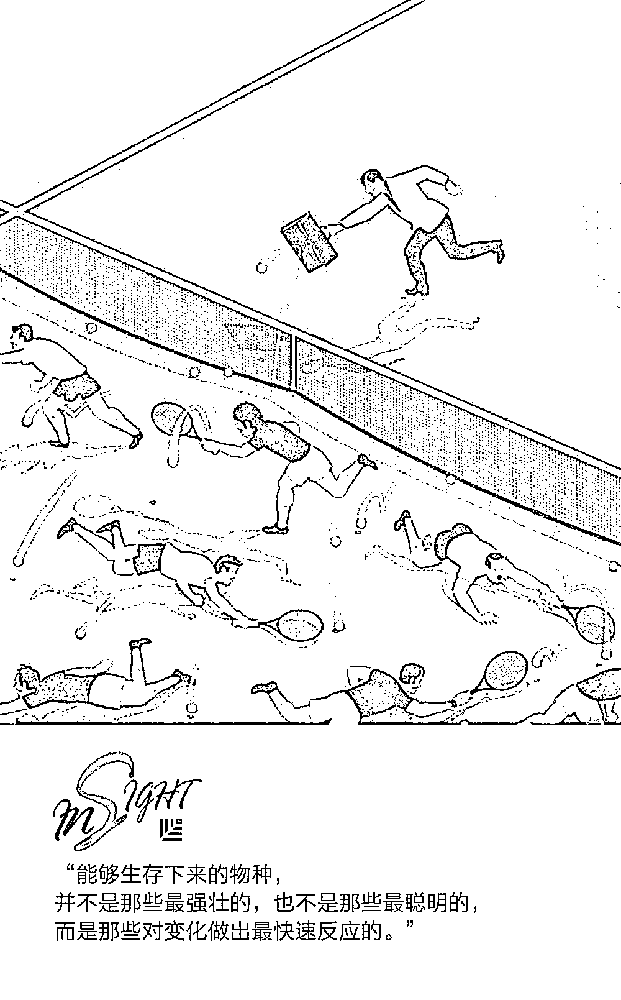
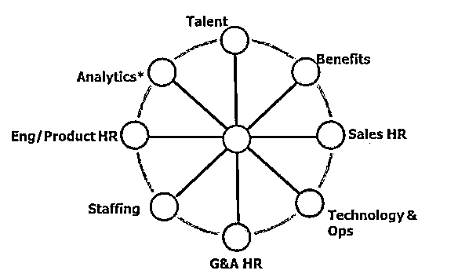

# 告别传统 HR 部门，谷歌们的用意是？｜首席人才官

> 原文：[`mp.weixin.qq.com/s?__biz=MzAwODE5NDg3NQ==&mid=2651225174&idx=1&sn=41ac3b708e1f7b858f8a496531c3e162&chksm=80804202b7f7cb14812a94f5179492ea3c31f05a0c11622e6883ac316b8d88a2ff9cb8db1eaf&scene=21#wechat_redirect`](http://mp.weixin.qq.com/s?__biz=MzAwODE5NDg3NQ==&mid=2651225174&idx=1&sn=41ac3b708e1f7b858f8a496531c3e162&chksm=80804202b7f7cb14812a94f5179492ea3c31f05a0c11622e6883ac316b8d88a2ff9cb8db1eaf&scene=21#wechat_redirect)

科技带来的变革正不断渗透各个领域，如今，传统的人力资源部门也渐渐消失，谷歌、优步、Facebook、爱彼迎、Netflix……这些为人熟知的科技公司没有传统的 HR 部门，它们都在重新定义 HR，从战术到战略、从局部到整体、从被动到主动，HR 的变革已经开始。

创新性企业如何重新定义 HR？未来 HR 应该扮演什么角色？这样的变革又能给我们什么启示？本文为你一一揭晓答案。以下是部分要点摘录：

▨ 创新性企业的成功完全依赖于每位员工的个体：从产品设计到工程开发再到营销都是如此。

▨ 新组织形式下更强调 HR 要主动积极地、前瞻性地看问题，并积极拿出有效的解决办法。

▨ 从组织角度而言，为员工营造更加积极的工作环境并创造更积极的个人体验，成为发展和保留员工的关键之举。

▨ 在二十一世纪，职业不再只由工作和技能来定义，而是通过经历和学习敏捷度来定义。

▨ 世界在变，HR 本身也要随时准备像业务部门打破常规、革新自己。

谷歌的人力资源部门并不叫 HR，而是叫 People Operations，翻译成中文叫“人力运营部”。如果再把视野扩大到更多的一些顶尖的科技公司，你会发现这种对人力资源部门命名的创新并不仅限于谷歌。

比如，优步也叫自己的人力部门为 People Operations，Facebook 把人力部门叫做 People，爱彼迎叫 Employee Experience（员工体验部），Salesforce 公司叫 Employee Success（员工成功部），Netflix 则把人力部门叫做 Talent（人才部），等等。

▲ 谷歌的人力运营部门架构图

这些领先的科技公司把传统的人力资源部改头换面，到底是为了噱头还是背后有其它的原因？

仔细分析这些新部门名称，发现它们大概可以分作两大类：一类叫人力运营（Operations），强调的是人力资源也应该像业务部门一样运作，也就是市场主导、数据驱动、盈利为先等。谷歌的前任人力 VP 拉斯洛曾经在《重新定义人才》（Work Rules）一书中提到谷歌命名人力运营部背后的真正原因：

在谷歌，我们寻求颠覆所有的传统思维和语言。人们总会把 HR 视作一种事务性和官僚性的工作职能部门。与此相反，在谷歌这种工程师文化主导的公司，工程师们会把“运营”视作一个值得信赖的职能，因为它意味着你能够真正地去解决问题。

还有一类叫 Employee（员工）或 Talent（人才），这一类更多强调的是员工在组织里的整个职业生涯周期中，所能够享受的全过程体验。借用 Netflix 公司对自家人才文化的一个定义来解释就是：

我们的核心理念是人员高于流程。特别地，我们希望所有优秀的人才可以一起工作，组成一个梦之队。通过这种方式，我们希望组织更加灵活、有趣、更富有激励和创新性，并能获得成功。

员工如果体验不佳，处处感到公司流程、层级、文化的制约，又谈何创新呢？

**传统人力资源部门的变革**

无论采用哪种名称，这些科技公司无非是希望它们的人力部门能够在新环境下与传统人力部门有所区别。

传统的工业企业之所以成功，可能会多少会依赖于工艺、流程和设备；而今天，创新性企业的成功则完全依赖于每名员工个体：从产品设计到工程开发再到营销都是如此。组织的成功比以往任何时候都更依赖于每一个员工的创造力。

今天的知识员工比起从前，也对自己的职业发展道路有了更大的自主掌控权。传统的那种长期呆在一家公司、沿着固定的职业发展路线一步一步爬梯子的现象已经越来越不被员工所喜。从组织角度而言，为员工营造更加积极的工作环境并创造更积极的个人体验，成为发展和保留员工的关键之举。

无论采用哪种名称，这些领先的公司都希望自己的人力部门在以下方面，与传统人力资源部门做的不一样：

▨ **从战术到战略**

优秀的人力团队不光要在战术层面解决业务部门的日常问题，而且还应在战略层面真正成为业务部门的合作伙伴。科技行业一日千里，固步自封、只看眼前的人力部门最终只能沦为组织内部一个简单的任务执行部门。

▨ **从局部到整体**

传统的人力资源部门设置突出专业性和模块化，招聘、培训、薪酬和 HRBP 等分门别类、界限清晰。新组织形式更强调员工个体端到端的体验，从入职开始一直到离职为止，确保员工全周期内都拥有良好的个人体验。

人力专业人员需要具有洞察全局的视野和掌控全局的能力，只有打通所有人力模块才能实现这种可能。

▨ **从被动到主动**

传统的人力部门被动接受来自业务部门的指令，新组织形式下更强调人力要主动积极地前瞻性地看问题，并积极拿出有效的解决办法。以 Netflix 为例，招人从来不是为了当下的某个岗位而招人，而是会看至少 6 个月以后，组织需要什么样的人才，并为组织的未来而招人。

**重新定义 HR**

也许，对于大部分企业而言，现在就把 HR 部门改名还不够现实，但是，前面所列举的这些公司的经验可以带来以下几点启示：

▨ **首先，打造一种以人为先的文化**

德勤在 2018 全球人力资本趋势报告中提到，在二十一世纪，职业不再只由工作和技能来定义，而是通过经历和学习敏捷度来定义。工作的持续转型、对人才和组织持续提升能力的需求、以及员工偏好的转变，都要求在学习、工作设计、绩效管理和职业发展方面采取新的方法。

为了创造出最佳的员工经历和体验，那就要对员工抱有客户思维，把员工当做公司产品的客户那样，设计员工从入职到离职的全周期流程和项目。

▨ **其次，****数据驱动决策**

大部分公司的 HR 都喜欢研究别人的最佳实践，然后拿来依样画瓢。谷歌的人力部门宣称自己的每一项决策从来都不来自最佳实践，而是完全靠数据驱动。

谷歌的数据驱动决策到了何种极致？拉斯洛曾经在《重新定义人才》一书中提到，为了帮助员工在餐厅排队时最大限度地利用等候时间与周围人交流，谷歌人力部门专门分析了员工排队候餐的数据，得出最理想的排队时间，并重新设计了员工餐厅布局。

严格通过数据决策，才能有效打消其他部门的质疑，让每一项人力决策都有理有据，把投资在人力上的每一分钱都花到刀刃上。

▨ **最后，自身的敏捷创新**

世界在变，人力部门本身也要随时准备像业务部门那样打破常规、革新自己。借用一句达尔文的话：“能够生存下来的物种，并不是那些最强壮的，也不是那些最聪明的，而是那些对变化做出最快速反应的。”

原标题 / 为什么越来越多的领先公司不再把人力部门叫 HR？

来源 / 行走的帆（ID:sailing-fan）

** 推荐阅读**

壹

[超过 2000 亿规模的红杉重仓天使投资，它想要找到什么样的创始人？](http://mp.weixin.qq.com/s?__biz=MzAwODE5NDg3NQ==&mid=2651225142&idx=1&sn=83cceab8d14910beeb4a5a64f84ee1f0&chksm=80804262b7f7cb744e1161fd0cee210240f9844e5e618d07b6c999db30357dc9b5cffb839151&scene=21#wechat_redirect)

贰

[求助：领导非要在工作时间让我看世界杯怎么办？](http://mp.weixin.qq.com/s?__biz=MzAwODE5NDg3NQ==&mid=2651225143&idx=1&sn=e24399065f6a487fae7b8f821f0fe552&chksm=80804263b7f7cb7584b1cd664f72551400a1612025e58c080b6305d0400b8f8269365b9b7827&scene=21#wechat_redirect)

叁

[真正优秀的产品经理不会告诉你的 5 个秘密](http://mp.weixin.qq.com/s?__biz=MzAwODE5NDg3NQ==&mid=2651225152&idx=1&sn=47bd4cb3ff2b88613d384ad69cf06d19&chksm=80804214b7f7cb02f2f4559c713ab954af7c6171d0320ff83dce1fbb138072527778ede1d3ba&scene=21#wechat_redirect)

肆

[神策数据桑文锋：如何在脆弱的起步阶段坚守并传递信仰、稳定军心？](http://mp.weixin.qq.com/s?__biz=MzAwODE5NDg3NQ==&mid=2651225155&idx=1&sn=f3cd019d9969260a3b39186c2abc7cf7&chksm=80804217b7f7cb0181f422528a80c7c69488db51fd42f2f54c7ba3227c5cfe1505d32ec3e701&scene=21#wechat_redirect)

伍

[1 分 18 秒抖音 style，见证 C 位基金的诞生｜红杉种子基金](http://mp.weixin.qq.com/s?__biz=MzAwODE5NDg3NQ==&mid=2651225160&idx=1&sn=a881d56d07ac454bc486cfb4973f695a&chksm=8080421cb7f7cb0a36bae73052f473d109dda22bbc40eb615899c0c2bad63efe0d9926a60392&scene=21#wechat_redirect)

