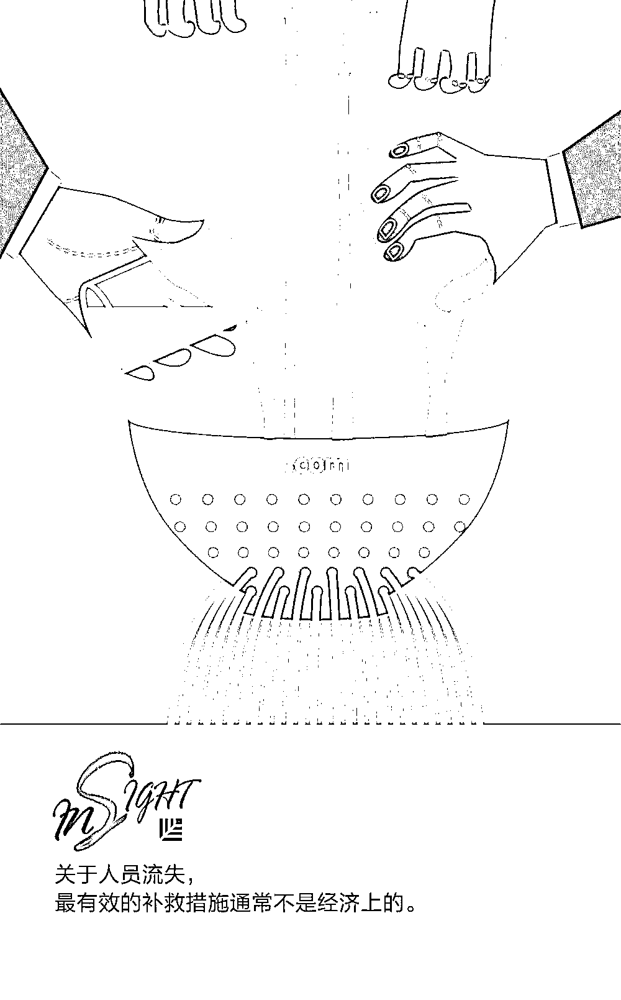

# 数据告诉我，没有谁的辞职是“突然”的｜首席人才官

> 原文：[`mp.weixin.qq.com/s?__biz=MzAwODE5NDg3NQ==&mid=2651224762&idx=1&sn=5fedde1e43cecdcebc22ed448c074e3b&chksm=808044eeb7f7cdf82a25888b63f353b53df9da3a01b3e3dcddb6b754abd5e2d884c5e99871b7&scene=21#wechat_redirect`](http://mp.weixin.qq.com/s?__biz=MzAwODE5NDg3NQ==&mid=2651224762&idx=1&sn=5fedde1e43cecdcebc22ed448c074e3b&chksm=808044eeb7f7cdf82a25888b63f353b53df9da3a01b3e3dcddb6b754abd5e2d884c5e99871b7&scene=21#wechat_redirect)

你有关于团队成员的表现、想法和感觉的数据吗？这些数据可以帮助你对团队成员进行“人员分析”，进而判断其辞职意向。

“人员分析”可能会让人有一种成本高又很困难的错觉，然而事实并非如此。关于上述数据，其实你掌握的可能比你意识到的更多，并且在工作场所中，可能还有更多数据尚未得到开发。这时候，如果你能多注意一些日常工作中的细节，或许就能提前避免一些常见问题的发生，例如员工流失等。

在本文中，致力于促进人员管理科学、提高绩效的人力资本创新中心(CHCI)的执行副总裁 Anne Loehr 就介绍了如何挖掘关于团队成员的数据，通过数据分析后采取合适的行动，减少人员流失。以下是部分要点摘录：

▨ 无论你采用什么方法来收集情感数据，都要做到既简便又可以匿名，而且请务必关注趋势，而非绝对值。

▨ 习惯在领英上寻找编程人员的 HR 会特别注意最近更新的“技能”部分，他们认为这可能是工程师有兴趣了解新就业机会的标志。

▨ 一旦你发现了某种趋势，要立即采取行动。最有效的补救措施通常不是经济上的。

▨ 以人性化为前提开始进行人员分析并不会减少人员数量，这只是帮助公司理解为何某些情况会导致人们继续以某种方式行事。

**降低****客服中心流失率的启示：**

**小问题可能埋下大隐患**

客服中心的流失率往往很大，许多人只是来打临时工，等他们攒够了一定的钱后就辞职。较低的人员流失率会带来更高的企业绩效，因此管理者对如何预测并减少人员流失十分感兴趣。

我的公司曾经帮助过一个客服中心分析它已经收集到的一些基本数据：话务员呼叫的时长和次数，以及这些呼叫得到升级或解决的频率。在每次轮班结束时，员工都会收到一张反映这些数据点的“成绩单”。由于客服中心员工的薪酬与绩效数据直接挂钩，他们会因为获得良好的评分而受到高度激励。

但总分低并不一定表示员工表现欠佳。分析师发现有两个特定因素更具预测性：通话时长增加，以及做出决议的通话减少。

因此，客服中心的管理人员派出检查员在出现这两个因素的那天与每个话务员会面。然而，大多数人还没有到要考虑辞职的程度。不过他们发现工作上遇到的挫折通常很容易解决，就像耳机出故障或是工作班次不合意。检查员被授权解决大部分的此类问题，在接下来的几个月中，客服中心的流失率下降了一半。

**如何发现早期迹象？**

你可能会认为这与你无关，因为你并没有经营一个客服中心。即便如此，你或许可以开始寻找一些不尽人意的早期迹象，而且这些迹象在发现之初相对容易解决。以下有两种方法供参考：

1

**不断询问员工的感受**

要衡量“看法”看似是不可能的，但事实并非如此。要收集这类数据，你可以使用市场倾向调查、运行焦点小组等进行实时调查。

一些大型的实体办公空间甚至会安装情绪按钮，这些按钮是简单又便宜的设备，管理者会询问“今天过得如何？”这样的问题，并提供红色（不好），黄色（还行）和绿色（很好）的按钮，供人们在工作之时快速按下，这类按钮在一些机场和酒店都有安装。无论你采用什么方法来收集情感数据，都要做到既简便又可以匿名，而且请务必关注趋势，而非绝对值。

2

**了解工作时长或工作的努力程度**

这可以从总登录时长进一步了解，不过除非你的公司需要“上下班打卡”，否则就要引入软件来监控是谁坐在电脑前，这感觉就像是监视。因此，尽管现有数据不全面，但你还是可以从中察觉一些东西，比如，相比上季度或去年同期，在本季度请了多少病假？需要多长时间的年假？等等。

这些数据通常都很好地说明了哪些人可能需要休息。生病时，需要用掉余下的假期，或是感到疲惫不堪时，需要花一段时间修养以应对工作压力。

**领英上的秘密**

还有第三种方法，我已经看到了很好的成效。最近，某知名科技公司正面临工程师人才流失的问题。习惯在领英上寻找工程师的 HR 会特别注意最近更新的“技能”部分，他们认为这可能是工程师有兴趣了解新就业机会的标志。因此，该科技公司想到了利用这个原则。

管理者意识到自己的工程师可能会做同样的事情，每当他们准备跳槽时，就会更新领英上的个人资料。因此，该公司编写了一个简单的脚本来捕捉领英的更新订阅源，从而获取大约 2000 个顶级工程师的个人资料。这让管理人员在其中某位员工添加新信息之时能够迅速作出反应。

与之前客服中心的案例类似，检查员随后会趁机与可能动摇的工程师讨论职业目标和职业发展机会。最终，许多工程师被转移到了更适合他们才能和兴趣的任务或项目中。

**发现趋势后立即行动**

无论你是询问员工的感受，还是了解其工作时长，或是观察领英上的动态，都要保证收集数据的时间以两周到两个月为一个周期，以便获得足够的信息来进行合理分析。

一旦你发现了某种趋势，要立即采取行动。时刻注意公司的每个角落，寻找不满情绪的来源。也许某个团队需要的只是灵活的日程安排或更好的认知度、或急需什么信息。最有效的补救措施通常不是经济上的，一旦你确定采用某个解决方案，要衡量其有效性以确保它能继续产生你所期望的结果。

以人性化为前提开始进行人员分析并不会减少人员数量，这只是帮助公司理解为何某些情况会导致人们继续以某种方式行事。在理想情况下，减少意外对每个人都有好处，而且会给周围的人带来更多快乐。

** 推荐阅读**

壹

[数字化转型失败真相：领导者伪造变化，假装转型](http://mp.weixin.qq.com/s?__biz=MzAwODE5NDg3NQ==&mid=2651224756&idx=1&sn=ae83dba9d038ecbef7a2857efe2cad31&chksm=808044e0b7f7cdf66830cdefae6bf380b616cae239737ec5dcbd8b5ba1df84b2a68e3aaecf67&scene=21#wechat_redirect)

贰

[如何让求职者爱上你，更爱你的公司？](http://mp.weixin.qq.com/s?__biz=MzAwODE5NDg3NQ==&mid=2651224725&idx=1&sn=26d5f9b016e49526d21d3bfb7b3839bd&chksm=808044c1b7f7cdd7a2b714dbbdc0a3163e4404d08d4167cb9e9c17e21b8c3f43937cf44b54a7&scene=21#wechat_redirect)

叁

[超燃 TED 演讲集锦，10 句话点燃你的小宇宙](http://mp.weixin.qq.com/s?__biz=MzAwODE5NDg3NQ==&mid=2651224733&idx=1&sn=59fa580f87fdfaa1c16fb201624acbac&chksm=808044c9b7f7cddfac16530bb445c905a0fe7e4b2fac35e107a250d6069357adb36cb689c5b4&scene=21#wechat_redirect)

肆

[返回交大捐赠 ACM 班奖学金时，沈南鹏讲了一个 32 年前的下乡故事](http://mp.weixin.qq.com/s?__biz=MzAwODE5NDg3NQ==&mid=2651224748&idx=1&sn=302b9f643fdd68524c4d422502042cf8&chksm=808044f8b7f7cdee379fcf386e80fda2c5630e6bcbe2e3c734a00c5ae55e4c5a2bd9f4815f95&scene=21#wechat_redirect)

伍

[为什么我相信提问是学习最好的开始？](http://mp.weixin.qq.com/s?__biz=MzAwODE5NDg3NQ==&mid=2651224750&idx=1&sn=4282b6e0efe03ea45c830a44de8242c5&chksm=808044fab7f7cdec05c4a89648cbc0c91c2c49cb70b218dc6d0fa19c0517347197c6dc0f4c7d&scene=21#wechat_redirect)

