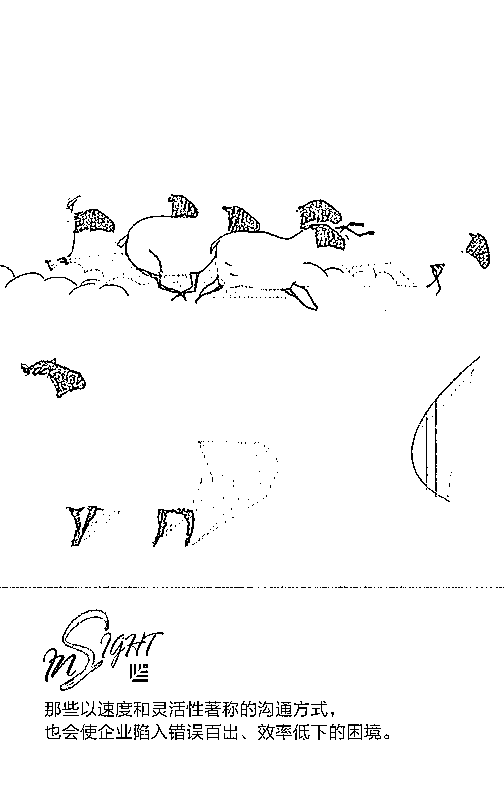
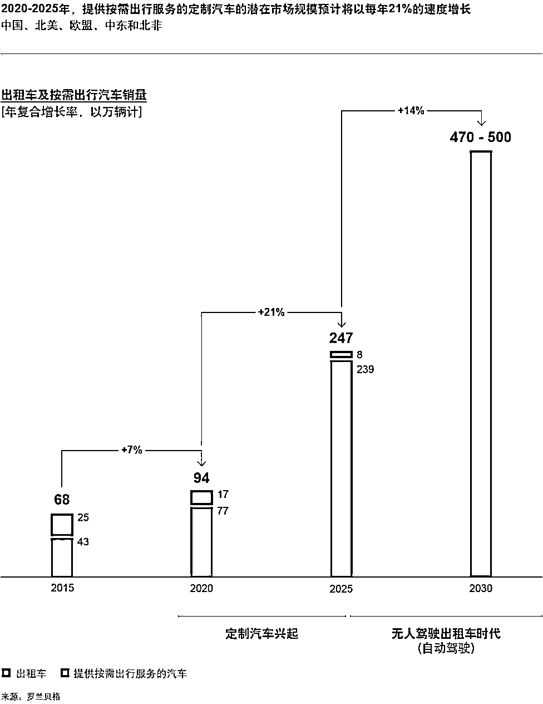

# 为什么极致高效、灵活的沟通是个坑?｜红杉汇内参

> 原文：[`mp.weixin.qq.com/s?__biz=MzAwODE5NDg3NQ==&mid=2651225273&idx=1&sn=72d63710df276f1ed24d60c244106c54&chksm=808042edb7f7cbfbf5cb7c86128a2f973932b4b5a745149fe751575f01898b72b8b8b8e8d518&scene=21#wechat_redirect`](http://mp.weixin.qq.com/s?__biz=MzAwODE5NDg3NQ==&mid=2651225273&idx=1&sn=72d63710df276f1ed24d60c244106c54&chksm=808042edb7f7cbfbf5cb7c86128a2f973932b4b5a745149fe751575f01898b72b8b8b8e8d518&scene=21#wechat_redirect)

[ 编者按 ] 创业企业，最重视灵活性、扁平化，似乎一定得通过某种非正式性的文化显现出来才行：直接称呼高管的名字，穿 T 恤、牛仔裤见客户，企业内部随处可见各种“自组织”……就连商业沟通也变得更加非正式。

但是，过度依赖非正式沟通可能会损害绩效。研究显示，非正式沟通往往精确性差、可靠性差，而正式沟通则提供了任何公司都不容忽视的、特定的、关键的优势。企业不可能回到每个流程都需要有一式三份记录的时候，但也不应忽略非正式沟通的局限性，不加思考地将其视作是最好的做法。

每期监测和精编中文视野之外的全球高价值情报，为你提供先人一步洞察机会的新鲜资讯，为你提供升级思维方式的深度内容，是为 **[ 红杉汇内参 ]**。

** 内参**

**创业企业**

**如何选择正确的沟通模式？**

编译 / 洪杉

互联网时代，正式、按照规范进行的沟通越来越被视为是过时、充满官僚主义且浪费时间的行为。毫无疑问，非正式性会使企业的日常运营更为顺畅。并且，对业务目标不起真正作用的不必要会议对需要开会的部门来说简直就是折磨。

但是过度依赖非正式沟通可能会损害绩效。因为非正式沟通往往精确性差，可靠性差，而正式沟通则提供了任何公司都不容忽视的、特定的、关键的优势。

《MIT 斯隆管理评论》研究了 73 个生产基地，包括 163 个定制工业机械和仪器的生产流程，分析了正在进行的非正式沟通（如电子邮件和电话）以及定期的（通常是每周）、有着规约议程和预先指定参与者的跨职能会议。

结果显示，进行定期规约会议的团队比那些只依赖非正式沟通的团队更具有持续性的绩效优势。使用正式沟通规约将准时交货率提高了 5 到 8 个百分点。

**认识正式沟通的价值**

在我们的研究中，只有 45%的企业依赖于正式会议规约。应用最广泛的沟通渠道是电子邮件（71%）。企业经理们经常说他们选择电子邮件的原因主要是因为快捷和灵活，之所以反对定期会议，是因为员工抗拒。

非正式沟通渠道确实比正式通信更快捷，更灵活。并且，当要处理的事情确实异常、或复杂到需要快速来回讨论之时，非正式渠道非常有用。但是，如果你处在日常运作的纷乱之中，这些任务可能会比实际上的看起来更异常，更复杂。此外，如果你选择非正式沟通，那么可能会有联系错人的风险，传递或接收到不准确或不完整的消息。要从这些信息中分清主次，就可能从当前的互动中分散注意力。因此，依赖非正式沟通经常会导致延误、返工、合同处罚、昂贵的赶工费用及客户的失望。

举例来说，关键信息有时被搁置，甚至被遗忘，因为利益相关者没有及时回应发出者的临时请求。在其他情况下，个体寻求关于决策的指导，但是——在他们的非正式信息在企业内发了一圈都没有得到回应后——只能依靠自身向前推进，而从未收到过明晰的“是”或“否”，或者对下游影响的适当评估。

相反，正式沟通模式使所有相关利益攸关者有机会根据规约的规定表达他们的关切。建立一个规约需要付出努力，并且必须克服这样一个普遍看法，即形式意味着苦差事和惯性。但在沟通错误成本高昂的情况下，正式规约可能是一块可靠的磐石，因为正式规约可以做到以下这些：

▨ 允许人们在合适的时间与合适的利益相关者建立联系。

▨ 使消息规约化以确保消息完整，并提供规约化的后续程序。

▨ 促进对任务的问责，因为责任明确转移给了特定的人。

▨ 从先前的互动和会议中吸取教训，以确保学习是累积的。

**设计沟通规约**

没有必要就不频繁事件而建立正式沟通规约。非正式渠道正好适用不频繁事件。例如，如果一个采购团队的成员必须联系营销专家，那么使用企业社交网络平台来识别和联系适当的人是明智之举。而为这种少见的沟通建立规约则将是浪费时间。

但是，正式沟通对于频繁发生的事件尤其有用。例如，如果采购团队发现某一个供应商将延迟供货，正式的沟通规约确保关于这一情况的信息可以准确传达给相应的生产计划员和销售代表。然后计划员需要将其它订单提前（以便受到延迟供货影响的订单能推后），而销售代表则需要与客户联系。

当事件发生频率足够大，企业就能知道各种情况下相应要联系的人是谁，而这些经验是可以写进企业的沟通管理规定的。企业还可以找出哪些错误和哪些类型的沟通失误是最常见的，而精心设计的沟通规约可以解决这些疑难问题。

理想情况下，这类沟通规约理应由经常需要相互协作的人来共同制定。当个人培养了自己的沟通习惯，他们认为的最佳做法往往和其他同事不一致，而这可能导致令人沮丧的局面发生，使得各种期望相互抵触，大家的努力不协调同步。

**推动建立正式沟通规约**

让人们制定并坚持执行正式的沟通规约是一项相当大的挑战。毕竟，大多数人还是更喜欢用自己的话来编辑信息，在任何他们想要的时间发送给他们认为相关的人。

因此，要想鼓励人们做出改变，消除人们对正式流程的负面印象尤为重要。反对正式沟通的一种常见观点是，即便是经常发生的事件也有其独特性，需要非正式地、单独地提出来沟通。例如，客户改变订单，这是制造业常见的问题。销售人员经常说，他们看重的客户值得他们针对其变更要求提供快速的个性化回复，而采用正式沟通渠道似乎不可能快速做出回应。

非正式沟通可能确实能够迅速得到对方的回应，但往往也会很快地就失去对方的注意。如果所有的相关信息都没有立即被人理解，如果对话遭到遗忘、误解，错误就会出现，客户不满和延迟交货的情况就会增加。例如，立即对客户订单修改表示同意，之后可能会发现新的交付日期无法满足——因为没有咨询所有相关方，或者因为后续工作不足以保证订单变更得到彻底、协调的实施。

收集和展示过去沟通失败的相关数据，以及由此导致的交付失败案例，或许有助于减少人们对正式的沟通规约的抗拒。研究发现，正式沟通在那些系统地改进流程的企业更为常见。例如，一家机器人生产商的某个流程，交货表现不太理想。虽然每个人都意识到这一问题，改进的努力一开始并没有侧重在改进沟通上的问题。直到分析数据显示，企业内部对产品变化的疑问比任何外部因素（甚至比机器故障和零部件供货延迟）更经常导致交货失败，他们才改变关注点。当然，只是这样分析不足以证明正式沟通的有效性，但确实提出了改变的需要。

当正式的沟通规约得以形成，进行比较分析可以鼓励人们将其广泛推广。一家生产工业冷冻系统的企业发现，当客户订单变更通过邮件来沟通，失败概率是通过每周举行会议让生产计划员和销售人员共同参加进行沟通的两倍，这样平均成本也会翻倍。面对这一惊人数据，就连最不情愿的销售代表都承认邮件的便利性其实与沟通的有效性无关。

** 预测**

**MaaS****来啦**

（MaaS：出行即服务）

罗兰贝格最近发布的报告预计，到 2020 年，用于新型出行服务的车辆将占总新车销售的 13%，一个新的细分市场即将出现，即提供按需出行服务的新一代定制汽车。欧洲、美国和中国的定制网约车和出租车的年销量到 2020 年预计可达到 100 万辆，到 2025 年将增至 250 万辆。

** 情报**

#既能挤奶，又能收集数据#

**机器人挤奶工将优化乳品业**

在 20 世纪 70 年代中期，美国奶牛场的平均奶牛数量约为 25 头。如今，许多公司拥有 3000 多头奶牛。美国康尼狄格大学的 Kellogg 乳制品中心，正利用机器人挤奶工及其它传感器监测奶牛和它们所处的物理环境，提高生产效率和动物的幸福感。

▨ 解放人力。机器人挤奶工不仅提高了牛奶生产效率，还新增了收集生产、牛奶成分及奶牛行为相关信息的能力，让生产者可以做出更有计划的决定。

▨ 关注牛性。有了机器人挤奶系统，奶牛成为主角，自主决定进食、反刍、休息或产奶的时间，机器人将全天候跟踪牛奶中的成分，关注奶质变化。

▨ 精准制乳。实时数据可以帮助我们理解奶牛个体的行为，将这种信息和数学优化算法结合在一起，可以判断应该如何准确地改进或调整过程。

#无人传授但至关重要的技能#

**创业者必修课：学会独处、直面孤独**

▨ 连通性引发孤独。信息技术决定了人类文化发展的方向，连通性所带来的好处不言自明，但当人类无法静静思考，强烈的孤独感也随之而来。

▨ 孤独引发技术控。孤独让你感觉越不自在，你就越不可能了解自己。为了避免孤独，人们越来越沉溺于那些貌似可以让我们获得自由的技术。

▨ 无聊是一种刺激形式。几乎所有以不健康的方式控制人们生活的东西都源于一种意识：我们害怕虚无引发的虚无感，无聊其实可以提供它特有的刺激。

▨ 感受思想，了解你自己。不了解自己，就几乎不可能找出一种与周围的世界进行互动的合理方式，就无法建立度过余生的基础。

** 推荐阅读**

壹

[作业帮侯建彬：我非常相信企业价值观背后的力量｜红杉原创特写](http://mp.weixin.qq.com/s?__biz=MzAwODE5NDg3NQ==&mid=2651225265&idx=1&sn=bea9348aac3535abb50af7cedd519f4d&chksm=808042e5b7f7cbf36daf8b3e2af2b119d9c3fe02c457980e776a4d42209cbffffee4bae3a1e2&scene=21#wechat_redirect)

贰

[故事怎么讲才更扎心？跟“招聘界的迈克尔・乔丹”学两招](http://mp.weixin.qq.com/s?__biz=MzAwODE5NDg3NQ==&mid=2651225269&idx=1&sn=fe44d8c51776ce07eb4dabff1c5aaf53&chksm=808042e1b7f7cbf759f4964a3ae46ab7ac5d40584b8f7c460aac0cb9f8f722477add2a4acbf7&scene=21#wechat_redirect)

叁

[你对“现金为王”的理解有多少是错的?](http://mp.weixin.qq.com/s?__biz=MzAwODE5NDg3NQ==&mid=2651225247&idx=1&sn=c2f3e71e30168c7e81b14603b6f541f2&chksm=808042cbb7f7cbdd68060128ac7ce9dc085a2be88f447be6202f0bdadb64f41b6cacee7b0d35&scene=21#wechat_redirect)

肆

[自动驾驶是马拉松，Pony.ai 一路领先 | 红杉 A 轮特写](http://mp.weixin.qq.com/s?__biz=MzAwODE5NDg3NQ==&mid=2651225254&idx=1&sn=7f814683dd60f2e192b0a66d4322f643&chksm=808042f2b7f7cbe47ce5341fee8ea58e1a2575b2bb988e402b5abb7d8aefcdcb0d39ab72b32d&scene=21#wechat_redirect)

伍

[什么时候该把选择权交给命运？问问算法吧](http://mp.weixin.qq.com/s?__biz=MzAwODE5NDg3NQ==&mid=2651225255&idx=1&sn=fc42cfb83b0b00c7d41b1a32ecddf70a&chksm=808042f3b7f7cbe577c982149a529fce5e517d7bffc0a841df66c3f19b7907fe3a2f2dbf19bc&scene=21#wechat_redirect)

