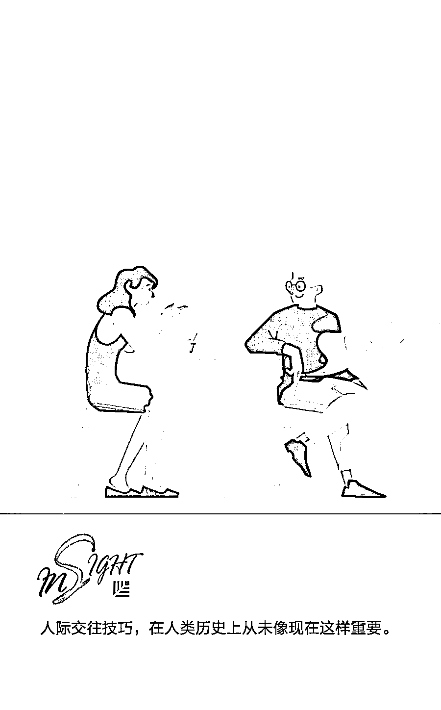
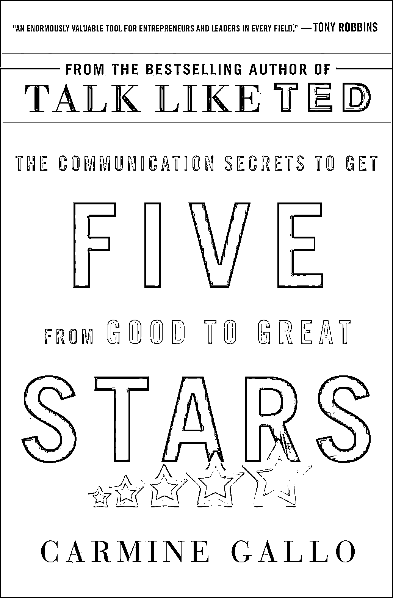

# 劝导的艺术，像亚里士多德那样说服别人 | 欧美新书推荐

> 原文：[`mp.weixin.qq.com/s?__biz=MzAwODE5NDg3NQ==&mid=2651225960&idx=1&sn=e9cceece09236a7e06111ef334b22509&chksm=8080413cb7f7c82ae180dec4d499bdd118b2e30811547769d86d44e84845d2e58fe7886bcf9a&scene=21#wechat_redirect`](http://mp.weixin.qq.com/s?__biz=MzAwODE5NDg3NQ==&mid=2651225960&idx=1&sn=e9cceece09236a7e06111ef334b22509&chksm=8080413cb7f7c82ae180dec4d499bdd118b2e30811547769d86d44e84845d2e58fe7886bcf9a&scene=21#wechat_redirect)

还在把沟通能力当作一项软实力吗？畅销书作家、哈佛大学讲师和品牌顾问卡迈恩·加洛（Carmine Gallo）的职业生涯一直专注于沟通技巧。他认为，人际沟通已经不是一种软技能，而是获得商业成功的基础，尤其在今天，世界上任何更善于表达自己想法的人或许都可以见证人类历史上前所未有的财富巨增。

在他的新书《五星：从优秀到卓越的沟通秘诀》（Five Stars: The Communication Secrets to Get From Good to Great）中他指出，伟大的说服者在整个历史中都是不可抗拒的，2000 年之前亚里士多德就提出了沟通三要素：Ethos（信服力）、Pathos（情感）、Logos（理性）。然而古代的劝导艺术已经逐渐从现代商业世界消失，他希望自己可以帮助更多企业家和领导者重拾这门技艺，掌握沟通的秘诀。本文是对他的采访要点整理。

** **

**Five Stars**

The Communication Secrets to Get From Good to Great

Carmine Gallo **/ 著**

St. Martin's Press 2018 年 6 月 5

**把古老的劝导艺术带回商业圈**

为什么在过去几年里，良好沟通技巧的重要性受到了如此大的关注？

**Carmine Gallo：**纵观历史，伟大的劝导者都具有不可抗拒的特质，而且人际交往技巧在人类历史上从未像现在这样重要。这种现象引起了我的兴趣，而这也是我写这本书的原因。因为现在，世界上任何比他人更擅长表达自身想法的人可以在短时间内取得大量的财富，而这在人类历史上前所未见。

在农业时代，耕作技能比邻居稍微好一点的农民并不能获得更多财富。在工业时代，零件组装速度比旁边的同事更快的工厂工人也不会获得更多财富。然而，我为了著书而咨询过的历史学家、经济学家、企业家和风险投资家都表达了同样的看法：在当前这个人工智能，全球化，自动化的时代，有一种技能可以将你和人类创造的技术以及同龄人区分开来，这种技能就是古老的劝导艺术，即结合文字和思想来激发人们的想象力。

现在有很多人通过短信或电子邮件而不是电话或信件进行沟通。我们是否已经因为过分依赖技术而失去了用沟通手段劝导他人的能力？

**Carmine Gallo：**我们用来实现相互沟通的工具已经产生了变化。这些工具还应该包括我们使用的数字化展示工具，例如 PowerPoint。我们现在不必像几千年前的人类那样在洞穴墙上画画了。但有趣的是，我所谈论的竞争优势并没有改变，依然是古代的智慧，原始的智慧。我们偏好的沟通方式、我们利用的故事载体、用情感和同理心来处理信息的方式，这些从一开始就未曾改变。这就是为什么我说“掌握古老的劝导艺术”是一种可以提升竞争力的技巧。这是一门古老的艺术；而我们要做的就是把它带回商业圈。

你认为企业对这门艺术的了解程度有多高，它们是否会将它纳入招聘流程中？

**Carmine Gallo：**企业对它的了解程度比你想象的要高得多，而且这也是促使我写下这本书的原因。我并不是出于一时冲动而写书的，我感受到了目前的动态。我曾多次与企业高管和首席执行官交谈。行业中发生了哪些事？例如，一家全球性的大型商业软件公司 SAP 去年刚刚聘请了一位入行时间相对较短的营销经理，而她的头衔是首席故事讲述官。讲故事的历史可以追溯到 2000 年前亚里士多德所处的年代。当企业发现，他们无法通过解释工程术语和讨论商业软件而获得竞争优势时（因为商业软件非常复杂，普通人很难理解），他们使用故事和叙述载体来推动产品的销售。

我在谷歌也发现了同样的趋势。我采访了谷歌的高级管理人员之一阿维纳什·考什克（Avinash Kaushik），他也是世界一流的网络分析专家之一。他说，“卡迈恩，我们可以获取全世界所有的数据，比其他企业更好的数据。但是，如果我们无法将这些数据的含义传达给客户，并向他们展示把这些数据应用于他们所在的领域可以改善业务的过程，那这些数据对我们公司来说就毫无意义。”

这就是为什么谷歌正在通过更优秀的故事讲述者、更出色的沟通人员，和清晰易懂且令人印象深刻的信息包装方式，让它的完整文化更具说服力。他们使用的正是数千年前的先贤代代相传的技能。

**最好的创意都诞生于篝火旁**

在本书中，您谈到维珍航空首席执行官理查德·布兰森（Richard Branson）对讲故事的热情。他认为这是企业的关键组成部分。

**Carmine Gallo：**他说讲故事可以用来推动变革。但后来他又说道，“我认为在当前的环境下，如果你不是一名优秀的故事讲述者，那你就无法成为一名出色的领导者。”理查德·布兰森和他的团队是如何运用讲故事这一工具的？他们用的方法和几千年前的人类所用的方法基本一致。他把团队成员聚集到他位于内克尔岛的家中，然后让他们围坐在一个火坑旁边。他说：“我们全公司最好的创意都是在篝火旁边诞生的。”

我意识到，与数千年前的人类相比，我们其实并没有改变多少。越了解大脑处理信息的方式以及听众接收这些信息的方式，所获得的竞争优势就越突出。

那么，对于那些称自己只想达到目的，并了解事实的人来说，情况是怎么样的呢？

**Carmine Gallo：**这就是为什么我非常重视亚里士多德的三要素劝导公式。亚里士多德向我们提供了适用于所有劝导者的公式，无论是开国元勋还是如今的伟大商业领袖，亚伯拉罕·林肯、约翰·肯尼迪还是马丁·路德·金，在他们的精彩演讲中都能看到。

为了说服你，需要这三个要素：第一，信服力（ethos），即一种令人信服的特质和品格；第二，理性（logos），也就是论证的逻辑结构，在商业领域，逻辑证明就是支持论证的数据或证据；第三，也是关键的一点，情感（pathos），没人能在不带情绪的情况下说服他人改变主意。从商业谈判到资本市场，再到投票方式，人性有关的一切都以我们作为群体和个人向彼此进行的情绪描述为基础。这是一个世代传承的三要素公式。

和华盛顿大学分子生物学家约翰·麦地那（John Medina）的一次对话让我大开眼界。他说，“大脑不会注意那些无聊的东西。”这就是为什么人们喜欢听 TED 演讲，因为这些演讲配有视觉呈现的内容，而不是只有文字和要点。实际上，TED 演讲台上不允许使用要点列表。演讲者要基于扣人心弦的叙述和故事，以及引人注目的视觉效果来吸引听众。这需要一些创造力。打开 PowerPoint 软件并且在幻灯片上填写要点和大段的文本很简单，但我们正在谈论的是古老的劝导艺术。这种艺术已成为人类基因的一部分，它是我们与生俱来的能力，但它确实需要配合一点创造力才能充分发挥作用。

**善于沟通**

**是海豹突击队的领导者**

**和航天员的共同特质**

对良好沟通技巧的需求会对企业产生什么影响？

**Carmine Gallo：**这种影响很大，所造成的差距我称之为沟通技巧差距。我在书中引用了多项调查结果，其中一项是领英（LinkedIn）对世界各地的多位招聘人员和招聘经理进行的研究。在这项调查研究当中，94％的受访者表示，与经验丰富但沟通技能稍逊的人相比，拥有较好经验但沟通技能十分出众的人更有可能被提升到领导层。

还有非常可靠的证据表明，无论是千禧一代还是中层职业人士或领导者，沟通技能较好的人被提拔的可能性和频率都高于沟通技巧一般的同龄人。无论处于哪个阶层，他们升职的速度都相对较快。他们在销售产品、营销和团队合作方面的表现也更为突出。这样的差异几乎总是被归结为他们具有更强大的领导能力。然而，这究竟意味着什么？这意味着他们的沟通能力更强，更善于劝导。他们可以与他人建立更深入、更稳定的关系。

你采访过海军海豹突击队，他们通常采用一种别具一格的领导方式。锻炼良好的沟通技巧在他们的工作中发挥着怎样的作用？

**Carmine Gallo：**海军海豹突击队非常重视领导者，他们必须有能力清晰简洁地传达战略任务要点或某项行动背后隐藏的愿景，不能像现在的一些商业活动那样只会用 PowerPoint 展示令人困惑的内容。海军海豹突击队那些训练有素的领导者必须以更为直观的媒介演示，而且做到条理清晰、内容简明，让每个人都能立即理解任务内容。这是海军海豹突击队文化环境中的一项重要的实际训练。

美国国家航空航天局的航天员也具有同样的特质。他们不能只凭体能测试成绩、博士学位或担任试飞员的工作经验成为航天员。这些只能当成资历，也就是我们之前谈到的信服力。但是，当你必须与一小群拥有不同文化和团队背景的人一起在空间站里驻留一年，却无法与其他团队成员沟通协作时，航空航天局不会雇用你。从 1.8 万位申请人中挑选出来的 12 名精英通常都很善于沟通。

**“优秀的劝导者拥有不公平的竞争优势”**

企业家和企业领导者必须有能力激发人们对愿景的兴趣，并引导人们步入这一旅程。

——**卡迈恩·加洛**

畅销书作家、哈佛大学讲师和品牌顾问

再回到商业领域，有时我们会忘记围绕企业提供的产品或服务而展开的沟通有多么重要。

这就是为什么我们要讨论这一理念——那些优秀的劝导者通常可以崭露头角。我采访了 Google、Airbnb、Uber、PayPal 背后数位资产超过亿万的风险投资家。有一个人说了一句：“优秀的劝导者拥有不公平的竞争优势。”

当一个想法被提出时，它只是一个想法，有 90%的沟通内容是我们所希望实现的预期目标。我们必须把沟通对象带入我们的愿景。企业家和领导者现在比以往任何时候都更需要激发人们对某种愿景的兴趣，并引导人们步入这一旅程。这是一种让人可以脱颖而出的技能。

我之前在和硅谷种子加速器 Y Combinator 的合伙人之一杰奥夫·拉尔斯顿（Geoff Ralston）谈话时，我说，“杰夫，我们准备讨论一项软技能，就是公开演讲和沟通。”他立刻反驳我说，“你可能认为这些是软技能，但我认为这非常重要。”他说这话的时候态度非常认真。

现在人际沟通比以往任何时候都要重要。劝导艺术配合文字和思想可以促使人们采取行动，所以它在当前的全球性环境下并不是一种软技能，而是你成功的基础。** **

** 推荐阅读**

壹

[“追求市场占有率=获取利润”，这个理念已然过时 | 新书推荐](http://mp.weixin.qq.com/s?__biz=MzAwODE5NDg3NQ==&mid=2651225815&idx=1&sn=a3dd5c383955e73c3c8615e420c2285d&chksm=80804083b7f7c9950e509130aafbd6baaf37dc256caa7bc31321f1476bff5a22f336c3702e8c&scene=21#wechat_redirect)

贰

[给有创业梦的人的一封信 | 欧美新书推荐](http://mp.weixin.qq.com/s?__biz=MzAwODE5NDg3NQ==&mid=2651225643&idx=1&sn=64a148d4b12e350a10fcbede6c280d89&chksm=8080407fb7f7c9697ea319c2f6055767d011073e47f8d98880d2e1a24c16030baa36b81fce7c&scene=21#wechat_redirect)

叁

[去规模化：人工智能和新一代企业如何创造未来经济 | 欧美新书推荐](http://mp.weixin.qq.com/s?__biz=MzAwODE5NDg3NQ==&mid=2651225606&idx=1&sn=519e2e3c2baca63eac6b7cd23fc454ae&chksm=80804052b7f7c944572fbeeb67830464bcee38391235988319850a8bbb57fb54c87a40c5a5db&scene=21#wechat_redirect)

肆

[“破碎的星球”变出雨果奖“帽子戏法” | 欧美新书推荐](http://mp.weixin.qq.com/s?__biz=MzAwODE5NDg3NQ==&mid=2651225568&idx=1&sn=4aa51751abae4ac60055f9270a7aad99&chksm=808043b4b7f7caa230fb732c09dfede5d54ef607b868242c4c3337e0c09ef85fbf20b74d46a8&scene=21#wechat_redirect)

伍

[初创公司如何利用同理心取得商业成功？| 欧美新书推荐](http://mp.weixin.qq.com/s?__biz=MzAwODE5NDg3NQ==&mid=2651225470&idx=1&sn=807b3aa94bb0f603c23ae5b710df414e&chksm=8080432ab7f7ca3cd61d2cec943f5d9dae04b9b50dcd6fd1cf3d0141690afbc932f07e2817a4&scene=21#wechat_redirect)

