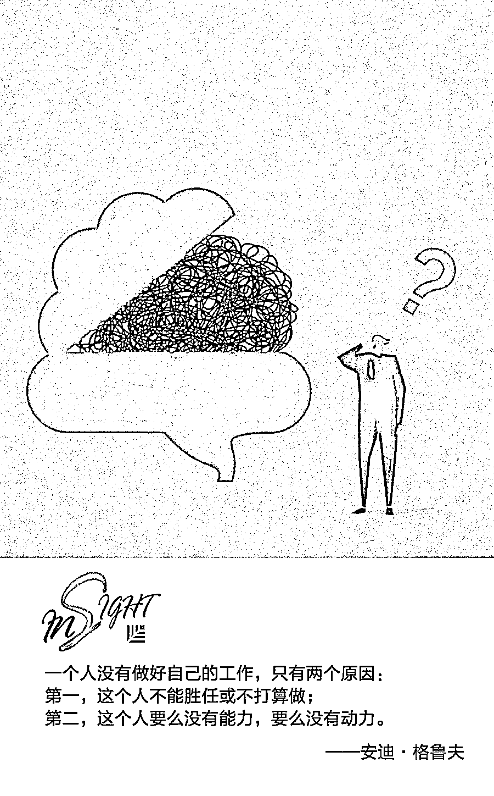
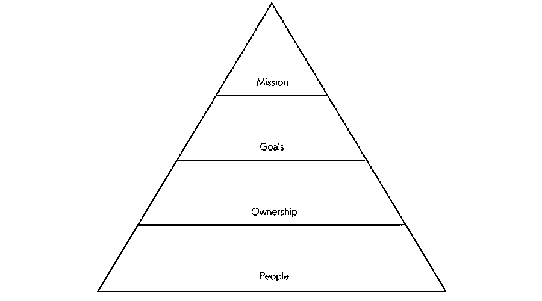
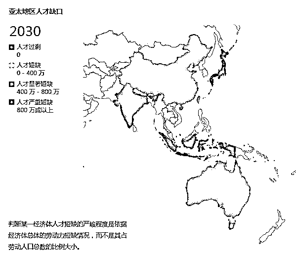

# 为什么创始人要坚持与员工当面交流？｜红杉汇内参

> 原文：[`mp.weixin.qq.com/s?__biz=MzAwODE5NDg3NQ==&mid=2651225362&idx=1&sn=ee808d6650139ae93a26017e600b2382&chksm=80804346b7f7ca50aed671ccd66e6ed7e038bab3cd24f0da991a98f384925e3653cc974613ff&scene=21#wechat_redirect`](http://mp.weixin.qq.com/s?__biz=MzAwODE5NDg3NQ==&mid=2651225362&idx=1&sn=ee808d6650139ae93a26017e600b2382&chksm=80804346b7f7ca50aed671ccd66e6ed7e038bab3cd24f0da991a98f384925e3653cc974613ff&scene=21#wechat_redirect)

[ 编者按 ] 每一位创业者都希望公司快速做大做强。然而，当成功真正来临，许多创始人又开始向往过去只需为产品与市场适配而奋斗的日子。因为现在，他们不仅需要讨好新的投资者和董事会成员，还要考虑股票期权、月活用户数和核心团队等各种事情。即便每个人都知道员工积极性对企业发展的重要影响，但在更多的重要事项面前，这一议题只能不断后延，不断搁置，直至危机四伏。

或许是我们过度强化了这一工作的复杂程度。对于初创公司的领导者来说，重振员工积极性的办法其实很简单，或者是一次巧妙的提问，或者是一次简单而有效的面对面沟通，关键是创始人是否有时间了解人们积极性下降（并持续下降）的原因……

每期监测和精编中文视野之外的全球高价值情报，为你提供先人一步洞察机会的新鲜资讯，为你提供升级思维方式的深度内容，是为 **[ 红杉汇内参 ]**。

** 内参**

**重振员工积极性的**

**4 个简单做法**

编译 / 洪杉

杰克·周（Jack Chou）曾是领英的早期产品主管，以及设计网站 Pinterest 的产品负责人，如今就职于金融科技公司 Affirm。周曾在 18 个月内，将一支团队壮大了七倍，助其打造全新技术，并将业务从零美元扩展到大规模盈利。他觉得（初创公司的）混乱可以理解，但成功与失败的区别在于创始人是否有时间了解人们积极性下降（并持续下降）的原因。

**影响员工积极性的金字塔模型**

周分享了他设计的金字塔模型——一种新的需要层级制度，用以解释如何建立和保持员工的积极性。

**人**

第一个影响积极性的因素就是人们日夜相处的工作团队。如果团队活力减弱，通常是以下两个原因引起的：其一是人员不足。其二是人际摩擦，这是一个更加紧迫和棘手的难题。

周建议负责人给予团队适当的时间。许多情况下，人们只是需要找到他们的节奏。“或许你们可以在房间里待上两个小时，仅仅将这些东西在白板上画出来，都可以让你们建立友好关系。人们需要时间放下拘谨。”周说。

在条件允许的情况下，领导者应当将信任构建与招贤纳士放到同等重要的位置上来。将团队成员放在一个必须协作的环境中，让他们一起思考并找到解决方案。

其他时候，你也可能会遇到真正不可调和的分歧。特别是在领导者的职业生涯初期，（在问题无法解决时）他们会倾向于将其搁置，并且一放就是很长时间，以为时间会解决一切。经验丰富的产品主管则会定期召开团队黑客马拉松，看看哪些人可以天然地成为很好的合作伙伴。（注：黑客马拉松也叫“编程马拉松”，是一种在一段时间内很多人聚集在一起，进行合作电脑编程的活动。）

人际关系在构建团队中是一个重要的考虑因素，有意识地关注人员的差异其实才是尊重你的团队伙伴。

**主人翁意识**

一旦你所组建的团队人员充足，大家享受在一起工作，他们就会在工作中具备一定的主人翁意识，这是影响员工积极性的第二要素。

随着公司规模不断扩大，员工们一定会觉得自己离公司重要决策越来越远，字面意义和象征意义上，均是如此。“如果我们只有 10 个人，我就可以亲眼见证决策的制定。总裁可能就坐在离我 10 英尺的地方。”周说，“一旦公司快速发展，就不能保证每个人都参与到每项事务决策中，但他们可以负责做好自己的分内之事。”

为此，如果成员间没有自然形成主人翁意识的团队文化，领导者就需要主动强调这样的文化，推动员工承担责任，做好分内之事。

例如，在 Affirm，周每星期都会进行几次产品评价。“我不提倡给团队两个选项然后让他们做出选择。而是希望他们过来告诉我，‘这是我想做的，理由是……’如果你想让员工们具备做事的主人翁意识，就应该让他们自己成为决策者，而不是从外部强加一个决策者。”周说。

培养团队的直觉和自觉意识需要耐心。通常你直接告诉他们答案会更快更简单。但不要冲动。你要教会他们这样跟你说，“我们打算这样做，这样做的原因是什么，你对此有什么想法吗？”

**目标**

一旦人们内心对自己的工作有了主人翁意识，他们就需要明确的目标来磨练直觉，保持动力。好的目标应该是可衡量的、难以轻易实现的、对业务影响深远的。快速设立这些目标的方法是在一组目标指标上达成一致：对项目、团队或公司的进度进行度量。但是要小心，如果度量标准没有按照产品的生命周期进行调整，那么指标只会立刻变得令人沮丧而不是激励人心。

周确定了产品开发的三个关键阶段:创造、扩展和优化。“随着公司逐渐成熟，你不能停留在重复的事情中，而要尝试去做新的东西。同时让之前做过的东西变得更有价值。在每一个阶段，你设定的目标——以及你关注的指标——都将非常不同。”

周认为，应该明确地告诉团队“嘿，就是这个。你是对的，去实现吧”。这是保持团队团结和热情的重要方法。

**使命感**

当你到达动力金字塔的顶端时，如果一切进展顺利，你应该有一个氛围好以及对工作有强烈主人翁意识的团队，这也是由清晰的目标和指标驱动的。而为了获得持久的动力，你还需要确保他们也理解工作对公司整体的好处。

周推荐了两种策略：一是让团队有机会与组织的其他成员分享他们正在做的事情，二是经常性地（通过各种方式和媒介）重申公司的使命。

“当公司只有 30 人的时候，你可能不需要建立正式的沟通体系。你可能不需要创造机会把想法带到更广泛的群体中。然而随着公司的成长，这些你必须都做到。”周说，“盘点一下你的员工听到你们的使命的论坛和渠道。应当每周至少发一次电子邮件，以及一周一次当面交流。”

尽管这么做可能很耗时，你也不能投机取巧。最终，使命带你来到金字塔的顶端，并成为了公司内外其他人的灯塔。积极性的其他组成部分都通过强烈的使命感得到强化：

*   你团队中的每个人都是为了这个目的吗？

*   他们是否正在朝着同一个方向努力？

*   他们是否拥有产品决策权？

*   你是否了解到作为一家企业要做的事情所处的更广泛的背景？

*   你能从衡量标准中看到它们是如何转化为改善人们生活的实际举措的吗？

**如何发现积极性削弱？**

▨ 成果产出。“成果的产出是否在以你期望的速度进行？”周问道，“如果没有，问问你自己为什么。如果你的员工在具备所有职能的小型专职团队中擅于做自己的工作——如果他们感觉自己是老板，明白他们的目标以及如何融入公司的使命——他们的工作效率就会很高。”

▨ 谈话。有些时候，人们可能会告诉你他们正失去动力。简单的警告包括：“我不知道某某为什么会这样做。”“我们对此意见相左。”“我们需要一些时间来做决定。”还有另一种形式的警告：那就是当一个团队成员不再提问，也不再试图弄清楚他们的工作在全局中起到什么作用的时候。在这些情况中，重要的是坐下来弄清楚如何彻底解决它。

请记住，坦诚有来有往，是一条双向的街道。如果你想听到员工的肺腑之言，你也需要给他们提供一些东西。

**扭转局势**

当你确实发现了动力削弱的迹象时，迅速找到源头并采取行动。周分享了他在不同岗位和公司中看到的一些常见的失败模式，以及关于领导者如何增强员工积极性的建议。

▨ 工程组觉得自己是为产品组工作，而不是与他们合作。

**解决办法：**创造主人翁意识。

▨ 产品经理是决策者，但是人们并不认为他们能够做决定。

**解决方法：**让这些管理者做决定。这一点要保持明确。

▨ 领导已经开始制定、实现更大的目标，但团队的积极性依然不高。

**解决方法：**停下来听听大家的意见。你是否了解为什么这些人觉得他们信任的人没有把团队管理得很好？又是否了解谁有充裕的时间来维护团队的和谐？

▨ 你一直坚持的一个标准不再适用于你要完成的事情。

**解决方法：**在公司和团队内，不断探讨你的目标和标准。我们要记住，标准不只是纸上的一些数据，它会帮助你实现目标。

** 预测**

**2030 年，人才荒？**

世界各地的组织机构和整个经济体，正陷入一个重大商业危机。光辉国际预测到 2030 年，技能型劳动力将出现严重的供不应求现象，全球将面临 8520 万人以上的人才缺口，导致全球年收入损失每年高达 8.452 万亿美元，相当于德国和日本 GDP 的总和。 

中国将错失 1.434 万亿美元收益，其中，受金融服务业人才缺口的影响最大。

** 情报**

#大脑正在错误地简化事物#

**认知偏差如何影响绩效管理**（以及解决办法）

▨ 基本归因谬误（Fundamental Attribution Error）。我们倾向把他人的行为归因于他们的内在特点，而不是他们所处的环境。（如约翰无法完成任务，不是因为他忙于其他事情，而是因为他懒。）

▨ 确认偏误（Confirmation Bias）。假设约翰很懒，我们就会开始到处寻找“证据”，并忽略任何与之相反的证据。

▨ 自利性偏差。作为某人的管理者（或者甚至是同级同事），在处境困难、状况暧昧不明时，我们更有可能消除自己的责任，把大错化小，并归咎于他人。

**解决办法**

▨ 让自己熟悉各种认知偏见。了解你和周围其他人可能会落入的陷阱。不断地质疑自己的判断。良好绩效管理的最大敌人是管理者容易陷入认知偏差的倾向。

▨ 在同级同事和下属中建立信任、确立开放的态度。如果别人不信任你，并且他们出现问题时你无法进行沟通，那么理解别人就会变得更加困难。

▨ 理解动机理论，尤其是内在动机。关于这个主题的著述有很多，推荐看看丹尼尔·平克（Daniel Pink）的《驱动力》（Drive）一书。

#正确认识玩耍对团队管理的价值#

**利用游戏解决工作焦虑感**

▨ 压力带来焦虑。初创企业往往变化快速，与之而来的压力和焦虑会削弱人们的恢复力，适应能力和合作能力，导致整个团队效率低下。

▨ 游戏释放情绪。解决办法之一是创建一个空间，让员工重新塑造他们用来抒发想法的物体并畅所欲言，利用创造力和好奇心表露真实意识。

▨ “折叠”阶段：通过重新整合先前无意识的想法和感受，个人可以重新与同事建立联系；团队也可以重新与其他群体及利益相关者建立联系。

** **

** 推荐阅读**

壹

[优秀领导者都要克服的五大偏见 | 红杉汇内参](http://mp.weixin.qq.com/s?__biz=MzAwODE5NDg3NQ==&mid=2651225311&idx=1&sn=97edb88c689d72d3145a13b710742a00&chksm=8080428bb7f7cb9d73de17482d04d4f56139140cb1035fe29cce41d49e24fc873e6e49ecfdc2&scene=21#wechat_redirect)

贰

[为什么极致高效、灵活的沟通是个坑?｜红杉汇内参](http://mp.weixin.qq.com/s?__biz=MzAwODE5NDg3NQ==&mid=2651225273&idx=1&sn=72d63710df276f1ed24d60c244106c54&chksm=808042edb7f7cbfbf5cb7c86128a2f973932b4b5a745149fe751575f01898b72b8b8b8e8d518&scene=21#wechat_redirect)

叁

[你对“现金为王”的理解有多少是错的?｜红杉汇内参](http://mp.weixin.qq.com/s?__biz=MzAwODE5NDg3NQ==&mid=2651225247&idx=1&sn=c2f3e71e30168c7e81b14603b6f541f2&chksm=808042cbb7f7cbdd68060128ac7ce9dc085a2be88f447be6202f0bdadb64f41b6cacee7b0d35&scene=21#wechat_redirect)

肆

[颠覆组织：让人人都成为“迷你 CEO”｜红杉汇内参](http://mp.weixin.qq.com/s?__biz=MzAwODE5NDg3NQ==&mid=2651225214&idx=1&sn=9fa64294faa93b2251c2c88e92fe5c9f&chksm=8080422ab7f7cb3cfa25225616150bfadecd2afc7c7633010ddc618233429bde6dba21f7ebc0&scene=21#wechat_redirect)

伍

[创业企业都应该学习的亚马逊 14 条领导力原则 | 红杉汇内参](http://mp.weixin.qq.com/s?__biz=MzAwODE5NDg3NQ==&mid=2651225184&idx=1&sn=1911ebd5e4704cf4105b59bf273d1207&chksm=80804234b7f7cb22800ca9f3db8690c6f99554d5cea57e4a3a93ba0e691ca561920f83c23d0a&scene=21#wechat_redirect)

