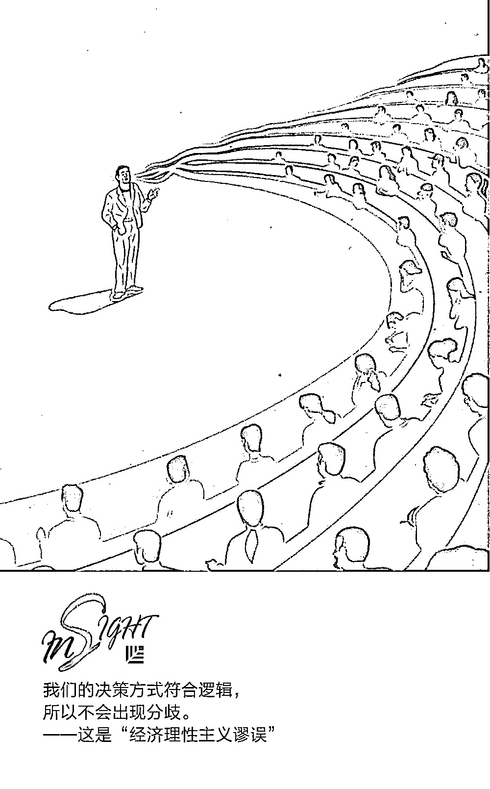
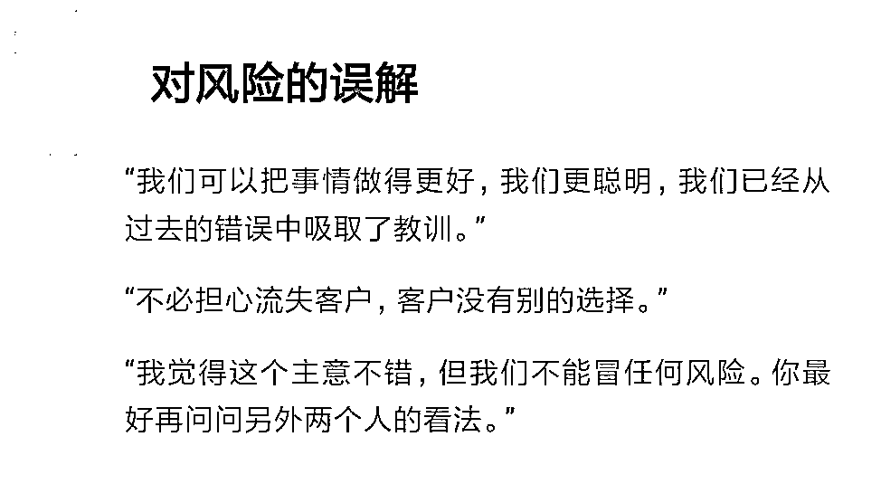
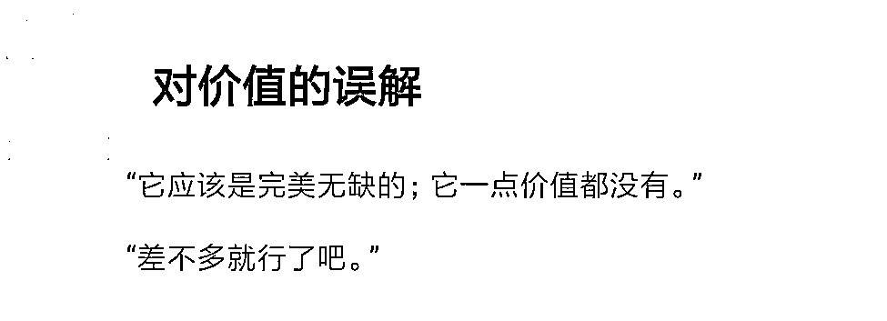
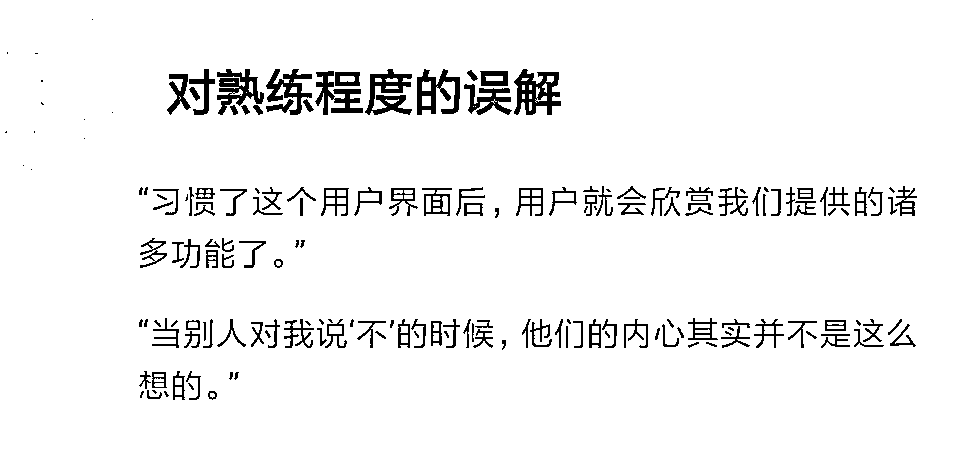
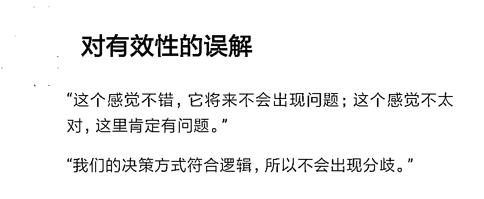

# 如何让别人对你的潜在价值深信不疑？｜首席人才官

> 原文：[`mp.weixin.qq.com/s?__biz=MzAwODE5NDg3NQ==&mid=2651224996&idx=1&sn=c42b752cf98848f70b7fd0143d78ccd4&chksm=808045f0b7f7cce68bf0153e293f63204ec0c9fea723454495d918382de3a622075b49068b09&scene=21#wechat_redirect`](http://mp.weixin.qq.com/s?__biz=MzAwODE5NDg3NQ==&mid=2651224996&idx=1&sn=c42b752cf98848f70b7fd0143d78ccd4&chksm=808045f0b7f7cce68bf0153e293f63204ec0c9fea723454495d918382de3a622075b49068b09&scene=21#wechat_redirect)

“我们以前尝试过这个方案，但没有什么效果。”如果某位领导者在会议中提出这样的观点，最常见的结果是：几乎所有人都会对此观点深信不疑，认为这类方案永远不会奏效。可事实有时候并非如此。要知道，这样的否定可能将很多颠覆性创新扼杀在摇篮中。这就属于误导性信息，它不准确，但很有说服力。

还有一个最令人感到困惑的问题是，一些企业希望将阳光、积极的文化价值观传达到每一位员工身上，但是效果却不尽人意。因为那些误导性信息源源不断地涌入企业，使人陷入气馁、自我挫败的困境。这类信息正在由内而外地损害你的企业。

精神领域的研究专家杰弗里・施瓦茨（Jeffrey Schwartz）和乔西・汤姆森（Josie Thomson）就为解决误导性信息传播的问题提供了建设性建议。他们认为应该从了解其本质开始，重新定义并构建误导性信息，使其往好的方向发展。在本文中，他们用多个真实案例详细说明了如何利用新理念让员工们对公司的潜在价值深信不疑，重新构建误导性信息以帮助公司“起死回生”。

施瓦茨是加利福尼亚大学洛杉矶分校的研究型精神病专家，著有《脑锁》等书，他还是第一位发现自主神经可塑性和注意力密度的学者，他所创建的这两个术语为个人和组织提供了变革的手段。

21 世纪初，跨太平洋集团（TPI）连交好运，该公司创始人特里・皮博迪（Terry Peabody）将一家小型煤灰回收公司逐步发展成为澳大利亚最大的废物处理企业。在此过程中，他完成了约 50 次由债务驱动的收购，并成功跻身亿万富翁之列。2007 年，皮博迪斥 12.5 亿澳元巨资（这笔钱对于澳大利亚的废物处理行业来说相当可观）收购了一家名为可宁卫（Cleanaway）的废物管理企业，此时的 TPI 扩张达到顶峰。

在那之后，全球金融危机爆发。工业废料清理业务的行情一泻千里，这是 TPI 最重要的利润来源之一。2007 年中，TPI 股价从当时的 9.96 澳元跌至 1 澳元以下，随后该公司通过私募股权基金获取了 8 亿澳元的救急资金。2010 年皮博迪退休后，该公司在短时间内连换三位首席执行官。2011 年，公司已经濒临破产，因此不得不同时采取多项企业复兴和改革重组措施。

在此背景下，董事会批准公司聘请一位名叫基思・贝利（Keith Bailey）的外部局势扭转专家，并让他在公司某个陷入困境的部门担任总经理。但不管从哪个角度入手，拯救 TPI 都是一项巨大的挑战。正如布里斯班的《信使邮报》（Courier Mail）上刊登的一篇文章所写的那样，该公司已经“债务缠身，摇摇欲坠”。TPI 垃圾填埋场的空间已经快被占满，新环境法规引起的合规费用迟迟未缴，人们对它的质疑越来越多。公司领导层相互之间几乎零交流，且他们的工作目标常常各不相同。

但这家公司最大的问题很可能出在自身的文化上，误导性组织信息已经植根于企业文化中，并且在企业里不停地反复出现。

在企业发展蒸蒸日上的那些年里，公司上下都被振奋人心、让人充满自信的信息围绕着：我们与众不同，刻板的规则不适用于我们。而现在，公司被负能量且错误的信息笼罩着：没有人能拯救这家公司，接下来我们会面临一场血洗。除了我之外，每个人都犯了错。

如果贝利和其他复兴部门的领导者没能直接解决这些问题，那么更阴暗的误导性信息就会对公司的决策过程产生重大影响，导致公司进一步走向衰落。

在担任总经理的两年中，贝利曾多次召开会议，在会议上把那些隐性假设放到明面上。事实上，贝利揭露了公司文化中潜藏的反刍思维，并将这种文化重新定义为人们在这家公司中抱有的集体心理习惯，而不是现实状况。用他的方式重新定义文化后，人们就可以重新构建自己的处境，选择一套更乐观的心态结构，促使自己向前迈进：不管公司的情况多么糟糕，只要我们内部不乱，就能扭转乾坤。

贝利充分利用了人们建立和管理自我认知习惯的方式，这种新方法发挥了很大的作用。上任九个月后，他所管理的部门实现了盈亏平衡，并在一年内实现盈利。一年半后，这个部门持续盈利，并被其他企业收购。这一举措保住了股东的资金和绝大多数相关岗位。从那之后，TPI 又经历了许多风风雨雨，但它一直以此前收购的“可宁卫”公司的名义持续盈利。该公司于 2016 年获得了复兴管理协会（Turnaround Management Association，贝利所属领域的专业人士组成的全球性团体）澳大利亚分部颁发的年度复兴大奖（Turnaround of the Year award）。

**误导性信息的本质**

许多公司都面临相同的文化难题：不准确但看似有说服力的信息源源不断地涌入，使企业陷入令人气馁且自我挫败的困境。

其实，当领导者抱怨自己的企业文化时，他们抱怨的通常是企业内部的认知扭曲现象。出现认知扭曲时，所有人仿佛都在互相欺骗，用对企业和企业潜力错误的判断来误导别人。

误导性组织信息未经核实，但人们却总信以为真，并且在日常对话中反复强化这些信息的影响力。某位领导者在讨论一项提议时可能会这么说：“我们以前尝试过这个方案，但没有什么效果。”这样一来，人们往往会达成一项隐性共识：这类提议永远不会奏效。这条共识会被当作无可置疑的公理，每个人都会避开任何与之相悖的行为。

在组织内传播误导性信息的过程与向个人灌输误导性洗脑消息的过程类似，只是规模更大。误导性信息往往会分散人们的注意力或阻止人们实现重要的目标，且这些念头似乎显得十分合理，让人难以抗拒。当你面对反复出现的反刍型思绪时，因大脑回路习惯性搅动而产生的信号比你所接收到的现实信号更具误导性。例如，被强化的负面信息：我总是把事情搞砸，没有人赏识我；或与上述想法相反的信息：我很特别，所以我可以逃避一切惩罚；又或者，其他人看待事情的方式和我一样。

精神可塑性现象会扩大误导性信息的影响力，因为反复出现的思维活动往往会强化与之相关的大脑回路神经。随着时间的推移，习惯性思维和情绪会变得越来越强烈，而且重复出现的频率也越来越高。它们还会影响你关注世界的方式，使你更注意那些强化这些思绪的事件和现象。如果重复的次数够多，这类信息就会转变成一种认知世界的固定方式。

我们当中的大多数人都或多或少地掌握了一点抵抗误导性大脑信息的方法。比如认识到自己必须走出舒适区，去学习并获取新东西。然而，即使只是抵抗这种想法也是要付出代价的。

斯坦福大学心理学家詹姆斯・格罗斯（James Gross）认为，就个人而言，忽视或压制误导性大脑信息的行为会带来更大的压力。比如会引发一些诸如强迫症、某些特定形式的成瘾或抑郁症等症状。在企业中，这会导致一些与企业策略南辕北辙的行为发生。

在这样的背景下，战略领导者的任务就是像贝利那样行动：在意识到误导性信息并非现实的前提下，重新定义这些信息，重新建立信息的架构（用更有益且更精确的新消息来代替它们），并把领导者的注意力反复转移到更准确的新信息上，直到新信息成为企业文化的第二性质融入文化中。

太多的组织中都存在着大量的误导性信息，经过不断分析总结，我们发现了以下四种最常见的误导性信息。

经济学家卡门・莱因哈特（Carmen Reinhart）和肯尼斯・罗格夫（Kenneth Rogoff）写道：“有种情况总是反复出现——形势比较好的时候，国家、银行、个人和企业会欠下过多的债务，而且没有充分意识到将来面临不可避免的经济衰退时，这些沉重的债务会带来哪些风险。”这两位经济学家在其合著的作品《这一次不一样：八百年金融危机史》中指出，在 2008 年金融危机和历史上类似危机的酝酿过程中，人们曾相互传递这样的误导性信息：“我们可以把事情做得更好，我们更聪明，我们已经从过去的错误中吸取了教训，”莱因哈特和罗格夫如此写道，并且对风险的错误评估进行了阐述，“旧的风险评估规则已不再适用”。

这种过度自信的例外主义，即高管低估企业活动风险的现象，已经使得众多企业产生自满情绪，进而走向失败。面对日益壮大的竞争对手时，高管可能会这么说：不必担心流失客户，客户没有别的选择。有时候这种误导性信息会在过分勇敢、有自恋情结的领导者周围出现：我们的首席执行官总是能抓住机遇，使企业长期处于前列。如果这种例外主义倾向扩大到整个公司，那管理者就会习惯于越界或篡改数字，变得越来越激进，直到风险带来难以承担的恶果。

自负型例外主义的另一个极端是过度厌恶风险。它同样会削弱人们的力量，当它成为一种生活方式时，这种负面影响尤其明显。我们必须做好准备应对任何可能出现的失败。过度厌恶风险通常有这样的表现：决策者在批准某项决策之前会尽可能多地为决策争取支持，“我觉得这个主意不错，但我们不能冒任何风险。你最好再问问另外两个人的看法”。

它还可以表现为“分析无能”，过度厌恶风险会让人们拒绝前进。因此，决策者不再做开创性的决策，并放弃宝贵的机会，包括从风险环境中学习并培养自我判断能力的机会。过度规避风险的公司在无意中承担着最大的风险：由于花费大量时间来进行集体反思而被竞争对手抛在身后。

正如 TPI 所经历的那样，这两种误导性信息可以同时存在，它们都以决策者的舒适程度作为风险指标。但实际上，这个指标存在问题：舒适度来自过去的成功经历（这种成功可能不会继续下去）或引起痛苦的失败经历（不一定会再次发生）。虽然风险评估技能是战略的基础，但面对这些误导性组织信息时，领导者很难培养出这种技能。

涉及价值认知的误导性信息会使人们对当前努力的潜在价值产生误解。一般情况下，这种误解会表现为完美主义倾向，或是全赢、全输的极端想法：它应该是完美无缺的；它一点价值都没有。坚持这种想法的团队可能会放弃提出一个有趣的创意，因为他们担心这个创意不够好，但好的创意可能是经过不断打磨、修改而成的。在考虑员工的晋升时，主管可能会在两种极端情形之间摇摆不定，比如头一年把某位下属视为一颗冉冉升起的新星，下一年就认为这个人一定一事无成。

全赢或全输想法的另一个极端是“得过且过”：只要满足要求，哪怕不是最优方案也可以接受。“这已经差不多达到政府工作的标准了”就是一个例子。这类信息会促使人们做出水平较低的承诺，在保证自己不受处罚的情况下交付水平较低的成果。除此之外，抱有这种想法的人还会对同事们偷工减料的行为视而不见。

对价值的误解往往反映了斯坦福大学心理学家卡罗尔・德维克（Carol Dweck）提出的“固定型思维模式”观点，但德维克认为，与之相对的“发展型思维模式”才更妥当。拥有这种思维模式意味着人们可以改变习惯、超越极限，并且在生活中持续扩展他们的能力。事实上，人们可以利用自主神经可塑性来持续达成这一目标，反复在大脑中勾画出神经通路，形成新的习惯，从而集中注意力。

如果你信奉“发展型思维模式”，就要抛弃全赢或全输的完美主义以及“得过且过”的心态，把那些推动你不断进步的事情，当作一项有价值且值得投资的活动。

你和公司影响他人、把事情做好的能力有多强？根据心理学家阿尔伯特・班杜拉（Albert Bandura）提出的定义，这个问题的答案揭示了一种“自我效能”心态，即对自己获取成功的能力有多少信心。

某些人的自我效能水平高到了不切实际的地步，这类人认为即使自己缺乏纯熟的技能也可以顺利完成高难度的任务。而自我效能过低的人即使是在有机会成功的情况下也可能会轻易放弃。

在组织当中，自我效能低下的表现为根深蒂固的不安全感。整个团体都会内化这种想法——我们现在的效率不高，而且效率永远都提升不了。这种误解通常与一种名为“排斥积极性”的认知扭曲现象有关。人们会认为任何由企业或工作带来的好处都必定都是虚假的。

劳伦和马吉德都是一家手工食品公司的区域经理。（这则故事按照当事人的要求隐藏了他们的身份，但其中的细节是真实的。）劳伦是该地区的产品经理，她之前一直期待着自己的事业可以兴旺发达，直到她推迟把业务拓展到新地点的计划，而马吉德对她做出的这一决定提出了质疑。他并没有和劳伦商量，而是把问题提交到了总部，但总部在调停时表示支持劳伦的意见。然而，劳伦并不认为自己取得了胜利；她认为马吉德避开和她交涉，直接上报总部的行为本身就代表了失败。

事件发生后，两人都觉得自己永远不会被对方接受，劳伦认为性别是主因，而马吉德认为他的外籍背景造成了阻碍。要知道，他们的上司在事情发生之前都把他们看作是极具潜力的管理者，直到发现他们无法顺利共事。

另一方面，自我效能过高往往会通过“读心”，或者把自己的态度投射到别人身上的行为表现出来。在这种情况下，自我效能过高者会假设别人对自己和当前事态的看法相互一致，并以此为行事的前提。当工程师们漠视新用户的投诉时，这种误导性信息就会反映到复杂的技术成果中。“习惯了这个用户界面后，用户就会欣赏我们提供的诸多功能了”。很多不当行为也是由“读心”引起的。人们会理所当然地认为，当别人对我说“不”的时候，他们的内心其实并不是这么想的。

对有效性的误解会让我们相信某些事情是真的，可能只是因为它给人带来的感觉，或是它背后纯粹的逻辑，但并非两者的结合体。这是一种把理智与情感分开的认知扭曲，最有效且最持久的决策是将理智与情感有效地结合在一起。

具有认知扭曲性质的信息被称为“情绪化推理”，即如果你和同事感觉到某件事情是真的，那它肯定就是真的。我们对此感觉不错。因此，我们认为将来不会出现问题。或者恰好相反，我们感觉这不太对；这里肯定存在问题。当你基于自己和同事的感受来确立逻辑关系时，可能会受到误导。这种模式通常会影响交易的结果，因为人们倾向于根据对过去交易的情感印象来评估投资。比如上次在这片地区达成的交易对我们造成了损失，所以我们再也不会在这里交易了。

情绪化推理常常会引发自我实现预言，即让自己的预期成真的预言。例如，如果你的公司被收购，你可能就会回想起过去自己有过此类预期的经历；无论你是否确认自己最终会不会被解雇，你都会感受到被解雇的那种不信任感、恐惧感，以及认为公司没有责任心，并觉得之前被其他公司解雇也是因为它们责任心缺失。但实际上，如果你确实有点自我意识过剩，顽固又暴躁，领导者更可能因为你自身的原因要求你离职。

情绪化推理的另一个极端是僵硬死板的理性主义：我们以符合逻辑的方式制定了这一决策，所以不会出现分歧。这是“经济理性主义谬误”。比如大家都支持这次裁员，因为他们已经听到了符合逻辑的理由：裁员可以提高公司业绩。裁员或许是必要且合理的，但员工们不一定会产生你认为应该产生的那种情绪。

**重新定义误导性信息**

处理误导性组织信息，或者所有误导性信息的第一步就是辨别它们的本质。我们把这一步骤称为“重新定义”而不是“定义”，因为误导性的组织消息本身就拥有一条隐含的定义：“事情就是这样的”。作为一名企业领导者，你为新产品贴上的标签决定了人们对产品的集体意识。应该告诉员工：这些信息并不是真的，它无法代表我们的真实情况，它只是我们向自己灌输的东西，我们对它们看得越清楚，就越有能力改变它们。

简单的重新定义也许本身并不是什么了不得的事，但却是领导者所能做的最有影响力的事之一。因为这可以帮助整个公司摆脱那些误导性信息的干扰，避免让组织走捷径或选择只顾眼下的短期解决方案，同时进一步建立强大的执行力、更远大的理想和更优秀的长期意识。

相比说教，询问才是高效完成重新定义的关键步骤。但不要说 “这条信息是错误的”或者“我们为什么还要相信这种东西？”而应该提出开放式问题，例如：“这条信息是如何成为我们生活方式的一部分的？我们之前试图解决哪些问题？”提出这样的问题，能让大家清楚地意识到那些不曾被人质疑或长期使用的策略都不是不可更改的信条。

 **重新构建信息**

基思・贝利帮助 TPI 扭转颓势的手段远不只是增强人们对现存误导性信息的意识。他还完成了信息的重构，即用公司潜在价值的新理念来取代陈旧的信息。

2011 年末，贝利在上任的第二天就召集了部门的十四位经理开会。他用一张思维导图来概括了自己的想法，以表格的形式列出了经营复兴战略所涉及的所有元素。这张图表非常简洁明了。从高层管理者到工厂职员，公司里的每个人都能领会其中的含义。它营造了一个进行新叙述的背景：这些问题的确相当严重，但如果我们可以克服内部的障碍并改变自己的做法，就有可能解决这些问题。

贝利表示，在接下来的两年里，公司需要采取许多令人痛苦的措施，包括大幅裁减员工人数以及其他不必要的开销，努力达成“止血”目标。公司还需要进行多项重大的业务变革，包括应用“精益思维”方式。最后，公司还出售了部分未被充分利用的重大资产，以保证它们在其他更适合管理这类资产的企业中得以存活或者取得更突出的表现。

虽然当时假期已经临近，但贝利仍然坚持要求管理人员立即执行新方法。“当时大多数工厂还有三周就要停工了，我只剩三周的时间来完成现场巡查，会见所有的核心管理人员，并进行高标准的评估，”他回忆道。“我不能等到他们一月份放假回来以后才行动。”有人问及经理们的反应和后续行动时，贝利表示大多数人都持怀疑态度，而他很清楚背后的原因。“我以前从没见过这些经理。我是新来的。别人对我的信赖程度低，而我个人承受的压力很大，公司管理层随时可能决定停业。”

在新一年的前两个月里，贝利在公司的 8 个主要办公地点组织了一系列深入核心的会议和培训活动。他向人们保证，传遍公司各处的“血洗”流言是不准确的，并承认自我保护意识等以往的情绪损害了他们提出新想法的能力，使得他们当中的许多人开始互相指责。

在一堂重要的培训课上，来自 8 个工厂的约 30 名核心管理人员齐聚一堂。贝利要求参与者以自己的业务发展目标为话题，提前准备一则简短的演讲。讨论结束后，他让这些领导者们传阅一张写有他个人立场和目标的声明书，而这份声明书是他在会议的前一天刚打出来的。“事实证明，声明书上写的东西和他们刚刚说完的话高度一致，”他解释说。“他们都惊呆了。”

他们都对于彼此正在相互竞争的误导性组织信息信以为真。然后，重新构建信息的过程就开始了：我们都在同一条船上。“然后我们就进入了正式的审视过程，”贝利说。“我要求他们找出业务过程中那些妨碍产品以有益的方式按时交付的浪费和关键故障点，并思考他们和自己的团队应该如何解决这些问题。每个人都提出了自己的想法。”在五小时内，就找出了 130 多个问题，并且在 7 个需要首先解决的问题上达成了一致的意见。他们还就由谁来推动纠正措施这一问题取得了共识，即向每个小组分配一个支援小组。这些问题都比较宽泛，而且会对大部分甚至全部的工厂造成影响。

这个重构过程使这一领导者群体免受不确定性和冲突的干扰，并为他们设立了共同的目标。

在劳伦和马吉德所在的食品公司也有一则影响巨大的重构案例。劳伦鼓起勇气邀请马吉德和她单独一起吃午饭。这并非易事，但当他们见面时，劳伦发现开诚布公地谈论她的忧虑其实更难。“马吉德，”她温和而不带怨气地说：“我们之间存在着一个问题，而且它影响着我们团队的每一个人。”

让她惊讶的是，马吉德也敞开了心胸。他表示自己也同样在意这件事；他并不想伤害她，只是想保护自己。现在他们已经意识到自己的成功取决于彼此的表现。他们不必完全信任对方，但确实应该在问题升级到需要总部干预的地步之前先进行沟通。

随着劳伦和马吉德的交流日益频繁，他们逐渐找到了新的合作方式来拓展所在地区的业务，并开始把对方视为值得信赖的对象，也不会相信那些误导性信息，不再担心自己面临被边缘化的危险。相反，现在的他们共同传达了一条信息：我们知道应该如何齐心协力地促进企业的发展。

变革型领导者是推动周围的组织成员采取前瞻性行动的催化剂，他的能力取决于重新定义和重新构建误导性组织信息实践成果的持久性。当你重新构建这些信息，编写出引领你朝着正确方向前进的新信息时，就能开启大脑中层次更高的行为模式，并让大脑的类似习性来加以强化。最终，你传达的企业文化中将不再具有误导性。

** 推荐阅读**

壹

[苹果 CEO 库克：迈出第一步，哪怕你不知道会走向何方](http://mp.weixin.qq.com/s?__biz=MzAwODE5NDg3NQ==&mid=2651224991&idx=1&sn=8ae6cf1d5075fa13dd756409857357bb&chksm=808045cbb7f7ccdd84b66399ff88045751ee20335714f6a8d5109eac763ed3257819e4fce609&scene=21#wechat_redirect)

贰

[一个人潜力高不高，就看这 3 点](http://mp.weixin.qq.com/s?__biz=MzAwODE5NDg3NQ==&mid=2651224970&idx=1&sn=5d6a110d764748bc28b6dff8d5ec53a6&chksm=808045deb7f7ccc8ca1d1d58e2bc97a9338a03046d5efa6d8ceb0c2e3b9b42d2dd956a0c9eb5&scene=21#wechat_redirect)

叁

[决定你能否淘到 AI 这桶金的 7 个问题](http://mp.weixin.qq.com/s?__biz=MzAwODE5NDg3NQ==&mid=2651224976&idx=1&sn=1dd0653a86fe833d15d437ce52520eab&chksm=808045c4b7f7ccd2719472384eb383e21078512d2233e88b8a5ee66a854535f72384c5ee733b&scene=21#wechat_redirect)

肆

[威马汽车沈晖：造一辆用得起、用得爽的智能电动汽车要花多少钱？](http://mp.weixin.qq.com/s?__biz=MzAwODE5NDg3NQ==&mid=2651224981&idx=1&sn=b9c2d40dbd889218712484fec4f3f62b&chksm=808045c1b7f7ccd7068599446b7637c22b12e033140dc56281f17f2e0d255593e14131487431&scene=21#wechat_redirect)

伍

[用户、数据的话都不可信，教你一套真正读懂用户的体系](http://mp.weixin.qq.com/s?__biz=MzAwODE5NDg3NQ==&mid=2651224985&idx=1&sn=da93d61742326c27e2fffb605128355c&chksm=808045cdb7f7ccdb7402141060115384e6b24800e54f6afe5bd21490ab7f3c7ceea66713b824&scene=21#wechat_redirect)

