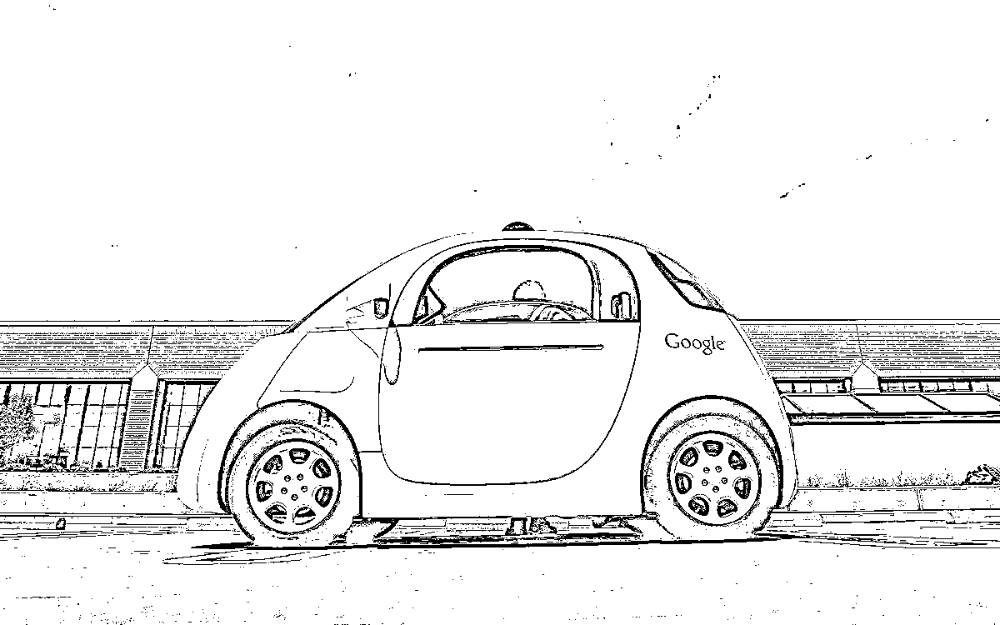
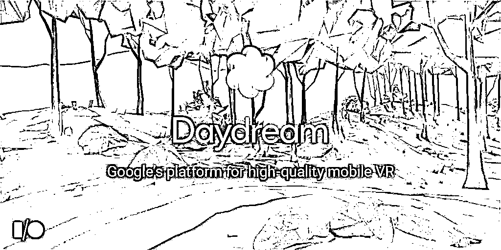
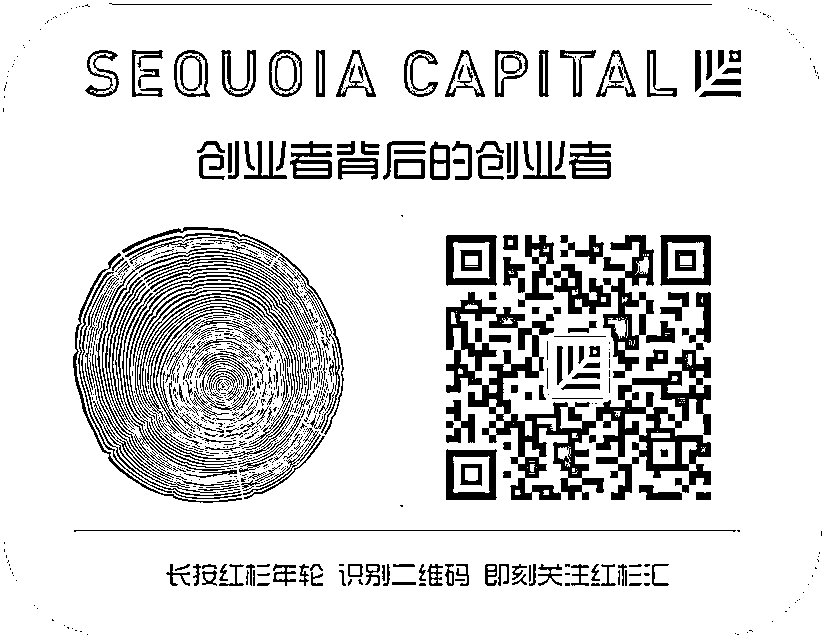

# 红杉汇内参｜创业者忠告：不要和员工做朋友，成功和友善无关

> 原文：[`mp.weixin.qq.com/s?__biz=MzAwODE5NDg3NQ==&mid=2651221562&idx=1&sn=15686ebbe0d2553ed1aa7ccc39fb7a71&chksm=8080506eb7f7d9784a77593b670ebb051ec2ccc4bc4954e10dc286db3e87edba5c8fd97181a7&scene=21#wechat_redirect`](http://mp.weixin.qq.com/s?__biz=MzAwODE5NDg3NQ==&mid=2651221562&idx=1&sn=15686ebbe0d2553ed1aa7ccc39fb7a71&chksm=8080506eb7f7d9784a77593b670ebb051ec2ccc4bc4954e10dc286db3e87edba5c8fd97181a7&scene=21#wechat_redirect)

**‖** **红杉汇内参 **‖****

第 **003** 期

*[* *编者按 ]* 在西方政治中，一直有一个不成文的潜规则：总统没有朋友。

也就是，一旦当选，总统应超越党派利益，为全体人民谋福祉。同时，总统不应该在官僚体系内有朋友，以保持公职人员的公正。

但许多创业企业家不是这样想的，或者说，正在犯这样的错误。他们误把受员工欢迎和喜欢当作 CEO 的“ 正事 ”，甚至超级享受那种年会现场各种高喊、社交媒体上被集体点赞的摇滚明星般的感觉。

Chris Myers 是美国的一名初创企业创始人，他讲述了自己的经历教训，以及最终的反思：员工需要的是一位带领他们走向成功的 CEO ，而不是爱耍宝逗趣、被赞扬很“ Nice ”的朋友。

况且，与员工做朋友的悖论是，你不可能与每位员工都成为朋友。这将意味着你在团队中区分了亲疏远近——即使你自己不这样想，但你的员工却会以亲疏远近的视角来看待与你的关系，以及你在每件事情上的决定和处理。

祝贺你：到了那一步，办公室政治就产生了。

每期监测和精编中文视野之外的全球高价值情报，为你提供先人一步洞察机会的新鲜资讯，为你提供辟开脑洞、升级思维方式的深度内容，是为 **[ 红杉汇内参 ]**。

【本期悬念】

*   **一篇心灵毒药：**员工需要的是 CEO 的领导力，而不是成为朋友。Why ？作者以自己的江湖血泪史现身说法。  

*   **如果城市交通网络完全由无人驾驶接替将会如何？**有人畅想了 50 种魔幻可能。比如，再也不需要考驾照了……

*   **一位资深美国投资人分享了他的买买买清单：**8 个也许还能经得起历史检验的长线投资主题。

*   **10 月：VR 的狂欢！**Google 、索尼和 Oculus 都将在下月推出新产品。这次不需要割肾。

**※※※**

【内参】

**创业者忠告：**

不要和员工做朋友

ChrisMyers（ BodeTree 联合创始人及 CEO ）

来源：Forbes

我所要讲述的是我首次创办创业公司并任 CEO 的经历。

在我职业生涯初期的孤独阶段，我曾在一位经理手下工作，这位经理总是难以掩饰他对其员工的蔑视。无论你做什么，都无法取悦他。

团队士气受挫之际，我使出洪荒之力投入到工作中，以试图破解他的情绪密码。最终我还是不能理解，究竟是什么驱使着他有着这样的行为。

这次经历给我留下了深刻印象。多年以后，我开创了 BodeTree 。我告诫自己，永远别成为那样的领导人。我希望打造的团队氛围是，员工有主人公姿态、能够得到赏识、能够真正快乐地融入其中。

然而，为了极力避免我曾经遭遇的那种管理方式，我却在很多事情上显得唯唯诺诺。我希望能与我的团队成员成为朋友，因此我总是扮演和事佬角色，不敢明确提出目标和工作要求，然而这些“ 善意 ”的努力最后都以失败告终。

最终，我意识到，员工需要的是一位领导，而非一个朋友。

**你是不是一个“ 漂亮朋友 ”不重要** 

一个不太恰当地比喻：做 CEO 有点像为人父母。家长都很宠爱自己的孩子，想给孩子想要的一切。然而事实是，为人父母不只是陪孩子娱乐和游戏，而是能让他们在某一天成为一个正直的人、值得尊敬的人、成功的人。而这需要纪律、奉献和困难的决策。如果你期待自己的孩子有所作为，首先是要做好父母的角色，其次才是和他们成为朋友。

同样逻辑也适用于团队管理。作为领导者，打造一个轻松、舒适和充满乐趣的团队是件令人愉快的事，如果你看起来是一位“ 有趣的老板 ”，你的情绪的确会感染到员工。但是，作为领导者，你需要做的还有很多。如果你无法制定出战略目标、无法推动员工走出舒适区、无法让员工产生责任意识，在这些至关重要的方面你是失职的。

努力成为每个人的最好朋友本质上就是一种自私的行为。

这无关乎你看上去有多友善。领导者的工作最重要是帮助员工成为最好的自己，而不是取悦他们。

**避免冲突只会让结果更糟**

我不喜欢团队里有冲突。

然而这种方式所带来的问题比逃避的问题多得多。原因是员工几乎不再去“ 犯错 ”了。行为过失或者与预期不符往往是因为理解或判断角度不同，并不一定是员工真的做错了。避免冲突没有任何益处，只会使情况变得更糟。

相反，领导者必须明确工作预期目标，即使会让人感到不舒服。

我来讲个故事。我的公司 BodeTree 工作时间很灵活，如果员工希望全天工作时间是 8:30-17:30 ，这肯定没问题。但由于工作性质的原因，一些团队成员则需要从 8:00 开始工作。

在过去，我一直没有明确表达这种要求，一是因为我一直希望员工仅仅做好份内工作，我不鼓励为公司额外付出或牺牲；二是因为我讨厌设置双重标准。但结果是，我回避了很多事情的公布。这种领导方式显得懦弱且无效。

其实我需要做的，仅仅是在团队成员面前说明情况、设定预期目标。避免冲突的模棱两可态度带来的仅仅是困惑和挫败。

**接受这一点：CEO** **是孤独的** 

大部分人都仍然会这样描绘领导关系：金字塔模型，即领导在塔尖，下面是各级经理和员工，大家都争相服从和试图取悦领导者。然而，真正的领导关系就好比一个倒金字塔，整个团队反而需要依靠一个领导者来驱动他们的努力和付出。

一个不可否认的事实是，CEO 是一个从根本上孤独的角色。如果你努力成为每个人的最好朋友，你将被孤立并且整个团队没有危机意识。你需要带领团队前进，这需要纪律、牺牲和勇气。

员工需要领导者，而非朋友。

**※※※**

【情报】

#也许还经得起历史检验呢#

投资者应关注这 8 个长线主题

Sungarden 投资研究公司创始人 Rob Isbitts 分享了他的一份长期投资主题的有限列表，这份列表经常进行动态更新。他认为，专业投资者能够比业余投资者做的更好的就是，跨越不同级别构建其投资组合，并能够清晰地界定它们——

*   优雅地老去：婴儿潮一代的退休后生活，花在医疗保健和休闲娱乐上的钱会不断增加。

*   属于亚洲的世纪：在发达经济体日本和欠发达的越南之间，还有众多国家市场，值得长期跟踪关注。

*   哑铃经济：金融危机后，收入不平等现象加剧，对某些能够服务于哑铃市场两端的公司来说这是机遇。

*   连接消费者：移动互联网、电商不再是一种趋势，而是一种新的现实。

*   能源多样化：在化石能源之外，企业和消费者有了更多选择。

*   产业演进：自动化和高科技制造工艺的进步，企业正生产出“更加智能”的产品。

*   基础设施：永远有需求。

*   穷途之困：食品行业高需求与有限供给之间的矛盾长期存在，领军企业应做好长期投资的打算。

｜来源：Marketwatch 

# 哦！警车追逐劫犯的场景没有了 #

无人驾驶渗透未来的 50 种魔幻方式

作者 Geoff Nesnow 畅想了 50 种未来世界被无人驾驶全面改变的科幻电影般的场景，在此摘选其中 10 条：

*   车辆设计和制造行业的新成员将包括优步、谷歌、亚马逊及其他您并不了解的公司。行业内会有 2 到 3 家公司控制着整个消费运输市场份额的 80% 。

*   驾照慢慢消失，多数国家的机动车辆管理部门也会消失。

*   不再有停车场或停车位，住宅和商厦的建筑美学也将有所改变。

*   交通灯和标志会过时。车辆甚至不再有前照灯，红外和雷达将取代人类可感光范围。

*   石油不再重要。这一转变将造成许多地缘政治方面的影响。

*   随着步行和自行车的便利普遍化，“ 适合步行的城市 ”将更受欢迎。

*   人们在出行的途中能够有更多时间从事其他活动，或者提高生产力。

*   人们会知道自己的出发和到达时间以及目的地。迟到的借口变少。

*   酒驾罪不再出现。餐馆和酒吧将出售更多的酒水。

*   更多的人将参与赛车运动，重温他们的驾驶情结。

| 来源：InnovationExcellence

#这不是虚拟现实，这是真的#

10 月：即将到来的 VR 狂欢

 谷歌的 Daydream 平台、Oculus 的 Touch 以及索尼的 PlayStation VR 都将在下月发布新产品，它们将带来什么？

*   谷歌将在 10 月 4 号举行发布会，首次展示适用于 Daydream 平台的 VR 耳机模型，以及宣布与制造商合作推出 Daydream 手机。

*   今年，Facebook 与 Oculus 实现了深度融合，如何在 VR 环境中添加 Facebook 好友和进行社交分享？Oculus 将于 10 月 5 日召开的第三次开发者大会或许有解答。

*   10 月 13 日，索尼将发布 PlayStation VR 耳机。这是索尼进军 VR 以来的又一新作，为消费者提供了除 Rift 和 Vive 之外的低成本选择。

*   11 月初，洛杉矶还会有一场 VR 开发者大会举行。

｜来源：VentureBeat

#我为什么又接到了骗子的电话#

贵公司有数据伦理观吗？

 数据即信息，信息即洞察力，洞察力即权力。大数据技术让我们的信息极易被收集，但消费者对公司的数字信任却几乎没有。怎么办——

*   你能够接触到数据并不意味着你可以任意使用。

*   现在，企业已经很难与客户建立数字信任，双方已有的信任已非常脆弱。

*   Gartner 预计 2019 年全球信息安全支出将超过 1000 亿美元。

*   企业应该设计执行一套数据伦理审核流程，就像软件开发的标准审核流程一样。

*   在当今数字市场上，信任的价值是通过底线衡量的。信任指数高的公司会赢得较好的品牌忠诚度。

｜来源：斯隆管理评论

**※※※**

【往期回顾】

红杉汇内参第 002 期

[让员工对进步上瘾：第一手解读替代 KPI / OKR 的美国最新管理理念](http://mp.weixin.qq.com/s?__biz=MzAwODE5NDg3NQ==&mid=2651221540&idx=1&sn=8b5c160dcdb89a3f015e5a2b9406182e&chksm=80805070b7f7d96660a5e6b3ab6efbd36e0f8ec37c309e735a0e3063f0a06f98453fc817eb69&scene=21#wechat_redirect)

 

红杉汇内参第 001 期

[机器智能时代，非科技公司如何立于不败之地？](http://mp.weixin.qq.com/s?__biz=MzAwODE5NDg3NQ==&mid=2651221512&idx=1&sn=7907c0307bcc6a167a377f8fe3327bc3&chksm=8080505cb7f7d94a6807454b7886bf0de38e47f73430393bc29e30ae2c42583d5dca848c8090&scene=21#wechat_redirect) 

  

