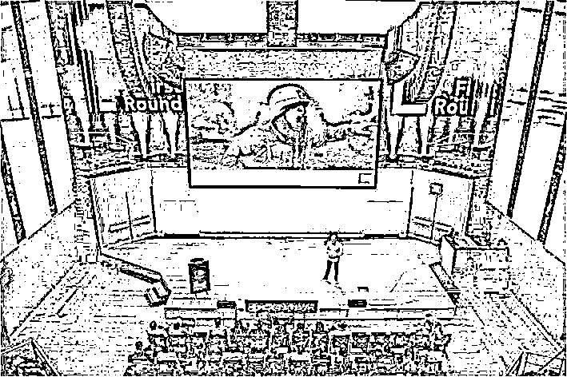

# 管理者必须与员工进行的 3 场对话 | 红杉汇内参

> 原文：[`mp.weixin.qq.com/s?__biz=MzAwODE5NDg3NQ==&mid=2651221890&idx=1&sn=f4630a0c0388c85a3e99ba617f76d96c&chksm=808051d6b7f7d8c0ba31f94a44a40eb170d38c3d6fe6b59b18002f000692f8aaf2a0822bcf58&scene=21#wechat_redirect`](http://mp.weixin.qq.com/s?__biz=MzAwODE5NDg3NQ==&mid=2651221890&idx=1&sn=f4630a0c0388c85a3e99ba617f76d96c&chksm=808051d6b7f7d8c0ba31f94a44a40eb170d38c3d6fe6b59b18002f000692f8aaf2a0822bcf58&scene=21#wechat_redirect)

**| 红杉汇内参 |**

第 009 期

*[* *编者按 ]* CEO 为什么要关注员工的个人职业发展甚至是人生状态？本质上是因为，现代企业的管理方式不再是只追求效率，而是需要创造性协作。

本期推介一篇俗称的“深度好文”：一个合格的管理者必须和员工进行的 3 场对话，以关注员工的过去、当下、未来的职业发展规划和人生梦想。让员工实现自我驱动的自我管理，也就是“不待扬鞭自奋蹄”的状态，需要的是价值观和愿景的契合，在其与你的公司能够**同行**的这一段旅程中，彼此成就，互有裨益。

本质上，关注人是 CEO 最重要的工作。而不只是 HR 的。

每期监测和精编中文视野之外的全球高价值情报，为你提供先人一步洞察机会的新鲜资讯，为你提供辟开脑洞、升级思维方式的深度内容，是为 **[ 红杉汇内参 ]**。

【本期悬念】

1、请从幼儿园开始，谈谈你的人生吧！竟然要从这个话题开始你与员工的**职业发展对话**？

2、说到 2017 年的**大趋势**，无外乎大数据、云计算、人工智能之类。这些趋势背后的趋势是什么呢？

3、更大范围的**网络恐怖袭击**会在明年发生？有人这样预测。

4、一位创业 CEO 说，好老板的关键是**下放权力**，不要把所有猴子都背到自己身上。

  ※※※

【内参】

管理者必须与员工

进行的 3 场对话

Russ Laraway 在演讲中

当作战计划因为各种突发情况落空，年轻的士兵下一步应该做什么？了解指挥官的想法之后，最没有经验的士兵也能懂得如何灵活应变，完成最终任务。同样地，“管理者要让员工和他一样对战略目标有清晰明确的方向。”Candor 公司创始人之一兼 COO 拉斯•拉里韦（Russ Laraway）说。

曾任美国海军陆战队连长的拉里韦退役后，成为一名咨询顾问，曾为谷歌几百名员工的职业发展制定框架，也在推特从事运营以及管理的相关工作。在近日由 First Round 举办的 CEO 峰会上，他描述了一个服务型管理者在与员工进行职业发展对话中应该具备的技能，以此促进共同进步、提高参与度、留住团队中的有用之人。任何创业公司都希望留住那些天才员工，不妨来听听拉里韦的有用建议。

**搞砸与员工对话的四种表现**

*绩效考核实际上就是员工对过去的工作耿耿于怀，而真正有效的职业对话应该是向前看的。绩效考核≠职业发展对话*

你是否需要将自己目标和热情传达给你的员工，这样他们也能够以同样地方式来回报公司？

相信你的答案是肯定的。

“服务型管理者”这个概念诞生于 1970 年代，指的是管理者以身作则，以服务团队需求的方式来领导员工。“一个让你知道自己是否是服务型管理者的方法，是看看你的员工是否在你的领导下实现了自身发展。”拉里韦说，“人们会惊异于自己在不断进步，越来越接近自己的梦想。这只是职业发展对话其中的一个优点，它还能适当地抑制员工想辞职或是急于晋升的焦躁情绪。”

不过，“你必须得小心，谨防自己在与员工进行职业发展对话中走捷径。”拉里韦警告说，“有你没你，员工在职业的道路上都会有所发展。问题就在于他们将会发展成为什么样子？”

常见的四种与员工对话的四种糟糕情形是：

*   绩效考核=职业发展对话。员工并不知道和上司谈论自己的职业规划是自己的义务，更糟的是，“伪对话”的情况也时常发生。绩效考核就是典型例子，它实际上是指员工对过去的工作耿耿于怀。然而，正确有效的职业对话大多是对未来工作的展望。

*   升职对话=职业发展对话。“讨论升职就是讨论职业吗？不是这样的，”拉里韦说道，“升职，说得好听点，就是在一定范围里的提升。说得难听些，升职仅仅是对一次工作完成度的肯定。升职对话并不等于职业对话。”

*   让员工填写个人规划就万事大吉。坏公司的做法是，让每个员工填写个人发展规划，然后汇总到 HR 部门，但之后再也没有人会看这个所谓计划一眼。

*   缺乏指导的随心所欲。员工在制定职业计划时，往往走一步算一步，或是半途而废。

怎样避免以上这些糟糕情形发生？拉里韦的建议就是，和员工就职业行动计划进行一次严肃的、意义非凡的甚至称得上奇妙的对话，真正帮助他们一步一步发展，不断接近他们的梦想。这种方式本身就是在给员工一种暗示：“我一直在进步，而且我的老板始终在背后支持着我。这样看来，别的公司也并不见得有多好。”

**请从幼儿园开始，谈谈你的人生**

*如果他们不愿用单一理想来限制自己，就让他们说出三五种*

以下是管理者必须与员工进行的三场对话，每一次都至少需要进行一小时，间隔时间大约为两周，以此帮助员工了解过去、现在和未来在内的他的整个职业生涯的关键性一步应该怎么走。

一、回望过去。可从这个问题开始：“请你从幼儿园开始，谈谈你的人生。”接着向他们提出更多关于人生目标的问题。

“曾经在你的人生里给过你强烈信号的人，请一定要珍惜他们，并记下他们给过你的信号”。那些既往发生过的故事能够帮助管理者更直观、更细微地了解员工在意的是什么，他做了什么才让他成为今天这个样子。

二、明确灯塔的位置。对于员工来说，最关键的一步就是明确未来发展目标——问问员工的梦想是什么。

如果员工不愿用单一理想来限制自己，就让他们说出三五种来。但不要说未来十年这种有时间限制的计划。在员工觉得愿意接受挑战之时，问他，走到职业巅峰之时会做些什么。

拉里韦的建议是，管理者在理解员工的梦想之后，问他以下三个问题，从而将这个梦想清晰化：

*   你想在多大规模的公司里工作？

*   你想在哪个行业发展？

*   你是想做资深个人贡献者，还是资深管理者？

三、制定职业行动计划。这份计划会细致入微地描绘出员工的个人梦想实现之路，可看作是引导员工实现自我的路线图。

**职业行动计划的本质：**

**何人在何时做何事？**

*理解一个人的长远职业理想之后，就能给他更利于长远发展的培训投资*

“明确了人物、事件、时间的计划才是可靠的计划，才能成为管理者进行管理调配的基础。”拉里韦说。

大多数时候，员工对职业发展的思考不过是对旧想法执着的重复：下一步是什么？——人们渴望知道自己下一个工作是什么、下一次升职是什么时候。但是，如果管理者能让员工感觉到对他的支持，感觉到自己在以不一样的方式对他进行投资，结果会不一样。管理者要让员工的现有工作能够帮助他们实现自己的职场终极梦想。

同时，因为了解到员工想扮演的下一个角色或者是目标，不管是员工所希望的纵向或横向的职位调动，都能够帮助管理者对未来的“何人在何时做何事”有更清楚合理的调配。

拉里韦说：“海军陆战队员知道战斗结束状态应该是什么样，因而指挥官能够带领大家一步步结束战斗。一个人对最终状态有了明晰的认识，就能够在当下采取有意义的行动。这就是所谓的混乱中的清晰。你越是帮助员工们走好自己的路，他们就越倾向于长久地服务于你的公司，在自己前行的同时，也为公司创造价值。”

 ※※※

【情报】

#知其然，还得知其所以然#

**“技术名词趋势”背后的趋势**

Thought Works 的一篇文章指出，在大数据、物联网、人工智能等以技术名词为代表的趋势背后，你可能忽略的真正趋势：

*   系统智能化和交互性日益增强。机器智能将会开启企业生产力的新时代，从以工作流为中心的应用发展为以决策为中心的应用。

*   VR 和 AR 会成为各个组织必须建立、购买或租用的主流功能。你需要问自己的是：“我们要打造哪些体验？”

*   社会性设计和技术性设计同样重要。团队结构的整体效应得到越来越多的赏识，将一个组织划分为多个明确定义（外部或内部）“客户”和明确的成功准则的团队，将能够交付更出色的成果。

*   平台支持技术发展。企业需要一项用来发展壮大企业数据资产的数据策略。

*   “智能授权”。利用与人类直觉和灵活性相配合的机器智能来交付远好于利用机器或人类单独交付的结果的系统。

#城中大盗与黑客帝国#

**2017****：更不安全的网络世界**

 在信息技术界与国际社会中，2016 年被认定为迄今为止网络世界最不安全的一年。就此，Portnox 公司 CEO 谈到了 2017 年关于网络安全的五个预测：

*   物联网会成为下一个木马。物联网设备在默认情况下是开放的，受默认密码保护，虽然方便了用户，但对企业安全来说却是噩梦。

*   更多的标准安全控制和方案被设立。

*   自动化加强。允许软件自动更新、合规性更改和即时检测漏洞、自动修正响应。

*   更大范围的网络恐怖袭击的增加。如对水、电网络和核设施等关键基础设施进行攻击。

*   对公众人物的攻击。今年的美国大选中就能让我们一窥黑客的出没和私人信息的泄露，用来影响公众和羞辱公众人物。

#不要把猴子都背到自己身上#

**一位创业 CEO****说，好老板的关键是下放权力**

美国宠物短期寄养网站 DogVacay 的创始人、CEO Aaron Hirschhorn 近日在接受《Entrepreneur》杂志时说：

*   您用什么策略来保持专注力？尝试在相对较短的时间范围内谨慎的设定一两个具体目标，且确保实现设定的目标。否则是很容易就会被无尽循环的电子邮件、会议和讨论所淹没。

*   早期工作教会了您什么重要或有用的东西？站在别人的立场上思考问题，理解他们的动机很重要。

*   您得到的最佳建议是？下放权力，不再干涉不属于我的工作。

*   您极其信赖的效率信条是什么？每天抽出几个小时不看电子邮件，专注于其他事情，与其他人面谈。

*   面临创造力瓶颈时，您使用什么策略恢复创新性？走出现有圈子，走出办公室，与不同的人谈话，倾听不同观点。

**※※※**

【往期回顾】

红杉汇内参第 005 期

[向达芬奇学创新：隐藏在《最后的晚餐》中的秘密](http://mp.weixin.qq.com/s?__biz=MzAwODE5NDg3NQ==&mid=2651221720&idx=1&sn=d1a24a85999144e565ac1a50c1bc1b40&chksm=8080508cb7f7d99ae3364fb83d64461910b50d762e8a2a8868b81fff2c8523002c3079fd58a7&scene=21#wechat_redirect) 

  

红杉汇内参第 004 期

[乔布斯和富兰克林：谁拥有更棒的领导力](http://mp.weixin.qq.com/s?__biz=MzAwODE5NDg3NQ==&mid=2651221672&idx=1&sn=e4fe4295cd23572d9b8007449a8348d5&chksm=808050fcb7f7d9eac7260b157b384f463ae440c1da2e9f6c690ccb89328cfb118794dbb26957&scene=21#wechat_redirect) 

红杉汇内参第 003 期

[创业者忠告：不要和员工做朋友，成功和友善无关](http://mp.weixin.qq.com/s?__biz=MzAwODE5NDg3NQ==&mid=2651221562&idx=1&sn=15686ebbe0d2553ed1aa7ccc39fb7a71&chksm=8080506eb7f7d9784a77593b670ebb051ec2ccc4bc4954e10dc286db3e87edba5c8fd97181a7&scene=21#wechat_redirect)

