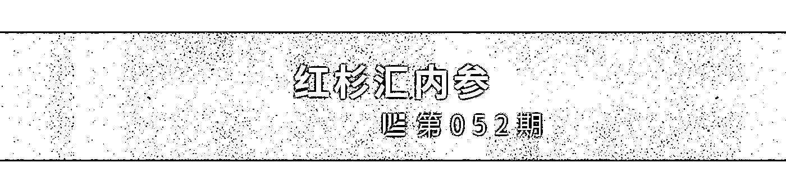
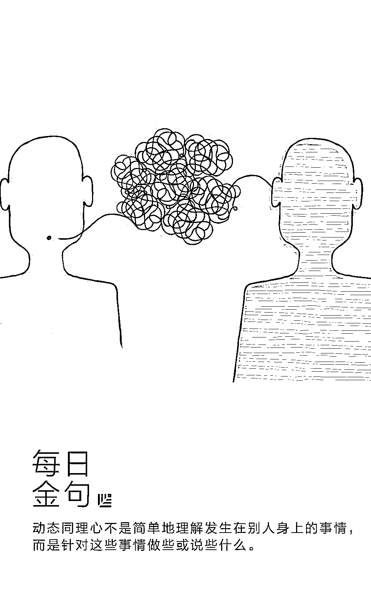
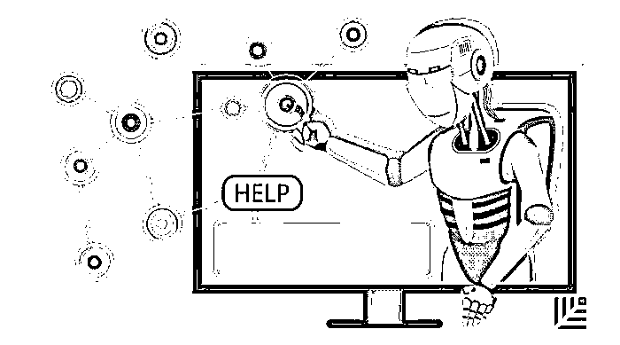
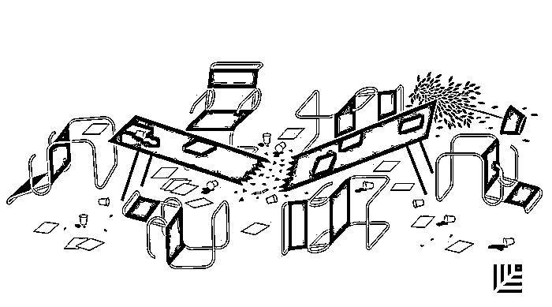

# 把「考虑别人的动机」变成自己的管理习惯｜红杉汇内参

> 原文：[`mp.weixin.qq.com/s?__biz=MzAwODE5NDg3NQ==&mid=2651223919&idx=1&sn=30c3b0dc887b282aebeee0568505af42&chksm=8080493bb7f7c02d4c29842203fafdaa5aef8c882ff18edc0a292acf0169132f1ac78da8195a&scene=21#wechat_redirect`](http://mp.weixin.qq.com/s?__biz=MzAwODE5NDg3NQ==&mid=2651223919&idx=1&sn=30c3b0dc887b282aebeee0568505af42&chksm=8080493bb7f7c02d4c29842203fafdaa5aef8c882ff18edc0a292acf0169132f1ac78da8195a&scene=21#wechat_redirect)

[ 编者按 ] 相信我，一切管理问题就是沟通问题。

如何好好说话真是一门艺术，因为信息总有衰减，需要编码到解码。不能正确理解战略意图，管理者对员工有看法；不能恰当关注情绪和心态，员工对管理者就会有抱怨。

这里有一个好方法：建立“动态同理心”。能够感知同事的感受和想法，以及想出在一个快速变化的环境里如何应对这些感受的方式，才能快速解决问题以及实现同心同力。

它的目标不是要预测人们的所思所求，或者将来会发生什么，而是在众多的可能性中思考，做到随机应变，同时仍感觉自己是有备而来。

在耶鲁-红杉领导力中心项目 2017 级开幕的系列活动中，其中一场 Workshop 特别邀请了积极心理学的讲师来向学员分享，如何从改变认知、体察情绪、转换语言范式入手，提升创业团队的积极沟通效果，本期内参主文正与此有所呼应。**原文长达 1 万多字，在红杉汇后台****回复「****同理心****」可取阅 13 种训练方法的具体清单。**

每期监测和精编中文视野之外的全球高价值情报，为你提供先人一步洞察机会的新鲜资讯，为你提供升级思维方式的深度内容，是为 **[ 红杉汇内参 ]**。

** 内参**

把考虑别人的动机变成管理习惯

**建立“动态同理心”**

作者 / Maggie Leung

综合编译 / 洪杉

读大学期间，麦琪・梁曾做过一份工作，对她来说简直是一场噩梦。

她当时在一家汽车服装租赁店工作，这家店常常会采取超额预定的措施，而她每天的工作常常是面对这些没有租到服装而盛怒的车队，跟他们说他们是运气不好。“所以我就想我可以利用这个机会去学习——试着摸清每种人的特点，然后尽快地平息他们的怒气。因为他们无论怎样都是会生气的。”

这种意识培养了她日后职业素养里非常关键的一种能力，助她今天成为 NerdWallet 的内容副总裁，管理着全美 100 余名作家和编辑。她运用察言观色的能力，发现身边的人需要什么才能实现成功，以及如何有建设性地解决工作中出现的种种状况。

梁把这种能力称为**“动态同理心”——指的是你能快速地感知同事的感受和想法，以及想出在一个快速变化的环境里如何应对同事的这些感受。这种能力不是天生的，可以通过后天学习。**在摸索学习这种能力的过程中，梁仔细地记下了许多组问题，这些问题让她得以应对工作中出现的最棘手的情况。

它们尤其适用于人员管理或者跨团队合作这些领域。让你学会如何拥有动态同理心、快速解决问题以及实现同心同力。

这就是，把“考虑别人的动机”变成自己的一个管理习惯。“当我理解并能清楚地表达出他人之需时，我就可以更大方地说‘你的需求我可以理解。那下面是我的需求’。这种对话才是平等，可行的，好过你说‘我要求你要给我这些’。”梁如此说道。

建立动态同理心的目标不是要预测人们的所思所求，或者将来会发生什么，而是在众多的可能性中思考，这样你就既可以继续随机应变，同时仍感觉自己是有备而来。

它不是简单地理解发生在别人身上的事情，而是针对这些事情做些或说些什么。这能成为你前进的助力。

以下就是梁找到的建立持续信任的最有效的沟通策略。

**正视问题，消除顾虑**

如果你想要一对一地展开问题的讨论，那就不要有所掩饰。如果你发觉有人犹豫不决，不知道要不要迎接挑战，那你就应该正视这个问题了。你应该直接说：“嗨，你可以跟我谈谈，这不会影响你的表现评分。”当员工发现你在采用这种方式建立人际关系的时候，你就可以建立信任了。

**提出具体的、开放性的问题**

通常与员工谈话时，管理者得到的都是一些肤浅的回答。“你过得怎么样？”得到回答都是“我过得很好”。这时候，你要让对方稍微主导一下谈话，看看他们是否能够直指问题的核心。如果不能，那你要引导一下。比如，你可以问：“比这件事难度更大的是什么？”

这种方法能帮你在与不同的人交谈时识别其中的模式，帮你提前察觉危险信号。在不同的场景、工作和公司中，这个问题都适用。而且它没有指责意味。

我们的**目的是让对方觉得自己的情绪是正常的——而不是去指责。**如果你问“你是不是很焦虑？”，就好像在逼迫别人承认，这会让别人觉得尴尬。你可以换种说法，比如：

“我知道你现在同时有许多工作要处理。如果我是你，我可能会有点焦虑。”

“你的团队现在压力很大，大家都怎么处理的？每个人对压力的反应不一样。”

“我不确定你什么感受，但是要我说的话，我觉得……”

**只要你给了别人纠正你、坦诚交谈的空间，即使你说错了也没关系。**

你应该迅速找到问题的核心，同时又要显得通情达理。如果问题得当，你可以很快就跳过闲聊部分。因此，问题要具体，同时寻求的回答又要显示开放性。

在和别人一对一交谈时还可以直接问“我能帮上忙吗？”如果员工认为管理者真的关心并且想要帮忙，他们就会产生信任，并愿意全力以赴。

**带着弱点领导团队**

然而，在任何人际关系中，真正的坦诚很少是单向的。所以对于那些向你汇报工作的人，不要只是审视他们的工作是否到位，你要向他们吐露自己的缺点。

交谈不要用太空泛的术语或者词汇，而是要用他们能够联想得到的或者在你身上学到的例子。坦诚地讲出你感到吃力、需要帮助的事，对管理者或者任何人都大有裨益。

**作为管理者，不论你有没有意识到，团队成员其实时时刻刻都在给你打分。**理想情况下，你应该清楚自己的表现如何，存在哪些可以改进空间。

**主动确认内容**

明白坐在你对面的人从哪里来，只是这个过程的一部分——你还要让他们知道你理解他们。达成这个目标可能就像确认听到的内容一样简单。

在对话的整个过程中，要对听到的内容进行不断回顾或者重新解读，亦或不断巩固。也就是说**要传递这样的信号：“我”正在聆听，“我想确保我正确地理解听到的内容”。**

这个简单的技巧益处多多：你可以厘清所有你存在误解的地方，当然也会促进话题推进。此外，这个行为还能创造共鸣。

如果你很在乎这次谈话，你就会主动去确认对方的说法，说明你真的在努力了解他人。如果不是这样，你就会沦为那种问“你好吗”的人，结果不言自明。

**寻找模式**

你可以反复问同样的问题，但是要聪明地问。除了要让对话有意义，这项练习的一个目标就是识别出其中的模式。“如果我听到两三个人都在说一件事很难，我就会想找原因，”梁说，“可能是过程有问题，或者我们对员工要求过高。我可能会记录下来，然后进行后续跟进。之后我会再回到这个问题上或者派人去做。**大家都不希望有人要求你投入努力，然后又忽视它。**”

**问无止境**

最后，记住，它并不是“一次成功，高枕无忧”，而是一种思维模式，一种新的管理和合作方式。即使你已经能够看透他人，你还是要不断分析这些问题。毕竟，人会改变，你在努力弄清楚的动机也会改变。

一些人原来可能是为了得到职业发展而加入公司，但现在他们有了孩子，可能就会寻求一种更加平衡的生活-工作方式。**公司需求和个人需求总有不在同一个圆内的情况，圆圈中的内容可能也会变。但只要这两个圆圈的重叠部分变大，那么即使发生改变也没有什么大碍。你只有不断问问题才能知道重叠部分的变化。**

** 情报**

#建立决策的智能投（票）顾（问）系统#

**董事会里的 AI：公司治理的下一个王国**

复杂的决策需要智能系统的辅助。**将 AI 融入公司的治理和战略实践中，这与领导力和治理的自动化过程没有关系，主要目的是提高董事会的智能水平。**AI 在战略决策（资金分配）和经营决策中的应用将成为一种必不可少的竞争优势，就像工业革命中的电力和信息时代里的 ERP 一样举足轻重。

▨ AI 可以追踪资本分配模式，突出关注因素（比方说，某家公司正在削减研发支出时，大多数竞争者正在增加投资）；

▨ 审阅并处理信息，找出正在进入核心产品市场的新对手；

▨ 提供投资建议以帮助企业保有市场份额；

▨ 分析内部沟通表现以评估员工士气并预测人员流失数量；

▨ 识别对产品或战略有影响的顾客偏好或构成特征。

**将 AI 引入决策过程的三个步骤：**

▨ 绘制多家企业的“基因组”图谱，并将这些数据与经济成果结合到一起，从而创建一组数据；

▨ 开发一种量化单个企业的方法，并将结果与更大的数据库进行比较，评估其竞争力和发展轨迹；

▨ 让 AI 来推荐行动方案（如改变资本配置），从而提高组织绩效。

#扪心自问四个问题来打破这一恶性循环#

**压力让你成为一个微观管理者，这让事情变得更糟**

确实，你只是觉得需要对自己的企业有一种控制感，你害怕出错，相信如果要做好某事，最好亲自做。但是，你的压力驱动型微观管理对你和他人都有害——

▨ **我扼杀了团队的创造力吗？**如果员工觉得他们没有测试新事物的自由，他们将会放弃发挥创造力。如果在最近的项目或集体讨论中，你不满意他们提出的举措或理念，责任或许在你。

▨ **我影响了员工表现，或导致员工离职吗？**微观管理会让员工觉得你并不相信他们的判断。2011 年的一项研究发现，觉得工作时受监视的员工结果表现较差。

▨ **我正在损害团队成员的健康吗？**有压力的工作在遇到决策自由度低的情况时对员工的健康有着明显的负面影响。

▨ **我是在做自己的工作吗？**团队工作顺利会为你腾出时间，做好你自己应该做的事情。不要担心，如果团队需要你，他们会来找你。

如何解决？

▨ **尝试一下 360 度匿名反馈调查**，了解你的不良习惯对他们造成了什么影响。

▨ **确定是什么令你产生担忧和压力。**

▨ **说出你的愿景和你希望自己的团队取得的成果。**暂时不要关注工作细节，重新考虑其目的，明确目的之后，就命令他们该如何做。

▨ **不再由你制定方法，为你和你的团队制定所有权和参与度指南**：你将不放弃参与哪些任务和关系？团队什么时候该来找你？抵制你的干预冲动。

#重要的是，不要犯同一模式的错误#

**可能会搞垮你公司的 9 个错误**

莫因错误而灰心丧气，相反，从教训中学习和成长。以下是一位创业 16 年的老兵的箴言：

▨ 用人不善，而且**没有及时辞掉他们。**

▨ 对客户没有服务条款限制。

▨ 缺少工作规程和检查表，让小疏忽造成大损失。

▨ **接受坏的交易**，没有挑选客户。

▨ **让优秀员工过度工作。**

▨ 把工作交给不靠谱的自由职业者。

▨ 承接超出我们能力范围的项目。

▨ “我只是想帮忙” “你为什么不告诉我？”之类的话，并不能解决与员工的冲突。

▨ **抓住机会，而不是等待行动的完美时刻。**************

** 推荐阅读**

壹

[终身学习，抵达未知，红杉-耶鲁助你为领导力赋能](http://mp.weixin.qq.com/s?__biz=MzAwODE5NDg3NQ==&mid=2651223905&idx=1&sn=64d01a8e5f7f23640f2e9dbef0508896&chksm=80804935b7f7c02307f0b6e7ef45ceb21f4b7ea7793089b5d1dd070194e0cd0b895543543176&scene=21#wechat_redirect)

贰

[顶级科技公司为何如此热衷“学徒计划”？](http://mp.weixin.qq.com/s?__biz=MzAwODE5NDg3NQ==&mid=2651223906&idx=1&sn=7a2db9d76910ebfe5d3cc38f75a8cb42&chksm=80804936b7f7c020496df819677b0eb0968e8dade06d306ff471e7574fa6ea5544146eacd91c&scene=21#wechat_redirect)

叁

[猩便利获 3.8 亿 A1 轮投资，红杉中国领投，共同推动中国即时便利消费体验升级](http://mp.weixin.qq.com/s?__biz=MzAwODE5NDg3NQ==&mid=2651223918&idx=1&sn=8bc8ac01759026fe6878ce92aa91fe80&chksm=8080493ab7f7c02c4629235e92ef3ed57f38ce9ccb33a05bf68ce3501e3e6a31f2fc26a469ed&scene=21#wechat_redirect)

肆

[英雄联盟，书写传奇 | 红杉中国 2017 CEO 峰会系列报道（一）](http://mp.weixin.qq.com/s?__biz=MzAwODE5NDg3NQ==&mid=2651223873&idx=1&sn=d6fdbdd019922615c6cffbde2e27710a&chksm=80804915b7f7c003a872b5083b0586d3518bf07d99e3cf480d80ef1fd8f31322039e19cbd8f6&scene=21#wechat_redirect)

伍

[4 位创业者谈“我是如何学习的”｜耶鲁-红杉领导力中心 2017 级学员完整名单曝光](http://mp.weixin.qq.com/s?__biz=MzAwODE5NDg3NQ==&mid=2651223881&idx=1&sn=fb875451a1c8a7713ba0ef49b5de5c22&chksm=8080491db7f7c00b3e86b994a7f0351165daebfdb2ef1b29b857634c011aa5011f6b122b02f3&scene=21#wechat_redirect)

