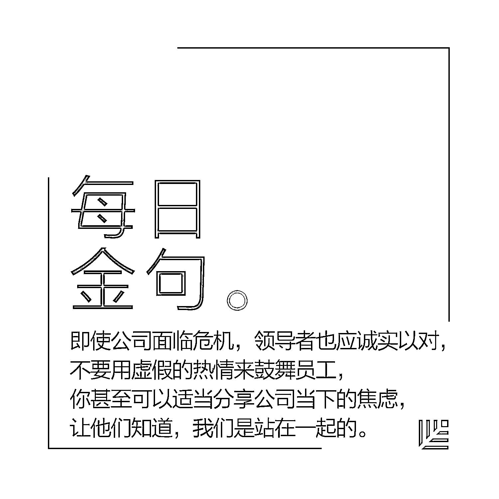

# 致领导者：切勿把员工的负面情绪当成公司禁忌 | 首席人才官·留

> 原文：[`mp.weixin.qq.com/s?__biz=MzAwODE5NDg3NQ==&mid=2651222916&idx=1&sn=92cd84987effa2d12339420706898d51&chksm=80804dd0b7f7c4c6e0d0cebdfef86c403f58868c1d7f96c5d23990fbfa7b5608a5cbc1b45af4&scene=21#wechat_redirect`](http://mp.weixin.qq.com/s?__biz=MzAwODE5NDg3NQ==&mid=2651222916&idx=1&sn=92cd84987effa2d12339420706898d51&chksm=80804dd0b7f7c4c6e0d0cebdfef86c403f58868c1d7f96c5d23990fbfa7b5608a5cbc1b45af4&scene=21#wechat_redirect)

绝大多数人都经历过工作中的负面情绪，但绝大多数人——尤其是领导者——从未学习过如何应对它们。

本文作者 Christine M. Pearson 是被誉为“国际管理教育第一校”的雷鸟全球管理学院的教授，她针对“负面情绪如何影响公司运营”这一话题进行了长达二十年的调查，她的研究显示，负面情绪会极大影响组织运作，大大减少员工投入工作中的精力和时间，降低绩效标准，削弱忠诚度。而当公司出现危机时，负面情绪甚至可能成为“致命一击”，直接威胁公司生存。

为此，她在本文中分享了认识和应对职场中负面情绪的一些方法，至少包含以下这些要点：

*   约 20%的受访者表示，在他们的职业生涯中，从未出现过能有效管理负面情绪的上司。大多数管理者都承认自己根本不知道该如何处理负面情绪。

*   领导者应该明白：千万不要将员工的负面情绪作为公司的禁忌。

*   消极情绪是会传染的。如果消极情绪持续酝酿，人类的生理本能会倾向于模仿那些情绪低落的同事，使他们的动作、姿势和面部表情趋向一致。

*   愤怒、恐惧、悲伤是职场中最危险的三种负面情绪。

> “我们被收购了，裁员 70%，每个人现在的工作量都是过去的两倍，但获得的资源却大大缩水。各个级别的员工都对他们的未来感到沮丧、愤怒和焦虑，而我们所有的新高管似乎都对这种情况毫不在意。
> 
> 组织的自豪感已枯竭，人们肩上的压力太大，士气空前低落，一走进办公室就能感觉到这种压抑感。然而，我们的新领导得知有人想辞职时，竟然大吃一惊。为什么会这样？”

**许**多高管都试图无视员工的负面情绪，结果适得其反。

请明确一点，杜绝职场的消极情绪是不可能的。无论引起消极情绪的是糟糕的决策、不幸的遭遇还是雇员个人的问题，任何组织都不能完全免受其困扰。而这种困扰会煽动更大规模的负面情绪。对于一切皆处于不稳定状态的创业公司，这样的情况尤其危险。

首先，领导者应该明白：**千万不要将员工的负面情绪作为公司的禁忌**。

在职场中，消极情绪有多种成因：

*   上级和员工之间的默契缺失；

*   工作的要求越来越高而收获却越来越少；

*   令人措手不及的变化。

二十多年来，我一直在研究引起消极情绪的职场环境——从那些极端的个案：如职场凶杀案或商业犯罪，到同事之间的日常问题，我们把这一现象定义为“职场不文明行为”。通过调查和访谈，数以千计的受访者向我们描述了他们曾经历过的职场消极情绪及相关原因。

在我们的研究中，有两个关键的发现：**首先，很少有领导可以妥善应对负面情绪；其次，负面情绪不仅不会成为阻碍，甚至还能带来机会**。当高管们加快步伐，试图解决员工日益高涨的不满情绪时，也正是他们建立彼此信任的好时机。

**束手无策的高管**

多数高管通过向员工施压来压制这些情绪。更有甚者，把正在苦恼的员工推给人力资源部处理。有一小部分领导者认为情绪对公司运营有害，坚定地认为职场中应该避免情绪的产生。对此，我的一名受访者道出了一个具有代表性的理由：“我们的 CEO 不想听到任何负面消息。”

另外一些高管抱怨，应对员工消极情绪会耗费大量的时间和精力。有些人担心，他们的干预可能会加剧而非改善这种情况，尝试解决情绪问题可能会引起更强烈的反应，使情况超出掌控。此外，高管们担心，让员工释放消极情绪是极度危险的。

还有许多高管报告说，他们没有接受过有效管理负面情绪的训练，而且没有可以效仿的榜样。我最近的一项研究证实了这种说法。

我曾向 124 位经理和高管提问，让他们说出和职场负面情绪有关的个人经历。**约 20%的受访者表示，在他们的职业生涯中，从未出现过能有效管理负面情绪的上司，大多数管理者都承认自己根本不知道该如何处理负面情绪**。

我想改变这种情况。我们对职场危机和不文明行为进行了研究，观察到两者所产生的影响和人们的反应。基于获得的结论，我们提出了一些建议。此外，考虑到消极情绪的敏感性，我咨询了服务于经理人和高管的临床心理学家，对以下建议进行了验证。

**会传染的负面情绪 **

我们的研究表明，忽视或抑制负面情绪可能会使组织生产力下降，人心涣散，效率变差，造成上百万的经济损失。

在一项以 137 名高阶主管企管硕士班的管理者学员为对象的研究中，乔治城大学的克莉丝汀·波拉思（Christine Porath）和我有一个共同的发现：消极情绪会极大影响组织运作，大大减少员工投入到工作中的精力和时间，降低绩效或质量标准，削弱对组织的忠诚度。那些试图掩盖负面情绪的员工会失去热情，甚至把自己的负面情绪转嫁给下属、同事、上级或无关人员。

我们在不文明行为的早期研究中发现，消极情绪不但容易产生，而且极易“传染”：当情绪高涨时，上下级间的针锋相对通常会导致事态升级，造成恶性循环。**如果消极情绪持续酝酿，人类的生理本能会倾向于模仿那些情绪低落的同事，使他们的动作、姿势和面部表情趋向一致**。

**情绪预警机制**

是否有个别员工投入到工作中的时间和精力变少了？参与度是否下降了？那些可自行决定是否参加的活动——例如非强制性的会议或学习——报名的员工是不是变少了？这些行为都预示了潜在的负面情绪，还有一些硬数据和趋势指标：比如迟到、旷工和离职率。

这时候，你需要找出陷入困境的员工，提出简单的问题，比如“你今天觉得怎么样？”或“一切都好吧？“员工可能不乐意对你诉说自己的悲伤，但他们可能会告诉你，他们正感到沮丧或失望。

一家制造企业的高级经理解释说：“用轻松的态度来表达我的担忧，然后等待回应。我还会小心行事，避免扮演父母的角色。”同时，帮员工找出他们人际关系网中的核心人物，让他们来帮助提供支持。

当消极情绪源于员工之间的冲突时，切记不要转移话题，而应该促成讨论，让他们认识到，如果不能解决分歧，会耗费许多个人和集体的成本。

千万不要以为这些情况只在极少数的公司里出现，不信的话，你现在放眼办公室，也许就能发现一些“预警信号”。

**应对愤怒、恐惧和悲伤**

愤怒、恐惧和悲伤是职场中常见的三种主要消极情绪。

****▍**愤怒**

这是工作中最普遍的负面情绪，也是最容易接受的。

与愤怒的人一起工作是很累人的：它使他人筋疲力竭，破坏人们的积极性，抑制他们的认知能力。即使人们敢于对愤怒做出回应，大脑的化学反应也会让他们难以顺畅地沟通或清晰地思考。遗憾的是，低下的回应会使得愤怒者信心更加膨胀，强化愤怒情绪。

作为领导者，你应当对团队里的那些“危险分子”有所防备。

一个公共服务机构的高管建议，“**要让员工意识到，愤怒不能解决任何问题，如果他们不支持团队，他们就要付出更高的个人成本，于人于己均无益处**。”

****▍**恐惧**

全面的组织性危机，令人沮丧的季度业绩，甚至是那些随意说出口的消极评论都会引发职场的恐惧情绪。这常常发生在创业公司中。

当恐惧袭来，生存的本能会让人们做好战斗，逃跑，或者僵持的准备，而组织仍会期望员工坚持工作。即使面对不堪设想的危机，雇主依然期待员工们继续努力实现一贯的绩效目标。

事实上，我们研究了二十多年的负面情绪后发现，恐惧最容易引起员工辞职的念头。

职场焦虑的一个常见来源就是流言散布。我和同事们观察到，经理和高管会试图隐瞒当前公司变化的细节，导致信息不透明。然而，这会引起员工的猜测，而猜测出来的结果往往比实际更糟糕。为了驱除恐惧并避免这一问题，管理者应该充分沟通。

一位高管描述了他是如何成功应对职场恐惧的：“我允许觉得害怕的员工发泄情绪，我仔细倾听他们的担忧，坦率地告诉他们我能说的所有实际情况。”

**即使公司面临危机，领导者也应当诚实以对，不要用虚假和不切实际的热情来鼓舞员工，你甚至可以适当分享公司当下的焦虑，让他们知道，我们是站在一起的**。

****▍**悲伤**

悲伤可能是职场中最不受欢迎的情绪了。

我们的调查和访谈数据显示，处于悲伤情绪中的员工上经常到得晚但走得早，爱逃避那些可能会引起不快的会议，主动要求完成外出任务，并紧紧抓住那些远程办公的机会。有 17 名曾深陷悲伤的员工最后都变得十分冷漠。

但正如我在组织危机中观察到的结果，陪伴是最好的解药。

如果员工遭受了严重的个人损失，那就给他们提供帮助，让他们暂时把工作放在较低的优先位置，这样员工就可以专注于处理自己的悲伤问题。让员工按照自己的节奏来克服悲伤，包括提供数天休假或者缩短工作时间，允许员工远程办公，找一些合理的途径来把他们的部分职责转移给其他同事，并允许他们推迟或取消工作安排。

在艰难时期，公司领导者的支持会对员工的士气产生巨大的影响。一家互联网公司的创始人兼前总裁把同理心视为他企业在困难时期取得巨大成功的关键因素。他说，“我特别希望用自己艰难经历来帮助我的团队成员走出困境，毕竟我们都经历过困难。”

**点击文末“阅读原文”查看最新招聘信息**

**加入红杉中国大家庭**

