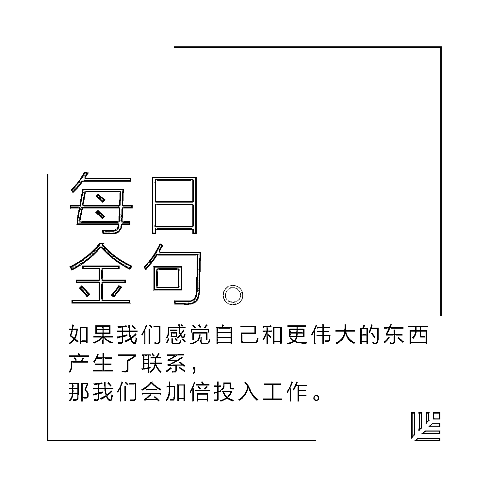
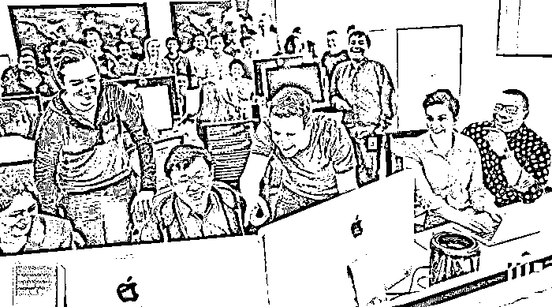

# Facebook:员工高敬业度的唯一驱动力 | 首席人才官·用

> 原文：[`mp.weixin.qq.com/s?__biz=MzAwODE5NDg3NQ==&mid=2651222941&idx=1&sn=70439b77ad99c1a38b0bd11cdb159879&chksm=80804dc9b7f7c4df3ff0b6f32e69169c84a3f3310e273ef409e3a90d92e4d8f0cffa76973040&scene=21#wechat_redirect`](http://mp.weixin.qq.com/s?__biz=MzAwODE5NDg3NQ==&mid=2651222941&idx=1&sn=70439b77ad99c1a38b0bd11cdb159879&chksm=80804dc9b7f7c4df3ff0b6f32e69169c84a3f3310e273ef409e3a90d92e4d8f0cffa76973040&scene=21#wechat_redirect)

研究表明，敬业的员工在工作时会有更好的表现，而他们所在团队的效率会因此提高，获得更多盈利，降低失误率。如今，“员工满意度”已经不够用了，“员工敬业度”已然成为管理层及 HR 部门关心的问题。Facebook 人力资源部与沃顿商学院亚当·格兰特（Adam Grant）教授合作进行了一项调查，研究 Facebook 公司员工高敬业度和高积极性工作的原因。本文论述了这项内部研究成果，部分要点摘录如下：

*   在 Facebook，敬业度背后最重要的驱动因素就是对公司的自豪感；

*   当员工以公司为荣时，他们就会把组织目标内化为自己的目标。例如，在 Facebook，员工把招聘看成每个人的职责，而不只是招聘团队的工作。

*   公司各职能部门的自豪感源于：乐观、使命感和社会公益。即：员工对公司的未来有多大信心？员工有多关心公司的愿景和目标？员工是否相信公司可以让世界更美好，他们对此有多大的信心？

**为**了解 Facebook 员工高敬业度的内在驱动因素，在过去的几年里，我们曾提出上百个问题，并把它们编成了问卷，进行了全公司范围的倾向调查。

反复调查的结果推翻了我们对其中最重要因素的猜测。排在第一的因素并不是我们曾设想的那样，如职场里是否有好友，是否受到尊重，或是否有一名体贴的上司，甚至不是自主权、工作和生活平衡等内容。

**在 Facebook，员工高敬业度背后最重要的驱动因素只有一个：对公司的自豪感**。

当它们因为在 Facebook 工作而感到自豪时，他们会更满足，对公司更忠诚，工作更成功，更有可能把 Facebook 视为好雇主，从而乐意向别人推荐这家公司。

不只是 Facebook，其他企业也不例外。管理研究人员发现，**当员工以自己的公司为荣时，他们会将组织目标内化为自己的目标，他们不会只专注于个人目标，而是把精力转向对组织最有利的方向**。

在职场中处处都可以看到这样的现象。

例如，在 Facebook，员工把招聘看成每个人的职责，而不只是招聘团队的工作。他们经常通过自己的人脉搜寻合适的招聘人选，试图找到可以让 Facebook 变得更好的人才。

那么，自豪感源自哪里呢？在仔细分析调查结果后，我们将其归结于三点：

*   乐观：员工对公司的未来有多大信心？

*   使命感：员工有多关心公司的愿景和目标？

*   社会公益：员工是否相信公司可以让世界更美好？对此有多大的信心？‍

**乐观**

世界各地的员工都会因为对公司有强大的认同感而感到自豪。**人们评价自己的公司时，不仅要看公司的过去，还要看公司的未来**。

无论是在 Facebook 的哪一个部门，乐观态度对自豪感的影响都是最大的。

如果员工可以感受到公司的未来是振奋人心的，那么乐观情绪就会油然而生。而**比起面向未来生活的产品，人们更容易对那些能够塑造未来的理念、特质或目标感到乐观**。领导者往往会用抽象的方式进行表达，但若能用具像化、生动化的语言进行描述，员工会更容易理解其中的含义。

例如，过去非技术相关部门的许多员工都不清楚为什么 Facebook 在虚拟现实领域投入巨大。这一情况自 2016 年 4 月产生了变化。当时首席执行官马克·扎克伯格发表了讲话，对虚拟现实的未来进行了生动的描述：“我还是个婴儿的时候，我的父母在一本育婴指南上记下了我迈出第一步的日期，我的侄子们迈出第一步的时候，我姐姐拍下了照片和视频发送给我们。”他继而说到，当他的女儿马克斯（Max）迈出第一步时，他想用 360 度全景摄像机捕捉整个画面，让观看视频的大众“感觉自己仿佛就在客厅里，和我们在一起”。

现在人们可以看到，Facebook 平台是如何通过虚拟现实技术把人们和有纪念意义的时刻联系到一起的，是如何让我们身临其境并乐在其中的。

**使命感**

Facebook 的使命是让世界变得更开放，同时加强人与人之间的联系。在 Facebook 公司，人们感受到的所有自豪感中，有 16%来源于他们对公司使命的认同感。当人们为达成使命而全心付出时，他们与公司之间的关系就发生了变化。

**工作不仅仅代表一个职位或是一项事业——它还会成就一种使命感。有了使命感，员工会在做好本职工作和帮助同事之余，开始关注如何为公司的利益服务**。

例如，Facebook 的一位软件工程师在参加训练营的时候曾被叫去解决一些漏洞，这些漏洞和帮助视障人士“阅读”的程序有关。她很快就利用业余时间修复了许多漏洞，数量甚至比她被要求完成的还要多。她还研究了如何让视障用户更便捷地使用 Facebook。

“这是我第一次看见盲人像大家一样使用技术与世界互动，”她说到，“我决定了，我们要做点事来帮助他们。”

这种类型的贡献并不只是领导者的举措，还是达成公司使命的重要承诺。当看到同事们努力达成使命时，公司带给员工的自豪感会更加强烈。

**社会公益**

社会公益并不等同于企业社会责任，企业社会责任只是从核心产品和服务衍生出的副项目，**社会公益本身就是产品和服务**。改造空间技术，节约能源，连接世界，引领数字化革命，普及信息并让信息产生利用价值，这些都是社会公益。

每个星期五，Facebook 都会举行一场公司范围的问答会，其中有个环节就是分享那些生活因 Facebook 而受到积极影响的用户故事。

最近，有个住在奥克兰的叙利亚难民家庭在视频中提到了 Facebook 和 WhatsApp 的价值，称这两个应用能让他们与家乡的亲人保持联系。还有一家专门销售阁楼床的德国家族企业 Holzconnection，曾濒临破产。后来企业所有者被他“笨手笨脚”的儿子说服，在 Facebook 平台上尝试了数字营销，经营状况得以改善。

社会公益向人们证明了一点：**公司的工作成果改善了人们的生活**。即使是和终端用户间的细微联系也可能会产生巨大影响。

公司的自豪感是驱动敬业度的引擎。正如伏尔泰所说，“当我们独处时，我们很少感到自豪。”**如果我们感觉自己和更伟大的东西产生了联系，那我们会加倍投入工作**。公司不只是我们工作的地方——它还是我们的一部分。

**点击文末“阅读原文”查看最新招聘信息**

**加入红杉中国大家庭**

