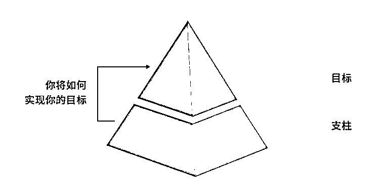
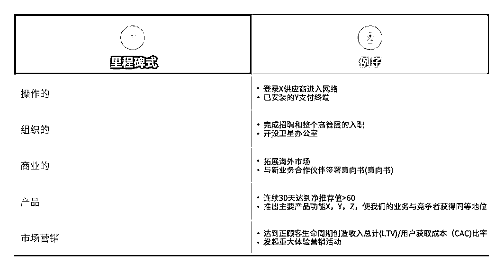
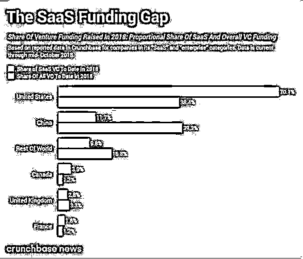

# 新手创业“套路”深：钢铁执行力是如何炼成的｜红杉汇内参

> 原文：[`mp.weixin.qq.com/s?__biz=MzAwODE5NDg3NQ==&mid=2651226066&idx=1&sn=1578613f2a3cd0a0f1f7b98fe2ec5b59&chksm=80804186b7f7c890f077f614176c64b5f99eba24207dde89a98603cf33d922a870d57dae1108&scene=21#wechat_redirect`](http://mp.weixin.qq.com/s?__biz=MzAwODE5NDg3NQ==&mid=2651226066&idx=1&sn=1578613f2a3cd0a0f1f7b98fe2ec5b59&chksm=80804186b7f7c890f077f614176c64b5f99eba24207dde89a98603cf33d922a870d57dae1108&scene=21#wechat_redirect)

[ 编者按 ] 如果说一个机构是一个人能力的延伸，那么，如何在创业初期，让整个团队像“一个人”一样去思考、去行动、去战斗，则肯定是许多创始人梦寐以求的事了。 

Josh Schachter 是波士顿咨询数字投资公司的一名咨询顾问，在其职业生涯中，帮助数个初创企业建立并打磨团队。他发现，最大的挑战就是，在一个既定的目标下，如何统一来自不同领域的人才团队。要像活塞发动机一样，团队的行动、节奏和路线对新公司的成长和繁荣至关重要。

基于经验，他总结了这套创业行动金字塔模型（Startup Ops Pyramid）——从目标开始、建立目标支杆、明确指标标准、使用阶段关卡、制定推进计划、营造文化环境。知易行难，善用兵者强，希望这一方法论对创业者有所禆益。

每期监测和精编中文视野之外的全球高价值情报，为你提供先人一步洞察机会的新鲜资讯和升级思维方式的深度内容，是为** [ 红杉汇内参 ]**。

** 内参**

**详解创业行动金字塔**

**作者 / Josh Schachter**

**编译 / 洪杉**

**创业不易。Ideas are cheap，而创业成功的核心主要在于执行。**

**最大的挑战是，在一个既定的目标下，如何统一来自不同领域的人才团队。这就要像活塞发动机一样，团队的行动时机和路线对新公司的成长和繁荣至关重要。**

**在思考创业成功原因的过程中，我有机会记录下让我们成功的工作方式。事后看来，它的效果是相当直接和明显的，是现有方法和常见原则的混合体，这个工作方式成了团队工作的强大助手。我把它叫做创业行动金字塔——一个实用模型的实用名称。**

****从目标开始****

**在这个金字塔的顶端是团队目标。这是第一步。**

**给你的团队建立一个真正的指南针，为了前进，你必须知道你想去哪里。创建和传递目标是领导任何团队的基本组成部分，这一目标得是激励人心的，而且与当前状况息息相关。**

**目标应该要能使得团队走出舒适区，但也必须基于市场的现实——竞争者的存在、技术的可用性，最重要的是——客户的声音。最好的目标设置是通过对当前客户、市场竞争和机遇进行详尽而深入的调查和洞察所形成的。这将使你的团队与众不同。**

****目标的支柱是帐篷中的长杆****

**你需要支柱来支持你的目标。可以有任意数量的支柱，但我总是发现 3 是神奇的数字，因为它是稳定的三角结构，容易被人接受和记住：**

**▨ 建立基础（即获得与竞争对手平等的地位，建立可靠的、性能优秀的解决方案）**

**▨ 用独特的方式满足客户（即为他们提供令人惊奇、影响深刻的用户体验）**

**▨ 为供应商提供价值（即为我们的双向网络供应商带来经济效益）**

****

**▲支柱代表你将如何建立你的目标**

**在支柱建立后，团队所做的一切都与这些基础捆绑在一起：已经创建了一个机制，且团队可以围绕这个机制联合起来。**

**头脑风暴会议可以沿着这些路径展开——提出与每个支柱相一致的想法。这种结构还可以帮助你在讨论时把可能偏离轨道的想法推回原处。比如把产品路线图用颜色标注，因此显得分类明确，以便每一个开发项目都有助于建立一个或多个支柱。在一天结束的时候，可以追踪产品路线图上代表每个支柱的分配比例，以便更好地理解实现目标的方式。这里有一个我在这个框架下使用过的产品路线图的例子。**

****

**▲年度产品路线图与总体目标的每个支柱之间的映射图示例**

****指标标准是最重要的****

**接下来，我们来定义关键业绩指标（KPI）和成功的标准。这是在建立了支柱之后，而不是在建立团队目标之后。有了支柱，更易于日常操作，因此更容易衡量。**

**KPI 和成功指标会投映到每个支柱上。这将极大地帮助团队，让每个人都能够理解和意识到我们的度量标准的关键以及它们为什么重要。我坚信，拥有数据驱动的心态是任何初创公司成功的首要因素。  **

****

**▲KPI 指示板指标映射关系示例**

****使用阶段关卡，以免贪多嚼不烂****

**既然已经确定了前进的方向、实现目标的方式以及衡量成功的方法，那么接下来要做的工作就是将长期目标分解成分散的、可实现的部分。可以把这些阶段叫做关卡。**

**阶段关卡代表了业务中想寻求实现的里程碑。里程碑可以分为不同的类别，是执行层面的、组织的、商业的、产品的或市场营销驱动的。包括了实现目标的 KPI。**

****

**▲业务功能领域的阶段关卡里程碑示例**

**阶段关卡为企业运营提供多种功能。有利于团队以此制定一个短期的工作计划。此外，完成阶段关卡可能会引发团队和/或领导做出关键的决定。建议是，阶段关卡的完成时间段至少以季度为单位。这样团队就能够设定可行的目标和可交付的成果，然后为此制定清晰的工作计划。**

**阶段关卡也可能在完成中途改变。这种灵活性有利于初创公司在面对市场需求和客户反馈时能够随机应变。但是你应该尽量减少这些波动，以免让团队因为不断变化而陷入不安。**

****制定工作计划****

**愿景、支柱、KPI 和阶段性里程碑已经生效。万事俱备，就差执行了。执行力决定谁是创业界的赢家，这正是团队工作计划中最有价值的地方，让我们从创业行动金字塔的尖端向下延伸。**

**要求每位团队成员每周观察业务实时进展，并据此更新工作计划。每完成一项活动，就从表格中相应删除。他们还可以添加或修改任务，突出显示关键事项。**

****营造合适的环境****

**创业行动金字塔在方法上是公式化的，且足够简单。我们还需要的是一个能让团队运作蓬勃发展的工作环境——归根结底是要有团队文化的支持。成功的创业行动金字塔需要具备两个关键的文化元素：透明的交流和团队价值观体系。**

**▨ **工作计划透明化****

**团队必需以非常坦率的态度工作。这种坦率是谷歌前高管艾米·斯科特（Amy Scott）在其 2017 年出版的《坦诚相对》(Radical Candor)一书中所描述的一种透明的沟通方式，这意味着直接挑战他人，同时对他人的兴趣和观点保持关心和理解。这需要团队领导以身作则，为其他人树立榜样。没有这种工作环境，团队成员可能会退回到各自为战的状态，而避免这种工作模式正是金字塔模型要达到的目标。**

**▨ **灌输文化价值****

**作为一个团队，初创公司需要有一个值得推广和传播的单一价值体系。我强烈推荐这些价值观——**

** - 用事实说话**

** - 未说出的想法才是坏想法**

** - 顾客满意是我们奋斗的宗旨**

** - 超越舒适区**

** - 我们是一家人**

****结语****

****

**▲完整的创业行动金字塔**

**创业成功没有一种万能的方法。创业行动金字塔模型像是一个脚本，希望它也能帮助到你的团队。不管你选择什么样的管理方式，关键是贯彻到底、纪律鲜明。并不是每个团队成员都会立即接受你的管理方式，所以要有耐心。把你对改变世界的热情投入到运营公司的过程中，其他人也会被你带动。**

**** 读数****

****70.1**% VS  **11.7**%**

****

**中国企业级服务市场的爆发还在酝酿中，远见者必将提前布局。**

**根据 TechCrunch 最近公布的数据，中国初创企业的融资额在今年以来的全球风险投资总额中独占鳌头，获得 39.3%，而美国是 38.4%。但具体到 SaaS（软件即服务）领域，70.1%的美国风投基金投向了 SaaS 初创企业，相比之下，中国这类企业只拿到本国风投的 11.7%。**

**从规模为 1 亿美金以上的融资交易数量来看，今年初至 10 月中，美国至少有 15 笔；中国只有三家 SaaS 公司的四轮融资规模超过 1 亿。**

**** 情报****

**#就业、教育和未来的财富分配#**

****吴恩达：AI 热潮不会退却****

****

**这位著名 AI 大神最近接受某杂志采访，谈到了 AI 如何改变商业、教育等话题。** 

**▨ 必须确保我们通过 AI 创造的财富是以公平公正的方式分配的。道德观的建立不在于保证机器人不会作恶，而是真正想明白我们正在建设一个什么样的社会？并且确保这个社会是公平、公正和透明的。**

**▨ 我们需要在雇主的帮助下改变教育。四年的大学生涯不再决定一个人的余生，你会成为终身学习者。**

**▨ 自动化造福的不仅是医疗业。比如农业，我们正努力收集农场数据，帮助农民更好地决定何时种植作物。**

**▨ AI 热潮不会退却。AI 已经有了明晰的发展路线图，可以创造巨大的价值。**

**▨ 但我们对于时间表太过乐观。支持对公众观点进行纠正，人们仍然需要明辨 AI 的可能性和局限性。**

**#牢记：保护自己、保护企业才能保护未来#**

****初创企业避免法律风险的六种方法****

****

**律师们认为，企业家应该提前花时间设想公司出事时的应对方案：** 

**▨ 好朋友并非好的商业伙伴。**

**▨ 永远做好准备，因为合作关系有一天会终结。“考虑何时退出将有助于企业的初期发展——设立适当的条例规定。”一位律师建议，“定好终点，然后设计如何到达目的地。”**

**▨ 保护好知识产权。一个与外包有关的常见陷阱：如果一个私人顾问在没有书面协议的情况下被聘用，他们将拥有自己在企业里创建的任何知识产权。**

**▨ 对投资者做背景调查。**

**▨ 一定要尽力地争取和保护股权，因为你可能会有一个无法摆脱的股东。**

**▨ 网上的信息并非可靠，比如使用从网上下载的投资协议文件等。** ****

**** 推荐阅读****

**壹**

**[欢迎进入“仿生企业时代”，用三种新资本重塑超能力 | 红杉汇内参](http://mp.weixin.qq.com/s?__biz=MzAwODE5NDg3NQ==&mid=2651226007&idx=1&sn=660c0d43d33a45aff1cdeb5b4d39844b&chksm=808041c3b7f7c8d5e61e8486b904506acc272c72553c403d2dc282c576c0ed8bf959d4858fd8&scene=21#wechat_redirect)**

**贰**

**[贝佐斯说，创业公司永远都要活在“Day 1” | 红杉汇内参](http://mp.weixin.qq.com/s?__biz=MzAwODE5NDg3NQ==&mid=2651225909&idx=1&sn=3faca0e7f8cb2aaf8632643cd6213756&chksm=80804161b7f7c8777652f365171e8272054f636b9982d2ff2d0ee341e5bc1f98244756578f0e&scene=21#wechat_redirect)**

**叁**

**[进击的平台：为什么传统大企业会被颠覆？ | 红杉汇内参](http://mp.weixin.qq.com/s?__biz=MzAwODE5NDg3NQ==&mid=2651225805&idx=1&sn=45d33ea6f3a5aae2a423171e8d5b4357&chksm=80804099b7f7c98fac7d5a6f35420c1a227df53efa505c1c937507868133a3cd4326a4358aa2&scene=21#wechat_redirect)**

**肆**

**[当创业快车驶向失败边缘，如何及时且正确地刹车？ | 红杉汇内参](http://mp.weixin.qq.com/s?__biz=MzAwODE5NDg3NQ==&mid=2651225762&idx=1&sn=33a82575a5cdf91639dd8b54bce97894&chksm=808040f6b7f7c9e0971b9b990607fee52fe65073b39c963fb117e213750eaed6b450d03066fd&scene=21#wechat_redirect)**

**伍**

**[世界经济论坛报告：关于未来工作的 12 个趋势判断｜红杉汇内参](http://mp.weixin.qq.com/s?__biz=MzAwODE5NDg3NQ==&mid=2651225721&idx=1&sn=1b7f0ad694fa1d6263860eb6df3cffad&chksm=8080402db7f7c93b0e79fe1cf2599500942dc9646e2b5d1fde4472546a905b686c4368c9bd0c&scene=21#wechat_redirect)**

****