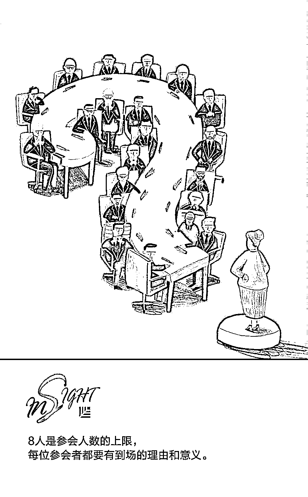
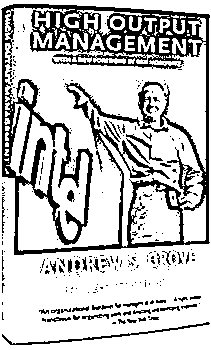

# 安迪·格鲁夫：一份 35 年长盛不衰的高效会议秘诀 | 经典重读

> 原文：[`mp.weixin.qq.com/s?__biz=MzAwODE5NDg3NQ==&mid=2651225340&idx=1&sn=a45b35cc6623a85d81142b010223e9bb&chksm=808042a8b7f7cbbe7e8d9783db15eb6b4429e1cc21f947ff91a6c9ed92bd114c7120df9d7423&scene=21#wechat_redirect`](http://mp.weixin.qq.com/s?__biz=MzAwODE5NDg3NQ==&mid=2651225340&idx=1&sn=a45b35cc6623a85d81142b010223e9bb&chksm=808042a8b7f7cbbe7e8d9783db15eb6b4429e1cc21f947ff91a6c9ed92bd114c7120df9d7423&scene=21#wechat_redirect)

会议常常让人头痛，尤其是那些参会者众多、冗长、低效、不能解决问题的会议。在完成正常工作之余，还要忙碌于参加、协调、组织各种会议，让许多管理者苦不堪言。那么，究竟该如何高效地利用会议解决问题，而不是浪费时间呢？

英特尔前董事长兼首席执行官安迪·格鲁夫就在《高产出管理》（High Output Management）一书中，介绍过如何避免会议浪费时间。虽然从此书第一次出版至今已经 35 年过去了，但他关于如何提高会议效率的宝贵经验依然值得我们思考和学习。本文是对安迪·格鲁夫的高效会议秘诀的总结和分享。以下是重点内容摘要：

▨ 会议基本分为两大类：过程导向型会议和任务导向型会议。

▨ 在员工会议上，上级的角色为领导者、观察者、推动者、发问者和决策者，并非演讲者。

▨ 对公司而言，尤其是初创公司，开会成本很高。

▨ 8 人是参会人数的上限，每位参会者都要有到场的理由和意义。

** **

**高产出管理**

High Output Management

Andrew S. Grove **/ 著**

Vintage 1995 年 7 月

很多文章介绍过亚马逊创始人杰夫·贝索斯著名的高效会议秘诀——“两个披萨原则”。会议人数过多，效率就会降低。对此，杰夫提出的解决方法是，两份披萨不够吃，说明参会人数太多了。这个说法言之有理，但究竟多少人才算太多呢？

英特尔前董事长兼首席执行官安迪·格鲁夫的原则是会议的参与者不能多于 8 人。在《高产出管理》（High Output Management）一书中，他用了整整一个章节来介绍如何让会议高效。他建议我们不要把会议的时间浪费，要尽可能高效地利用会议时间解决问题。尽管该书写于 1983 年，但很多内容至今仍适用。

在安迪看来，会议基本分为两大类：过程导向型会议和任务导向型会议。

过程导向型会议是为了分享知识、交换信息。本质上，这种会议为例行讨论会议，可细分为三种：一对一会议、员工会议和工作回顾会议。任务导向型会议是为了解决具体问题，通常会上要做出决策。

**过程导向型会议**

为了发挥过程导向型会议的最大作用，安迪建议将其定为例行会议。换言之，参会人应知悉会议流程、会议讨论的重要事项以及会议目的。以下是安迪提出的几点具体建议：

▨ 在一对一会议上，上级应聆听下属的意见，鼓励下属提问，一起找到问题的根源，达到双方满意的结果。为了让会议更高效，上下级均应做好会议记录。另外，一对一会议应定期召开。

▨ 通过员工会议，上级也有机会从意见交流和冲突中学到东西，意见冲突其实很常见。在此类会议上，上级的角色为领导者、观察者、推动者、发问者和决策者，并非演讲者。

▨ 如果员工会议变成了两个人的对话，讨论的问题只与这两个人有关，那么上级应打断他们的对话，建议他们稍后再继续交流，并重新开启其他话题，让更多员工参与其中。

▨ 如果您参加了工作回顾会议，要记得自己是带薪开会的，这并不是忙碌一天的午休。要正视开会的本质：工作。为了让参会者专心开会，或许得要求他们合上电脑，并把手机收起来。

▨ 然而，实际上，如果一切进展顺利，例行会议可解决 80%的问题，剩下 20%的问题仍需通过任务导向型会议解决。

**任务导向型会议**

任务导向型会议通常是临时召开的，目的是得出某个特定结果，一般是决策。对于此类会议，成功的关键在于会议主持人做了些什么。以下是安迪提出的几点具体建议：

▨ 对公司而言，尤其是初创公司，开会成本很高。因此，在花费时间和资源召开会议前，要先确定好会议的目的。要有清晰明了的会议目的——要采取什么行动？要做什么决策？毫无疑问，如果不知道自己想要什么，又怎么能得到呢？

▨ 为了实现价值最大化，尽量不浪费时间，需要为此类会议制定清晰的框架。一份高效的议程表会列出会前和会中要达到的明确目标。

▨ 会议主持人也要负责统筹安排的工作。要确定哪些人需要出席，并尽量让这些人都到场。仅仅提出会议邀请，然后保持乐观态度等待这些人出席是不够的，还要展开后续追踪工作，让相关人员给出明确答复和承诺。如果有人不能亲自参加会议，请他务必派能代表他发言或表态的人来参加。

▨ 必须要牢记的是，如果召开会议是为了做出具体决策，那参会人数超过 6 或 7 人时，可能会议就很难有效推进了。8 人是参会人数的上限，每位参会者都要有到场的理由和意义。

▨ 另外，一些会议只召开一次，用来做一项特殊决策。这种会议需要精心策划和落实，因为经常是临时召开的，没有明确目标，参会人数通常又过多。

▨ 会后，主持人必须整理好会上讨论的问题、所做的决策以及尤为重要的后续必要行动，并及时分发会议记录。参会人需要尽快拿到会议记录这点也很重要，尽量控制在 24 小时内，因为这样能有效防止他们忘记或忽略会议内容。

▨ 主持人也要负责维持会议纪律。因为如果允许他人迟到，或以其他方式浪费大家的时间，那这无异于犯罪。

▨ 如果临时为特定事项召集的任务导向型会议占据的时间超过了 1/4，那这就意味着会议组织不当。** **

** 推荐阅读**

壹

[为什么伟大艺术的真谛在于 Do Nothing｜欧美新书推荐](http://mp.weixin.qq.com/s?__biz=MzAwODE5NDg3NQ==&mid=2651225296&idx=1&sn=5a354e7ac10e043ff0231b92b50b8bee&chksm=80804284b7f7cb9229c4252587cf42723f0a70d6c5e758aa90fb546bf38a22f2caa6ed486403&scene=21#wechat_redirect)

贰

[什么时候该把选择权交给命运？问问算法吧｜新书推荐](http://mp.weixin.qq.com/s?__biz=MzAwODE5NDg3NQ==&mid=2651225255&idx=1&sn=fc42cfb83b0b00c7d41b1a32ecddf70a&chksm=808042f3b7f7cbe577c982149a529fce5e517d7bffc0a841df66c3f19b7907fe3a2f2dbf19bc&scene=21#wechat_redirect)

叁

[把一本书读好，比读一本好书更重要](http://mp.weixin.qq.com/s?__biz=MzAwODE5NDg3NQ==&mid=2651225093&idx=1&sn=4e426598f89c0280c3f63a0cfb79b1fc&chksm=80804251b7f7cb47e928a7130c69017dac331ba1ac219cce2337eb8b1076e56232bf5e9e6c0c&scene=21#wechat_redirect)

肆

很[忌讳决策失误？一时冲动？错失良机？诺贝尔经济学奖得主给你解决方案｜](http://mp.weixin.qq.com/s?__biz=MzAwODE5NDg3NQ==&mid=2651225048&idx=1&sn=943ee74ac8ac605549e8287653e88995&chksm=8080458cb7f7cc9a21d74d44912b464934a038295f03c5fb9e25fd40c1371aa7f1a551cb87ab&scene=21#wechat_redirect)新书推荐

伍

[“硬撑”不是唯一的路，你明明知道自己可以活得更好｜欧美新书推荐](http://mp.weixin.qq.com/s?__biz=MzAwODE5NDg3NQ==&mid=2651225018&idx=1&sn=679e2a702b6ffce3dd1ebdaf37611b87&chksm=808045eeb7f7ccf82444fdb3b5e491e7aab36dbec5fc2662ed80e4969b728f5b43b646ee4c22&scene=21#wechat_redirect)

