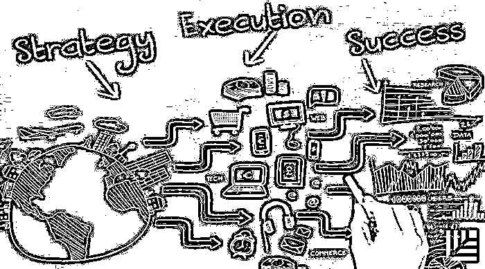
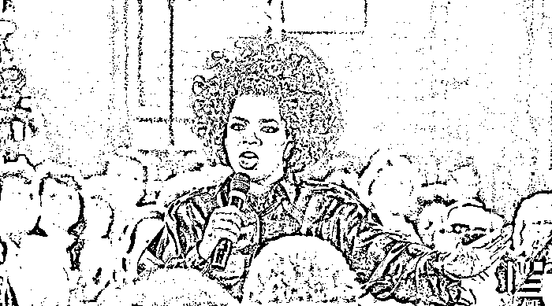

# 克服管理“巴别塔”：让战略与执行“知行合一”的 10 个法则｜红杉汇内参

> 原文：[`mp.weixin.qq.com/s?__biz=MzAwODE5NDg3NQ==&mid=2651222617&idx=1&sn=2efba23b6ccaf20c5d81821493654ca0&chksm=80804c0db7f7c51b9db057fb5057b7b3b6f08faeeeb31b5c974c95838dae7365632d20bcecd9&scene=21#wechat_redirect`](http://mp.weixin.qq.com/s?__biz=MzAwODE5NDg3NQ==&mid=2651222617&idx=1&sn=2efba23b6ccaf20c5d81821493654ca0&chksm=80804c0db7f7c51b9db057fb5057b7b3b6f08faeeeb31b5c974c95838dae7365632d20bcecd9&scene=21#wechat_redirect)

[编者按]对于企业管理者来说，将战略制定与日常执行完美结合，是一件非常困难的事。如何始终如一地向用户传递企业独一无二的价值，如何在日常运营中保证公司战略的贯彻？普华永道旗下的咨询公司 Strategy&通过对多家企业的案例研究，包括苹果、亚马逊、宜家、星巴克和中国的海尔，提出了 10 个让战略与执行“知行合一”的重要法则。

进一步理解，这实际上关于管理信息流的话题。尽管使用同一种人类语言，但沟通的“巴别塔”现象却在许多公司里发生，高层制定的战略在传达时信号损耗或失真，不同岗位的员工无法无缝协作，当然会导致具体执行产生偏差。或者是，人人勤奋努力，却和战略目标无关。

你的公司已经出现这类问题了吧？

每期监测和精编中文视野之外的全球高价值情报，为你提供先人一步洞察机会的新鲜资讯，为你提供升级思维方式的深度内容，是为** [ 红杉汇内参 ]**。

***

**【本期悬念】**

1.像苹果、亚马逊和星巴克那样，让战略与执行**知行合一**，学会这 10 个法则。

2.一位 25 岁的新手创业者，回想起从前在麦当劳做服务生经历，发现许多商业经验于创业同样适用。

3.奥普拉不仅是脱口秀女王，还是亿万富翁呢，她的商业经验是？

4.善于销售自己，才能更好地推销你的产业、服务和品牌，心理学家建议了提高**公开演讲能力**的 12 个简单方法。

***

**【每日金句】**

每位顾客都想高兴而来，满意而归。

这不仅仅是快餐店服务生

应该明白的道理，

和你的客户也应该这样相处。

***

**【内参】**

克服管理**「巴别塔」**

让战略与执行“知行合一”的 10 个法则

作者/Ivan de Souza/Richard Kauffeld/David van Oss

综合编译/洪杉

**产**品质量、创新水平、营收能力以及发展壮大，全都依靠战略和执行的无缝衔接。如果它们相互排斥，或者不能连贯而有条理地组合在一起，那你就是在冒险——这个问题太常见了。在 Strategy&最近的一份覆盖 700 名公司高管的全球调研里，要求他们对本公司最高领导人的战略制定能力和执行能力作出评级，只有 8%的领导人能在两项指标里都达到“非常有效率”的等级。

但为什么像苹果、亚马逊、宜家、星巴克以及中国的海尔这些标志性的大型企业，能够一而再、再而三地在竞争中胜出？秘诀就在于其在战略和执行上是极其连贯一致的，在它们所做的每一件事里，都可以看到对战略和执行的混合体系的应用。

如何通过每天的工作一步一步地实现战略和执行的结合？以下 10 条是 Strategy&提炼出的原则，对于那些成功企业来说，这些原则已是基因。

**志存高远**

为战略设定一个高远的目标：不仅是要获得丰厚收益，还要保证价值创造的可持续性，通过你的产品、服务以及品牌让世界变得更好。同时，在执行端也要设立同等高远的目标，即使在外人眼里，这种追求卓越的决心已近似走火入魔。

为执行这一原则，CEO 必须走在最前面。坚持，拒绝降低标准，并且向公司其他人展示出自己的勇气和决心，否则就没有人会这样做了。**想要判断自己当下是否志存高远，标准就是员工能否觉得公司正变成一个更好的、让自己更想投入的理想工作之地**。

**发展你的竞争优势**

如果忙于追求突然出现的各种新机遇，却没有仔细思考自己是否拥有相应能力来抓住这些机会，你会逐渐看不清自己最有能力的领域在哪里，或者疑惑：为什么用户会对你自以为仍很擅长的领域提出质疑？

这时，你可以在清单上列举出你最与众不同的能力，看看在哪些方面，公司已夺得业界头筹。清晰标出每一项能让这些能力发挥作用的必要元素，并厘清：如果要继续发展该项优势，还需要准备什么？如此，你将会沿着相同路径一直收获成功。

越清楚自己的能力，就越有机会去发展自己的优势。时刻分析自己最擅长的领域是什么，不断搜集相关数据，并持续进行检查和分析。每一件事情里都有值得学习的东西，你可以反观自己在这个过程里的各种举动、各项选择以及所创造的价值。

**拥有“两手俱利”的能力**

“两手俱利”的原本意思是说一个人能够灵巧、协调地使用他的左右手。而在商业世界中，它指的是一个人的战略规划和其执行能力都同样出色。

当然，我们必须得承认一个事实：不是每个人都熟悉公司的战略。员工不太需要花过多时间去讨论理论上的战略问题，但必须清楚自己扮演的角色是什么。就像假冒砌砖匠总会觉得自己能修建大教堂一样，**团队成员也必须意识到，他们要做的不只是满足规格，更重要的是具有别具一格的“修建”能力，还知道需要做些什么**。

同样地，最高领导层虽然不能了解具体的执行细节和专业要求，但是，在做出正确决策前，却必须注意操作上的细节问题。一个优秀 CEO 不会说这样的话：“我自己不需要会用电脑，因为我的员工就是我的电脑。”如果领导者没有“两手俱利”的本事，那么他们就很有可能被有该能力的人淘汰掉。

**明确每个人的战略角色**

在公司日常运作里，每个人——无论他们在哪儿、无论级别如何——常常都要代表公司去做出各种各样的决定。每位雇员，只有在了解自身工作的重要性、明白公司的进步能带动个人发展后，才能更加笃定和忠诚。

**使结构向战略看齐**

对组织结构进行设计，包括层级、决策权、激励机制和指标，从而使它们能够强化公司的价值主张和关键能力。如果组织结构不支持战略，不妨考虑对它们进行移除或是批量更改。否则，就是障碍。

数据分析学正发展到可以帮助指标和机制焕发活力的地步。无论投入有多么复杂，最终的激励机制和指标都要做到足够简明，才能推动清晰一致的行为。在更普遍的意义上而言，组织中的每一个结构都应该能够使你的能力更强，并且将重点放在战略目标上。

**超越职能障碍**

不妨想想星巴克对于如何创造正确氛围的理解、海尔快速制造和满足订单的能力，以及亚马逊利用新技术推出产品和服务的能力。**跨职能部门的相互作用越强并且越能得到公司文化的支持，工作就越有成效**。

不幸的是，许多公司允许各职能部门独立运行，无意中就削弱了它们的能力。一些部门管理者通常更容易专注于“把本职工作做得更好”，而不是“我们可以一起完成的事情”。当各自部门狭隘的优先事项发生冲突，则公司最终会陷入内部竞争的不良循环。公司规模越大，解决这些问题的难度就越大。

总会存在这样的风险——这些跨职能部门的团队会被视为“臭鼬工厂”般的存在，与其他部门产生割裂。为了防范这种风险，需要每个团队成员与原来的职能部门之间建立一个强有力的虚线汇报机制。迟早，这会成为一种习惯，影响人们看待自身角色的方式：不是作为自身专业素养的守门人，而是作为一名面向更大目标的贡献者。

**成为全面数字化的企业**

第七项原则应该会影响你所做出的每一项技术投资，还会阻止你做出一些过时的投资。接纳数字技术的潜力以改造你的公司，从根本上创建全新的体验与互动。

全面数字化必然会拓宽你的战略选择范围，使你能够去追求在以前不可行的产品、服务和革新。Under Armour 的火速崛起就证明了这一点：最初只是一家经营技术辅助型运动服装的公司，为了实现其作为创新者的价值主张，它现在已强势扩张到健身追踪器与智能服装领域。

**有时候要保持简单**

执行本就是一件复杂的事。员工的能力、客户的需求不尽相同，设计新产品、新流程的内部团队也不相互沟通。即使你频繁地在消除这些障碍，但复杂与不连贯、附加成本与繁文缛节还是会不断滋生。

答案是，持之以恒地、有选择性地寻求简单。但不要大刀阔斧地削减产品种类或者精简组织结构，要将战略与能力相匹配，然后才能让业务运营清晰化：哪些复杂业务是增值点（比如为最重要客户量身定做的供应链）、哪些是绊脚石（比如过多供应商）。

“有时候要保持简单”这一原则比乍看上去的要更为复杂。该原则结合了三个概念：

*   变得尽可能简单；

*   在公司战略引导下加入适当的复杂性；

*   培养所需能力，以应对服务市场与客户所必然带来的复杂性。

**锻造你的价值链**

没有哪家公司是孤岛，每家公司都有赖于其它公司来构建一条价值链。**在提高自己公司水平的过程中，你也会提高合作方的水平，如供应商、经销商、零售商甚至是监管机构**。

它们也应当更积极地参与你公司的战略制定。这意味要让它们接受你的战略，让它们为全新层面的合作而兴奋，并且以资金投入和卓越运营来支持对战略的承诺。

**培养集体控制能力**

许多大公司都有这样的毛病：内部规章制度的制约阻力越大，决策流程越复杂，导致员工无法做出相应决策，因为他们不清楚战略上的优先选择是什么，也不知道其他部门或层级的实际想法。

这就需要集体控制能力的培养。它并不是一种管理机制，而是一种公司文化。许多硅谷公司有这样的特征：鼓励冒险精神，允许员工在创新中犯错；在为公司创造价值时，员工才依赖制度与流程；而在其他时候，则可以自主做出决策。

让每个人都能拥有快速的反应力以及果断的行动力，从本质上说，是因为每个人其实都有一定的判断能力，知道什么时候该去咨询什么样的人物。只要建立了互信关系，一个人就可以代表团队的所有人来及时做出决策。即使有时会产生分歧，最终也会殊途同归。

**集体控制能力能让流程变得更简洁，在变化莫测的市场中，高标准的流畅性以及灵活性正是最基本的路标和灯塔**。

***

**【情报】**

#莫轻视今天的平凡工作#

**我从快餐店服务生经历中学到的创业经验**

一位 25 岁的新手创业者，回想起从前在麦当劳做服务生经历，发现许多商业经验于创业同样适用：

*   每位顾客都想高兴而来、满意而归。这不仅仅是服务生该明白的道理，和你的客户也应该这样相处。

*   莫轻视你今天的“平凡”工作。不论做什么，甚或兼职，都可以磨炼你的创业精神和商业直觉。

*   人际关系很重要。在初级职位上，你更可能认识形形色色、背景各异的人，此机不可失。

*   记住当初在基层岗位与顾客或同事交流的经验。客户服务的工作就是跟顾客产生共鸣并解决矛盾，了解他们的需求，清楚他们为何沮丧，并找到一个互惠的解决方案。创业同样适用。

#比你会说，也比你会赚钱#

**脱口秀女王的商业之道**

她是脱口秀女王、曾获奥斯卡提名的演员、《时代》周刊评出的 20 世纪“最具影响力人物”之一，同时，她也是亿万富翁。从奥普拉·温弗瑞身上能学到什么商业经验？

*   成功需要时间。奥普拉电视网花了三年时间站稳脚跟，三年时间，你可以做到什么？

*   善于推销自己。奥普拉是这一策略的赢家，围绕自身建立其个人品牌。

*   和牛人在一起。无论是雇佣还是合作，都将会使你的业务提升到一个新高度。

*   着眼长远利益。在成为电视名人后，她没有要求涨薪酬，而是重新商定了节目所有权、制作工作室的股份。这些都帮助她成为亿万富翁。

*   取即是予。积极行善和回馈用户，将创造良好口碑。

#妈妈再也不用担心你的口吃了#

**心理学家建议：提高演讲能力的 12 个简单方法**

*   将注意力集中于听众，由此放松对自我形象、声音的过度在意。

*   注意肢体语言。

*   不要使用过多幻灯片，干扰听众的同步理解力。

*   用书写的方式直面恐惧：写下你能想象到的最坏结果，真有那么糟吗？

*   记住：是别人请你演讲的。

*   抵御自我负面心理暗示。

*   想象演讲成功。

*   改变对压力的看法，就可以改变身体对压力的应对方式。

*   保持简洁。即使是评价极高的演讲，听众们在 10-20 分钟以后也会开始走神。

*   接受自我风格。

*   给自己一个“自我暗示语”。

*   不对每个小失误都反应过度。

***********

**【往期回顾】**

红杉汇内参第 020 期

[怎样处理联合创始人冲突？最佳 CP 是这样炼成的](http://mp.weixin.qq.com/s?__biz=MzAwODE5NDg3NQ==&mid=2651222545&idx=1&sn=07f72561a688138c402ba8b12616da16&chksm=80804c45b7f7c553ca02c6049c5eff6341808e922aea77e233693d5b42c3b4fe874799b20461&scene=21#wechat_redirect) 

红杉汇内参第 019 期

[为什么你需要一个 COO？](http://mp.weixin.qq.com/s?__biz=MzAwODE5NDg3NQ==&mid=2651222505&idx=1&sn=d72cfd0858c1815f419ad1e93961c0b9&chksm=80804fbdb7f7c6ab55aa1a01ba01a25d9c2e2f46381f95c0cfb7d51b09746443939c8a0c5f15&scene=21#wechat_redirect)[敢打赌你没有认真思考过](http://mp.weixin.qq.com/s?__biz=MzAwODE5NDg3NQ==&mid=2651222505&idx=1&sn=d72cfd0858c1815f419ad1e93961c0b9&chksm=80804fbdb7f7c6ab55aa1a01ba01a25d9c2e2f46381f95c0cfb7d51b09746443939c8a0c5f15&scene=21#wechat_redirect)

红杉汇内参第 018 期

[TED 迄今最好的 9 个关于领导力的演讲](http://mp.weixin.qq.com/s?__biz=MzAwODE5NDg3NQ==&mid=2651222472&idx=1&sn=03ec4541a46dcae5fa380a097f68c8f0&chksm=80804f9cb7f7c68a8b66857888445f30300db42a0e3bb5137f4c1345593de34f8d5a659b8cf5&scene=21#wechat_redirect)

