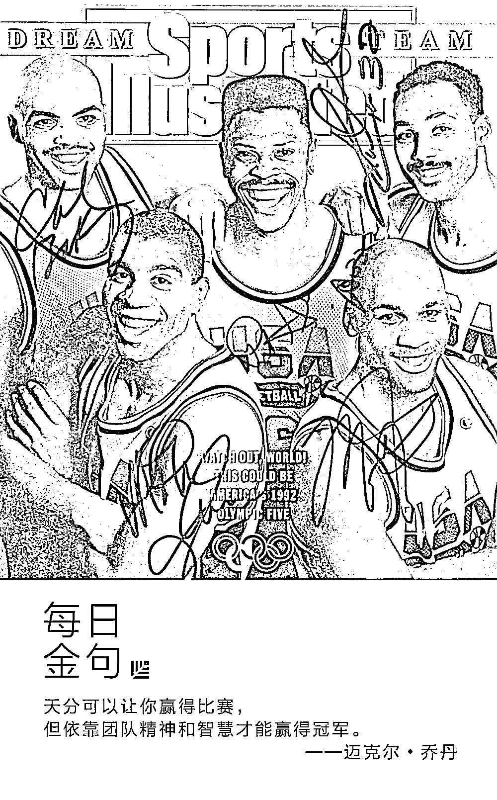
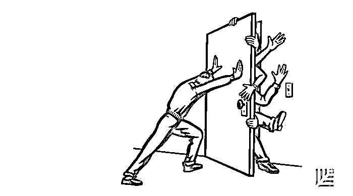
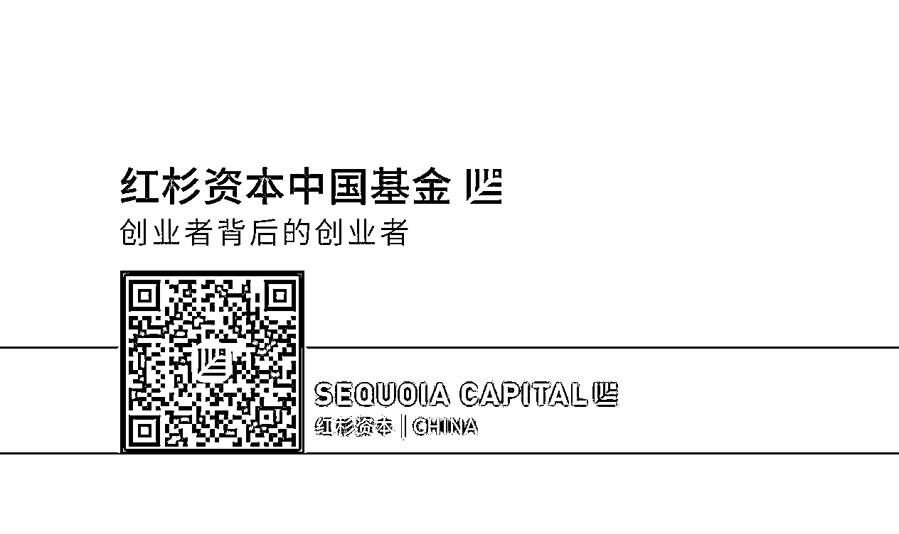

# 怎样打造一支地表最强战斗力的铁军｜红杉汇内参

> 原文：[`mp.weixin.qq.com/s?__biz=MzAwODE5NDg3NQ==&mid=2651223361&idx=1&sn=7eddea3a2438979c72b9030395b84d4e&chksm=80804b15b7f7c203c7d4735420c54084afa12d50f56bbfae33dbc9b9445bad7c5c269284dbaf&scene=21#wechat_redirect`](http://mp.weixin.qq.com/s?__biz=MzAwODE5NDg3NQ==&mid=2651223361&idx=1&sn=7eddea3a2438979c72b9030395b84d4e&chksm=80804b15b7f7c203c7d4735420c54084afa12d50f56bbfae33dbc9b9445bad7c5c269284dbaf&scene=21#wechat_redirect)

[ 编者按 ] 铁军，是对那些能打硬仗、能打胜仗、执行力强的团队的称呼。

同样绝妙的创业想法、理想的商业模式、潜力巨大的市场前景，之所以有人能脱颖而出，而大多数人溃于途中，关键因素就在于谁拥有更强悍的执行力。一支不折不扣地执行战略部署、辟开市场缝隙、败敌于阵前的团队，是今日之所见的多数创业公司制胜的必然条件。

麦肯锡的两位高级合伙人 Scott Keller 和 Mary Meaney 最近特别撰写此文指出，在今天的信息时代，虽然技术发展已经改变了我们对工作的理解，传统的公司界限也在逐渐被打破，但绩效的重要性非但没有降低，反而更加受到重视。

也因此，如何打造一支高绩效团队，仍然是商业世界永恒追求的主题，这也是很多投资人关注初创企业团队构成的原因所在。

每期监测和精编中文视野之外的全球高价值情报，为你提供先人一步洞察机会的新鲜资讯，为你提供升级思维方式的深度内容，是为 **[ 红杉汇内参 ]**。

** 内参**

**高绩效团队：**

**永恒的领导力话题**

作者 / Scott Keller、Mary Meaney

综合编译 / 洪杉

高绩效团队的价值早已得到认可。这就是为什么 90％ 的投资者在评估一家初创企业是否能走到 IPO 那一步时，管理团队的质量是最重要的非财务考量因素。领英联合创始人里德・霍夫曼曾说：“不管你的想法或战略多么出色，如果你只是一个独行的玩家，那么你必定会输给一个团队。”迈克尔・乔丹也说过：“天分可以让你赢得比赛，但依靠团队精神和智慧才能赢得冠军。”

数字技术的发展改变了工作场所的观念以及工作方式，但绩效这个话题的重要性不会减少，反而增加。因为越来越多的工作要远程进行，传统的公司界限逐渐被打破，自由职业者越来越普遍，合作伙伴关系也越来越重要，对领导力的要求就越来越高。也因此，打造一支高绩效团队会成为企业永恒追求的主题也不足为奇。

**团队多大是合适的？**

首先得从团队组成开始。

团队规模要小但又不能太小，其成员组成并不由组织结构来决定。一个顶尖团队如果不超过六个人的话，可能会由于缺乏多样性而导致做出不良决策，可供选择的人也少，加上内部的竞争，从而阻碍了继任计划。同时，研究表明，如果一个团队超过十人，团队的效率将会降低，因为内部会分派系、造成分歧。

此外，CEO 还应考虑以下问题：

▨ 每个团队成员在技能和态度上能跟他人互补吗？

▨ 他们是否认识到自己有进步的机遇？

▨ 是对整个公司负责还是只负责自己的业务领域？

▨ 如果形势变得艰难，是否会坚持到底？

▨ 会成为良好的榜样吗？

大型组织很难将顶尖团队成员人数限制在十人或以下。一家全球保险公司的 CEO 在全球各地共有 18 个直接下属，由于议程规模庞大，即使视频会议超过 30 分钟也讨论不出任何一个话题的结果。

因此，他组建了三个顶尖团队：一个专注于公司的策略和长期健康发展，一个处理短期绩效和运营问题，另一个处理一些公司管理、政策和人员相关的问题。包括 CEO 在内的一些高管参与三个团队的讨论，其他人参与自己所在团队的讨论便可。一些团队成员甚至不是直接下属，而是从下一级管理层挑选的。

**什么是优秀团队的基因**

想想 1992 年美国国家男子篮球队的奥运大名单，囊括了有史以来最顶尖的篮球运动员，但光把这些球员聚在一起并不能保证成功。事实上，在他们集训的第一个月里，“梦之队”就在一场练习比赛中输给了一群业余选手。斯科蒂・皮蓬赛后说：“我们不知道怎么和队员一起打。”后来他们调整了打法，之后的事情就大家都清楚了——该队不仅赢得了 1992 年奥运金牌，而且完胜每场比赛，每场得分均超过 100 分。

网罗明星成员的团队和全明星团队的区别究竟是什么？在过去十年中，麦肯锡让 5000 多名高管回忆他们作为团队成员的“最佳经历”，并用一个或多个词形容一下当时的情景。结果惊人的一致，体现了好的团队合作的三个重要方面——

▨ 方向一致，大家对公司发展方向和团队扮演的角色有共同信念；

▨ 高质量互动，其特点是相互信任、开放沟通和直面冲突；

▨ 强烈的创新意识，团队成员时刻充满活力、勇于冒险、创新、学习外部思想，并在不利环境下仍能付诸实践。

那么下一个问题来了，如何在每一个顶尖团队中重新创造相同的条件？

**选择解决哪些问题很重要**

低绩效团队成员提到的不满普遍都是开会花的时间太多。但据经验来看，真正的症结不在于时间长短，而在于会议内容。顶尖团队的会议应该是关于那些需要集体的跨领域专业知识才能解决的问题，比如公司战略、企业资源配置以及如何实现团队协同等。这些会议需要绕开那些仅凭个别业务部门或个人能力就能解决的问题。

由此反思：**会**议的关注点不应该在于业务问题本身，而是在于如何解决问题。多问几个为什么：团队成员对目标认知趋于一致吗？他们会为结果感到激动吗？如果没有，是什么原因？他们是否感到相互促进、激发了各自的潜力？

无论答案是什么，都能加深彼此的信任，这样的坦诚布公最重要。要让每个人都明白，不同观点的碰撞不一定以冲突告终，相反，能带来更明智的决策。

**很**多团队会在初次会议上安排一位公正的观察员来考察和提高团队动力，最终收效甚好。例如，当话题开始跑偏时，观察员能够及时给出提醒。我们见过一些团队居然花太多时间去讨论早餐吃什么这种事上。有一位 CEO，发言时长是其他成员的 5 倍，当被提醒他在阻断讨论进程时，他一脸震惊。而一个自称优先处理公司前三大事务的 9 人团队，当被要求把这三项事务写下来时，列举出了至少 15 项五花八门的答案。

**学会开会**

在办公室以外的地方开会并不是每次都能让团队动力变强。团队成员需要首先在办公室遵守这些思维方式和习惯，然后规范自己的行为。例如，我们熟悉的一家拉美矿业公司就采用了以下做法：

▨ “黄牌”。每个团队成员都有一张黄牌，用于喊停其他人无意义的行为，并提供建设性的反馈意见。例如，若有人把部门需求置于公司需求之上，或者双方无法继续磋商时，就可以使用“黄牌”。

▨ 节奏控制。在讨论期间，电子投票系统能有效控制会议室的节奏（或者像某位团队成员所说的那样：“让大家都快速发言”），避免群体思维，并有助于剔除过分详细的讨论，重新回到当前议题中来。

▨ 幻灯片不超过三张。最大限度地扩大讨论时间（允许简要预读）。

建立一个高绩效团队必然需要时间和精力。然而，我们的研究表明，**高**管们以一个团队来工作时的生产力比独自工作时高出五倍之多。建立理想团队的商业案例是强有力的，而且团建的技巧也得到了事实的验证。

** 情报**

#在 AI 时代如何继续以人为本？#

**埃森哲：企业拥抱 AI 的 8 个关键策略**

埃森哲最新的一份报告称，成功应用 AI 的企业平均年利润率到 2035 年将提高 38% 。并建议商业领袖考虑以下 8 种策略：

▨ 制定 AI 战略：让 AI 产生价值需要公司高层的认可和行动力，路线图更必不可少。

▨ 把 HR 重塑为 HAIR：CHO 的作用不仅是管理人力资本，而且还要学会管理人机交互或人工智能人力资源（Human AI Resources）。

▨ 和机器一起学习：培养员工在敏捷技能方面的发展。

▨ 任命首席数据官：他将负责建立一个综合的、端到端的数据供应链。

▨ 创造开放的 AI 文化：信任、开放和透明是人与机器关系良好运作的关键。

▨ 让人也进入云端：下一阶段的创新将是关于人的数据和 AI 能力的结合，从而创造新的颠覆性的商业机会。

▨ 超越自动化：企业需要进一步开发机器的自我学习和自我管理能力。

▨ 用计算估量回报：投资 AI 的回报不像传统资产会随着时间流逝而贬值，相反，它会增值。因此，CFO 们需要新的财务指标，以正确评估 AI 的投资回报率。

#正能量也是生产力#

**你的团队里是否正潜藏负面情绪？**

▨ 研究表明，忽视负面情绪的影响可能会使组织生产力下降，人心涣散，效率变差，进而造成上百万的经济损失。

▨ 那些试图掩盖负面情绪的员工会失去热情，甚至把自己的负面情绪转嫁给下属、同事、上级或组织以外的人员（比如客户）。虽然他们会设法避开引发负面情绪的同事或者环境，但却会造成沟通不畅。

▨ 在许多组织中，表达负面情绪的行为会招致他人反感，所以你不能指望所有员工都能从容应对职场负面感受。

▨ 应该密切留意这些迹象，它们表明员工可能对组织抱有负面情绪：

□ 频繁以“私事”或远程办公为由请假

□ 不明原因的迟到和早退次数增加

□ 对加入团队、扩大团队规模或跨部门沟通等行为表现出抗拒

□ 单独吃午餐、关闭办公室门等行为

□ 经常抱怨其他同事或工作环境

□ 多次提及负面情绪状态 ****

** 推荐阅读**

壹

[因为只有聪明还不够，还需要经验，还需要敬畏](http://mp.weixin.qq.com/s?__biz=MzAwODE5NDg3NQ==&mid=2651223353&idx=1&sn=860948e9840ad1484dc5a295682c1b1b&chksm=80804b6db7f7c27b04f6621579dfe9ac8a1c133aa941971ff9620f68eb29ae4803fded69fd8b&scene=21#wechat_redirect)

贰

[“巴菲特的老师”：只招聘没钱、聪明、有野心的人](http://mp.weixin.qq.com/s?__biz=MzAwODE5NDg3NQ==&mid=2651223358&idx=1&sn=129f808b61d20f47bb97312feccc848e&chksm=80804b6ab7f7c27c03a8b0263918602c65b5547c6075a28fdc0fcf83ff71a119e9688931aa0d&scene=21#wechat_redirect)

叁

[创业就是升级打怪，这里有 12 个通关小妙招给你](http://mp.weixin.qq.com/s?__biz=MzAwODE5NDg3NQ==&mid=2651223331&idx=1&sn=bb535401ca1391982fdefb4cc951d867&chksm=80804b77b7f7c2612f13d24b1a192f86e3a6bb58c480c444faa6a3d7d1edf5a8f8a7267af8f1&scene=21#wechat_redirect)

肆

[杨浩涌：大数据的应用必须建立在提升行业效率的基础之上](http://mp.weixin.qq.com/s?__biz=MzAwODE5NDg3NQ==&mid=2651223339&idx=1&sn=048eef836705b53c6fde3a4561fd5feb&chksm=80804b7fb7f7c2694d6a18f465b6d1faeadcdb553732fcb0714247d28d0ee7a294a2a509d554&scene=21#wechat_redirect)

伍

[管理好情绪，就管理好自己一半的人生了](http://mp.weixin.qq.com/s?__biz=MzAwODE5NDg3NQ==&mid=2651223348&idx=1&sn=5178877ce80cf73b90b46e305861b8bd&chksm=80804b60b7f7c2768802e951d7b259e0767be9653deb288d0253fb0843b90244bfa02fc84c9f&scene=21#wechat_redirect)

