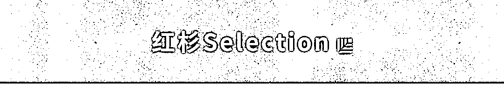
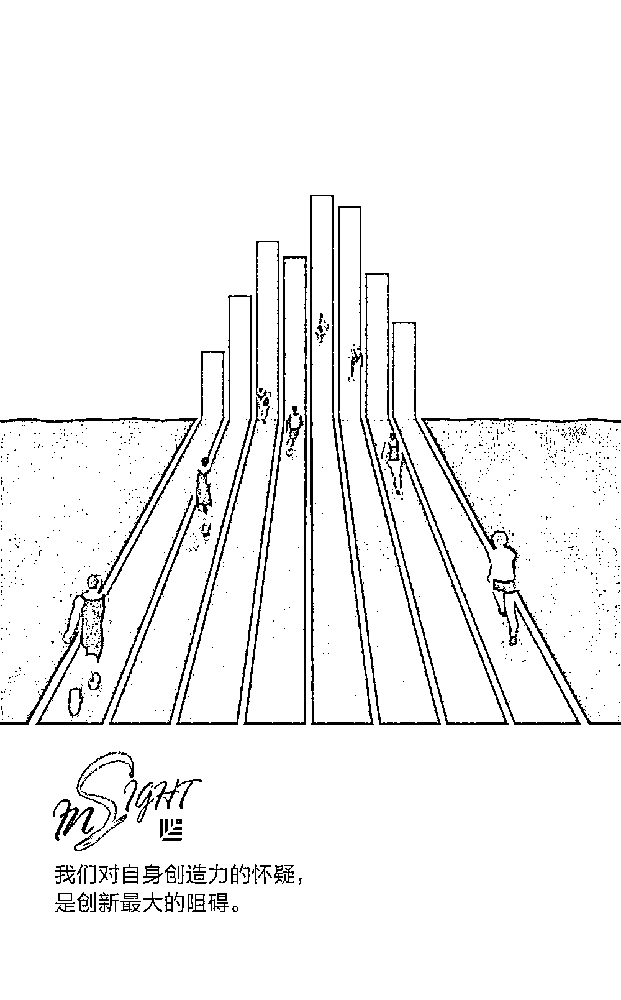

# 对自身创造力的怀疑，是创新最大的阻碍

> 原文：[`mp.weixin.qq.com/s?__biz=MzAwODE5NDg3NQ==&mid=2651225024&idx=1&sn=85415e8b11eb83f23fe0c24c80c7fd32&chksm=80804594b7f7cc829fdd675af65541745fbea836d615b2ee525751bc80ba82bcd9b09ec22182&scene=21#wechat_redirect`](http://mp.weixin.qq.com/s?__biz=MzAwODE5NDg3NQ==&mid=2651225024&idx=1&sn=85415e8b11eb83f23fe0c24c80c7fd32&chksm=80804594b7f7cc829fdd675af65541745fbea836d615b2ee525751bc80ba82bcd9b09ec22182&scene=21#wechat_redirect)

“很久以前我就有过这个想法，要是当时采取行动现在成功的人就是我了。”当你看到一些伟大的想法落地时，是不是也会有一些这样的念头。

但你为什么不大胆说出自己的想法，并努力实现它？

作家 William Cho 阅读美国哲学家、作家爱默生（Ralph Waldo Emerson）所著的《自立》一书后，从中发现了相信自己、勇于表达和实践的重要性。希望你也能从 William Cho 的感悟中看见希望、开启创新之门。

爱默生被美国前总统林肯称为“美国的孔子”，《自立》汇聚了爱默生的思想精髓，它倡导人们追求自我，提倡个性自由，号召人们主宰自己的命运。在这个毕业季，我们也将最诚挚的祝福送给即将在 6 月 7-8 日参加高考的孩子们，在未来的日子里，希望你们都能勇于追求自我、勇于表达自己的想法、努力实现心中的梦想，成为改变世界的创造者。

爱默生在《自立》中探讨了个人主义和避免从众的必要性。我相信很多人都会有所感触，从书中发现生活智慧、改善思维并塑造人格。

相信自己的想法，相信自己内心坚守的是真理——这就是天才。说出你内心的信念，它具有普遍性；因为内心深处的东西在适当的时候会显露......

爱默生告诉我们要相信自己，并公开坦率地说出我们心中的真理。但在现实生活中，许多人因为害怕受到批评和抵制而不敢分享自己内心的想法。小心翼翼地掩盖自己的话语，不表露自己的立场，以免伤害他人的感受或让他人产生误解。

因此，即使我们有一些好想法，恐惧也会让人丧失尝试的勇气。我们对自身创造力的怀疑，是创新最大的阻碍。

爱默生告诉我们，要相信自己内心坚守的是真理。如果你有足够的勇气发表自己的观点，你会发现其他人也同意你的观点。但很多人却保持沉默，总希望有人先表达他们的观点，从而判断自己的观点是否会被认同。

实际上，如果我们发现自己是错误或无知的，就会收获更多，因此别害怕说出自己的想法。至少我们能知道自己错了、错在哪里，并努力让自己成为更聪明的人。 

人们应该学会探测并观察自己内心深处闪现出的一线光辉，而非吟游诗人和圣人的光辉。然而，人们总是会因为“这只是我的想法”而不重视它，任由它一闪而逝。然后在面对每一件天才之作时，都能从中找回那些曾被自己扼杀的想法，它们带着某种陌生的威严感再次出现在眼前。

每当看到像 Facebook、YouTube 或 Uber 之类的好想法，我们都会暗自想到：“是我先有了这个想法！要是我当时采取行动，现在就是亿万富翁了。”

或是在听了一次精彩的演讲或读了一本有启发的书后，有一种不可思议的感觉，感觉自己似乎曾经听过或读过类似的东西。

也可能出现这样的情况，即对方所说或所写就是我们心中的想法，但是在它们被展示出来之后，我们才会对其加以解释或说明。

我们每天都可能有很多出彩的想法。当然，它们可能有点粗糙，需要时间不断打磨和完善。我相信每个人都有一点天分，只是缺乏耐心和实践。

每个人的成长过程中都会经历一段深信嫉妒等于无知、模仿等于自杀的时期；不论好坏，我们都必须接受生命里的每一部分；只有辛勤耕耘，才能迎来丰收。只有自己才最清楚自己能做什么，若你仍感到迷茫，或许在迈出尝试的那一步时，就能真正明白自己能做些什么了。

爱默生告诉我们要勇于实践。他认为羡慕那些成功人士是无知之举。有时候我们会认为自己想要“看起来”有趣、舒适和奢华的生活，但实际上我们根本不知道自己真正想要的是什么。

他说模仿等于自杀，因为每个人的人生道路都是独特的，模仿别人的生活永远得不到快乐或满足感。

他告诉我们，一分耕耘一分收获。如果你从未尝试，那么绝不会有任何收获。

如果你只是想着去锻炼、做一个项目或写一本小说，却从不采取行动，那么你会感到焦虑和不安。你知道应该怎样改变你的生活，却犯了拖延症。

你知道自己喜欢做什么，却因为自我怀疑而停下脚步。不要活在这个永无止境的负面循环之中，去做你认为自己该做的事，感受其中的自由和快乐。

我们独处时会听到一些声音，但踏入喧嚣的世界后就听不见了。社会中有太多的纷扰，阻碍我们找到自我。社会就像一家股份制公司，人们往往为了保住股东的面包，同意牺牲自由和文化。人们推崇“顺从”即美德，自立遭厌弃。

我们永远不会得到真正的独处。朋友和家人可以通过聊天工具与我们即时沟通；而我们也有各种方法紧跟世界的脚步。

我们无法真正独立思考。身处社会之中，我们选择避免谈论一些被视为禁忌或无礼的事，尽量避开那些令人不快的对话和想法来获得舒适和快乐之感。我们的注意力每一天都被分散。我们忽略了自己内心的不安和痛苦，扪心自问，现在的生活是不是自己真正想过的样子？

为了不孤单，我们选择了从众。为了融入这个社会，放弃了个性和活出自我的能力……我们渴望孤独，活出自我，但也需要爱的陪伴。这是为人之道的残酷悖论。

我们都有能力成为天才、艺术家、作家和创新者，但我们一直以来都忽视自己内心的声音。如果我们不担心他人异样的眼光，不羡慕他人的生活，我们可以为下一代创造出什么样的世界？如果我们都为自己的人生负责并开始提升自我，那么 50 年后的世界会是什么样子？

如果你从这一点出发承担起改变自己生活的责任，那么在接下来的几年里你会变成什么样？你将成为一个强大的人、一个为人敬仰的人、一个有能力、可敬又瞩目的人。

如果你学会了自立，还有什么可害怕的？即使社会在你面前崩塌，你依然能保持骄傲和坚强。

去做自己关心而非他人所想的事。这一规则在现实生活中很难实现，而这正是高贵和鄙俗的差别。它的困难之处在于，总有人自以为是地认为他比你更明白你的职责所在。

在这个世上，随波逐流地活着很容易；孤独也很容易；但是要想活得伟大，就要在芸芸众生之中以最完美的状态保持自立。

** 推荐阅读**

壹

[苹果 CEO 库克：迈出第一步，哪怕你不知道会走向何方](http://mp.weixin.qq.com/s?__biz=MzAwODE5NDg3NQ==&mid=2651224991&idx=1&sn=8ae6cf1d5075fa13dd756409857357bb&chksm=808045cbb7f7ccdd84b66399ff88045751ee20335714f6a8d5109eac763ed3257819e4fce609&scene=21#wechat_redirect)

贰

[如何让别人对你的潜在价值深信不疑？](http://mp.weixin.qq.com/s?__biz=MzAwODE5NDg3NQ==&mid=2651224996&idx=1&sn=c42b752cf98848f70b7fd0143d78ccd4&chksm=808045f0b7f7cce68bf0153e293f63204ec0c9fea723454495d918382de3a622075b49068b09&scene=21#wechat_redirect)

叁

[信 AI 还是信自己？这是一个问题](http://mp.weixin.qq.com/s?__biz=MzAwODE5NDg3NQ==&mid=2651225006&idx=1&sn=f267bbdace0c3041ff455c38c51fd64f&chksm=808045fab7f7ccec0883fba2056bb115171449fc6f79ecae3b2a8a29d9dd6723bb0b632ff761&scene=21#wechat_redirect)

肆

[爱奇艺龚宇：80 亿播放量的现象级爆款是如何炼成的？](http://mp.weixin.qq.com/s?__biz=MzAwODE5NDg3NQ==&mid=2651225013&idx=1&sn=e5171074f966d6c260e54b633adaf3f9&chksm=808045e1b7f7ccf7dfc84788ebf2ae78fd9cad3743ab02ca6db2206a6379093d45e88e85df3b&scene=21#wechat_redirect)

伍

[“硬撑”不是唯一的路，你明明知道自己可以活得更好](http://mp.weixin.qq.com/s?__biz=MzAwODE5NDg3NQ==&mid=2651225018&idx=1&sn=679e2a702b6ffce3dd1ebdaf37611b87&chksm=808045eeb7f7ccf82444fdb3b5e491e7aab36dbec5fc2662ed80e4969b728f5b43b646ee4c22&scene=21#wechat_redirect)

