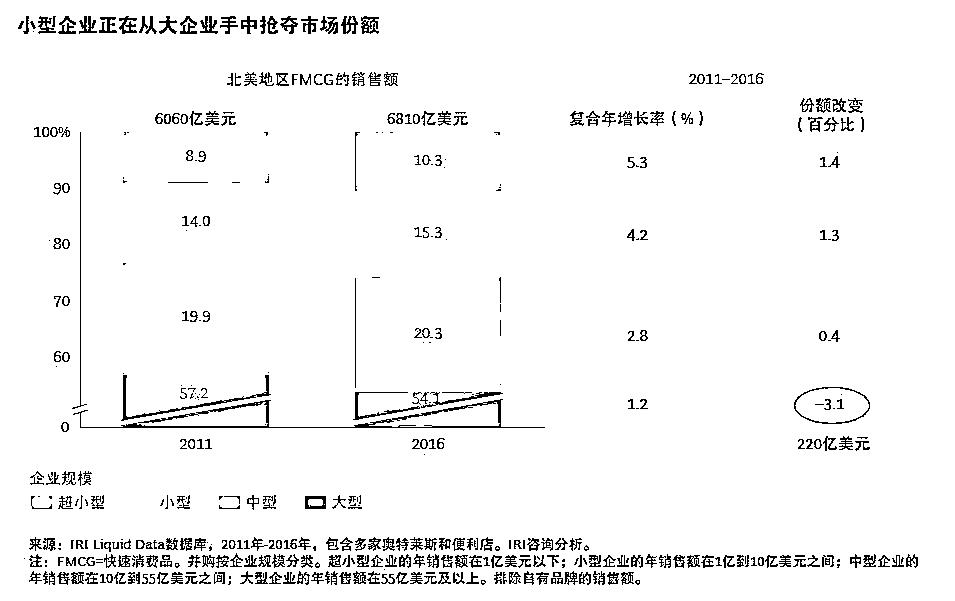
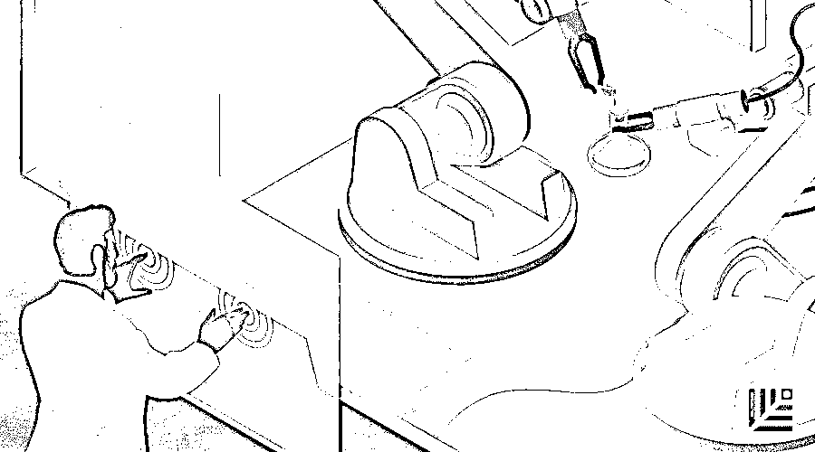

# 贝佐斯说，创业公司永远都要活在“Day 1” | 红杉汇内参

> 原文：[`mp.weixin.qq.com/s?__biz=MzAwODE5NDg3NQ==&mid=2651225909&idx=1&sn=3faca0e7f8cb2aaf8632643cd6213756&chksm=80804161b7f7c8777652f365171e8272054f636b9982d2ff2d0ee341e5bc1f98244756578f0e&scene=21#wechat_redirect`](http://mp.weixin.qq.com/s?__biz=MzAwODE5NDg3NQ==&mid=2651225909&idx=1&sn=3faca0e7f8cb2aaf8632643cd6213756&chksm=80804161b7f7c8777652f365171e8272054f636b9982d2ff2d0ee341e5bc1f98244756578f0e&scene=21#wechat_redirect)

[ 编者按 ] 创业公司的特质是什么？

亚马逊创始人兼首席执行官杰夫·贝佐斯用了一个词，完美诠释了创业时所经历的全部考验、磨难及创业精神的魔力——“Day 1”，也就是每天都要像创业第一天那样运营公司。他认为，始终保持“Day 1”的特征至关重要，一旦成为“Day 2”公司，就代表着停滞不前，随之而来的是与市场脱节，经受衰退的痛苦，最终走向没落。

贝佐斯揭示了“Day 1”公司严格遵守的四个原则，这就是：真正把目光锁定在顾客身上，抵制形式主义，积极适应外部趋势，快速做出决策。它们可以帮你快速检测公司状态，并打消想要休假的念头。

每期监测和精编中文视野之外的全球高价值情报，为你提供先人一步洞察机会的新鲜资讯和升级思维方式的深度内容，是为 **[ 红杉汇内参 ]**。

** 内参**

来自亚马逊的成功秘诀

**成****为“Day 1”****公司的四个原则**

作者 /Tom Koulopoulos

编译 / 洪杉

我们常常会被一些精致而简洁的概念吸引，因为它们能轻而易举地将一系列复杂的概念变得简单，令人印象深刻。例如，马尔科姆·格拉德威尔（Malcolm Gladwell）的著作《引爆点》（Tipping Point），和罗伯特·福尔根（Robert Fulgham）的《幼儿园教会我的人生知识》（All I Really Need to Know I Learned in Kindergarten）。

这些简单的框架内容，可以成为你的罗盘，帮你探索复杂的生活。

亚马逊创始人兼首席执行官杰夫·贝佐斯（Jeff Bezos）就提出了一套框架，如一本秘籍，帮助你了解一个成功企业要想不断发展需要哪些最为关键的态度、做法及文化。

每个创业团队成员眼中所迸发出的活力和乐观都是独一无二的。尽管工作时间长，需要牺牲自己的时间、家庭、金钱，以及许多我们视若珍宝的事物，但创业仍让人有一种他人无法感同身受的快感。

然而，每个初创企业都要留意一个陷阱：渴望摆脱创业模式，成长为一家真正的公司。但其实，创业者应该一如既往地保持创业之初的“魔法力量”，因为创业时的活力和热情与最终的结果一样宝贵。失去了这些活力和热情，企业就无法成长。这将是成功路上最大的绊脚石。

如何为创业公司的特质命名？贝佐斯完美诠释了创业时所经历的全部考验、磨难及创业精神的魔力——“Day 1”。他认为，始终保持“Day 1”的身份至关重要，甚至因此将亚马逊总部大楼命名为“Day 1”！

“Day 1”公司应保持自己的目标定位——避免成为一家“Day 2”公司。贝佐斯说：“‘Day 2’代表着停滞不前，那么随之而来的就是与市场脱节，经受衰退的痛苦，最终走向覆灭。所以，亚马逊要始终做一个‘Day 1’公司。”

那么如何才能立于“Day 1”的位置不倒呢？贝佐斯揭示了“Day 1”公司严格遵守的四个原则。看看你的公司符合哪一条。

**真正把目光锁定在顾客身上**

贝佐斯说：

你的关注点可以是竞争者、产品、技术、商业模型等事物。但我认为，始终关注顾客才是保持首日活力最有力的方式。

顾客永远没有满足的时候，即便他们说自己很开心，公司很棒。有时，甚至连顾客自己都不知道，他们总想要更好的。你必须时刻想着取悦顾客，这样才能促使你根据他们的喜好不断创新。

如果你想知道自己的公司是“Day 1”还是“Day 2”，问问你的顾客。

**拒绝形式主义**

大公司的常识判断下线时，概念偷换往往已经发生了。

贝佐斯指出了各大公司在创新时的最大挑战——员工找到了一种彼此心照不宣的安全办法来推脱个人责任。

“随着公司规模的壮大，复杂程度的加深，员工通常会试图偷换概念。具体的方法花样百出，但这种做法危害大却又不易被察觉，在“Day 2”公司身上尤为典型。一个常见的例子就是拿流程做概念偷换。大公司很容易遭遇这种情景。将流程等同于想要的结果，然后就不再关注最终结果，而只是在确保流程正确。这种做法简直令人倒吸一口冷气。”

贝佐斯告诫我们要留意流程的使用。“员工以‘我们是按照流程来的’为借口，为不理想的结果开脱——这并不罕见。但更有经验的领导者会将之视作一个进行调查、改进流程的机会。流程不是问题，但我们要自问：是我们控制流程还是流程控制我们？‘Day 2’公司通常都是第二种情况。”

**接受外界的趋势变化**

那些聪明机敏、大获成功的公司即便在对眼前所见一头雾水时仍能径直地窥见新趋势，就好像阳光普照、天气明媚的日子里，看着海啸正滚滚而来，心中想着如何才能找到合适的角度，让自己的伞遮住最多的风雨。

贝佐斯认为：“发现这些大趋势并不难，但不可思议地是，大公司要接受它们却很难。”

“Day 1”公司和“Day 2”公司之间最大的差别在于对风险的态度。小公司敢于尝试，接受失败，然后站起来再次尝试。但随着公司的发展，这种模式变为尝试、失败、被解雇，最好的结果就是不再尝试！如果真是这样，那么欢迎来到“Day 2”公司的行列。

**快速的决策制定**

贝佐斯认为，做决策时，速度大于完美。

获得 70%左右的所需信息后，你可能多半就可以做决策了。等到了 90%，多数情况下，你做决策的速度可能就落后了。此外，无论何种方式，你都需要迅速找出那些错误决策并加以修正。若你擅长修正，那么决策错误的代价也就会低于预期，但速度慢则意味着高昂的代价。

贝佐斯由此引入了一个“不一致，仍实行”的概念，这对领导者来说异常宝贵。

‘不一致，仍实行’能够节省大量的时间。如果你对某个方案信心满满，即便意见不一，对大家说‘我知道我们意见不统一，但你们愿意陪我赌一赌吗？’即便大家对最终结果都没有十足的把握，但很可能会迅速同意你的观点。

贝佐斯的建议永不过时。无论你在任何行业，公司处在哪一发展阶段，这都不重要。事实上，不论是营利机构还是慈善机构，不论是个人性质还是专业公司，你只有两个选择：要么成为“Day 1”企业，要么成为“因公司衰败而遭受痛苦”的“Day 2”企业。

你的公司属于哪一种呢？ 

** 读数**

**220 亿美元**

为什么小企业和初创品牌居然开始瓜分大品牌的蛋糕了？从 2011 年到 2016 年，北美地区大约 220 亿美元的行业销售从大企业转移到小企业。欧洲也经历了同样的改变。

BCG（波士顿咨询） 研究发现，消费者需求的根本驱动因素并没有改变。但初创企业有了更好的“弹弓”：生产外包令他们可以“租借”制造能力，新的分销渠道让他们更容易以小额销量打入市场，而社交媒体渠道让它们能够低成本打造品牌。初创企业从未像今天这样赢得消费者支持。

** 情报**

#从研发到临床试验#

**人工智能引发药物开发的变革新浪潮**

▨ 建模和模拟（M＆S）。通过模拟不同的临床研究计划并确定最合适的结果来优化设计方案。

▨ 整合来源不同的数据。自然语言处理技术和机器学习的组合可以实现自动化整合过程并将其覆盖范围扩大到许多国家和地区。

▨ 预测志愿者招募。机器学习则更适合用来比较志愿者的行为模式，预测其中途退出试验或不遵医嘱的风险，进而帮助研究团队做决策。

#可能明天就会发生#

**5G 对通信行业意味着什么？**

▨ 更大的商业潜力。预计到 2022 年通讯基站的数量将达到 5 亿，移动数据使用量将达到新高。

▨ 更多的安全威胁。网络犯罪分子的目标是利用越来越多的移动办公人员和越来越多的互联网接入点接入网络——两者都由 5G 支撑。

▨ 更有创意的解决方案。移动边缘计算等可以帮助企业解决移动性和安全性的技术将逐渐普及，更多支持物联网的设备也将被引入。** **

** 推荐阅读**

壹

[进击的平台：为什么传统大企业会被颠覆？ | 红杉汇内参](http://mp.weixin.qq.com/s?__biz=MzAwODE5NDg3NQ==&mid=2651225805&idx=1&sn=45d33ea6f3a5aae2a423171e8d5b4357&chksm=80804099b7f7c98fac7d5a6f35420c1a227df53efa505c1c937507868133a3cd4326a4358aa2&scene=21#wechat_redirect)

贰

[当创业快车驶向失败边缘，如何及时且正确地刹车？ | 红杉汇内参](http://mp.weixin.qq.com/s?__biz=MzAwODE5NDg3NQ==&mid=2651225762&idx=1&sn=33a82575a5cdf91639dd8b54bce97894&chksm=808040f6b7f7c9e0971b9b990607fee52fe65073b39c963fb117e213750eaed6b450d03066fd&scene=21#wechat_redirect)

叁

世界经济论坛报告：关于未来工作的 12 个趋势判断｜红杉汇内参

肆

4 个 X 要素告诉你，伟大领导者和优秀领导者的差别 | 红杉汇内参

伍

比想象更快，开始依赖虚拟现实的 7 个行业 | 红杉汇内参

