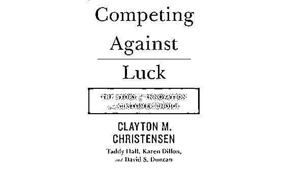
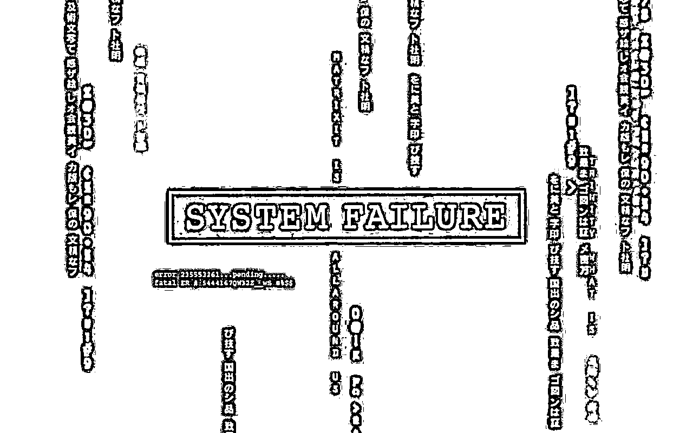
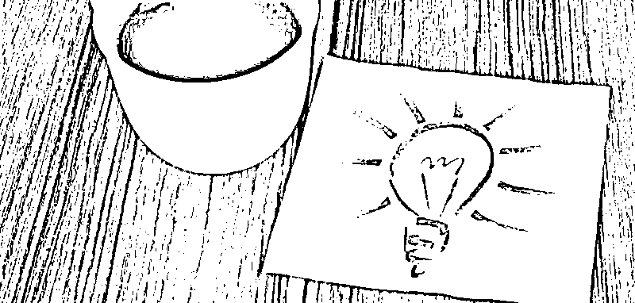

# 为何太多创新以失败告终？《创新者的窘境》作者又有新研究 | 红杉汇内参

> 原文：[`mp.weixin.qq.com/s?__biz=MzAwODE5NDg3NQ==&mid=2651221839&idx=1&sn=1ca6fb20b86d72c700cdc2394c29258d&chksm=8080511bb7f7d80d32ef0a69d0b318e6f9d3f4b5bc885292b417078e69ec7421d99d1eca4027&scene=21#wechat_redirect`](http://mp.weixin.qq.com/s?__biz=MzAwODE5NDg3NQ==&mid=2651221839&idx=1&sn=1ca6fb20b86d72c700cdc2394c29258d&chksm=8080511bb7f7d80d32ef0a69d0b318e6f9d3f4b5bc885292b417078e69ec7421d99d1eca4027&scene=21#wechat_redirect)

**| 红杉汇内参 |**

第 008 期

*[* *编者按 ]* 本期，我们来讨论一个敏感话题：假如贵公司失败了，墓碑上应该写点什么？

分析公司 CB Insights 最近发现，约有一半的创业公司失败的原因是：它们所要解决的问题根本不普遍，也就是非有效需求。很多创新起始于“伟大的心血来潮”，但却最终被市场啪啪打脸。

还有很多人迷恋“破坏性创新”，但为什么大多数都以失败告终？率先提出这一概念的哈佛教授克里斯坦森最近刚刚对此有了新研究，在其新书《与运气竞争》中指出，这是因为公司专注于产品功能而非客户究竟想用产品来做些什么所导致的。

这一关键发现用一句话概括就是，许多创新到产品卖给用户就终止了，因此公司会更关注产品的功能和交付能力，却忘了追问一个更根本的问题：用户要拿你的产品做什么？

因此，克里斯坦森提出了新的“待完成的工作理论”，意即公司要将用户的使用流程和体验纳入创新要考虑的范围中。虽然关注数据可追踪效率，但对于用户来说，有效性更重要。

宽泛地说，谷歌在安卓平台上推出的如微信那样的“小程序”也是这一思维的体现，即关注用户使用即时应用程序要做什么，而不是光拿下载量、留存率说事。

每期监测和精编中文视野之外的全球高价值情报，为你提供先人一步洞察机会的新鲜资讯，为你提供辟开脑洞、升级思维方式的深度内容，是为 **[ 红杉汇内参 ]**。

【本期悬念】

1.  为什么自诩为创新者的你又一次陷入窘境？看看《**创新者的窘境**》作者的新研究。

2.  如果把创业视为“用于搜索可重复和可扩展业务模式的临时组织”，你就**无惧早期失败**了。

3.  谷歌将在安卓平台大推如微信那样的“**小程序**”，将如何改变原生 APP 的生态？

4.  让大脑经常做**创意体操**的 9 个实用建议。

  ※※※

【内参】

 《创新者的窘境》作者又有新研究：

**为何大多数创新以失败告终？**

 作者：克莱顿•克里斯坦森等

出版商：哈珀·柯林斯

出版时间：2016/10/4

**碰运气的创新**

三年前，克莱顿•克里斯坦森（Clayton Christensen）和塔迪•霍尔（Taddy Hall）、斯科特•库克（Scott Cook）撰写了一篇名为《为营销模式纠偏》的文章，认为，由于市场被不断细分，美国公司已经失去了自己的方向从而变得忧心忡忡。他们收集数据来衡量市场细分的需求，然后使用更多的数据来衡量他们满足这些需求的进度。

但由于他们总是提出错误的问题，经常致力于解决这些“错误的问题，通过各种方式改进产品……（但这一切）与他们客户的需求毫不相干”。克里斯坦森总结说，我们所需的是一个新的模式：通过一个全新的视角提出正确的问题，以及对这些问题中产生的目标的进展情况进行衡量。

这篇文章为克里斯坦森的新书《与运气竞争：创新和客户选择那些事》打下了坚实的基础，也是克里斯坦森对他提出的“破坏性创新”理论和写作《创新者的窘境》一书的研究新进展。

自其提出破坏性创新概念以来，这已经成为一个流行语，“被广泛错误地用于表示任何与聪明和新颖有关的东西”。但更重要的一点是，它只是解释过去、回顾过去，并没有提供在哪里寻找新的创新线索。与此同时，公司被数据所“充斥”，这些数据也是回顾性的，侧重于购买模式、客户对当前产品的满意度以及类似指标。

最终结果？“公司正在呈指数增长式地加大付出，以实现仅仅一点点的增量创新，而完全忽视了对长期、可持续增长至关重要的突破性创新。”这也回答了，为什么大多数创新昙花一现，最后以失败告终。

**重要的是过程，而非产品**

著名经济学家西奥多•莱维特（Theodore Levitt）曾经喜欢告诫学生：“人们不想买一个四分之一英寸的钻孔机，而是想要一个四分之一英寸的钻孔。”

该言论被广泛引用，但克里斯坦森认为该言论并未被了然于心。人们还是倾向于根据钻孔机的“特色和功能”来衡量过去的性能并设定未来的基准，而非根据客户试图获得正确钻孔的经历。

对产品的关注是可以理解的，因为它很容易转化为可量化的数据，许多数字公司正是致力于推断客户特点与其购买的产品或服务之间的联系，由此揭示的模式可能是诱人的。但克里斯坦森表示，除非公司了解客户为何做出这样的选择，否则所有这些数据是不可能引发一致的创新。

只有相关性是不够的，关键是因果关系，这促使克里斯坦森补充其之前的破坏性创新理论，即他所谓的“待完成的工作理论”（或简称工作理论）——公司对于其给定产品或服务应该询问的唯一重要问题是：客户借助这些要做什么工作？

克里斯坦森寻求一种对“客户行为因果机制”的无情关注，产生了一种几乎是社会学性质的方法，并涉及对选择和使用给定产品或服务的经历的整体分析。 正是在这种经历的形成中，公司将发现创新和可持续竞争优势的潜力。

**识别未满足需求的方法**

 “传统的关注客户需求的方式不足以解释现实世界中的实际消费决策。”只有深入了解特定情况才能解释为什么。从这样的深层观察中出现的画面可能是复杂且具有层次感的，“在客户的踟蹰时刻对他们进行观察的洞察力不容易分解成可以输入电子表格的数据位”。克里斯坦森表示，这些“工作洞察力”是脆弱的，因为“他们更像是故事而非统计”。

一些公司已经通过“工作理论”的视角成功地审视了它们的所作所为，最终从根本上转变了它们的品牌使命感，转变了竞争目标。

将产品或服务定义为“待完成的工作”不仅可以帮助公司重塑公司形象，还可以让公司以全新的视角发现潜在市场中隐藏着的但又显而易见的新任务——因为现有的产品并没有充分解决产品需求和用户愿望。

通过“工作理论”视角，克里斯坦森认为，在某些情况下，公司不会与其它公司产生竞争关系，而是在与自己公司的“非消费”领域进行竞争。比如 Airbnb 发现，在网络租房服务不存在的情况下，40%的用户选择不去旅行。因此，Airbnb 并不与传统酒店竞争，而是与“决定不去旅行”这个想法进行竞争。

非消费模式允许创新者识别未满足的需求和未开发的机会，探索开放式的新市场，而不是在“零和博弈”中满足于市场份额的微小增益。

当然，未满足的需求也可以通过其他方式发现。有时，客户将通过“拼凑在一起的解决方案”来抵消不充分的选择。看似“不合理”地使用现有产品也可能有助于发现新的潜在市场。

人们通常会避免“负面工作”任务，不过该任务也可以为那些勇于挑战的人提供新机会。有一对夫妇的孩子喉咙非常不舒服，他们在孩子看病时遇到了一系列麻烦：选择儿科医生、预约、确诊为链球菌性喉炎的话要等待处方药单等。而 CVS MinuteClinics 简化了这一过程，现在 CVS 旗下 1000 多个诊所已经遍布美国 33 个州。

**对手无法抄袭的**

**是****你创造的卓越用户体验**

识别一项任务隐藏与否是一回事，创建围绕产品或服务表现所需的体验是另一回事。这是一种先进的策略，涉及到预测和解决在过程每一个阶段的需求、障碍和所担忧的问题。正是如此，公司才可以发现一个自身既明确又可持续的竞争优势。

Airbnb 推出之前，他们“仔细地识别并推断 Airbnb 屋主与房客的 45 个不同的情感时刻”， 然后对不同的情感做出详细说明。例如，如何迎接房客？如果该场景定位为“放松”，那么房客进入房间时是否会播放轻音乐？克里斯坦森说，传统营销分析可以透露客户的需求，但却不能告诉我们用户的真实体验。

American Girl 通过仔细分析购买其玩具娃娃的用户体验，打造了一项非常成功的业务。玩具本身非常可爱且质量尚佳，但并未达到惊为天人的地步。竞争对手试图抄袭其产品，并试图以低价售卖。但是竞争对手们并未成功，原因是他们并不了解除了娃娃之外的其它设计，比如，娃娃商店的精美设计、娃娃礼盒打开时的巧思以及关于每个娃娃的故事。

 American Girl 案例：产品易模仿，体验难复制

创始人 Pleasant Rowlant 称：“竞争对手不愿探究产品深层次的设计从而创造（新的）体验，他们认为产品就是产品，并没有什么意义。”克里斯坦森称：“如果能深入了解自己的产品（为什么受欢迎），你根本不用担心竞争对手所产生的威胁。”

宜家也是通过密切关注客户体验细节，从而拥有其自身长期竞争优势。乍看起来，宜家似乎没有特别的商业秘密。“任何潜在的竞争对手都可以走进宜家门店，通过还原工程制作其产品或复制产品目录。但并没有人能再创另一个‘宜家’。”克里斯坦森将这种独特的客户体验与沃尔玛和 Target 等大型连锁零售商进行了对比，后者不断地在争占市场份额的竞争中“头破血流”。

**关注效率，还是有效性？**

关于将产品或服务理解为用户“待完成的工作”，可以让公司完全了解其如何满足客户。但克里斯坦森认为，真正的挑战是打造这样一家公司，使它的组织、运营、管理等机能都服务于这一统一目标。通常，与这种整合完全相反的是典型公司的文化——严格的组织结构、孤立的功能分工、侧重于内部指标和市场细分。

这就难怪了：即使是大型公司也会偏离轨道，弄不清客户为什么在第一时间选择你。

部分问题是对错误问题的关注。只有当各种指标专注客户利益时，指标才会具有参考性。亚马逊关注的并不是发货时间，而是货品交付时间——因为后者才是用户体验的一部分。这样的指标从本质上关注的是有效性，而不是效率。虽然跟踪效率就容易多了，因此许多公司受到这种“诱惑”而放弃关注产品交付的“有效性”。

复杂的问题是，基于产品的数据往往是“嘈杂的”，而以流程为重点的措施更微妙且更难以捉摸。“当管理者从条理杂乱的事件叙述中转移到条理清晰的电子表格时，会感到十分宽心。”定量数据看起来比定性数据更可信、更舒服。

克里斯坦森总结道：成功创新、然后整合、围绕“工作理论”这一过程说到底更像是艺术而不是科学。企业家们在这一过程中更像是“肖像和纪录片制作者”——将线索和观察整合在一起。敢于挑战的人将获得额外的馈赠，因为“产品可以复制，但是通过整合流程做好工作，公司不仅可以提供理想的用户体验，其自身竞争优势也能得到提高。”

 ※※※

【情报】

#你以为你以为你以为呢？#

**一半创业公司都败在这里**

**** 分析公司 CB Insights 最近发现，约有一半的创业公司失败的原因是：它们所要解决的问题根本不普遍，也就是非有效需求。如何避免重蹈覆辙？

*   先假设什么都不存在。很多公司的创立都是源于“伟大的心血来潮”，然后直接进入具有宏伟愿景的产品构建阶段。结果是市场没有像预期的那样反应，市场反而成了罪魁祸首。

*   做前期调查：减少你计划中未经检验的假设数量。

*   投入时间与市场互动来验证它：与潜在客户沟通能够真正了解和评估机会。

*   准备好失败：第一次试验某种产品时就能成功的几率是非常小的。

*   尽快构建一个最小可行性产品，在没有高成本投入情况下于真实市场中验证这些假设。

*   重新认识什么是初创公司：“用于搜索可重复和可扩展业务模式的临时组织”。

#手机将变“轻”，但流量入口更金贵#

**谷歌也搞“小程序”了**

**** APP 的世界正在成为僵尸国度。截至目前，iOS 和安卓平台上一共有多达 420 多万款 APP，但用户下载和使用它们的次数却越来越少。不约而同地，谷歌也像微信那样开始推广即时应用程序了：

*   可通过将现有 APP 模块化成不同的即时应用程序版本，帮助开发者扩大现有用户群，且在过于饱和的应用程序市场中，提高被发现的机率。

*   它将改变现有的三种 APP 收费方式：付费下载、APP 内购买和内置移动广告。

*   开发者需要重新评估粘住用户价值的方式——针对即时应用程序流，开发者不能再根据使用时间长短来衡量用户参与度，而将考察购买转化率等目标。

*   尽管下载量最初可能会下降，然而用户一旦获知其价值和实用性，参与度和留存率会大幅提高。用户可能更倾向于应用程序内购买，并愿意停留更长时间，广告价值由此将提高。

*   迪士尼、Medium 和当日酒店（Hotel Tonight）等正率先测试该程序。

#建议先做到第一项#

**让大脑成为创意工厂的 9 个建议**

**** 

*   随身带一个记事本（而不是打开手机里的记事本）。

*   进行激烈的头脑风暴会议：想象你在钓鱼，把头脑放空，让更多想法进来。

*   每晚记下 10 个新想法（训练你的大脑）。

*   把想法画出来，鼓励自己涂鸦。

*   尝试未知事物，以开拓视野。

*   关掉电子设备免得分心。

*   从与聪明人的对话中获取灵感。

*   如果有了一个点子的萌芽，强迫自己让想法继续延伸。

*   不要自我设框。不要轻易否定那些最初感觉荒诞的想法，先记下来。记住，创意是一种情绪，而非一种大脑类型。

**※※※**

【往期回顾】

红杉汇内参第 005 期

[向达芬奇学创新：隐藏在《最后的晚餐》中的秘密](http://mp.weixin.qq.com/s?__biz=MzAwODE5NDg3NQ==&mid=2651221720&idx=1&sn=d1a24a85999144e565ac1a50c1bc1b40&chksm=8080508cb7f7d99ae3364fb83d64461910b50d762e8a2a8868b81fff2c8523002c3079fd58a7&scene=21#wechat_redirect) 

  

红杉汇内参第 004 期

[乔布斯和富兰克林：谁拥有更棒的领导力](http://mp.weixin.qq.com/s?__biz=MzAwODE5NDg3NQ==&mid=2651221672&idx=1&sn=e4fe4295cd23572d9b8007449a8348d5&chksm=808050fcb7f7d9eac7260b157b384f463ae440c1da2e9f6c690ccb89328cfb118794dbb26957&scene=21#wechat_redirect) 

红杉汇内参第 003 期

[创业者忠告：不要和员工做朋友，成功和友善无关](http://mp.weixin.qq.com/s?__biz=MzAwODE5NDg3NQ==&mid=2651221562&idx=1&sn=15686ebbe0d2553ed1aa7ccc39fb7a71&chksm=8080506eb7f7d9784a77593b670ebb051ec2ccc4bc4954e10dc286db3e87edba5c8fd97181a7&scene=21#wechat_redirect)

