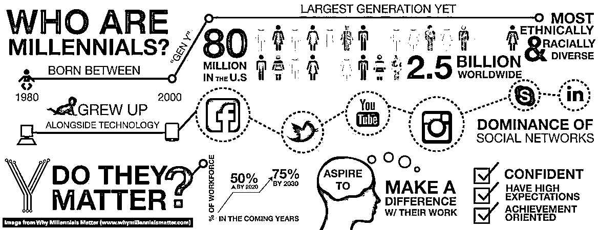
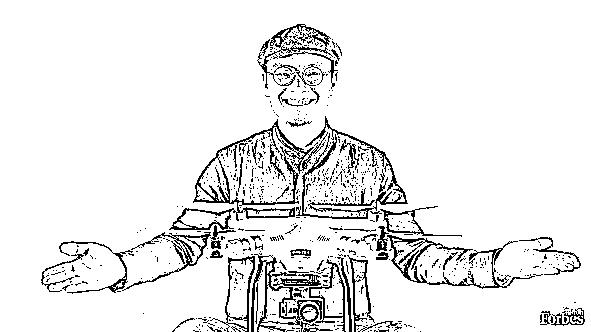

# 红杉汇内参 | 向达芬奇学创新：隐藏在《最后的晚餐》中的秘密

> 原文：[`mp.weixin.qq.com/s?__biz=MzAwODE5NDg3NQ==&mid=2651221720&idx=1&sn=d1a24a85999144e565ac1a50c1bc1b40&chksm=8080508cb7f7d99ae3364fb83d64461910b50d762e8a2a8868b81fff2c8523002c3079fd58a7&scene=21#wechat_redirect`](http://mp.weixin.qq.com/s?__biz=MzAwODE5NDg3NQ==&mid=2651221720&idx=1&sn=d1a24a85999144e565ac1a50c1bc1b40&chksm=8080508cb7f7d99ae3364fb83d64461910b50d762e8a2a8868b81fff2c8523002c3079fd58a7&scene=21#wechat_redirect)

**| 红杉汇内参 |**

第 005 期

*[* *编者按 ]* 将达芬奇绘制《最后的晚餐》的过程想象为创造一部非凡产品的历程是很有意思的，从中能否启悟到创新的奥秘，得失关乎一心。这就像是一场佛家的修行：你从每日的砍柴挑水中只体会到辛苦的日常，但得道者会领悟到低头起立之间的谦卑。

创新不是玄学。它有规律可循，但又需在窥道之后寻求打破常规。就像本期主文所透视的那样，在达芬奇作画的过程中，我们既能从其中心点的透视画法中启悟到目标聚焦的必要性，又能从其摹画阴影线的手法上领略到跟随个体直觉的重要性。

而最有意思的一点是，因为没有遵从当时壁画绘画的标准技术，《最后的晚餐》在完成 20 年后很快面临剥落的问题，一次次修复也难复原貌。教训就是，有时候完成目标的最佳方法并非是创新的，而需要用到最基本的方式。

每期监测和精编中文视野之外的全球高价值情报，为你提供先人一步洞察机会的新鲜资讯，为你提供辟开脑洞、升级思维方式的深度内容，是为 **[ 红杉汇内参 ]**。

【本期悬念】

1.  一个现代的创新创业者可以从**达芬奇**的艺术历程中学到什么？

2.  《哈佛商业评论》问了一个好问题：为什么有远见的 CEO 却没有选择有远见的继任者？虽然**库克**已经尽力了……

3.  如果 APP 和微信号的流量红利都消失，“下一个”连接用户的利器居然是……**电子邮件**？千禧一代将决定你的创业成败？这不是危言耸听。

4.  你相信吗？弹丸小国**爱沙尼亚**的人均创业企业数量全球领先，大名鼎鼎的 Skype 就源自这里。

  ※※※

【内参】

 **向达芬奇学创新**

隐藏在《最后的晚餐》中的秘密

作者：ScottBowden

来源：InnovationExcellence

当我们想到列奥纳多·达·芬奇与创新，也许常常会想到他的一些惊人手稿，其中包括飞机、军事装备的设计图以及《维特鲁威人》等。当我读了罗斯·金所著的《列奥纳多与最后的晚餐》一书后，我想到的问题是，一个现代的创新创业者可以从达芬奇的艺术历程中学到什么？ 

**速写本：观察的重要性**

“恐怕历史上没有人的产出可以与达芬奇相比，或者说是想要将所有看到的东西记录下来的强烈欲望。”金写到。达芬奇到哪儿都带着他的速写本，他也说过，有追求的画家必须“随时随地注意观察、记录和思考环境，以及人们的行为，包括交谈、争吵、大笑或者打架”。

Lesson 1：对于现代创新者来说，达芬奇的这种方法说明了对于定义创新，观察是非常重要的。创新者应该离开办公室，到公司其他部门甚至是离开公司来进行远距离观察。因为人的眼睛比耳朵获取的信息要多得多，对创新者来说，充分运用眼睛去看非常关键。

**工作环境：独处与开放**

达芬奇的另一个建议是关于画家的工作室大小：“狭小的空间或处所可以训练思维，而大的空间会削弱思维。”然而，金指出，事实上达芬奇在帮富商权贵作画时，常常占据城堡中几个最大的房间。达芬奇同样相信，工作室必须布满“好的画作”，“放着音乐，或伴有带着愉悦的优美的读书声”。

达芬奇建议画家必须尽可能地独自生活。他说，“当你独处时，你可以完全的掌握自己，当你有伴时，你只拥有一半的你。”

Lesson 2：这些看似毫无联系的建议包含了现代创新者需要的智慧。安静独立的房间可以产生冷静紧张的集中注意力，让创新思维的产生和细化更加高效。而大房间也许更适合头脑风暴或团队协作。

**红铅粉：打破常规**

艺术史学家从达芬奇为了《最后的晚餐》所作的针对铅粉的手稿中受益颇多。达芬奇研究了绘画的多种细节设计上的属性，金写道，虽然“达芬奇在一些存世的《最后的晚餐》手稿中用了黑铅粉……但他似乎特别偏好甚至创新地使用了红铅粉。”达芬奇有意远离其他艺术家所谓的常规，这是一个例证。

达芬奇开始使用红铅粉，因为它有两个优于木炭的属性。一是红铅粉在人物的描绘上更佳，因为更接近于人的肤色，并同样适用于其他红色调的场景比如抽烟、火和阳光。这种着色使达芬奇的作品更加逼真。二是，红铅粉比木炭的硬度高，可以削尖后用于更细节的地方。

Lesson 3：对于现代创新者来说，需要从这里学到的是不要轻易接受同事或者竞争对手解决问题的惯用工具。打破常规的工具可以带来新的能力。

**画阴影：跟随个体直觉去创造**

通常画家会用平行笔触来画阴影部分，基本上是从左下到右上，而达芬奇是从右下到左上。为什么？因为达芬奇是左撇子，对他来说画这种向后倾斜的阴影线更简单自然。

Lesson 4：从创新的角度来说，从这可以学到的是跟随个体的直觉去创造，而不是循规蹈矩。达芬奇也许为了跟其他画家一样，曾经尝试强迫自己遵循左下到右上的常规阴影画法。事实上，在那个年代左撇子被视为一种缺陷，人们常常会采取措施强迫他们的孩子变成惯用右手。

**中心点：目标聚焦**

透视和对称对于文艺复兴时期的画家尤为重要，在达芬奇的巨作中有充分体现。我们现在仍然可以看到《最后的晚餐》上有一个很小的钉眼，作为这幅作品的中心点标记。据推测，很有可能是达芬奇留下的，并出现在他不同的作品中。达芬奇把这看做“逐渐缩小的点”——所有线条和目光聚焦的位置。

Lesson 5：就像很多头脑风暴会上，通常都需要确定目标的中心点，然后把每个新想法都画到坐标上，同时运用多个参数在图表上呈现出来，来表现新想法与最初想法的关系及结果。这也可以检讨出哪些方面我们的创新是过剩的，而在哪些方面还需要投入更多。

**剥落的壁画：完成目标的方法并不一定是创新的**

如果达芬奇的风格是最好的，但他的技术却不是。达芬奇没有按照标准的壁画方式创作，导致在完成 20 年后就开始脱落，之后进行了一系列失败的修复，遭遇潮湿、厨房油烟和洪水，曾被拿破仑的军队用作马厩，被修道院的修士砍掉门，在二战中被盟军轰炸。而现在的状态是，20%为达芬奇的原作，80%为别人的修复。而在达芬奇名作的对面，是至今保存基本完好的 Montorfano 的《受难》，因为它是按照当时标准的壁画技术创作的。

Lesson 6：现代创新者可以从中学到的是，虽然方法的创新很重要，但有时候完成目标的最佳方法并非是创新的，而需要用到基本的方式。

**话说……**

达芬奇的赞助人在看到他的缓慢进度时曾表示惊愕，达芬奇回答：“天才往往在工作最少的时候却完成最多。他们先将创造的过程和最完美的想法在大脑中完成，再用双手表达出来。”就像我们要提醒自己：创新的过程并不总是可以简单概述为 5 到 9 个工作日一样。

 ※※※

【情报】

# @鲍尔默，@库克#

**为什么有远见的 CEO 却没有有远见的继任者?**

 盖茨时代后的史蒂夫•鲍尔默和乔布斯离去后的库克有一个共同点就是，他们让公司滑向平庸：短期收益非常显著，但长期前景却不那么尽如人意。为什么？

*   执行型 CEO 重视稳定性、过程和可重复执行，这对可预测性来说是件好事，但它往往导致创造力的死亡螺旋。有创意的人开始离开，其他执行者被赋予更多的高级角色，雇佣更多负责流程的人员，反过来又压迫了剩余的创造性人才。这种文化的转变从顶部渐次向下，以往曾立志要改变世界的公司，现在却仿佛换了一个人间。

*   创新 CEO 离任时所面临的困境是：你是要指定一个完美的执行者接班，还是在公司中深入寻找另一个能够带领创新的人？

*   将执行型人才作为继任者，是将世界级的执行力、对产品和客户的热情以及市场洞察力相混淆。历史已经告诉我们，这两种天赋是不同的。

| 来源：哈佛商业评论

 #如何从 APP 的苦海中脱身#

**2017：互动式邮件之年？**

移动 APP 开发神话不再，通讯应用注定会重蹈覆辙，“古老的”电子邮件将成为黑马？

*   电邮使用更频繁。相比其他移动应用，其平均打开率更高。

*   适用于任何操作系统，不需要因为 iOS 或安卓系统而设计新版本。

*   定制化十分快捷简易。想要新按键？那就加一个，反正也只是一个超文本标记语言。

*   你可以创建自己的邮件列表，完全免费，只需发送。

*   其互动功能技术上完全可行，比如电商购物页面等。

*   用户操作简易。无需下载和安装一个新的独立应用，也不用登陆新账号，你所需要向商家递交的信息，就是邮箱地址而已。

*   关注电邮渠道的创业公司已占据上风。如分享推荐网站 Product Hunt、母婴网站 Baby2Body 都把电邮作为连接用户的核心渠道。

｜来源：Medium

#飘一代#

****千禧一代决定你的创业成败****

 被称为千禧一代的 90 后正在成为新的消费主力军和雇员大军，你需要掌握到他们的 6 个心理偏好：

*   邻近某地对于他们来说不再具有太大价值，一切都可在网上进行。这将改变房地产业“黄金地段”的概念。

*   更喜欢自由工作。企业需要学会鼓励人才在“唯结果导向型的工作环境”里进行在线远程工作。

*   有意识地选择流浪者的生活方式来环游世界，而不是生活在办公室格子间里，过着一种被牢笼的生活。

*   优先考虑自由、选择和灵活度，而不是稳定。所谓稳定对他们而言是种错觉，是不存在的。

*   对成功更自信。愿意为梦想押上任何筹码。

*   千禧一代的所作所为和自由经济是一回事。千禧运动不是正处于诞生阶段，它已经诞生了，并且正在成长。

｜ 来源：Medium

#你能在地图上找到这个国家吗？#

**爱沙尼亚：技术领先全球的“弹丸之国”**

据《经济学人》报道，2013 年爱沙尼亚的人均创业企业数量创下世界记录，著名的 Skype 就诞生于此。这一切是如何发生的？

*   孩子们从七岁就开始学习编码的基础和原理。（而美国只有 1/4 的学校教授计算机编程技术）

*   想在爱沙尼亚创业？很简单，无需移民，只要申请成为电子公民即可。这是所有人都可以申请的跨国电子身份证。并可使用该国包括电子银行、远程转账、在线申报税务、数字签署和验证合同等许多在线服务。

*   除 Skype 外，还有诸多科技创新公司如 Transferwise、Pipedrive、Cloutex、Click & Grow、富途宝（Fortumo）等。

*   爱沙尼亚已经将区块链技术应用于公民的健康档案存储与管理。

｜ 来源：marketwatch

#不只是玩具#

**未来五年无人机将如何改变世界**

Business Insider 的一份报告描绘了 5 年后的无人机市场前景：

*   预计到 2021 年，无人机的销售额将高达 120 亿美元，而去年仅为 80 多亿美元。

*   消费类无人机出货量将达到现在的四倍以上。

*   随着美国与欧盟的全新使用规则的出台，它们将成为企业用无人机最具潜力的市场。

*   像地理围栏和避免碰撞之类的技术将让无人机的飞行更加安全，而且还能让监管机构更加从容地解决更多数量的无人机在天空飞行所带来的问题。

*   军用无人机方面的投资仍将继续超过其它领域，越来越多的国家和地区购买需求旺盛。

｜ 来源：Business Insider

**※※※**

【往期回顾】

红杉汇内参第 004 期

[乔布斯和富兰克林：谁拥有更棒的领导力](http://mp.weixin.qq.com/s?__biz=MzAwODE5NDg3NQ==&mid=2651221672&idx=1&sn=e4fe4295cd23572d9b8007449a8348d5&chksm=808050fcb7f7d9eac7260b157b384f463ae440c1da2e9f6c690ccb89328cfb118794dbb26957&scene=21#wechat_redirect) 

  

红杉汇内参第 003 期

[创业者忠告：不要和员工做朋友，成功和友善无关](http://mp.weixin.qq.com/s?__biz=MzAwODE5NDg3NQ==&mid=2651221562&idx=1&sn=15686ebbe0d2553ed1aa7ccc39fb7a71&chksm=8080506eb7f7d9784a77593b670ebb051ec2ccc4bc4954e10dc286db3e87edba5c8fd97181a7&scene=21#wechat_redirect) 

  

红杉汇内参第 002 期

[让员工对进步上瘾：第一手解读替代 KPI / OKR 的美国最新管理理念](http://mp.weixin.qq.com/s?__biz=MzAwODE5NDg3NQ==&mid=2651221540&idx=1&sn=8b5c160dcdb89a3f015e5a2b9406182e&chksm=80805070b7f7d96660a5e6b3ab6efbd36e0f8ec37c309e735a0e3063f0a06f98453fc817eb69&scene=21#wechat_redirect)

 

红杉汇内参第 001 期

[机器智能时代，非科技公司如何立于不败之地？](http://mp.weixin.qq.com/s?__biz=MzAwODE5NDg3NQ==&mid=2651221512&idx=1&sn=7907c0307bcc6a167a377f8fe3327bc3&chksm=8080505cb7f7d94a6807454b7886bf0de38e47f73430393bc29e30ae2c42583d5dca848c8090&scene=21#wechat_redirect) 

 

