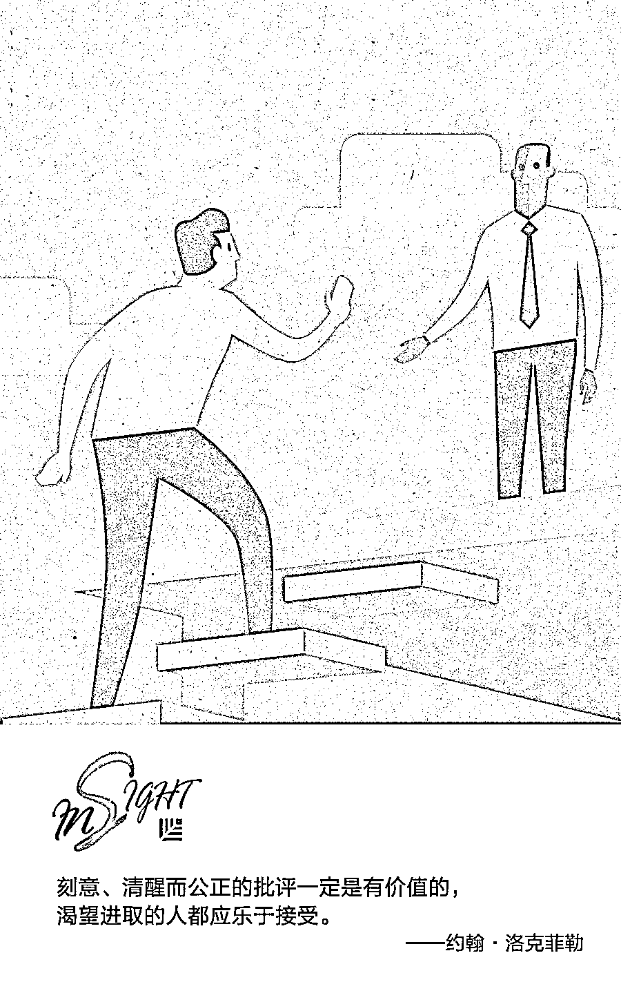
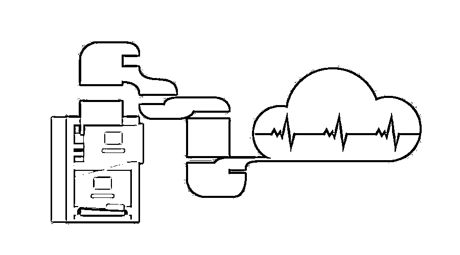
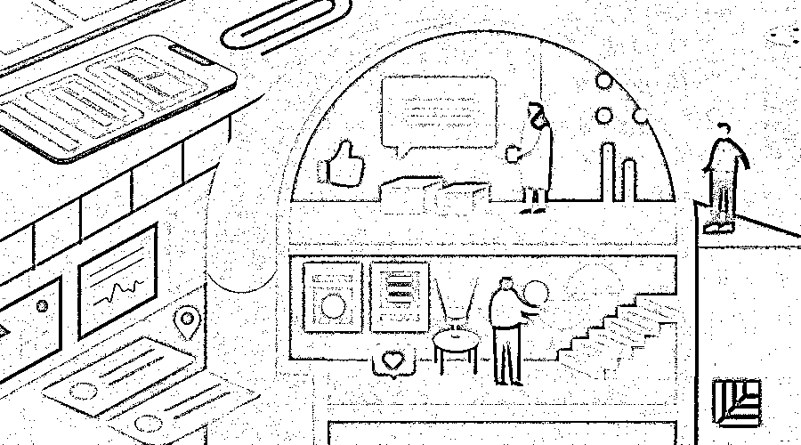

# 殿堂级商业领袖留下的 6 条最佳商业建议｜红杉汇内参

> 原文：[`mp.weixin.qq.com/s?__biz=MzAwODE5NDg3NQ==&mid=2651225455&idx=1&sn=8e5f288e8aff4d59e46122914148ba3f&chksm=8080433bb7f7ca2d1d5c5c691b76d964850254c6a6bfdedc48bbf36cf5df14a8dbf66400abda&scene=21#wechat_redirect`](http://mp.weixin.qq.com/s?__biz=MzAwODE5NDg3NQ==&mid=2651225455&idx=1&sn=8e5f288e8aff4d59e46122914148ba3f&chksm=8080433bb7f7ca2d1d5c5c691b76d964850254c6a6bfdedc48bbf36cf5df14a8dbf66400abda&scene=21#wechat_redirect)

[ 编者按 ] 作为美国开国元勋、伟大的发明家，本杰明·富兰克林的成功毋庸置疑。人们渴望了解他的过人之处，而富兰克林竟认为这要归因于“在表达时留有分寸”：“若事物可能存有争辩，我绝不会用‘一定’‘毫无疑问’这种传达肯定态度的词语。我认为这种习惯赢得了很多优势。”

同样，钢铁大亨卡内基留给后人的管理圣经也异常简单——任何一位成功的管理人员都应注意与雇员和顾客保持接触。

或许正是简单，才能做到经久不衰。无论是想寻求建议的首席执行官，还是寻求创新、灵感的首次创业者，都可以从那些殿堂级传奇人物那里获得最佳的商业建议。

每期监测和精编中文视野之外的全球高价值情报，为你提供先人一步洞察机会的新鲜资讯，为你提供升级思维方式的深度内容，是为 **[ 红杉汇内参 ]**。

** 内参**

那些杰出商业领袖留给我们的

**6 条基业长青建议**

作者 / Hayden Field

编译 / 洪杉

企业家可从某些时代佼佼者——那些最为富有、最为成功的人身上获得启发。

2015 年，音乐剧《汉密尔顿》赞扬了亚历山大·汉密尔顿：他“是个行动派，工作更为勤奋，思维也更为敏捷”。即便已过百年，人们仍然会在剧院、电视和电影中提及这些历史伟人，因为他们的财力、慈善和商业成就都是一段传奇。无论是想寻求建议的首席执行官，还是寻求创新、灵感的首次创业者，都可以从以下六位殿堂级人物那里获得最佳的商业建议。

**  亚历山大·汉密尔顿：**

**为未来做好准备**

**我的抱负与常人并无不同，贫穷令我屈居于记账员这种卑微的职位，我深以为耻，愿意不惜付出生命的代价，换取事业的腾飞，但绝不出卖我的人格……我一定要为未来做好准备。**

**——**亚历山大·汉密尔顿**，1769 年**

**汉密尔顿出生在加勒比海域的一个小岛，家境贫寒。他在 12 岁时写下了这句话，梦想自己能够功成名就。17 岁时，一场飓风令他家破人亡，当时还是记账员的汉密尔顿成了孤儿，他在当地的报纸上写文章，记录了这场灾难。**

**当地商人看到了他的才华，便筹钱送他去北美接受教育。后来，汉密尔顿成为了美国开国元勋之一，美国经济系统的守卫者，但这一切都始于他的鸿鹄远志和常人难以企及的决心。在汉密尔顿心中，他是在 “为未来做好准备”，这种钢铁般坚定不变的决心在任何一场冒险中都是无价之宝。**

****  本杰明·富兰克林：****

****谨言是聪慧的标识****

****（我）向来习惯于在表达时留有分寸，避免自负，若事物可能存有争辩，我绝不会用‘一定’‘毫无疑问’这种传达肯定态度的词语；而是会说，‘我想’或者‘我可以理解这件事是这种情况’，‘在我看来’或者‘出于这些原因，我认为是这样的’；‘如果我没说错的话，应该是这样的’。我认为这种习惯赢得了很多优势。****

****——**本杰明·富兰克林**，1789 年****

****富兰克林也是美国开国元勋之一、《财富之路》的作者，还是一位受人尊重的发明家。他认为自己的成功是因为自己对书籍如饥似渴，他渴求知识，甚至经常捧着新书读到深夜。他还热爱辩论，所以，除非有十足的把握，否则他绝不会用绝对肯定的词语——他喜欢“似乎”“我认为”“我想”“如果我说的没错”这类表述。****

****富兰克林说，这样的表达方式十分重要；因为你言辞肯定但又说错时，其他人可能不会纠正你的错误——你就无法学到东西。刻意使用某种表达对那些商业名人至关重要，尤其是在开会、发表声明和采访时。****

****人们普遍认为，谨言是聪慧的标识，毕竟世上鲜有百分百肯定的事。****

******  安德鲁·卡内基：******

******与雇员和顾客保持接触******

******工厂和矿井中有上千名操作人员，但雇员对他们要么知之甚少，要么一无所知；对他们而言，雇主也同样是个谜。互不了解常常会造成互不信任。各个阶层之间毫无怜悯，互相贬低。雇员与雇主之间，资本和劳动力之间，贫富之间常常存有不合。******

******——**安德鲁·卡内基**，1889 年******

******在《财富的福音》中，卡内基解释了自己为何将多半收入（1889 年，约有 3.5 亿美元）捐给大学、图书馆和其他机构。这篇文章中，这位钢铁大亨兼慈善家阐述了资本主义的黑暗面。尽管卡内基在后文说自己相信竞争利大于弊，但他承认竞争造成了雇主和雇员，即富人阶级和工人阶级之间的鸿沟。******

******任何一位成功的管理人员都应注意这一点，并利用自己的影响力改变这一看法，与雇员和顾客保持接触。******

********  约翰·洛克菲勒：********

******“审慎地”听取他人的意见******

******刻意、清醒而公正的批评一定是有价值的，渴望进取的人都应乐于接受。我受过许多批评，但是我可以肯定地说，我从未因此而对谁怀恨在心。我也不想批判别人直截提出的经过深思熟虑的观点，尽管它们与我的意见相左。不管那些悲观人士如何叫喊，我们知道世界正稳步而快速地向好的方向发展。当我们受到屈辱或感到压抑的时候，我们要牢记这一点。******

******——**约翰·洛克菲勒**，1909 年******

******洛克菲勒是石油巨亨、知名企业家及慈善家。1918 年，他的身价是 12 亿美元，这相当于 2017 年的 210 亿美元。他一手创立赫赫有名的标准石油公司，不曾担忧否定他的人的看法。他会考虑那些经过考量的建议并借助它们来让自己更靠近目标，但他努力不让“否定意见”干扰他的时间或精力。企业领导者最好是听取每一条建议但避免受到它们的影响而偏离最终目标，换句话说，要“审慎地”听取他人的意见。******

********  C·J·沃克夫人：********

********把握住就在脚下的机会********

******我是一个来自南方棉花田的女人。后来我晋升成了洗衣工，接着又晋升到厨房工作，再后来我努力让自己进入护发品生产行业，做了各种准备，靠自己的努力成立了自己的工厂。******

******——C·J·沃克夫人，1912 年******

******沃克夫人被很多人视作是美国第一位依靠自身努力而成功的女性百万富翁。沃克夫人的财富来自于她开发的针对黑人女性的护发产品，该系列产品结合了洗剂和铁梳的使用，被称作是“沃克法”。她的推销天赋使得她赢得了消费者和成千上万推销员的忠诚。******

******沃克的父母是刚获得解放的黑奴，虽然她生下来便获得了自由，但也要比其他同胞付出更多努力来建立自己的公司。她的启动资金仅有 1.5 美元现金。******

******“我们黑人女孩和妇女一定不要不敢为开创自己的事业而努力，通过耐心、勤奋、勤俭、决心、努力和近距离投身商业，把握住就在你脚下的机会书写自己的成功。”******

********  亨利·福特：********

********世界是让人们****生活更美好的地方********

****能源和机器，金钱和货品，只有当这些东西能给我们带来自由，它们才算发挥了用处。例如，我不认为以我名字命名的机器仅仅是机器。我把它们看作是某个商业理论获得实现的具体证据，它不仅仅是一种商业理论，更是一种能让我们生活的世界变得更好的理论。****

****——**亨利·福特**，1922 年****

****福特是商业巨头、大众生产革新者及福特汽车创始人。人们普遍认为，福特 T 型车的推出使得日常消费者也能买得起汽车，该车型在 1908 年到 1927 年之间卖出了 1500 万辆。尽管福特享有可观的财富——1918 年他的身家高达 1 亿美元，相当于今天的 18 亿美元——但他觉得把钱仅仅看作是一种获得自由的手段是至关重要的，而除了该目的，钱财毫无意义。****

****他对企业的看法也差不多，福特认为任何一家企业最终目的都是为了使世界变成“让人们生活更美好的地方”。抱有这种价值观可以帮助企业领导者获得长远的成功。****

****** 读图******

******B2B 价值要素金字塔******

****贝恩公司梳理了过去 30 年的数十项定量和定性研究，分析客户最看重的价值，由此总结出 40 种“价值要素”并归为五类：基本价值、功能价值、便利价值、个性价值、理想价值，以考察 B2B 企业在市场中所遇到的个体购买和使用产品或服务的动机。结果发现，产品质量、专业知识和响应能力与客户忠诚度关联最大，而削减成本甚至没有排进客户价值要素的前十位。****

********

****** 情报******

****#因为普遍应用，所以不再流行#****

******小心，到 2025 年“云”就过时了！******

********

****Citrix 调查了部分拥有 250 名及以上员工的英国公司，以及至少 750 名英国 IT 决策者，得出以下结论：****

****▨ 云正被广泛应用。目前英国 38％的大型企业将一半以上的数据存储在云中，87％的人认为采用云基础设施的主要优点是能提高生产力。****

****▨ 云是未来工作方式。使用公共云和混合云的人越来越多，88％的人认为私有云可以安全处理数据。****

****▨ 云概念将“过时”。56％的人认为云技术将与企业密不可分，所以它不再会被单独提及，26％的人认为 2025 年之后他们不再会讨论“云”。****

****#取悦客户，但不要取悦每一位客户#****

******什么才是真正的客户开发？******

********

****▨ 走出办公楼。这是非常重要的第一步，倾听潜在客户的意见会更有帮助。****

****▨ 了解哪些客户对你的企业存在意义。弄明白哪个客户细分市场符合你的需求——无论是长期还是短期。****

****▨ 无原则地赠送产品，经常是抛弃商业策略的表现。让用户试用你的产品是种很棒的感觉，但记住，要选择可以推动你的商业模式的客户细分市场和定价策略。****

****▨ 放弃一些客户。完全没问题，因为你的工作目的并非取悦每一位潜在客户。** ******

****** 推荐阅读******

****壹****

****[红杉发布 00 后泛娱乐消费报告：不懂 00 后的创业者们要小心了！](http://mp.weixin.qq.com/s?__biz=MzAwODE5NDg3NQ==&mid=2651225402&idx=1&sn=aedf0fd1209a4471e6bfbeae264a6cdf&chksm=8080436eb7f7ca78480bc7d780f4a50d56c540d78af4ff24e3eb44968fe1cc62ee1cc4975111&scene=21#wechat_redirect)****

****贰****

****[先营销，再创业：淹没初创公司的 8 个营销教训 | 红杉汇内参](http://mp.weixin.qq.com/s?__biz=MzAwODE5NDg3NQ==&mid=2651225396&idx=1&sn=8a887bd4009c13bbad38e43cdd71af40&chksm=80804360b7f7ca76fb3faed641e9524a977108337df83184345d4a697f81f4faeb7f6df99882&scene=21#wechat_redirect)****

****叁****

****为什么创始人要坚持与员工当面交流？｜红杉汇内参****

****肆****

****[优秀领导者都要克服的五大偏见 | 红杉汇内参](http://mp.weixin.qq.com/s?__biz=MzAwODE5NDg3NQ==&mid=2651225311&idx=1&sn=97edb88c689d72d3145a13b710742a00&chksm=8080428bb7f7cb9d73de17482d04d4f56139140cb1035fe29cce41d49e24fc873e6e49ecfdc2&scene=21#wechat_redirect)****

****伍****

****[为什么极致高效、灵活的沟通是个坑?｜红杉汇内参](http://mp.weixin.qq.com/s?__biz=MzAwODE5NDg3NQ==&mid=2651225273&idx=1&sn=72d63710df276f1ed24d60c244106c54&chksm=808042edb7f7cbfbf5cb7c86128a2f973932b4b5a745149fe751575f01898b72b8b8b8e8d518&scene=21#wechat_redirect)****

********