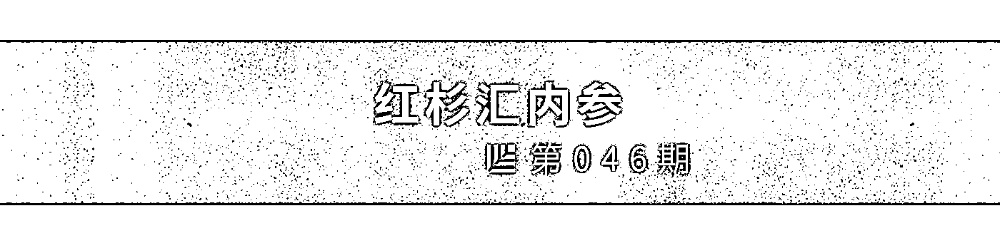
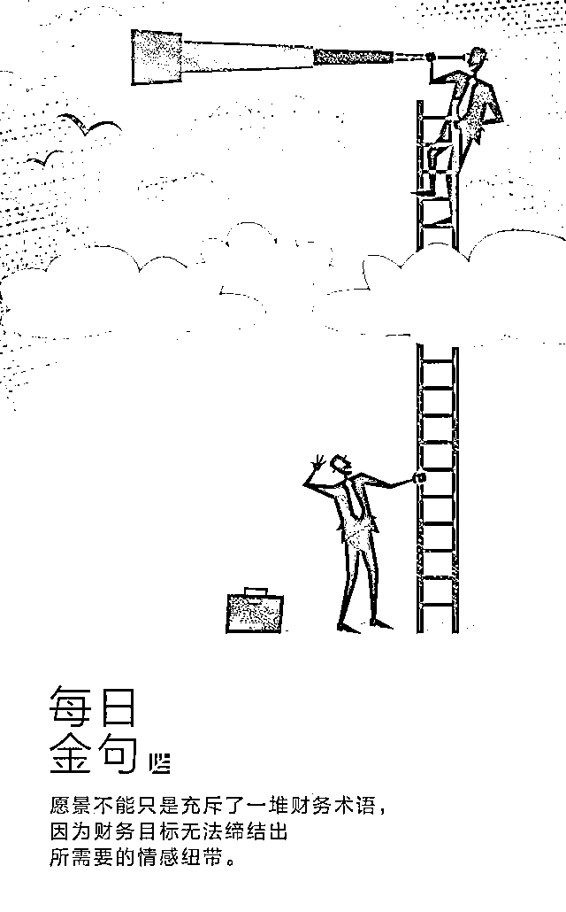
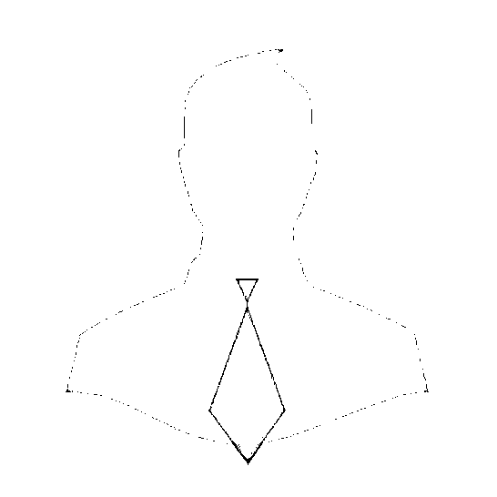
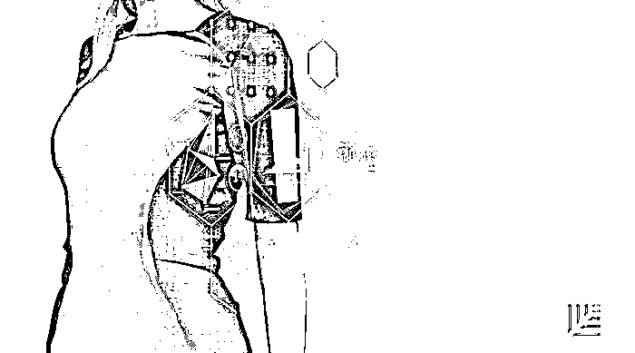
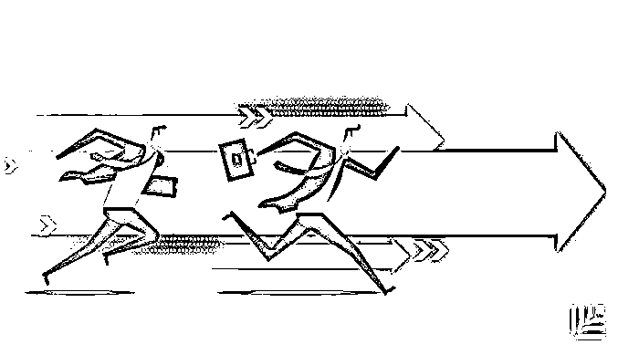

# 愿景愿景愿景愿景愿景愿景愿景……你真的明白什么是愿景吗？｜红杉汇内参

> 原文：[`mp.weixin.qq.com/s?__biz=MzAwODE5NDg3NQ==&mid=2651223594&idx=1&sn=e2bf1b19d603c431ea1fb9a989bc5aa9&chksm=8080487eb7f7c168ad2f7053f72503180d53868201441481c2bbf1b9d798856254d8990bfc6c&scene=21#wechat_redirect`](http://mp.weixin.qq.com/s?__biz=MzAwODE5NDg3NQ==&mid=2651223594&idx=1&sn=e2bf1b19d603c431ea1fb9a989bc5aa9&chksm=8080487eb7f7c168ad2f7053f72503180d53868201441481c2bbf1b9d798856254d8990bfc6c&scene=21#wechat_redirect)

[ 编者按 ] 很诧异：许多 CEO 都不知道如何建立一个能够在企业内部引起广泛共鸣的愿景。

或许应该从回答这个问题开始：变革之后，人们看到的、听到的、感受到的将会是怎样一番景象？

许多 CEO 也常常把“使命”与“愿景”搞混，或者只是列举公司运营中需要改善的地方（常见的有“创新”、“客户导向”和“团队合作”），或者充斥一堆财务术语和数字。

愿景，是应许之地，是“出埃及记”里被描述为“流着奶和蜜”的迦南之地，要生动、具体和鼓舞人心地向员工描述未来将实现的图景，激励人们去改变、去战斗。

特别地，莫把愿景当作一纸公文，以为传递愿景这一任务只要交给市场部门或者 PR 来完成就好了，那么最终结果只会是一份索然无味的声明。这是创始人的职责，必须以自己的独特方式去诠释它。

每期监测和精编中文视野之外的全球高价值情报，为你提供先人一步洞察机会的新鲜资讯，为你提供升级思维方式的深度内容，是为 **[ 红杉汇内参 ]**。

** 内参**

**愿    景**

CEO 们的认识误区及改正方法

作者 / Dan Ciampa

编译 / 洪杉

不少管理者并不懂得如何描绘一个让人无法拒绝的、让大多数人愿意为之付出的愿景，以促成改变。作为领导者，应该先问问自己：变革之后，人们看到的、听到的、感受到的将会是怎样一番景象？

正如每一位伟大的运动员在跳投或挥杆前，都已经在脑海中演练了一套完美的动作，对于怎么样才叫做成功，公司的核心成员也应该在脑海中形成一致的认识。这就是我们所说的——

愿景。

**“这叫使命，不叫愿景”**

一家公司经常会谈论它的“使命、愿景和价值观”，但问题是，大多数时候，他们用错了这个词。当 CEO 说他们已经给公司愿景找好了定义的时候，我就会让他们给我解释一下。很多人给了我类似这样的回答：

“

我们的愿景是要成为业内最创新的、最灵活的公司。

”

我回答他们：

“

**这叫使命，不叫愿景。**

”

这类所谓的“愿景”仅仅是在重复公司战略已包含的内容，并不能从情感上吸引那些负责实现这个愿景的人。领导者的愿景首先应该是一幅生动的、可信的图像，描绘出未来的理想状态。

为了实现具有挑战性的新目标，人们应要采取一些不同以往的行为，而 CEO 对要采取哪些行为的认识越清晰，成功变革的可能性就越大。新行为来源于对“换一种方式做事”的深层次情感承诺，而不是源自公司使命——即使它们相当鼓舞人心。

▨ 一种方法是依靠逻辑以理服人。说明为何变革是必须的，描述要采取的步骤顺序，展示其他公司是怎样做的并取得了怎样的成功。

▨ 第二种方式是描绘一幅“火烧眉毛”的图景，强调不变革会带来的危险。要传递这样的信息：如果火势蔓延，许多人就会失业。

尽管两种方法都可以起到一些作用，但却不足以改变行为和态度。逻辑论证是填补知识漏洞的教育方式，但若想建立新的行为模式，除了知识，还需要拥抱新事物的热情和持之以恒的决心。**一想到事态已到燃眉的地步，人们确实会改变自己的行为，但也仅是在威胁仍然存在的情况下。一旦火灭了，大多数人就会恢复让他们舒服的习惯。**

为了成功，领导者不能止步于此。还要列出公司内最具影响力的管理人员名单，让这些人撸起袖子加油干，让他们自己及受其影响的人都采取新的行为方式。

最行之有效的动员核心管理层的方法，是给他们传递一幅清晰的关于未来的愿景——**生动、具体、鼓舞人心，任何不符合这一标准的都不叫做愿景。**核心管理层需要对新策略获得成功所需要的新行为、新制度、新流程达成共识，换句话说，对组织达到最佳状态时该如何运转达成共识。

怎么做？下列五个原则或许能有所帮助。

**找到属于你自己的独特方式**

真正的愿景是促成改变的强有力资产，而建立这样的愿景并没有简单而通用的方法可沿用，必须根据企业风格度身打造，要以 CEO 自己的话进行阐述，并且能够反映 CEO 的性格特质。

正因为如此，**如果传递愿景这一任务交给市场部门或者 PR 来完成，那么最终结果只会是一份索然无味的声明**，CEO 也会因此失去信服力。

**经常以生动的方式唤起情感共鸣**

这一点重要性不亚于其他。比起现状，如果那个更令人满意的未来能够感染和打动员工，就能满足他们对于成就感、归属感和自我价值实现的需求。

**最佳的愿景会足够生动和形象，让人们明白未来公司会怎么运营，目前困扰着他们的问题又将怎样解决。**随着愿景以不同的形式被一遍遍强调，大家的脑海里会逐渐浮现出一幅图景，结果就是，他们以个性化的方式对愿景进行了剪裁加工，而在不断实验新行为的过程中，也会更加认同这一愿景。

愿景不能仅仅是靠逻辑说服，不能只是充斥了一堆财务术语，因为财务目标无法缔结出所需要的情感纽带。

**描述可以想象的改变**

没有人会乐意放弃已经习惯的行为方式，通常来讲，如果能在一种程度上参与决定新做法的具体细节的话，人们会逐渐承认行为改变的必要性。而 CEO 的愿景恰好能通过平衡未来和现状来实现这一点。诚然，愿景必须忠实地将一个不一样的现实传递给公司的每一个人，但**愿景的描述不应该与员工目前对公司的理解完全南辕北辙，否则，他们没办法想象出愿景实现后的公司到底会是什么模样。**

**描述有价值的行为，而非价值观**

CEO 必须对此要做好区分。

大多数公司在讲述使命的时候会一同阐述他们所谓的“价值观”。一般而言会出现三个问题：

▨ 他们所列出来的与其说是价值观，不如说是公司运营中需要改善的地方（常见的有“创新”、“客户导向”和“团队合作”）。

▨ 正直诚实、尊重采纳他人意见等等，这些价值观诚然是我们需要遵循的重要原则，但这些都不能告诉人们，该在什么地方做出改变以达成具有挑战性的新目标。

▨ 一个文化的价值观是持久恒远的，并不会仅仅因为战略或运营优先项发生了变动，或者 CEO 想改变就改变。价值观的改变需要点滴积累、循序渐进。随着时间的流逝，新做法又会慢慢重塑核心态度——这一过程会历经数年时间。

比起一味关注价值观，CEO 在建立愿景的时候，应当描述在理想的文化中富有价值的行为做法是什么；也可以指出当下哪些做法是成功的，是符合新战略和愿景要求的。

**既坚定不移，也要发挥民主**

必须明白哪些方面是不容改变的，哪些是有商量余地的，还有哪些是希望大家献计献策的。

最佳愿景，是在有条不紊、来回反复的过程中诞生的，一方面，CEO 可以把握图景构建的方式；另一方面，其他人也能感受到一些主人翁意识。**最终的结果，与其说是遵循着 CEO 设定的愿景，毋宁说经理们都被他们参与塑造的共同愿景所吸引。**

** 情报**

#记住：投资第一，花钱最后#

**创业初期八个必要的理财习惯**

  

就算你的初创公司运转得再好，你也不能把它当成存钱罐。所以，要从一开始就形成良好的财务管理文化。

▨ **不要在自己身上花太多钱。**

▨ **不要混淆收入与利润。**有资金流入并不代表你就可以挥霍。

▨ **招聘时要注重员工的价值。**

▨ **假以时日再将管理工作交给别人。**最初你甚至得自己承担人力资源管理和会计的工作。

▨ **尽可能让任务自动化。**因为时间就是金钱！

▨ **选择功能强大的会计软件。**

▨ **时刻关注现金流。**

▨ **确保预算用于购买你所需要的资源上。**

#硬科幻来一波#

**那些吸睛的未来技术**

▨ 眼控技术：只靠眼球运动就可控制各类设备和其它机器。

▨ 纸基诊断：由专业纸张制作的诊断工具将加快寨卡、埃博拉和猪流感等疾病的筛选过程。

▨ 可摄入机器人：具有生物相容性的近显微机器人，摄入身体后，将能够修复肌体损伤。

▨ 智能服装：能改变颜色、大小甚至调节温度以适应气候条件。

▨ 定制抗生素：针对特定细菌或病毒菌株。

▨ 金刚石电池：我们当前的能源供应问题终将得到解决。

▨ 碳呼吸电池：还能有效防治污染。

▨ 仿生材料：能够自我修复的衣服和建筑物。

▨ 高级算法：在医学、工程学、空间探索、经济学、天文学和地球起源研究等领域取得极大进展。

▨ 设计分子：由超级原子组成的人工合成分子将产生新的先进材料。

▨ 快速基因筛查：解决更多关于人类遗传史的细节问题。

▨ 核聚变能：目前 75%以上电网的将转而通过核聚变提供电能。

#反正苹果、亚马逊这么干都对了#

**做新技术的尝鲜者，对初创企业来说是好还是坏？**

▨ **早期尝鲜者**只占总人口的 13.5%，他们对于产品或服务打入大众市场至关重要。与其他人相比，他们其实是更为理性的消费者，视自己为“信息采集者”而非简单的工具爱好者。

▨ 从经济方面来说，初创公司抢先采用新技术的风险较高，因为它们可能会造成更多损失，而且回报有时也不会像期望得那么高。

▨ **要做好准备：**在后续版本中频繁解决错误和故障，解决兼容性问题和有缺陷部件，还要面临指引客户进入未知领域的营销挑战。

▨ 抢先采用新技术会带来高风险，但也可能在该领域建立起一个领导者优势。

▨ 避免成为领导者可能是一个安全的选择，但最终也可能会造成损失：所谓的“落后罚金”预计从 2015 年至 2018 年将增长到 6.92 亿美元。************

** 推荐阅读**

壹

[红杉资本刘星再谈新零售：新品牌从哪里来？](http://mp.weixin.qq.com/s?__biz=MzAwODE5NDg3NQ==&mid=2651223586&idx=1&sn=af4ef561e1df041bc2246592050924fa&chksm=80804876b7f7c160a5bd3294c1cee94d9a70a9083e543f32f7c01bb0a8cd601d700471de5bdf&scene=21#wechat_redirect)

贰

[选择和努力是人生的永恒主题](http://mp.weixin.qq.com/s?__biz=MzAwODE5NDg3NQ==&mid=2651223587&idx=1&sn=4dabbb31bbb62c37a79c88b339adeeb0&chksm=80804877b7f7c16101f58e82d15aa52a1957831a432a682b96204fe1a51d0be7cf05176783d9&scene=21#wechat_redirect)

叁

[计越详解红杉中国 AI 布局：已投资近 30 家，核心标准只有两个](http://mp.weixin.qq.com/s?__biz=MzAwODE5NDg3NQ==&mid=2651223559&idx=1&sn=d95c7ceb99e75a7903b20ded39a7b4c4&chksm=80804853b7f7c1454a7e4ecf9365d1831890fffa6096c30d093e827baf28e2e06723a30cbb59&scene=21#wechat_redirect)

肆

[“Today”叫醒你的是梦想还是闹钟？](http://mp.weixin.qq.com/s?__biz=MzAwODE5NDg3NQ==&mid=2651223568&idx=1&sn=dcfa370075a0acd2c64323825331021c&chksm=80804844b7f7c152528259ddedbf37a03d6e58122f666a6a60b950a01db42a231121e5afc760&scene=21#wechat_redirect)

伍

[复杂性商业环境里，你应当学会“管理”，而不是“解决”](http://mp.weixin.qq.com/s?__biz=MzAwODE5NDg3NQ==&mid=2651223572&idx=1&sn=a7f919df1f6f26681435076288631415&chksm=80804840b7f7c15630e239c84cfc16329f4f6223296b6296d80a403934a502a9836723153046&scene=21#wechat_redirect)

