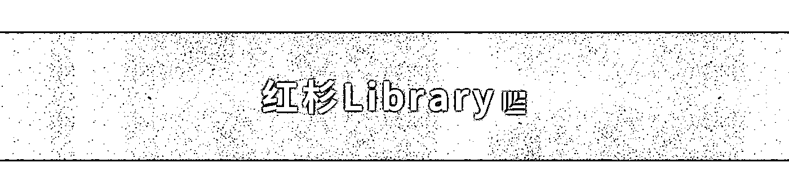
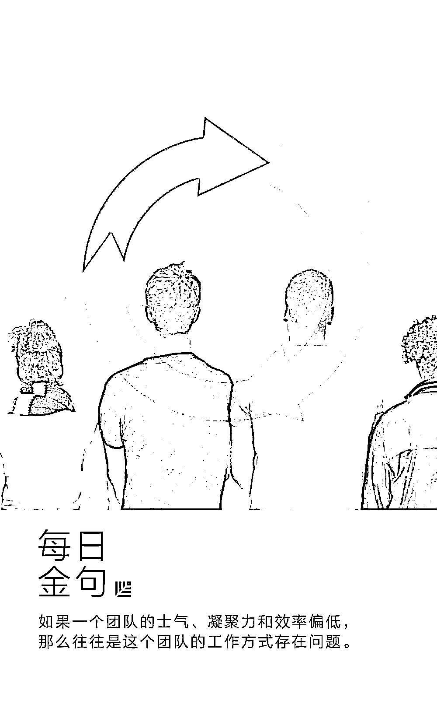
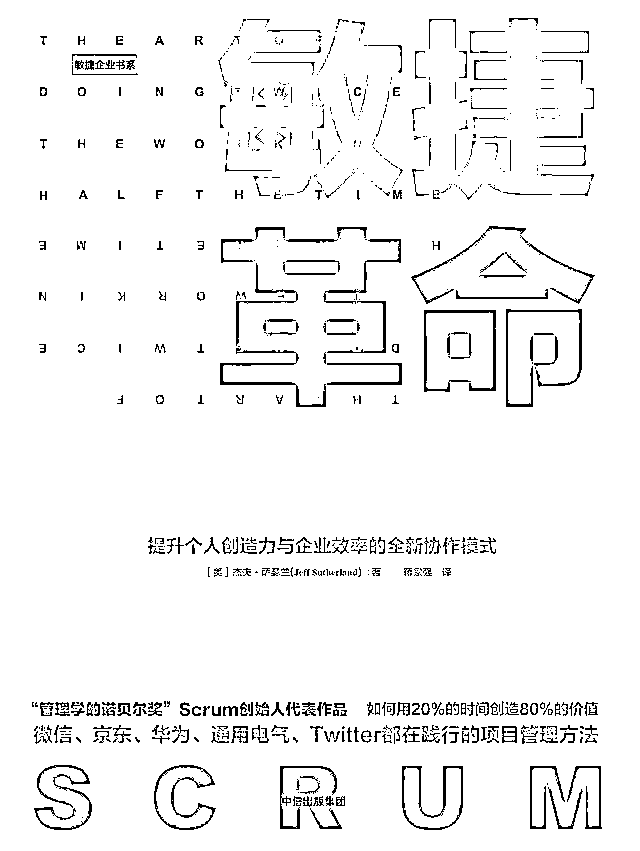
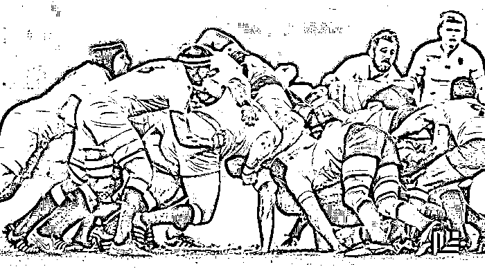

# 通用、Twitter……连美国 FBI 都在使用的管理方法 | 新书推荐

> 原文：[`mp.weixin.qq.com/s?__biz=MzAwODE5NDg3NQ==&mid=2651223367&idx=1&sn=84372101747d2997acb50e0f35e8989a&chksm=80804b13b7f7c205e3bc0b554dd00ee462834f5d3f05b770e4daa32526d4fa930466f49928fc&scene=21#wechat_redirect`](http://mp.weixin.qq.com/s?__biz=MzAwODE5NDg3NQ==&mid=2651223367&idx=1&sn=84372101747d2997acb50e0f35e8989a&chksm=80804b13b7f7c205e3bc0b554dd00ee462834f5d3f05b770e4daa32526d4fa930466f49928fc&scene=21#wechat_redirect)

什么样的管理方法，能够让 HBO 的热剧《硅谷》将它搬上荧幕，让通用电气利用它加速实现“数字行业公司”的转型，让 Twitter 利用它来开发各项新功能，连美国联邦调查局都利用它来开发虚拟案件档案系统……

它就是被誉为“管理学的诺贝尔奖”的敏捷管理（Scrum）。微信、京东、华为同样也采用了这种管理方法。

“ Scrum 之父”萨瑟兰博士先后担任了 11 家软件公司的首席执行官和首席技术官，积累了丰富的项目管理经验。他在新书《敏捷革命：提升个人创造力和企业效率的全新协作模式》（*Scrum：The Art of Doing Twice the Work in Half the Time*） 中用揭示了敏捷管理方法的奥秘，并用诸多案例讲解了如何用 20% 的时间创造 80% 的价值，帮助团队提高工作效率。

本文节选自萨瑟兰博士新书中的内容。

**PS：文末有惊喜！**

** **

**敏捷革命**

Scrum

杰夫・萨瑟兰（Jeff Sutherland） **/ 著**

蒋宗强 **/ 译**

中信出版集团 2017.04

**聚焦团队，而非个人**

在耶鲁大学，斯坦利・艾森斯塔特教授教的一门编号是 CS 323 的计算机编程课是出了名的难学。学生抱怨做一次作业要花很久，于是他跟踪了解每个学生完成作业所需的时间，他想知道学生的成绩和完成作业所需的时间是否有关系。

有趣的是，对比结果显示，两者并无关系。有些人完成的速度很快，得了 A，而有些人速度很慢，也得了 A。在成绩一样的前提下，最快的学生和其他同学的速度比为 10∶1。10 倍的差异很惊人，不是吗？如果你是一位经理，你会希望雇用那些能得 A，且花费时间最短的员工。

但如果从团队而不是个人的角度来看，会有其他有趣的发现。

在一项涉及 3800 个不同项目的研究里，当分析师没有关注个人表现的数据，而只关注团队表现的数据时，就有了惊人的发现。最好的团队可以在 1 周内完成任务，你猜最差的团队需要多长时间？

你可能会猜和耶鲁学生课上的表现一样，10∶1。这意味着，同一项工作，最差的团队需要 2 个多月来完成，最快的团队只要 1 周就能搞定。

但真正的答案却是，团队之间的差别比个人之间的差别大得多。最慢的团队不是花费 10 周，而是花了 2000 周。

这就是最差团队和最好团队的差别。

所以，你的关注点应该在哪里呢？从个人的角度看，如果你能把所有的员工变成天才，效率可能提升 10 倍；而要是从团队的角度看，即便你能让最差的团队达到中等水准，效率也会有惊人的提升。

**优秀团队的特质**

怎么努力让整个团队都变出色？优秀团队的特质是什么？美国“ Scrum 之父”杰夫・萨瑟兰博士在《敏捷革命》中描述了一个卓越团队应该具备的特质：

▨ **超越寻常**

他们的目标是超越寻常，下定决心拒绝平庸。这种决定改变了他们看待自己的方式，扩大了自己的能力范围，因此，他们能够出类拔萃。

▨ **自主性**

这种团队能够自我组织、自我管理，有能力决定如何开展工作，并获得了可以根据自己的决定做事的授权。

▨ **多功能**

这些团队具备完成项目所需的全部技能：计划、设计、生产、销售、分销。具有这些技能的成员们还会相互学习，相互提高。

**你需要一个多功能团队**

那么如何建立一个具有远大的目标、擅长自我组织的学习型团队呢？

**一个优秀的团队必须掌握所有必要的技能，能够独立完成所有的工作。**在一个按照传统方式组建起来的团队中，你可能会安排专门的人负责规划，然后还有专门的人负责建造、测试、生产和运输。只有每一个团队做完自己那个环节的分内之事以后，项目才能进入下一个环节，没有任何一个团队能独立做出一件完整的产品。

事实上，那些最优秀的团队，比如谷歌或亚马逊内部的团队，他们不会区分团队成员的角色，相反，每个团队成员都具备完成工作所需的各种技能。公司要求**团队成员必须掌握一整套的技能，既要无私，又要具有自主性，每个成员都是多才多艺的，一个团队就能把所有的工作做完。**

多功能团队最明显的例子存在于军事领域中，例如，美国特种部队。这支部队一般以“ A 类特遣分队”独自作战，每支特遣分队都拥有完成一项任务所需的全部技能，其成员都要全面接受其他专业的交叉训练。比如，他们会确保当两名负责医务的成员都牺牲时，负责通信事务的士兵也能帮助操作武器的那位士兵缝合伤口。

**最佳团队规模，仅需 7 人左右**

虽然组建多功能团队非常重要，但你不能像诺亚建成方舟之后那样把任何部门的人都挑选两个塞到团队里，**团队只有在维持小规模时，才会焕发出活力。**

虽然小到只有 3 个人的团队能够实现高水平的运作，但一个团队一般是由 7 个人组成的，可以多两个人，也可以少两个人。有数据显示，如果你的团队规模超过 9 人，那么运作速度其实会放缓。

为什么会这样呢？因为，我们的大脑一次记住的内容是存在上限的。

第一，要培养一个新成员，使其跟上其他成员的速度，需要耗费一定的时间。你也可以想象得到，带领一个新成员步入正轨会拖累其他成员的速度；

第二，团队成员增加之后，沟通渠道就会大幅增加，我们的大脑可能根本无法应付这么多的沟通渠道。

如果你想算一算团队规模的影响，也就是团队人数对于沟通渠道的影响，那么只要把团队人数乘以“团队人数减 1 ”，然后再除以 2 就行了。用 n 表示团队人数，那么**沟通渠道数量= n ( n-1 ) / 2** 。比如，你的团队有 5 个人，那么你们的沟通渠道就有 10 条；如果有 7 个人，沟通渠道就有 21 条；如果有 9 个人，沟通渠道就有 36 条……沟通渠道如此之多，超过了人类大脑的承受能力，我们根本无法得知别人正在做什么，而当我们试图寻找答案时，工作进度就会放缓。

因此，你必须要让你的团队保持小而精。

**找出“坏制度”，而非“坏人”**

**如果一个团队的士气、凝聚力和效率偏低，那么往往是这个团队的工作方式存在问题。**

我们每个人都是制度的产物，敏捷管理方法会承认和接受这个现实，进而审视导致失败的制度，最后着力改良制度，而不是非要找出一个人来承担责任。

就企业而言，这种指责个人而不指责制度的错误会怎么表现出来呢？有一个不错的例子是通用汽车公司与丰田汽车公司在加利福尼亚州联合投资的新联合汽车制造公司。这个工厂早在 1982 年就被通用汽车关闭了，因为当时通用汽车的管理层认为这个工厂的工人堪称整个美国最糟糕的工人，他们上班时喝酒，或者压根儿不去上班。

1984 年，丰田重开这家工厂。通用汽车的人告诉丰田的管理层这个工厂的工人很糟糕，但管理人员很优秀，丰田应该重新聘用这些管理人员。恰恰相反，丰田婉拒了这个建议，没有重新聘用原来的管理人员，反而重新聘用了原来的大部分工人，甚至还送一些工人去日本进修，让他们学习丰田生产系统。

结果新工厂的精密度和瑕疵率很快就达到了日本工厂的水平，工人还是那群工人，不同的是制度。****

**** 新书送送送 ****

**只要在文末给我们留言** 

**且留言获得点 👍🏻 最多的前 **10 **位粉丝**

**每人将直接获得本文推荐的《敏捷革命》一本**

**统计截止至本周日 2017 年 7 月 9 日噢~**

**** 推荐阅读****

**壹**

**[因为只有聪明还不够，还需要经验，还需要敬畏](http://mp.weixin.qq.com/s?__biz=MzAwODE5NDg3NQ==&mid=2651223353&idx=1&sn=860948e9840ad1484dc5a295682c1b1b&chksm=80804b6db7f7c27b04f6621579dfe9ac8a1c133aa941971ff9620f68eb29ae4803fded69fd8b&scene=21#wechat_redirect)**

**贰**

**[“巴菲特的老师”：只招聘没钱、聪明、有野心的人](http://mp.weixin.qq.com/s?__biz=MzAwODE5NDg3NQ==&mid=2651223358&idx=1&sn=129f808b61d20f47bb97312feccc848e&chksm=80804b6ab7f7c27c03a8b0263918602c65b5547c6075a28fdc0fcf83ff71a119e9688931aa0d&scene=21#wechat_redirect)**

**叁**

**[怎样打造一支地表最强战斗力的铁军](http://mp.weixin.qq.com/s?__biz=MzAwODE5NDg3NQ==&mid=2651223361&idx=1&sn=7eddea3a2438979c72b9030395b84d4e&chksm=80804b15b7f7c203c7d4735420c54084afa12d50f56bbfae33dbc9b9445bad7c5c269284dbaf&scene=21#wechat_redirect)**

**肆**

**[德邦崔维星：用速度跑赢时间，是我们唯一的生机](http://mp.weixin.qq.com/s?__biz=MzAwODE5NDg3NQ==&mid=2651223364&idx=1&sn=0c32937f0647195ee3294cd7c62254e3&chksm=80804b10b7f7c206207852365fc02e006ea605d6e86830bafb4a4245bc9634b6cdafa2e81ae2&scene=21#wechat_redirect)**

**伍**

**[管理好情绪，就管理好自己一半的人生了](http://mp.weixin.qq.com/s?__biz=MzAwODE5NDg3NQ==&mid=2651223348&idx=1&sn=5178877ce80cf73b90b46e305861b8bd&chksm=80804b60b7f7c2768802e951d7b259e0767be9653deb288d0253fb0843b90244bfa02fc84c9f&scene=21#wechat_redirect)**

****