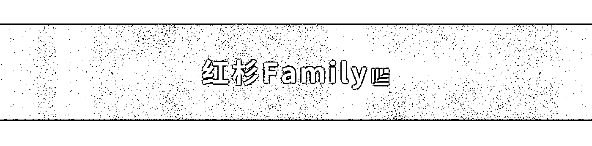
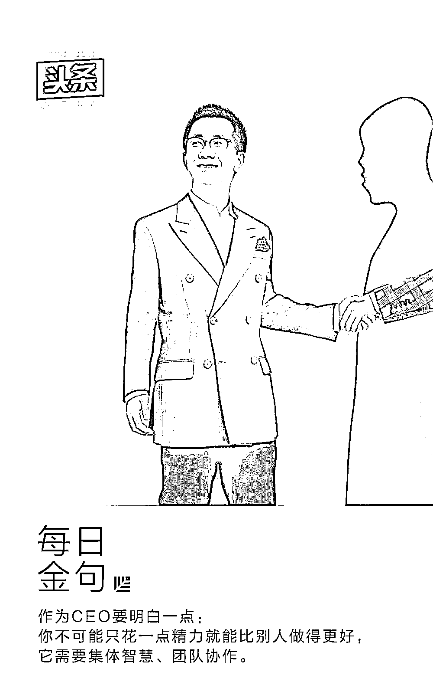

# 张一鸣用人心得：管理不能做“老好人”

> 原文：[`mp.weixin.qq.com/s?__biz=MzAwODE5NDg3NQ==&mid=2651223517&idx=1&sn=3102d3cfdd876f5cd4de79df6efd24fe&chksm=80804b89b7f7c29f12ee316b29834f0526c0792f4cfed62ec8a5215a7fc2ad597205ace11922&scene=21#wechat_redirect`](http://mp.weixin.qq.com/s?__biz=MzAwODE5NDg3NQ==&mid=2651223517&idx=1&sn=3102d3cfdd876f5cd4de79df6efd24fe&chksm=80804b89b7f7c29f12ee316b29834f0526c0792f4cfed62ec8a5215a7fc2ad597205ace11922&scene=21#wechat_redirect)

创业者提问创业者的问题总是尖锐的。因为每个人都想为自己正日夜头疼的问题，从他人的回答中寻找到解决方案。

在最近的一次交流活动中，面对红杉 Family 部分成员企业的创始人、CEO 们，张一鸣首先幽默地讲述了他的创业经历，在创立今日头条前，他已经“体验”过公司内部的各种角色：大公司员工、创业公司核心员工、公司合伙人、公司骨干、公司 CEO……在他看来，正是这些经历让他对“创业”有了一次整体性认识，也为日后的公司管理积累了许多思考，而这直接影响到今日头条的创立与发展。

“我们在早期动作很快，公司的管理也相对顺利，基本没有浪费什么时间，”张一鸣说，“在找团队的时候我也更清楚自己需要什么样的人。”

公司的一切问题都是人的问题，而“找人”、“用人”、“管人”等与“人”有关的话题也成为当天交流的关键词。

搭建团队时有哪些小窍门？怎么判断一个人是否是“真牛人”？怎样建立一个高效的组织？怎样在公司成长的过程中，应对队伍庞大之后的管理挑战……在场的红杉 Family 成员企业创始人、CEO 们分享了各自的经验与困惑，同时也没有放过提问张一鸣的机会。张以今日头条为例，介绍了今日头条的“用人心法”。以下是**「红杉汇」**整理的“随堂笔记”。

**#不执著于人才背景才能打破常规#**

**Q：今日头条团队有哪些特点，以及在团队搭建时有怎样的策略？**

**张一鸣**：今日头条的团队很多元，他们来自不同行业和领域，有着各自的“拿手好戏”。而相对于专业和背景，我们更看重人本身的特质。举例来说，我们的 HR 负责人曾经是早期投资领域的从业者，有人会问，为什么他能胜任 HR 的工作？因为 HR 是要考察人性的，而作为一个投资人，他有很强的“看人”、“选人”的能力，看似“专业不对口”，但实际上却十分匹配。

所以我也认为，只有不那么执着于人才的“背景”，公司才有可能打破常规。

**#发动集体智慧#**

**Q：今日头条在人才管理方面有哪些特点？**

**张一鸣**：我们提倡人才的“自驱”，发动集体的智慧。因为企业的价值在于分工和合作，而分工就是让一个人尽可能把自己负责的工作做好。

**#关注人才基本面#**

**Q：选择人才时，如何考察人才自身的管理能力？**

**张一鸣**：我更看重一个人的基本面，即人品、情商、胸怀、热情，而管理能力其实是可以培养的。另外，在面试时我还会着重考察一个人的知识储备和自学能力。我相信只要一个人的基本面是好的，管理能力也不会出什么大问题。

**#学习好公司的案例#**

**Q：你平常会读哪些管理类书籍？**

**张一鸣**：有两类，第一类就是大公司案例，这也是我们公司内部都会关注的课题，那些世界上的好公司有哪些成功之处？我们的团队需要去总结一下；另外一类是经典的管理学书籍，比如韦尔奇、德鲁克等大师的作品，也值得反复品读。

**#不做“好人”#**

**Q：因公司快速发展而导致部分人才掉队的情况应如何处理？**

**张一鸣**：调整。要么对人进行调岗，要么在不得已的情况下只能让他离职。而遇到这种情况我们会“摊开了说”，不要执着于远近亲疏、先来后到，要对事不对人。千万不要做“好人”，拖得越久反而会对人产生更加负面的影响。

**#以外部视角看公司#**

**Q：一鸣，你个人的时间是怎么分配的？有多少精力集中在产品，又有多少精力集中在其他业务上？**

**张一鸣**：其实我现在多数时候都在做一件事——从外部视角看公司。当我们看别的公司时，常常会看到许多问题，而站在内部时却常常看不到自己公司的全貌，因此要“跳出来看自己”。

而对于产品我只看三样东西：

▨ 数据；

▨ 产品体验；

▨ 定期问一下用户的使用反馈。

只要抓住这三点，我觉得就不会出现大的问题。对于具体的产品细节，我觉得作为 CEO 要明白一点：你不可能只花一点精力，就能比别人做的更好，这也需要依靠集体智慧、团队协作。

其实，张一鸣在早前的许多场合都阐述过自己“Context，not Control”管理方法。他认为 Control 与 Context 的区别在于——

Control 相当于把 CEO 当成超级计算机，CEO 做战略设计，提出战略计划，逐层分解之后执行；执行的过程中如果遇到情况，会再往上汇报，CEO 汇总信息，再次定出工作任务。这个过程中有审批、有流程，有很多的管理机制。

而 Context 意味着有更多的人参与决策，让更多的想法自下往上涌现出来，而不是从上到下的战略分解。这个过程中需要更多人基于上下文 Context 做出判断，而不是根据指令来执行。

在他看来，单纯的 Control 除了会带来战略上的问题，还会因为追求控制感而导致企业反应迟钝。只有在以下三种情况出现时 Control 才能发挥积极作用：

▨ 遇到紧急情况或处理重点项目时；

▨ 处于创新业务和新部门成立早期时；

▨ 遇到人才职位不匹配的情况时。

而在一般情况下 Context 会具有明显的优势：

▨ 让更多人参与决策，发挥集体智慧；

▨ 因为不需要层层汇总，所以可以更快速地执行工作；

▨ 让更多的同事直接面向行业，会使得信息更充分，角度更多元；

▨ 提高员工参与感从而激发创造力；

▨ 容易产生规模效应。

愿闻其详？可参见红杉汇之前推送的[**《张一鸣：如何应对公司变大之后的管理挑战》**](http://mp.weixin.qq.com/s?__biz=MzAwODE5NDg3NQ==&mid=2651223024&idx=1&sn=9a8cfa813d7327577b70ebe943614ea7&chksm=80804da4b7f7c4b2d94386a2f9f943e4e07d30a470a6cc834ae41d245758ad999983a05bdd25&scene=21#wechat_redirect)一文。********

** 推荐阅读**

壹

[计越：投资者青睐能解决用户核心问题，有使用场景的 AI 公司](http://mp.weixin.qq.com/s?__biz=MzAwODE5NDg3NQ==&mid=2651223489&idx=1&sn=b5c6bed48bf7e7879b658e9f5852c802&chksm=80804b95b7f7c283962e16f6fe1be7b43283027fb9f6153c3a095584099aed1b0aba8b7d2f48&scene=21#wechat_redirect)

贰

[创业 4 年，超 350 名员工遍布三大洲，25 岁创始人公开招聘主管秘诀](http://mp.weixin.qq.com/s?__biz=MzAwODE5NDg3NQ==&mid=2651223494&idx=1&sn=2414c3fa3b1572344bc4ff1ebbf906c7&chksm=80804b92b7f7c2841c5436ea1ec39fead24f3093939d4bf989dcac00ad57c2f00a6d314c33d9&scene=21#wechat_redirect)

叁

[五大技术，既能改变人类又能终结文明，怎么破？](http://mp.weixin.qq.com/s?__biz=MzAwODE5NDg3NQ==&mid=2651223497&idx=1&sn=eae097f23b134e054ab961b024bb2ee0&chksm=80804b9db7f7c28bb1eeec7e658e9a055c142946c4463f5473a1ab01d123e214dfd1b6f8f994&scene=21#wechat_redirect)

肆

[Airbnb CEO：房子不是生活中最大的财富，你的时间和潜力才是](http://mp.weixin.qq.com/s?__biz=MzAwODE5NDg3NQ==&mid=2651223500&idx=1&sn=9dcd949cc1d36c65a9186f4375e61ae0&chksm=80804b98b7f7c28ef28a9afe76e79919157bbede28344b4ef3ef76470c0bade439b05c9db25e&scene=21#wechat_redirect)

伍

[巴菲特 19 岁拿起这本书，此生从未放下｜好书推荐](http://mp.weixin.qq.com/s?__biz=MzAwODE5NDg3NQ==&mid=2651223503&idx=1&sn=f8a5accf682a4e7a532090179fe76ebf&chksm=80804b9bb7f7c28db14bf2b686480a605ef2cdaec2bab7a5418647474f74878bd7f5c8e8fc4f&scene=21#wechat_redirect)

