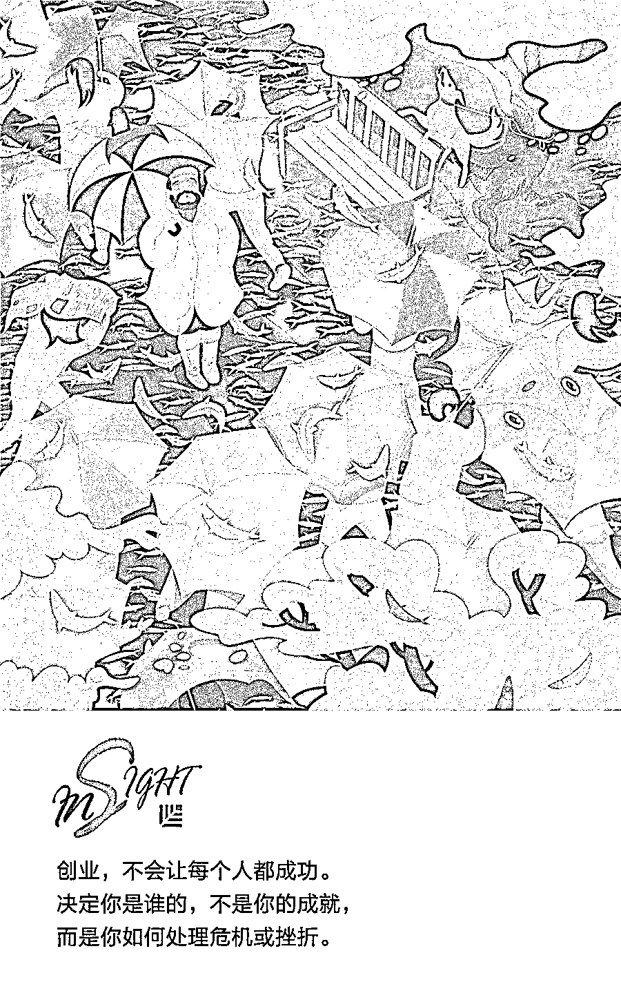
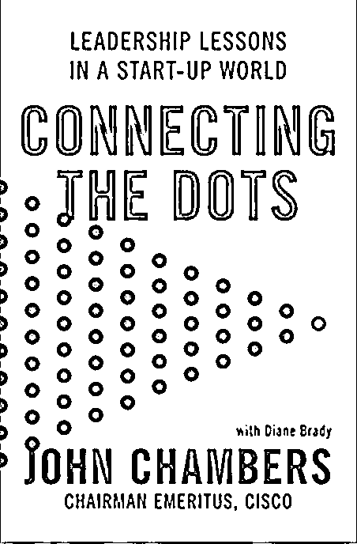
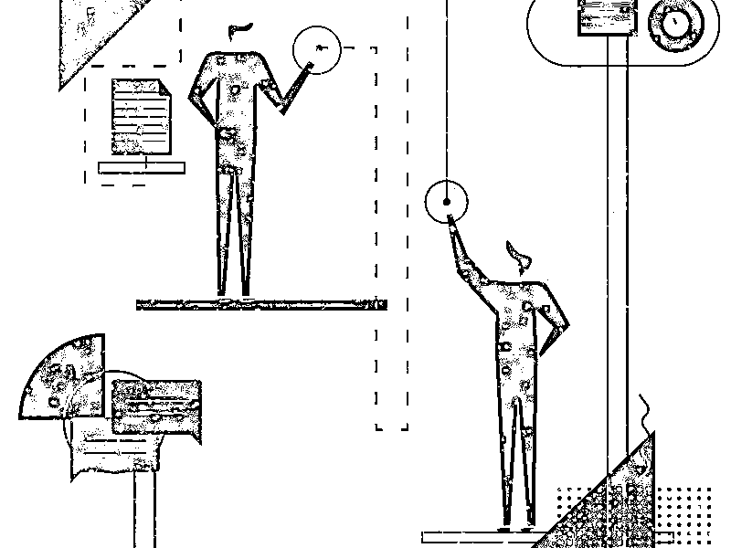
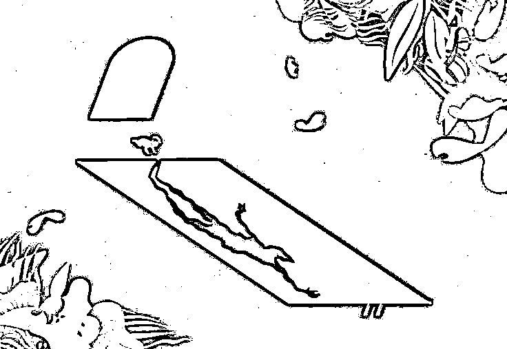
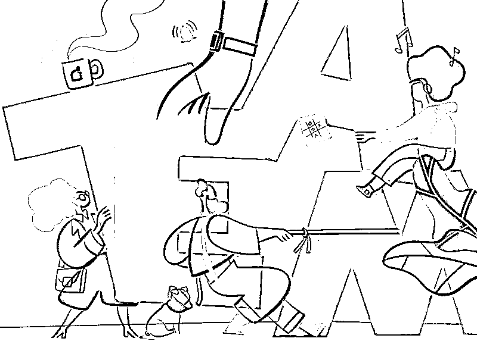

# 成为伟大的领导者之前，你会有一次濒临死亡的经历 | 欧美新书推荐

> 原文：[`mp.weixin.qq.com/s?__biz=MzAwODE5NDg3NQ==&mid=2651226347&idx=1&sn=2cb141e89d092a0dc44c654838cadd89&chksm=8080bebfb7f737a9b964d00c4161d9b85a09339d0d25d2bd3b0836e7466a4f1f3d724779e96e&scene=21#wechat_redirect`](http://mp.weixin.qq.com/s?__biz=MzAwODE5NDg3NQ==&mid=2651226347&idx=1&sn=2cb141e89d092a0dc44c654838cadd89&chksm=8080bebfb7f737a9b964d00c4161d9b85a09339d0d25d2bd3b0836e7466a4f1f3d724779e96e&scene=21#wechat_redirect)

约翰·钱伯斯（John Chambers），1991 年加入思科（Cisco Systems），从负责全球运营的副总裁、执行副总裁，到总裁兼首席执行官，他将思科的年销售额从 7000 万美元提升到 480 亿美元，并且将思科从一家路由器公司，转变为世界上最大的科技公司之一。曾入选《商业周刊》的“全球高管 TOP25”与《时代》杂志的“100 位最具影响力人物”。

然而这位思科前 CEO 的人生不是一夜成功的，在西弗吉尼亚州长大的钱伯斯，小时候患有诵读困难症，但他努力克服个人缺陷，并且深受身为医生的父亲的影响，最终成就了在思科的传奇人生。作为风投公司 JC2 Ventures 的创始人，钱伯斯在他的新书《画点成图：初创世界的领导力》（Connecting the Dots: Lessons for Leadership in a Startup World）中，他分享了来之不易的生活和商业经验。今天推送的文章，是对他的采访，以下是内容摘要。

▨ 领导力最重要的部分是：明确组织发展方向和稳定战略、建立伟大团队、打造文化内涵，和具备沟通能力。

▨ 初创企业的失败率会持续保持在高位，并不值得担心。

▨ 懂得如何应对挫折或挑战，如何在压力下保持冷静是许多领导者应该具备的素质。

▨ 今天的公司估计有 40%在 10 年后不会存在。要么成长，要么消失，你必须有勇气去改变。    

** **

**Connecting the Dots**

Lessons for Leadership in a Startup World

John Chambers **/ 著**

HarperCollins 2018 年 10 月

你认为领导力最重要的部分是什么？

**约翰·钱伯斯：**我认为对于一家初创公司或大型公司的 CEO，或一个团队的负责人来说，第一，要有明确组织发展方向和稳定战略的能力；第二，要有建立伟大团队的能力，包括发展团队、招聘人员和定期更换团队新鲜血液。第三，打造文化内涵，当我第一次担任 CEO 时，我不明白这点有多重要，但是如果没有强大的文化内涵，你永远不会有一个伟大的公司。第四，沟通能力，这个现在比以往任何时候都更重要。    

我会从这几个方面衡量领导者：工作成果、团队素质、领导者是否真正了解他们专注的行业、沟通技巧、谈话中的表现、文化素质以及大胆绘制蓝图，然后真正去实现的能力。

如今文化内涵被认为是优先事项，你认为是为什么？

**约翰·钱伯斯：**今天，文化内涵，对我来说和商业战略同等重要，它决定了你吸引的人才类型、你如何留住他们以及你的客户如何看待你。思科的 18 条产品线中，有 16 条在全球范围数一数二，销售额从 7000 万美元上升到 480 亿美元，我很荣幸能见证这一切。我们不仅在硅谷，而且在这个国家，都是拥有最强大文化内涵的公司之一。我知道公司里每个员工、他们的配偶或他们的孩子身上的重大疾病，并且经常和他们通电话，如果有必要的话，任何时候，哪怕是在平安夜，我也会不顾一切地帮助他们。      

我们会把客户放在首位，客户满意度影响着管理层的报酬，因此我们将文化内涵与我们的整体战略相匹配。我认为很多人低估了这一点。看着年轻的新 CEO 带领团队，实现美好愿景和商业战略，这也是我对初创企业情有独钟的原因之一。通信领域是另一个在过去十年里发生了巨大变化的领域，加强文化内涵通常是他们收获最慢的东西。但有趣的是，当他们增强了文化内涵，并与员工或客户一起看到结果时，他们会十分开心，这也是做年轻公司的导师，扶持其成长的乐趣。

那么为什么创业失败的比例这么高呢？

**约翰·钱伯斯：**我认为创业失败的比例一直都很高，可能在 70%以上。世界上最成功的风险投资家，往往比一般风险投资有更多的失败经验，因为他们承担更多的风险。但是投资中的一两个成功案例就可以回报其所有投资。

这是一个颠覆与被颠覆的时代。我相信，由于数字化、人工智能和不同的商业模式等，美国或全世界 40%的大公司将在未来十年消失。我认为这种颠覆实际上会不断加速。  

初创企业的失败率会持续保持在高位，并不值得担心，因为这是自然的。创业，不会让每个人都成功。一旦你错过了一个机会，就需要重新再来。这需要一种每次都能重新创造并敢于冒险的能力。

我认为需要关注的问题是美国的初创企业数量几乎处于 20 年来的最低点。我们曾经拥有世界上 95%的风险资本，后来是 80%，现在我们只有 50%。首次公开招股（IPO）的数量，在 20 世纪 90 年代是每年 400 到 500 次，甚至达到了 700 次的高峰。这个数字预示着未来会有多少工作岗位产生。今年这个数字超过 200 已经开始令人兴奋了，而且这是三年来的第一次。我担心的不是失败率，我担心的是没有足够的渠道，让这些初创企业快速发展壮大起来。   

这是一个颠覆与被颠覆的时代。

你在书中谈到一件事，你小时候在西弗吉尼亚州的麋鹿河，和你爸爸一起钓鱼时，学到了在压力下保持冷静。这是一个很棒的故事，你能再讲一遍那个故事吗？   

**约翰·钱伯斯：**那条河的流速很快，有些河段游泳很危险。当时我六岁，和我爸爸一起钓鱼。他叮嘱我小心，不要在这一段掉进河里。这是一个钓鱼的好地方，但就水的深度和水流的速度而言，也是一个非常危险的地方。他在我上方约 100 码处钓鱼，而我离河边太近，不小心摔倒后立刻被水卷走了。爸爸冲我大喊，要我抓住钓鱼竿。直到今天，回想起来时，我都能看到他在水边奔跑，浮浮沉沉的我眼前都是水。每次我浮出水面呼吸一口空气，我都能听到他大喊，“抓住钓鱼竿！"       

我紧紧抓住鱼竿，不停地喘着气，他终于在急流中钩住我，然后游了出去，把我拉到了一边。他坐下来，就像他经常对我做的那样，给我上了一堂生活课。他说，“约翰，当你掉进急流时，如果你试图逆流游泳，你会有溺水的危险。如果你恐慌，你也有溺水的危险。你要做的是以现在这样的方式对待——认识到你必须顺应潮流，寻找机会走出水面，然后学会如何拯救自己。”当我放松平静下来后，他把我放在急流中，让我自己去试。然后我们又回到开始钓鱼的地方，继续钓鱼。我妈妈不知道这件事，他后来又一次走到我上方 100 码处，继续钓鱼，这表明相信我已经吸取教训。

如何应对挫折或挑战，如何在压力下保持冷静是我在生活中学到的重要一课，也是很多领导者应该具备的素质。这意味着，意识到形势的严重性后，仍然会以一种有机会获胜的方式，寻找应对形势的方法，从困境中继续前进。

你说过失败不是坏事，但其实很多人都在职业生涯中惧怕失败，并且竭力避免失败。

**约翰·钱伯斯：**我认为领导者更像是挫折和失败的产物。任何说自己从未失败或遇到过挫折的领导人，他们要么没有冒险，要么对你撒了谎。   

前通用电气首席执行官杰克·韦尔奇（Jack Welch）实际上教会了我这一点。那是思科还在运营阶段的时候。许多人认为我们是美国最顶尖的领导团队，正在与世界上最有价值的公司一起冉冉上升。杰克对我说，“约翰，你会拥有一个很好的公司。但在你有一个伟大的公司或者成为一个伟大的领导者之前，你会有一次濒临死亡的经历。”

当时，我没太明白。但是当 2001 年的股市崩跌和互联网泡沫破灭时，我突然明白了他的意思。当时，我也明白了以色列已故总统西蒙·佩雷斯（Shimon Peres）教会我的东西——领导是非常孤独的。决定你是谁的，不是你的成就，而是你如何处理危机或挫折。一旦你学会了如何应对挫折，你就能在生活中取得更大的成就。

对我来说，诵读困难是一项挑战。尽管我的父母都是医生，但我的老师一度认为我无法高中毕业，甚至都没办法上高中。我在处理诵读困难症方面得到了特殊的帮助，并且我不断努力，最终我学会了如何克服一个弱点，随着时间的推移，它实际上变成了一个优势。当你从挫折和失败中吸取教训时，你就会变得更加坚强。硅谷最好的团队通常是以前没有成功过的，但一定是已经学会了吸取教训的团队。    

你还说领导者必须能够拥抱变革和创新。创新是可以理解的，但是对许多公司来说，拥抱变革仍然是一件困难的事情。他们获得了这种成功模式，并想继续乘着这股浪潮前进。

**约翰·钱伯斯：**数字化将会以非常快的速度摧毁商业模式和公司。我相信，今天的公司估计有 40%在 10 年后不会存在。要么成长，要么消失，你必须有勇气去改变。    

但是最难改变的是那些一直成功的人。当我谈到导致公司失败的原因时，第一个就是他们错过了市场转型，通常是商业模式和技术的改变，第二个是他们做正确的事情太久了。  

以思科为例，我们是一家非常成功的路由器公司，但是我们有勇气进入交换机领域。然后，我们从路由器和交换机，转向无线功能、语音、数据中心和安全等领域。我们的竞争对手犯了一个错误：只关注产品，而不注重产出。而我们不断重塑自己，不仅我们的核心产品变得更好了，我们的成果也变得更好了。这是一种拥抱变革的态度，现在我们不仅是一家制造路由器的高科技公司，而且是将改变人们工作、生活、学习、竞争方式的互联网的代名词。主动颠覆，很重要。** **

要么成长，要么消失，你必须有勇气去改变。

** 推荐阅读**

壹

[AI 时代，这 3 个冷门职业将变得供不应求 | 新书推荐](http://mp.weixin.qq.com/s?__biz=MzAwODE5NDg3NQ==&mid=2651226313&idx=1&sn=bf28c1dee0269d24cb54c861bd8714b4&chksm=8080be9db7f7378b2595e13eb9bbc5fd2bcb2125ee264f7f8067c4200ad4024976ae68691dfa&scene=21#wechat_redirect)

贰

[为什么一年读 100 本书都不会助你走上人生巅峰？| 红杉 Library](http://mp.weixin.qq.com/s?__biz=MzAwODE5NDg3NQ==&mid=2651226270&idx=1&sn=4acdfb8160878dd18a0b46b17261d2e8&chksm=8080becab7f737dce7ba8b9d264ed3338c4a74cd995531a6426a7a1b4cf579371314d2a6bfda&scene=21#wechat_redirect)

叁

[劝导的艺术，像亚里士多德那样说服别人 | 欧美新书推荐](http://mp.weixin.qq.com/s?__biz=MzAwODE5NDg3NQ==&mid=2651225960&idx=1&sn=e9cceece09236a7e06111ef334b22509&chksm=8080413cb7f7c82ae180dec4d499bdd118b2e30811547769d86d44e84845d2e58fe7886bcf9a&scene=21#wechat_redirect)

肆

[“追求市场占有率=获取利润”，这个理念已然过时 | 新书推荐](http://mp.weixin.qq.com/s?__biz=MzAwODE5NDg3NQ==&mid=2651225815&idx=1&sn=a3dd5c383955e73c3c8615e420c2285d&chksm=80804083b7f7c9950e509130aafbd6baaf37dc256caa7bc31321f1476bff5a22f336c3702e8c&scene=21#wechat_redirect)

伍

[给有创业梦的人的一封信 | 欧美新书推荐](http://mp.weixin.qq.com/s?__biz=MzAwODE5NDg3NQ==&mid=2651225643&idx=1&sn=64a148d4b12e350a10fcbede6c280d89&chksm=8080407fb7f7c9697ea319c2f6055767d011073e47f8d98880d2e1a24c16030baa36b81fce7c&scene=21#wechat_redirect)

