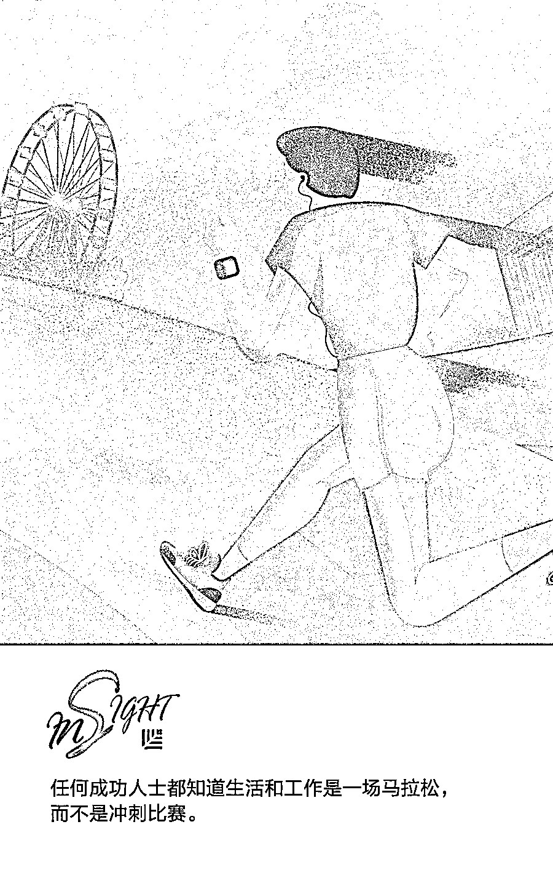
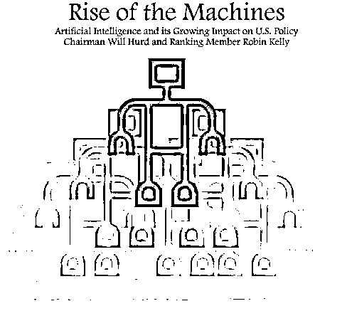
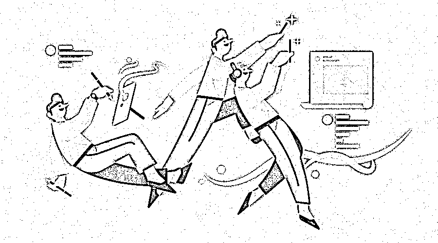
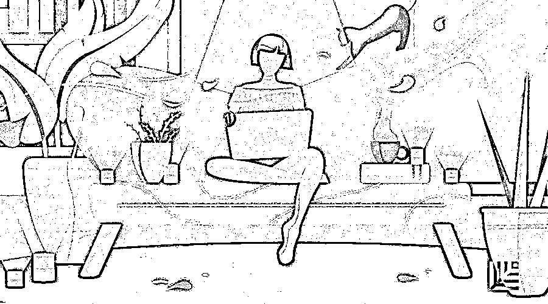

# 当创业快车驶向失败边缘，如何及时且正确地刹车？ | 红杉汇内参

> 原文：[`mp.weixin.qq.com/s?__biz=MzAwODE5NDg3NQ==&mid=2651225762&idx=1&sn=33a82575a5cdf91639dd8b54bce97894&chksm=808040f6b7f7c9e0971b9b990607fee52fe65073b39c963fb117e213750eaed6b450d03066fd&scene=21#wechat_redirect`](http://mp.weixin.qq.com/s?__biz=MzAwODE5NDg3NQ==&mid=2651225762&idx=1&sn=33a82575a5cdf91639dd8b54bce97894&chksm=808040f6b7f7c9e0971b9b990607fee52fe65073b39c963fb117e213750eaed6b450d03066fd&scene=21#wechat_redirect)

[ 编者按 ] 如果要评选世界最悲催职业，企业创始人一定能成功入围。据说，97%的初创企业都会以失败收场，多数初创公司在初期就遭临失败。尽管失败的原因各种各样，但创始人面临的悲惨境遇却大致相同。有人希望完善公司财务管理，却因此导致团队成员分道扬镳；有人忙于四处演讲，不成想公司内部早已分崩离析；更有人只是因个人原因休假，谣言就足以动摇军心……

不过，请记住，任何时候都不是世界末日。如果你已经意识到公司存在问题，那么你就有机会寻根溯源、理清脉络，甚至力挽狂澜。即使真的到了非结束不可的地步，一些及时止损的技巧也值得掌握。毕竟，失败经验也是东山再起的资本。

每期监测和精编中文视野之外的全球高价值情报，为你提供先人一步洞察机会的新鲜资讯和升级思维方式的深度内容，是为 **[ 红杉汇内参 ]**。

** 内参**

**如何挽救**

一个困难重重的初创企业？

作者 / Yon Heong Tung

编译 / 洪杉

作为一名追踪初创科技企业的观察者，我曾经见证无数企业大张旗鼓地成立，然后悄无声息地消失。据估计，97%的初创企业都会以失败收场。

如果你是位正在苦苦挣扎的创业者，你可以做的事情还有很多，但大致有两类：要么鸣金收兵，彻底放弃，要么破釜沉舟，找到致胜之法。

**第一步：找到原因**

多数初创公司都是在初期就遭临失败。背后的原因多种多样：或者，市场牵引力（受欢迎程度）或资金不足，无法实现规模扩充；或者，投放市场的时机有误；或者，顾客获取成本（CAC）过高，人才招聘力度过大，造成资金消耗率过高，难以维系后续资金需求；或者，也可能是你的商业模型本身就存在构思漏洞。

以市场导向型企业为例。在黄景深（Ng Jing Shen）成为亚洲知名约会平台 Paktor 的合作创始人（现任首席执行官）之前，他正在创建自己的第一家公司 Restless——一个瞄准活动市场的新加坡企业。 

但他遇到了两个问题：一是活动成本过高，二是供应商质量偏低。

从新加坡的国内市场来看，人们不愿为一场组织有序的活动支付 30-50 新元。而供应商认为，至少要以每人 30-50 新元的价格收费，他们才能从活动中营利。没有用户，也就没有供应商愿意上线。这是典型的“先有鸡，还是先有蛋”的问题，所有市场导向型企业都备受困扰。

尽管 Restless 有 200 个活动供应商，但他们之所以愿意注册，也只是因为想要从平台上获得一些额外帮助。因此，平台自然会出现这样一种趋势：只有那些需求不足的供应商才会想要入驻，而那些需求较高的供应商则对平台毫无兴趣。因此，平台上的活动也都是一些人们不愿参加的活动。

公正地说，这一商业模型并非无药可救。它有其优点，但真正的问题出在执行、模型微调和模型研究上。

回顾过去，黄先生的改进办法是：通过提供补贴或所需工具（而不是试图靠那些供应商并不需要的额外活动需求）来吸引大量优质供应商入驻。这样，平台在起步早期就可以获得较大用户密度，同时还将吸引更多供应商入驻。

更多创业企业失败的原因是，资历尚浅时，你很难建立一家公司，这也就是为什么会有研究表明，成功的企业家多是中年人。

许多年轻企业家起步时都是与朋友合作。但一起合作的原因可能只是你们两个在足球场上或是大学里相处融洽，是最好的朋友，但这并不意味着你们能将这份关系延续到商场中。

最初，公司有些散乱无章，但当它走上正轨，完成融资时，一切就不再是小打小闹了——现在，你要端起架子，认真做事。公司必须管理妥善，账簿要清楚明白，以免将来遭受牢狱之灾。股份分配、员工工资、营利追踪、各项成本开销都必须不厌其烦地记录在册。

如若处理不当，你和朋友之间的摩擦将不断累积，友谊将土崩瓦解，你们不是唇枪舌战，就是互不搭话。这种冲突势必会蔓延到员工之间，他们开始站队分派。而你的公司将支零破碎，深陷恶言毒语的泥沼。

不注意个人问题也会对企业造成严重影响。最近，一位要求匿名的年轻创始人告诉我，他与未婚妻的分手不愉快和与好友、家人的关系恶化令他意志消沉。

为了维护公司声誉，避免影响员工的士气，他选择休假，恢复精神，思考人生。但当他休假归来，公司一蹶不振。有关他不露面的谣言四起，有人说他抛弃了公司。这动摇了公司的根本，一些公司骨干辞职离开了。

**第二步：认清自己**

或许你不是唯一一个刚刚得到大笔投资的创始人。但现在，你很想大声告诉每个媒体机构，在每个科技会议上发言演讲。

你充满了正能量，急于分享自己的成功故事——为什么不呢？毕竟好的宣传等于更好的公司品牌推广，等于更多的交易和合作伙伴，不是吗？

答案是肯定的也是否定的。你必须把握好平衡。不能忽略公司和员工。公司尚在起初阶段，也就是说，现在正是加大投入、制定下阶段增长战略的时候。

有时，创始人资金到手后就在国外放纵狂欢，不放过任何一次在科技聚会或会议上的发言机会，希望借此提升形象，但回国后却发现公司已经四分五裂。

领导者不在，企业这艘大船就失去了掌舵人。如果你作为创始人，空有远景，却无法启发员工，你的员工只能依靠自己的力量，他们会开始抱怨不满。很快，那些喜欢趁虚而入的猎头公司就会纷至沓来，把大批员工挖到你的竞争对手那里。

还有，不要一味醉心于达成交易或追逐更多的投资和营利。如果它们的代价是忽略企业的妥善管理和账目记录，你可能只会惹恼当前的投资者或是下位潜在投资者，这可能会令企业彻底翻车。通常而言，一个杂乱无章的企业是无法吸引投资者的（除非你的产品极其出色）。

**第三步：直面问题**

即便你已经崩溃数日，但这也不是世界末日。

首先，深吸一口气，泡上一杯好茶（不要那种令人头脑亢奋的浓缩咖啡），找一个环境优美静谧的地方坐下，思考：

你还剩下什么？有欠款吗？欠了多少钱？如果你是家 SaaS（软件即服务）公司，你能否为顾客提供部分退款？你是否有钱支付本月的员工工资？

我知道，这对多数人来说都似乎只是常识，但千万不要把公司的资金一卷而光，然后把客户或员工蒙在鼓里就远逃海外（如果你这样做了，就不要幻想着还能回来，除非你喜欢蹲监狱）。你要与联合创始人和投资者敞开心扉，深入交流。公开各种问题，制定计划，偿还投资者。

现在，你可以进行公司清算。你可以折价出售有价值的 IP 和资产。你可以寻求合并，尝试向更大规模的企业或初创公司寻求人才收购，延续自己的雇主之谊。

用一块简洁的版面详细说明哪些事件造成了如今这种可怕局面并召开公司职工大会。回答员工提出的每个问题。不要把责任推到团队或员工身上。

讨论可做的选择，解释自己为何要做出某个决策。虽然你仍是首席执行官，但还是要从团队中争取认可和反馈，确保每个人都在你的计划之中；让他们知道自己的付出仍然是有价值的，每个人都是决策过程中的一环，尚在创业初期、团队规模较小的初创企业尤应如此。当然，最终拍板做决定的人还是你。

对公司的抛售日期或倒闭日期进行预估时要切合实际。提前做出诚实的预期不仅能够帮助你更好地为自己做打算，还能帮助安置员工，因为他们可能想要获得其他公司的面试机会。

公司面临倒闭，员工也很煎熬，你要表现出自己的同情与支持，例如，把他们介绍给自己认识的猎头、HR 和其他人脉，主动帮助他们审查简历、提供推荐信，这些会让他们始终铭记于心。

另一方面，投资者可能会想把你任命为其他投资组合公司的首席运营官或首席技术官。许多公司都认为初创公司创始人经验丰富，富有斗志，适合担任那些帮助推动企业发展的角色，愿意承担风险，大胆创新。

**第四步：永不懈怠**

二战时期，英国首相丘吉尔因为“永不懈怠（KBO）”这句名言而广为人知。若你心中仍有创业的激情，你可以按照下列指示，采取行动。

▨ 寻找一个“白衣骑士（指把公司从不利的收购建议中挽救出来的个人或机构）”挽救公司。

▨ 进行裁员或缩减公司开支，延长公司运转时间，以期潜在销售成交或新投资出现。

▨ 砍掉整个营销团队，充分利用剩余支出提高效率。

▨ 砍掉那些无利可图、表现较弱的产品。

▨ 对营销和分销渠道进行重新分配，寻找分销类似产品的互补渠道。

▨ 借助兼职维持公司的周转。

▨ 不要以个人名义承担金融负债。你的个人财务问题不仅会对你和公司造成伤害，还会伤害那些你爱的人。

▨ 保持沟通渠道的畅通。做好准备，从头再来。

** 读数**

**14%**

美国众议院监督和政府改革小组委员会上月发布了 AI 白皮书：《机器崛起：人工智能及对美国政策不断增长的影响》，重点讨论 AI 崛起对失业、隐私、偏见、恶意使用四个方面的影响和风险。其中引用经合组织（OECD）的一份报告称，OECD 成员国中，有 14%的工作面临自动化被替代的风险。

** 情报**

#准备好迎接了吗#

**未来工作的五大新趋势**

▨ 博学家多于专家。这并不意味着世界不再需要专家，只是在未来，各行各业都更需要通才。

▨ 协作能力大于个人能力。因为快速前进是解决未来工作创新的关键。

▨ 全球性思维。你的客户和同事可能分布在世界各地，未来的工作将穿过国界，跨越全球，远程协作。

▨ 横向职业发展而非线性职业发展。更多的工作场所具有更扁平的组织结构、更敏捷的工作方式，你必须灵活、适应性强，始终学习。

▨ 创新的主动做事者而非任务的执行者。拥有企业家精神将成为一种规范，企业将期望并鼓励员工拥有这种特征。

#生活和工作都是马拉松#

**成功企业家过周末的九种方式**

▨ 保持与工作日相同的作息。

▨ 与亲人共度美好时光。

▨ 充满热情活力。

▨ 找时间来一场小冒险。

▨ 激发创造性思维。

▨ 放松，反思和充电。

▨ 到户外锻炼身体。

▨ 适当进行社交。

▨ 抓紧时间休息。** **

** 推荐阅读**

壹

[世界经济论坛报告：关于未来工作的 12 个趋势判断｜红杉汇内参](http://mp.weixin.qq.com/s?__biz=MzAwODE5NDg3NQ==&mid=2651225721&idx=1&sn=1b7f0ad694fa1d6263860eb6df3cffad&chksm=8080402db7f7c93b0e79fe1cf2599500942dc9646e2b5d1fde4472546a905b686c4368c9bd0c&scene=21#wechat_redirect)

贰

[4 个 X 要素告诉你，伟大领导者和优秀领导者的差别 | 红杉汇内参](http://mp.weixin.qq.com/s?__biz=MzAwODE5NDg3NQ==&mid=2651225616&idx=1&sn=a16ffd468d319865b4dce414a65dd693&chksm=80804044b7f7c952fb4502afa2afbebbc08d0b9f52466415aee577ad7e3ea0a4f92bd722748b&scene=21#wechat_redirect)

叁

[比想象更快，开始依赖虚拟现实的 7 个行业 | 红杉汇内参](http://mp.weixin.qq.com/s?__biz=MzAwODE5NDg3NQ==&mid=2651225582&idx=1&sn=4d5dd23f7095da37881e259f10de2f3f&chksm=808043bab7f7caac24f459baa12cd46e1b11e62b7a872b625199e88054356b927521cfed9a5c&scene=21#wechat_redirect)

肆

[未来，你的健康将由 AI 做主 | 红杉汇内参](http://mp.weixin.qq.com/s?__biz=MzAwODE5NDg3NQ==&mid=2651225547&idx=1&sn=2963478adcd0f2814acd0d5f4adc3eb4&chksm=8080439fb7f7ca89a0e28338e844b0eea9ed608357cc4a0a69e76cff0ebc1b74541e9e11a9b1&scene=21#wechat_redirect)

伍

[自测：你是那个值得员工信任的领导者吗？ | 红杉汇内参](http://mp.weixin.qq.com/s?__biz=MzAwODE5NDg3NQ==&mid=2651225510&idx=1&sn=b5f833b59d40c5ceb20bce70218b3e49&chksm=808043f2b7f7cae4b170a7530327a8d39af6df1f325aa1d681e2d12f500e17d0b61d097878c6&scene=21#wechat_redirect)

