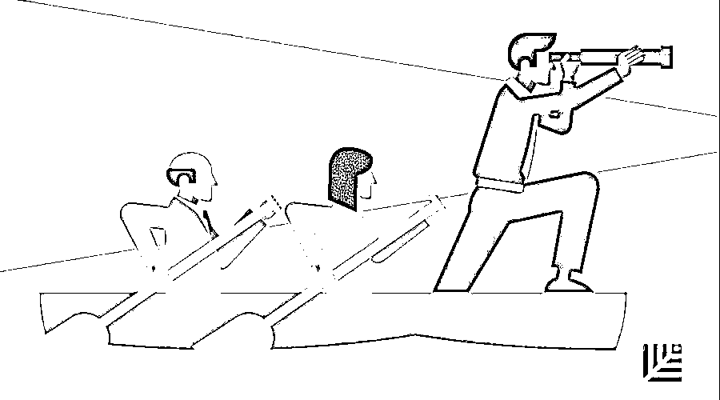
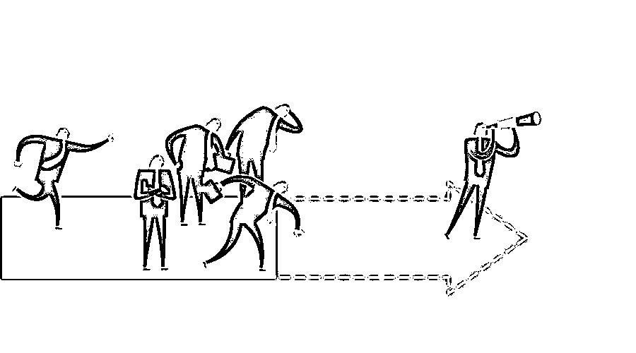

# 先营销，再创业：淹没初创公司的 8 个营销教训 | 红杉汇内参

> 原文：[`mp.weixin.qq.com/s?__biz=MzAwODE5NDg3NQ==&mid=2651225396&idx=1&sn=8a887bd4009c13bbad38e43cdd71af40&chksm=80804360b7f7ca76fb3faed641e9524a977108337df83184345d4a697f81f4faeb7f6df99882&scene=21#wechat_redirect`](http://mp.weixin.qq.com/s?__biz=MzAwODE5NDg3NQ==&mid=2651225396&idx=1&sn=8a887bd4009c13bbad38e43cdd71af40&chksm=80804360b7f7ca76fb3faed641e9524a977108337df83184345d4a697f81f4faeb7f6df99882&scene=21#wechat_redirect)

[ 编者按 ] 首次创业的人往往会认为，优秀的产品会自己说话，而无需做市场推广。但事实却是，你需要尽早建立外界对企业的信任，而这往往应该在产品准备好上线之前。

而对于很多技术类创业公司来说，过度“营销”似乎是个负面词汇，总是让人联想起“忽悠”“智商税”和“PPT 公司”，似乎只有产品不过硬的企业才会在营销上下功夫。

事实真的如此吗？科技公司 Keatext 的创始人提出了一个大胆的看法，她认为营销至关重要，甚至在产品尚未完成时，就得考虑如何进行品牌营销——在人们认识你的产品之前，要先让他们认识你的公司。

每期监测和精编中文视野之外的全球高价值情报，为你提供先人一步洞察机会的新鲜资讯，为你提供升级思维方式的深度内容，是为 **[ 红杉汇内参 ]**。

** 内参**

**创业公司**

**应该吸取的 8 个营销认知教训**

编译 / 洪杉

创业者通常都认为，自己的产品很有价值，喜欢为自家产品代言。这一点，在科技公司内部体现得尤其明显。然而，事实很残酷：如果没人知道你的技术，不管它多有革命性，也都会被淹没。你要让自己的公司吸引大众眼球，提高产品可信度。这一步骤进行得越早越好，甚至在产品还没准备就绪时就要开始。

Keatext 是一个基于人工智能的客户反馈解读平台。它把开放式调查的问题、网络评论和发布在社交媒体上的帖子转变为可付诸实践的想法。Keatext 的创始人兼首席执行官 Narjès Boufaden 说：“你在产品尚未完成时，就得考虑品牌营销。在 Keatext，我们对产品进行了很多研究与开发工作，但是我们本该在营销上花更多功夫：进行有竞争力的研究、明确可攻克的潜力市场、了解它们的弱势，而且在大规模地发布产品前就要树立品牌意识。”

本文深入探讨了技术人员出身的创业者需特别注意的营销错误，以及怎样做才能改正或避免这些错误。

**错误 1**

**没能及早专注于市场营销**

在一名首次创业者看来，企业的实力似乎完全基于产品，但是如果没有进行至关重要的市场营销，产品就不会获得你所期望达到的关注度。早专注于市场营销，你就能在开发技术时展现自己的远见。

有效的市场营销意味着聘请团队或代理商，在企业的生命周期中尽可能早地形成自己的品牌故事和策略。

因为要做的事情很多，也很难准确无误地做完所有事情，并取得你期待看到的结果。关键是要定义：为了实现目标，我们至少需要多少有实力的营销人员？

Keatext 的方法是聘请一位营销副总裁，这个人既要有资深的市场战略背景，还要运营方面有经验。随后，Keatext 还聘请了产品营销经理、内容营销经理和需求挖掘经理。如果你缺人手，你可以聘请一位有经验的人员，用实习生或自由职业者来帮助他们。或者，把你的营销方案外包给一个经销商（专门从事初创企业市场营销和发展的经销商），直到你觉得公司内部已经具备自己做营销的实力。

**错误 2**

**推销产品，却没有产品故事**

放眼世界，成功的企业都拥有精彩的故事，和与企业目标一致的优良产品。无论是企业还是消费者，他们都希望自己不仅是在使用有用的产品，还希望自己也是故事的一部分。这意味着，你的品牌故事得有吸引力：既要有独特的想象力，还兼有企业如何为改变世界做贡献的洞察力。

当你转变了自己的思维方式，从在企业内外部宣传自己产品的性能，转变为帮助团队、观望者和客户了解企业更大的目标，以及这目标是如何与他们有关联的，你将有机会与更多有影响力的人物、媒体和与企业故事有关的团体相联系，你就知道谁将成为或已经是你的理想客户了。

例如，Keatext 的品牌故事不是关于产品配置以及软件能做什么，而是关于其产品为什么能为大企业转变客户反馈流程，以及人工智能如何帮助它们同客户建立更良好的关系。从产品配置转移到 Keatext 创立的原因上，所有事情就变得简单多了。

**错误 3**

**未准备好战略就推销产品**

在初创公司还未迈入重要的市场营销阶段时，制定明确的目标至关重要。

“加入时，我发现他们已经试过很多方法。”Keatext 营销副总裁 Atallah 说，“并不是说营销团队没有努力工作—— 相反他们很有干劲，试过许多策略。但我认为真正重要的是要回头想想：我们想要干什么？”

Atallah 通过挖掘团队的想象力、制定详细的战略，明确自己团队的目标并帮助他们朝着目标努力。另外，通过锁定有明确且实际目标的战略，明白战略的哪方面有最佳效益，营销就变得非常有针对性并且成效显著。

**错误 4**

**等产品准备好接受客户反馈时**

**才进行营销**

在产品准备好之前就着手推销企业，不仅仅是建立品牌形象的好方法，还能帮助你更好地了解潜在客户希望你的产品拥有什么样的功能。你将会对目标客户的实际情况有更清晰的了解。

“这是对产品的现实验证，也是为了确保你正在做的事情是正确的，确保你确实在解决市场中的某个问题。”Boufaden 说道。

Atallah 推荐使用亚马逊的“逆向工作”（Working Backwards）产品开发法。在着手开发前发布新闻，团队既可以把注意力放在消费者真正的需求上，也能忠于企业原来的愿景。

**错误 5**

**未能测量结果**

你发起的每场营销活动，无论线上线下，都应该是可以进行测量的，并且只有对营销结果进行测量，才有可能知道你的投资是否获得了回报。网站分析、追踪码、折扣码和定制 URL 都是监控线上营销活动进展的有效方法。你还可以询问客户是如何找到你的产品，或是把调查问题附在注册表上，从而进一步了解哪些方法有效，哪些无效。销售团队可以减少花在推广上的时间，对市场和销售是双赢。

**错误 6**

**由于目标是企业级客户，**

**而忽视宝贵的社交媒体渠道**

“企业从来不是你的目标，你的目标是人。”Atallah 说道，“因此，这些人活跃在哪个平台，你就要在哪里刷存在感，用恰当的方式同他们沟通。”

缺乏经验的营销人员常犯的一个错误便是，没有学会利用社交媒体拉动企业销售额。无论企业聚焦于消费者还是聚焦于机构，背后都是人在决定是否要和你的公司接触。Atallah 强烈建议从网上找到企业的目标受众，根据不同的平台，以恰当的沟通语言，在正确的时间给他们发送正确的内容。通过在恰当的时机给他们的订阅发送精心设计的信息，你能在这一平台上说服他们成为你的客户。

**错误 7**

**未能好好利用知名客户提高曝光度**

和大客户合作，获得其好评和推荐，是提高企业可信度的绝佳办法。

BRP 全球客户营销经理出席某个会议时，提到了自己如何使用 Keatext 产品来让自己的工作更轻松。Keatext 于是发布了一个 BRP 的评价视频，两个小时内观看量达到 5000，一些原本不可能会看到这个视频的人也把它分享到社交媒体上。

尽管不可能每次都能获得直接的评价，但和合作伙伴在内容和调查上进行合作，共同举办在线研讨会、发布活动或进行推介，则可以通过这种关联性来获得间接认同。Atallah 还建议企业好好利用脱稿的评价，因为评价需要真实才具有可信度，要让客户用自己的话来讲述你的品牌故事。

**错误 8**

**重复犯同样的错误**

不是每个人都天生就能理解营销的力量。

是的，你的产品很好，但在人们认识到这一点之前，要先让他们认识你的公司。

** 神器**

**Parker 太阳探测器**

北京时间 8 月 12 日下午 3 点 31 分，具有历史意义的 Parker 太阳探测器成功升空，将于 7 年后接近太阳。它标志着人类的太空探索又进了一大步：①Parker 将会成为距离太阳最近的人造天体，设定的最近距离约为 610 万公里；②面向太阳的一面需要承受高达 1377 摄氏度的高温，难度可想而知；③将创造人造物体有史以来最快速度的记录——以 70 万公里的时速绕太阳运行。

Parker 的使命是通过对太阳的近距离探索，进而了解宇宙中其它恒星的秘密，也就越能明白地球上生命的起源。

** 情报**

#有些人注定不平凡#

**顶级企业家都有的 7 个品质**

▨ 永不言弃。当情况变得艰难时，他们不会寻找退路，而是承受压力，度过无数个不眠之夜，直到实现目标。

▨ 总是怀有强烈的质疑之心。他们必须质疑周围的世界，必须问为什么事情没有发生以及为什么现实会是如此，然后想出更具创造性、更实际的解决方案。

▨ 从长计议。创办一家一开始就很成功的公司是一回事，而使这种成功保持数年则完全是另一回事，因此要为应对变化做好准备。

▨ 具有获得别人支持的能力。经营企业意味着说服别人为你的梦想而投入自己的时间和精力，因此，让其他人加入是关键的一步。

▨ 对工作充满热情。如果没有强烈的激情和精力来完成手头的工作，长期努力是难以维系的。

▨ 深入理解自己。最好的企业家会花大量时间思考，通过思考，他们能够最大限度地提高生产力、效率和精力。

▨ 他们总能适应。最优秀的企业家不断学习和适应，成为更好的人和领导者，确保自己和公司共同成长。

#燃烧吧！小宇宙#

**勇往直前之人的 15 种共同之处**

▨ 他们相信自己。

▨ 他们培养清晰的愿景。

▨ 他们采取行动。

▨ 他们经受得住生活的磨难。

▨ 他们自我意识强烈。

▨ 他们保持生活的平衡。

▨ 他们适应变化。

▨ 他们为目标全力付出。

▨ 他们内在驱动力强。

▨ 他们负有责任感。

▨ 他们与拥有更大成就者为伍。

▨ 他们热爱学习。

▨ 他们永不满足。

▨ 他们炼心。

▨ 他们从不在自大和嫉妒上浪费时间。** **

** 推荐阅读**

壹

[为什么创始人要坚持与员工当面交流？｜红杉汇内参](http://mp.weixin.qq.com/s?__biz=MzAwODE5NDg3NQ==&mid=2651225362&idx=1&sn=ee808d6650139ae93a26017e600b2382&chksm=80804346b7f7ca50aed671ccd66e6ed7e038bab3cd24f0da991a98f384925e3653cc974613ff&scene=21#wechat_redirect)

贰

[优秀领导者都要克服的五大偏见 | 红杉汇内参](http://mp.weixin.qq.com/s?__biz=MzAwODE5NDg3NQ==&mid=2651225311&idx=1&sn=97edb88c689d72d3145a13b710742a00&chksm=8080428bb7f7cb9d73de17482d04d4f56139140cb1035fe29cce41d49e24fc873e6e49ecfdc2&scene=21#wechat_redirect)

叁

[为什么极致高效、灵活的沟通是个坑?｜红杉汇内参](http://mp.weixin.qq.com/s?__biz=MzAwODE5NDg3NQ==&mid=2651225273&idx=1&sn=72d63710df276f1ed24d60c244106c54&chksm=808042edb7f7cbfbf5cb7c86128a2f973932b4b5a745149fe751575f01898b72b8b8b8e8d518&scene=21#wechat_redirect)

肆

[你对“现金为王”的理解有多少是错的?｜红杉汇内参](http://mp.weixin.qq.com/s?__biz=MzAwODE5NDg3NQ==&mid=2651225247&idx=1&sn=c2f3e71e30168c7e81b14603b6f541f2&chksm=808042cbb7f7cbdd68060128ac7ce9dc085a2be88f447be6202f0bdadb64f41b6cacee7b0d35&scene=21#wechat_redirect)

伍

[颠覆组织：让人人都成为“迷你 CEO”｜红杉汇内参](http://mp.weixin.qq.com/s?__biz=MzAwODE5NDg3NQ==&mid=2651225214&idx=1&sn=9fa64294faa93b2251c2c88e92fe5c9f&chksm=8080422ab7f7cb3cfa25225616150bfadecd2afc7c7633010ddc618233429bde6dba21f7ebc0&scene=21#wechat_redirect)

