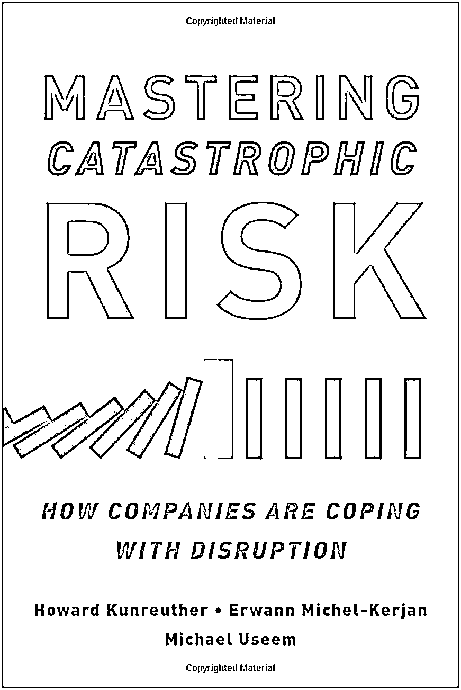
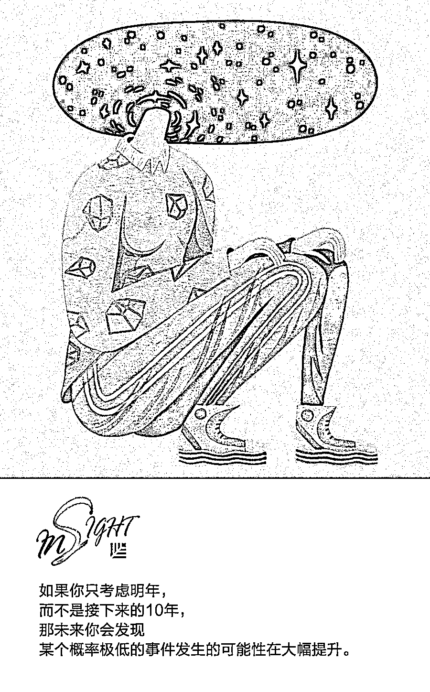

# 灾难性风险是永远悬在管理层头上的达摩克利斯之剑 | 欧美新书推荐

> 原文：[`mp.weixin.qq.com/s?__biz=MzAwODE5NDg3NQ==&mid=2651225375&idx=1&sn=3e719d99beb895498d8657469c65c13c&chksm=8080434bb7f7ca5d8ec061d9fbbc019d9d9c92d8f96df1474b8c551b4cc5763f8464f3c61840&scene=21#wechat_redirect`](http://mp.weixin.qq.com/s?__biz=MzAwODE5NDg3NQ==&mid=2651225375&idx=1&sn=3e719d99beb895498d8657469c65c13c&chksm=8080434bb7f7ca5d8ec061d9fbbc019d9d9c92d8f96df1474b8c551b4cc5763f8464f3c61840&scene=21#wechat_redirect)

今天，虽然世界上大部分地区都没有战争，但是我们却时刻生活在危机四伏的环境中，其中部分混乱是可以预测的，而另一些则会无声无息地到来。正像塔勒布在《黑天鹅》里所说，从次贷危机到东南亚海啸，从 9.11 事件到泰坦尼克号的沉没，黑天鹅存在于各个领域，无论金融市场、商业、经济还是个人生活，都很难逃出它的控制和影响。

在充满不确定因素的环境下，企业当然也面临着更多的挑战。从产品丑闻到数据泄露，再到自然灾害，企业一直都处在风险之中。过去许多企业往往在危机到来之后才想到要进行风险管理，而现在企业的领导者和管理层必须更加警惕。提高对未来冲击的警惕性和应变能力已成为企业战略的重要组成部分。

最近两位宾夕法尼亚大学沃顿商学院的教授：风险管理与决策流程研究中心副主任霍华德·昆路德（Howard Kunreuther）和领导力与变革管理中心主任迈克尔·尤西姆（Michael Useem）合著了一本新书——《掌握灾难性风险：企业应该如何应对混乱》（Mastering Catastrophic Risk: How Companies Are Coping with Disruption），他们通过深入观察和采访企业领导者和各层管理人员，建立了一个系统化的框架，帮助决策者提前做好准备，并能有效应对灾难性风险，从而降低出现大规模混乱的可能性，减少人力、财务和名誉等方面的损失。

他们还运用自己建立的“混乱（DISRUPT）”模型，着重介绍了混乱背后的七个主要驱动力：相互依赖（Interdependencies）会扩大受影响的范围；短视（Short-Term Focus）会导致愿景受限；规章制度（Regulations）需要变革；透明度（Transparency）提升了公众对各类问题及企业名誉损失的意识。本文是他们接受采访的要点内容整理。

** **

**Mastering Catastrophic Risk**

How Companies Are Coping with Disruption

Howard Kunreuther，Michael Useem **/ 著**

OUP USA 2018 年 9 月

**两位合作著书的初衷是什么？**

**霍华德·昆路德：**我们之所以合写这本书，是因为我们都对领导力以及公司应对风险的相关话题感兴趣。多年来，迈克尔和我经常聚在一起思考这些问题，但这是我们第一次把采访组织关键人物的想法付诸实践。

**迈克尔·尤西姆：**在通常情况下，人们认为风险和领导力是相互独立的。风险——我们必须善于分析并遵守纪律，而且应对风险往往需要一定的技术。领导力——其表现形式就是树立愿景并制定战略。然而，我们和许多企业的董事、行政人员和高级管理人员谈话后得出了一个结论：现在是时候把这两个术语结合到一起了。许多企业现在已经意识到了一点：评估风险、衡量风险、管理风险，并确保公司已准备好迎接风险引发的困难非常必要。

**相比 20 世纪 50 年代、60 年代和 70 年代的高管思维模式，风险意识是不是一种新出现的事物？**

**尤西姆：**是的，这也正是促使我们撰写这本书的真正契机。10 年或 15 年前，企业里还没有首席风险官这个职位， “企业风险管理（Enterprise Risk Management，ERM）”一词也还没出现，人们鲜少提及风险。现在各地的企业和组织都把风险管理提上了日程，而且这么做有充分的理由，因为近年来企业面临的风险数量在上升，大规模风险导致的灾难性影响也越发大。

**昆路德：**我们在开展研究，以及在和企业高级管理层谈话的过程中发现了一个非常有趣的问题：在 9·11 恐怖袭击发生之前，企业几乎从不重视低概率事件，即所谓的黑天鹅事件。从 9·11 事件开始到现在，这个问题已经变得越来越突出，而黑天鹅事件也比以前常见得多了。因此，现在很多企业的董事会和高级管理人员都会关注风险管理，这是一项非常重大的变革。

**当然，9·11 事件对整个美国都有影响，而且几年之后，经济大衰退到来了。这又如何改变了人们对风险的认识？**

**尤西姆：**我们和企业董事会或管理层进行深入谈话时也提出了这个问题，他们一致表示，有四件大事为他们敲响了警钟。首先是 9·11 事件，它迫使我们去想那些不堪设想的事情；第二是“桑迪”在内的一系列飓风袭击；第三是 2008 年到 2009 年的衰退，或者说近乎萧条的经济崩盘现象，谁能想到道琼斯指数竟会在一天之内暴跌 500 点？谁能想到雷曼兄弟竟然会破产？但这一切都成为了现实；第四就是 2011 年日本 9.0 级地震造成的大海啸，在此次事件中，有 2.5 万人死亡，一家核电站发生了火灾。

这些事件让许多公司受到了影响，造成了巨大的损失。大家都开始想，我们必须进行企业风险管理。

**经过这四个事件后，企业领导者对风险管理的看法有何变化？**

**昆路德：**现在企业领导者会经常说：“我们必须把风险纳入待处理事项。我们必须考虑一下自己的风险偏好和风险承受能力。”而这些都是他们以前从没想过的事。

风险覆盖的范围其实比人们认为的要广泛许多，领导者已经意识到他们还必须从长期发展的角度去思考。我们在书中建立了一个框架，并尝试利用这个框架结合丹尼尔·卡纳曼（Daniel Kahneman）开创的快速和缓慢思考学说衍生出来的部分成果。直觉思维是大家最常见的思维模式，这是一种短视的、乐观的思维模式，反映了人们对改变现状的抵触心态。现在很多企业的领导者已经认识到，他们必须更慎重地、长远地思考。这是一种变化，而领导者把这种变化和风险联系到了一起。

**尤西姆：**我们曾经向多位董事会成员提出这个问题：15 年前他们是否把网络风险、灾难性风险等纳入需董事会审议的内容？大多数人都给出了否定的答案。然而，询问他们现在是否会这么做时，他们的回答都是肯定的。我们目睹了塔吉特（Target）宣布被黑客入侵，以及其他企业或机构经历的网络灾难，现在没有任何一家企业的董事会承担得起漠视风险的代价。尽管董事会不参与微观管理，但董事会越来越关注公司的风险承受能力、风险偏好，以及采取了哪些预防措施。

**这本书中收录两个最新的风险案例：美国富国银行（Wells Fargo）的虚假账目丑闻和大众的排放作假争议。你们能否就这两个案例谈一谈？**

**尤西姆：**我们不想对任何一家企业挑三拣四，但也不想过分吹捧任何一家企业的优点，我们只想借鉴企业的经验。我们调查了美国富国银行事件，这是一个非常具有启发性的案例。首先，该公司采取了非常强硬的业绩改善措施。他们告诉员工，你必须达到设定的目标，否则一年之内就会被辞退。然而，没有人认识到，设立难以企及的业绩指标，且无底线地追求超额业绩的做法有弊无利。富国银行为此付出的代价是支付了数十亿美元的罚款。此外，美联储还下了一条限制性指令，要求富国银行不能再接受任何新增资产，除非它能向美联储证明自己已采取适当的风险管控措施。

另外一个案例就是大众的排放作假事件，即大众在车辆上安装了所谓的“减效装置”，而这个装置可以判断出汽车是否处于检测状态，进而显示符合美国标准的排放数据。事实上，这个软件只能欺骗那些查看检测数据的人。

显然，这两个事件都已经发展到了最坏的地步。富国银行和大众在声誉、品牌、股价等方面都受到了巨大的冲击。我们的书中还有一部分内容和英国石油公司在墨西哥湾的原油泄露事件有关，这个事件也具有一定的指导意义，值得所有能源生产商从中认真吸取教训。

**昆路德：**我们真正想说的是：请关注这些低概率事件。如果你只考虑明年，而不是接下来的 10 年，那未来你会发现某个概率极低的事件发生的可能性在大幅提升。如果你开始从长远的角度思考，而一些事件正好与公司打算做的事相关，即使发生概率极低，你也要注意那些事件了。

**如果企业面临的灾难是一种自然现象，比如夏威夷和瓜地马拉的火山爆发，那人们应该怎么办呢？企业可以未雨绸缪，但他们无法控制未来发生的事情。**

**尤西姆：**夏威夷和瓜地马拉的火山爆发事件对我们所有人来说都是一个重大警告，让我们注意到自然灾害在世界各地的影响范围正在不断扩大。除了一张显示持续上升趋势的图表外，没有其他方法可以描述这种现象。这种现象背后的部分原因是人们的居住地点临近地震多发区或者海岸线，以及飓风可能会因全球气候变暖而加剧。

为了帮助人们全面认识自己的灾难性风险管理措施，我们借鉴了一些以美国大企业为主的案例，当然也包括其他一些重点关注的德国公司，比如德意志银行（Deutsche Bank）和汉莎航空（Lufthansa）。我们建议谨慎的管理者和警醒的董事们要特别关注未遂灾难事件。

一个正面例子就是摩根斯坦利（Morgan Stanley）。这家公司在世界贸易中心设有办公室。在摩根斯坦利安保部门的副主管雷克·雷斯科拉（Rick Rescorla）坚持下，摩根斯坦利公司每年都要进行疏散大厦人员的大规模演习。9·11 事件发生之时，大厦北楼首先被击中，而摩根斯坦利的办公室位于南楼。雷斯科拉当机立断组织大家撤离，并成功疏散了将近 4000 人。然而遗憾的是他自己由于返回大楼查看情况，却没能及时撤离。对摩根斯坦利和其他许多人来说，他是一名伟大的英雄。从这件事中，我们可以总结出一条重要的结论：面对急剧变化的世界，我们应该随时具备风险意识，并及时学习防范和应对的措施，因为风险可能随时到来。

**昆路德：**从任意角度来看，未遂灾难事件都很重要。福岛地震和泰国洪水让人们深刻感受到了全球的互联性和相互依赖性。我们曾向各家企业的员工提出同一个问题：在他们可能面对的不利事件中，哪个事件的后果最严重？他们可以随心所欲地说出他们想说的事情，比如首席执行官意外离世、被绑架……但这些事情绝不是孤立的，福岛地震以及泰国洪水，都让很多距离事件发生地遥远的上市企业担心自己的零部件供应会受到影响。越来越多的企业决策者也意识到对单一供应链的依赖，很可能让公司在未来某段时间内无法正常运转。

**为了应对首席执行官意外死亡的状况，企业应该做好哪些准备？**

**尤西姆：**从那些遭遇过类似情况的企业的角度来看，我们所要做的就是把这些风险梳理清楚，然后预先制定一套行动方案。这就像保险一样，最好的保险是从未赔付过的保险，因为这说明灾难还没有发生，最好的风险管理系统就是从未调用过的系统。

书中我们还深入探讨了一场致命的汉莎航空飞机坠毁事件。事件发生的几分钟之内，他们就展开行动，给德国总理打了电话，并派遣了专业人士前往现场。他们的行动之所以这么迅速，不是因为他们曾考虑过不堪设想的情形，而是他们事先建立了一个可以快速反应的系统。当灾难来临时，你必须处理大量的不确定性，并且不能分散注意力和影响处理工作。企业要想任何时候，都能保证事件中心的人员能专心于工作并迅速展开行动，这就需要一个系统。** **

这就像保险一样……

最好的风险管理系统就是从未调用过的系统。

——**迈克尔·尤西姆**

** 推荐阅读**

壹

[安迪·格鲁夫：一份 35 年长盛不衰的高效会议秘诀 | 经典重读](http://mp.weixin.qq.com/s?__biz=MzAwODE5NDg3NQ==&mid=2651225340&idx=1&sn=a45b35cc6623a85d81142b010223e9bb&chksm=808042a8b7f7cbbe7e8d9783db15eb6b4429e1cc21f947ff91a6c9ed92bd114c7120df9d7423&scene=21#wechat_redirect)

贰

[为什么伟大艺术的真谛在于 Do Nothing｜欧美新](http://mp.weixin.qq.com/s?__biz=MzAwODE5NDg3NQ==&mid=2651225296&idx=1&sn=5a354e7ac10e043ff0231b92b50b8bee&chksm=80804284b7f7cb9229c4252587cf42723f0a70d6c5e758aa90fb546bf38a22f2caa6ed486403&scene=21#wechat_redirect)书推荐

叁

[什么时候该把选择权交给命运？问问算法吧｜新书推荐](http://mp.weixin.qq.com/s?__biz=MzAwODE5NDg3NQ==&mid=2651225255&idx=1&sn=fc42cfb83b0b00c7d41b1a32ecddf70a&chksm=808042f3b7f7cbe577c982149a529fce5e517d7bffc0a841df66c3f19b7907fe3a2f2dbf19bc&scene=21#wechat_redirect)

肆

很忌讳[决策失误？一时冲动？错失良机？诺贝尔经济学奖得主给你](http://mp.weixin.qq.com/s?__biz=MzAwODE5NDg3NQ==&mid=2651225048&idx=1&sn=943ee74ac8ac605549e8287653e88995&chksm=8080458cb7f7cc9a21d74d44912b464934a038295f03c5fb9e25fd40c1371aa7f1a551cb87ab&scene=21#wechat_redirect)解决方案｜新书推荐

伍

[“硬撑”不是唯一的路，你明明知道自己可以活得更好｜欧美新](http://mp.weixin.qq.com/s?__biz=MzAwODE5NDg3NQ==&mid=2651225018&idx=1&sn=679e2a702b6ffce3dd1ebdaf37611b87&chksm=808045eeb7f7ccf82444fdb3b5e491e7aab36dbec5fc2662ed80e4969b728f5b43b646ee4c22&scene=21#wechat_redirect)书推荐

