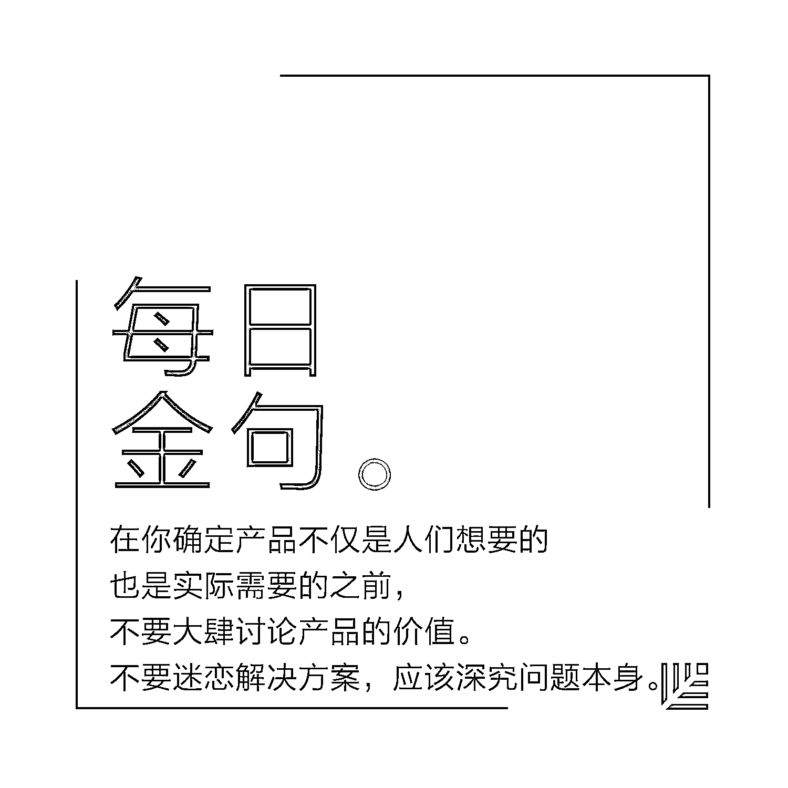
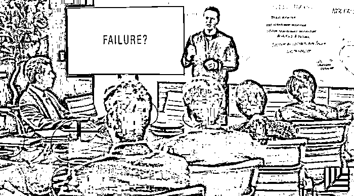
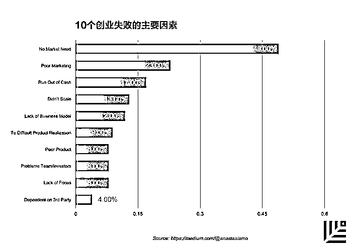
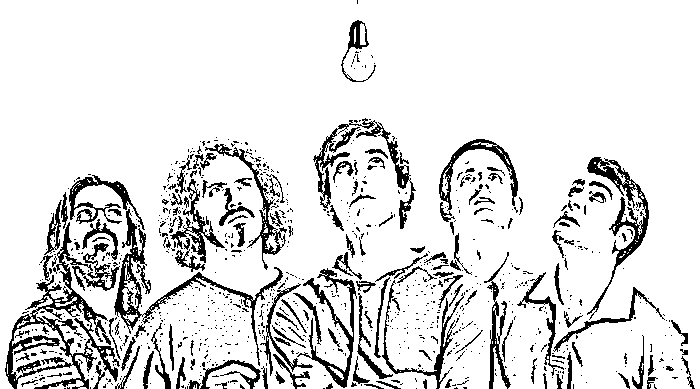
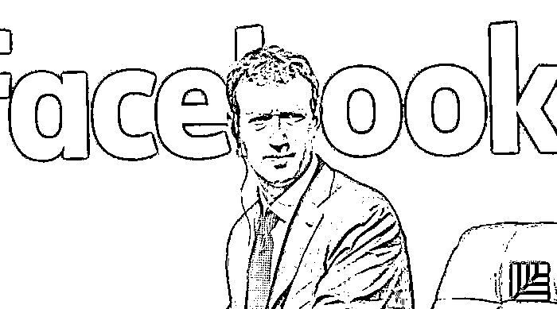
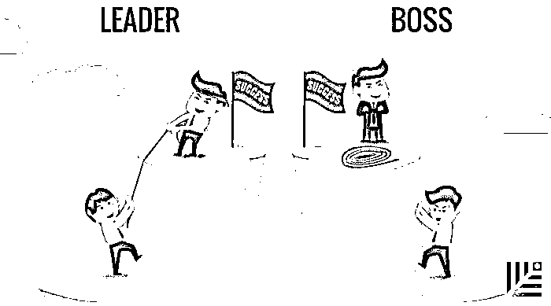

# 研究了 100 多个创业失败案例后，这里有 7 个血色教训给你｜红杉汇内参

> 原文：[`mp.weixin.qq.com/s?__biz=MzAwODE5NDg3NQ==&mid=2651223268&idx=1&sn=e361fd9df84e4e8f90219bf07909ad67&chksm=80804ab0b7f7c3a6327ba23c214d80e040ce0e244951c2dcf728e59349054c84b62d2a81e8c7&scene=21#wechat_redirect`](http://mp.weixin.qq.com/s?__biz=MzAwODE5NDg3NQ==&mid=2651223268&idx=1&sn=e361fd9df84e4e8f90219bf07909ad67&chksm=80804ab0b7f7c3a6327ba23c214d80e040ce0e244951c2dcf728e59349054c84b62d2a81e8c7&scene=21#wechat_redirect)

[ 编者按 ] 成功者的传记人们争相书写和阅读，失败者的故事却少人问津，甚至当事人也希望越快忘掉越好。

失败，既不该“学”亦不能“习”，但却值得“教”并得到“训”。那些回头去看再明显不过的错误判断和决定，为何当时却让你自己坚信不疑、自负满满？即使有人给出逆耳之言，恐怕当时的你也未必听得进去吧。这颇有些查理·芒格所说的“人类误判心理”的意味。

Anastasia Mudrova 也曾是一家创业公司的联合创始人，在项目失败后，她发疯似地阅读和思考了 100 多个创业失败的案例，以定量和定性分析的方式，总结了 7 个血色教训。它们就像是一种“凛冬将至”般的警醒，值得记取。

每期监测和精编中文视野之外的全球高价值情报，为你提供先人一步洞察机会的新鲜资讯，为你提供升级思维方式的深度内容，是为** [ 红杉汇内参 ]**。

 ***

**【内参】**

研究了 100 多个创业失败案例后，

**这里有****7 个血色教训****给你**

作者：Anastasia Mudrova

编译：洪杉

**关**于创业公司有一个笑话：“你在市场上看到的创业公司，10 个里有 11 个会失败。”在我自己失败之后，我开始寻找创业失败的原因。截至今日，我已经阅读了 100 多个创业公司的失败案例，这篇文章分享了我个人认为特别重要的几点。

**# 1\. 产品缺少市场**

在我的案例研究中，44%的 B2B 和 50%的 B2C 创业公司失败的主要原因之一是缺乏市场，哪怕是拥有最佳产品的顶尖团队也会失败。

为何会发生这种情况？为何创始人会再三犯错？Ghost.org 创始人约翰•奥诺兰（John O'Nolan）分享了一些见解：“我们不知道什么是牵引力，因此我们不知道自己缺乏牵引力。我们第一次对外宣传时吹嘘我们的网站‘发布仅仅 48 小时浏览量破万’，每月浏览量是我们所知的其它旅游博客的 3-4 倍。**我们只知自己是条大鱼，就是不知道池塘有多小而已。**”

如果你打算着手研发某一产品，确保你正在打造的产品有很大的市场。

**# 2\. 准备好在三年内面临失败**

创业公司的失败看似是一夜之间的事，实际却并非如此。在大多数情况下，某一方面或是某几方面的业务已经明显出现持续下滑，却没有得到重视和修复，直至公司陷入无法挽救的境地。

你可曾问过自己，在公司盈利或倒闭之前，你准备花多少时间打造它？不是多少钱，而是多少时间。让我来告诉你：我的调查表明，B2B 创业公司在失败之前，平均花了近 4 年时间，B2C 创业公司则是平均花了 3 年。

你对这个时间表有什么看法？

**# 3\. 去验证**

失败的创业公司大多都在努力证明技术上的可行性，却忽略了商业模式和市场验证是必要步骤。我们在调查中发现，这一问题影响了 17%的 B2C 创业公司。

要走出办公室。

**在大多数情况下，你的理念与市场需求相反。**

这也是为什么，你从一开始就要对自己百般挑剔。从尽可能多的角度证实你的理念，在你确定自己打造的产品不仅是人们想要的也是实际需要的之前，不要大肆讨论产品价值。

不要迷恋解决方案，应该深究问题本身。

艾德里安·谭（Adrian Tan）在创业失败后，写了如下总结：

“尽早验证你的商业模式：我的意思是要赶在打造产品和写下第一行代码之前。在这一过程中的任何时刻，你都该明确回答：‘我为什么要这样做？’、‘我打造这个产品是为了谁？’在了解潜在客户之时问他们：‘你会购买这样的解决方案吗？会为之支付多少钱？’”

**在头 10 位客户购买你的产品之前，你什么都证明不了。**

**# 4\. 潜在客户的谎言**

我原来的创业项目在开发阶段，收到了不少潜在用户的积极反馈，这些数据表明用户对我们的理念和产品有着浓厚兴趣。我们当时以为这样就足够了，以为这些反馈都是真实的，我们真是傻瓜。

如果我们进行更深入的调查，我们可能就会改变成立创业公司的决定——人们说这是一个好主意并不意味着事实就是如此。

事实表明，即使一个潜在客户有了某个问题，想要得到解决方案，但实际上并不一定会采取步骤去解决这一问题。

如果这一问题不够紧迫，不足以引发明显困扰，人们就会容忍其存在，避免花钱解决这一问题。

**询问潜在客户：为了处理这个问题都采取了哪些举措？如果他们什么都没有做，说明这一问题就不需要解决方案。**

马库斯•霍姆斯（Marcus Holmes）在对另一宗失败案例的分析中写道：

“主要教训是，**当客户说了顺耳之言时，你不能一味听之信之。**你必须看到他们积极地表现出将不惜一切代价来使用你的产品的样子，无论是要付出时间、金钱，还是两者都要。”

没错，潜在客户喜欢你的产品的话会告诉你这点。实际上，即使是邮箱选择登陆、测试注册总量和有针对性调查也不起作用。这些在登陆页面上输入邮箱地址的人与那些会每月购买你的产品的人存在很大差异。

**你应该测试的是客户行为，而非客户意见。**

创业后的一段时间里，我们发现事实与我们在创业前的调查大相径庭：

*   公测名单中的大多数人甚至都没有用过该产品。

*   使用过该产品的人只用了短短几天。

*   他们并非每天都使用该产品的重要部分。

*   没人为之付费。

**#5\. 糟糕的营销策略会使你一败涂地**

即使你的想法得到了验证，产品研发已准备就绪，也难以拉动客户数量增长。现实很残酷。B2C 创业公司失败的原因之二是营销策略不佳。在我们的调查中，它影响了 29％的公司（相比之下，只影响到了 7％的 B2B 创业公司）。

营销的目的是为了增加销售额，赚更多钱。**你的产品有多完美并不重要。即使是一个伟大产品也不会自己为自己营销。**

Mark Goldenson 在《创业失败的 10 个教训》中写道：“营销需要一定的专业知识。我不再认为营销是一个可以由聪明的新手在短时间内解决的问题。”

如果你不想面临失败，就需要多花时间研究分销渠道。你需要确定哪些是能够接触到目标受众的最佳方法，你需要聘请那些具备独特创业营销现实经验的人才。最重要的是，让你的产品到达客户手中。

**你应该花同样的时间来开发和分销最小化可行性产品。**

**# 6\. 资金耗尽即表明游戏结束**

你需要得到第一个客户，你需要开办第一个公司的资金，你需要能够实现盈利的资金，还有度过创业艰苦时期的资金。

你需要有一个财务计划，你应该设定明确的截止日期和预算，不能超支。回想我当初创业的经历，即使看到最小化可行性产品不起作用时，我们仍然投入了更多资金。现在看来明显是错误之举，但当时觉得那样做是正确的。

明智且有计划地花钱。**在确定产品是人们所需要的之前，不要在产品研发上投入过多的资金。**否则，你都是在浪费资金研发无人问津的产品。

在创业初期要力行节俭。别管什么名片、办公基础设施、员工福利以及所有关于注册公司那些乱七八糟的事了。你可以在家办公，雇用远程工作人员来避免 80％的开支。在产品销售出去之前，不要在那些只会分散主要目标的事情上花钱，把钱用到那些你真正需要的东西上。

20%的 B2B 创业公司和 15%的 B2C 创业公司都会出现现金流短缺。

**你的公司在最好或最坏情况下可以赚多少钱？无论投资者是否关心，你都应该问问自己这个问题，因为你需要知道你的创业企业是否是一个能够自力更生的公司。**——《致使我创业失败的错误》，吉尔•萨迪斯（Jim Sadis）著。

**# 7\. 不用在最终决定上纠结太久**

建立一家创业公司即创造一个愿景，将一个想法变成现实，并追求梦想。你有听说过企业家想放弃梦想的吗？我没有。

不幸的是，许多创业公司历经三年就会失败。创业者如同穿越死亡之谷，需要一直考虑什么时候该退出这个山谷，最好是在它变成你个人和财务噩梦之前。你越快做出这个决定，将来的痛苦就会越少。

一位创业失败者回忆说：“我觉得这让人有点感伤。由于产品是我们打造出来的，我们不愿意做出尽快放弃它以减少损失的决定。我们一直在欺骗自己，认为一切都会变好，然而我们无法让产品恢复正常。”

**创业并非易事，这无关乎爱好，而是关乎心态和态度。它既可能成为你生命中最美好的事情，也可能成为最糟糕的经历。**但是，若是能再度获得这种机会，我一定会为之付出所有，拼尽全力。

这很值得。

 ***

**【情报】**

#赚到第一个 100 万美元，然后呢#

**准备好从创业者向 CEO 的角色转换**

在渡过企业的草莽初创期后：

*   **准备好雇佣更多员工。**

✔️ 人力资源需求会变得越来越大、越来越复杂；

✔️ 岗位需要进行细分，需要专业化程度更高的员工；

✔️ 需要组建一个管理团队来进行战略决策；

✔️ 招聘本身就会成为一个正式的流程；

✔️ 人才招聘和公司扩张将成为你主要关注的事项之一。

*   **准备好改革经营方式。**

✔️ 对公司架构采取更多变革；

✔️ 确保在税收、合同和知识产权等领域受到必要的法律保护。

*   **重新思考融资方式。**

✔️ 作为一名消费者，你应该尽量避免担负债务。但作为一名企业运营者，你应该把债务当成一种工具；

✔️ 运营资金不仅和融资有关，还取决于你和客户签订的合同条款以及你管理费用的方式。

*   **准备好从事必躬亲的创业者过渡到学会放权的 CEO。**

✔️ 不仅需要和更多员工一起工作，还必须学会授权并激励你领导的那些人；

✔️ 许多创业者就败在这件事上：他们很难放手。原本大小事他们都亲力亲为，现在却要转变为信赖他人，他们觉得难以适应。

#让自己成为榜样，人人都将会效仿#

**企业转型始于领导者率先垂范**

“我们想转型，但现有的文化太难改变了。”我们经常听过或者说过这种话，为什么？

*   **文化是原始商业基因的一部分。**新文化不是浏览器插件，无法简单地下载并安装即可。

*   **多做事，少说话。**人们不会通过谈论来改变思维模式，他们需要体验变化，并感受进而相信这种变化。

*   **从转变自我行为开始。**每个领导者最重要的一项行动，就是他们希望在企业里看到其他人都效仿榜样角色的行为方式。

*   展示具体成果来推广转型，这很受欢迎并且有效。

*   **应用新工作方式并取得成果的人，是传播新文化的关键人物。**他们是最先潜入冷水、游泳和生存的企鹅。

*   **作为这场变革的领导者，你则是第零个企鹅：必须最先改变行为的人。**让你的愿景、言语和行为更透明，根据你希望看到的新文化来工作。

***

**【往期回顾】**

红杉汇内参第 034 期

[Facebook COO 桑德伯格毕业演讲：人生需要韧劲](http://mp.weixin.qq.com/s?__biz=MzAwODE5NDg3NQ==&mid=2651223223&idx=1&sn=09fbf0351cff1cfe3a43d92b05903233&chksm=80804ae3b7f7c3f5410155d243a1def6ace1af675aea6f965b0c57a2d4e3df49711548e4a600&scene=21#wechat_redirect)

红杉汇内参第 033 期

[你准备好应对一场企业危机了吗？](http://mp.weixin.qq.com/s?__biz=MzAwODE5NDg3NQ==&mid=2651223172&idx=1&sn=6fe5ca6893119f5749202949dffbc106&chksm=80804ad0b7f7c3c60debfd4936472cc1fc7b4d1fd2ecb1a686d450eba69d8ed2119a25d8fd5c&scene=21#wechat_redirect)

红杉汇内参第 032 期

[从烧钱数百万到七个月内扭亏为盈，](http://mp.weixin.qq.com/s?__biz=MzAwODE5NDg3NQ==&mid=2651223122&idx=1&sn=b990caa2eb4870ce38b7023df8853823&chksm=80804a06b7f7c310fbc5b99409535f5a18b288df6b765b6d9264f3e76ada5720a1a4640e3308&scene=21#wechat_redirect)

[这位创始人如何做到的？](http://mp.weixin.qq.com/s?__biz=MzAwODE5NDg3NQ==&mid=2651223122&idx=1&sn=b990caa2eb4870ce38b7023df8853823&chksm=80804a06b7f7c310fbc5b99409535f5a18b288df6b765b6d9264f3e76ada5720a1a4640e3308&scene=21#wechat_redirect)

