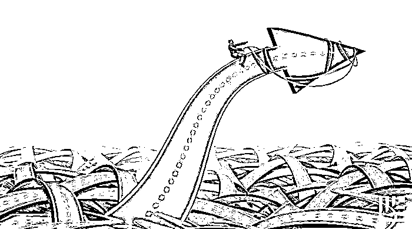
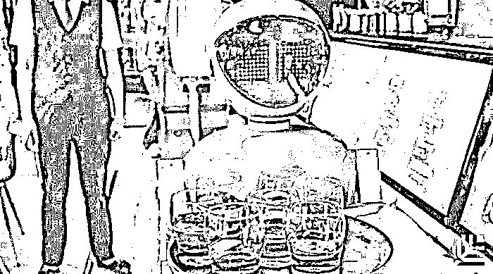
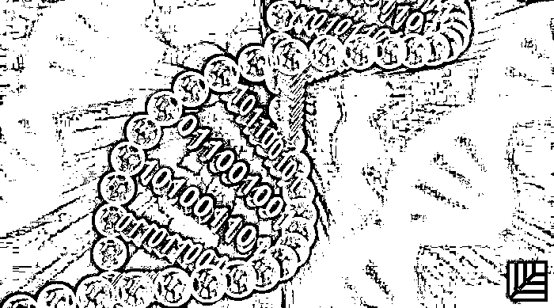
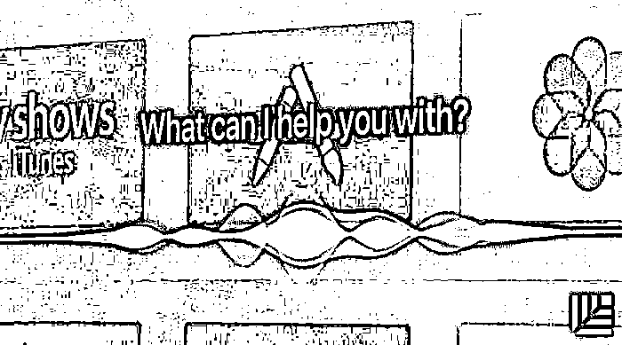
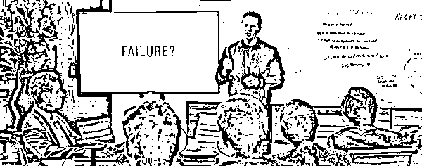
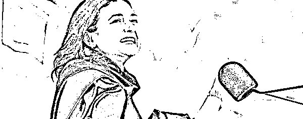

# 警惕“死蛇”！无意义的投入将耗干创业者的血｜红杉汇内参

> 原文：[`mp.weixin.qq.com/s?__biz=MzAwODE5NDg3NQ==&mid=2651223293&idx=1&sn=a18980d7397f5d52d6b2d0a267e17802&chksm=80804aa9b7f7c3bf56645815db2b20eaef2b2a112920095f20fd73d9c64b01d62faee5a1435e&scene=21#wechat_redirect`](http://mp.weixin.qq.com/s?__biz=MzAwODE5NDg3NQ==&mid=2651223293&idx=1&sn=a18980d7397f5d52d6b2d0a267e17802&chksm=80804aa9b7f7c3bf56645815db2b20eaef2b2a112920095f20fd73d9c64b01d62faee5a1435e&scene=21#wechat_redirect)

[ 编者按 ] 创业者最宝贵的资源是什么？

答案可能有很多。我们的回答是：

带宽——时间和精力。

所以，那些干扰、分散、浪费时间和精力，而又不能带来回报甚至缺乏市场需求的项目和产品，就是“死蛇”，必须除之而后快。

这番忠言出自理查德•戴利之口，戴利现任 DNAnexus 公司 CEO，这家全球基因组数据处理公司在过去两年里营收增长了 3 倍——很大原因在于其采用的“消灭死蛇”战略。他建议创业者要集中精力在正确的项目上，放弃那些“趁早失败”的项目。

如果你把团队训练成一支对“死蛇”有敏锐第六感的队伍，那么，你将会发现：

这就是你想要进入的状态。

这就是你让团队加速前进的方式。

这就是你让竞争对手无法看透你的方式。

每期监测和精编中文视野之外的全球高价值情报，为你提供先人一步洞察机会的新鲜资讯，为你提供升级思维方式的深度内容，是为** [ 红杉汇内参 ]**。

 ***

**【内参】**

**别在“死蛇”上浪费时间**

怎样识别、捕捉和让其无处出没

自述/理查德•戴利（DNAnexus 公司 CEO）

综合编译/洪杉

**把**你的公司训练成不会在“死蛇”上浪费时间的组织。

“死蛇”是什么？Netscape 前 CEO 吉姆•巴克斯代尔在他那次著名的哈佛大学演讲里，将有问题的想法称为“蛇”，并警告人们要警惕“死蛇”。在本文语境里，用“蛇”来比喻一个不会有什么成果的项目或产品功能。在决定要放弃之前，它们可能看起来非常有机会成功，可能会非常吸引消费者，可能是你上一次董事会议报告里非常关键的部分。

但它们是死的，只会分散我们的注意力、浪费时间和金钱。

它们是名副其实的“死蛇”。

若想团队时刻处在正轨，你需要学会辨认和处理“死蛇”，具体如下：

▨ 在公司里宣扬一种“什么都试试，不行就试下一个”的文化，鼓励员工无所畏惧地抓住每一个机会；

▨ 提倡员工更主动地抓住先机，并为失败方案提供风险保障来缩短开发周期；

▨ 降低对失败的恐惧；把公司文化转向人人敢于行动；

▨ 建立评估性准则，在看不到希望时悬崖勒马。

**识别“死蛇”**

“死蛇”有很多种形式。而且，即使它们是死的，仍然非常危险。以下是我们总结出来的“死蛇”的初期标志和触发因素：

*   **所谓“战略性”业务。**产品团队可能会说该项目会显示出公司有能力在市场里另辟蹊径。别被骗了。对公司来说，这是蛇即将要死的第一个标志。

*   **看不到财务回报。**如果一个产品或者产品功能不能为季度或年度财务计划带来巨额收入，就不应该做。若是这件事该做，它的投入、产出应该有一个清晰的预设，没有定死一个数字让团队齐心协力去达到的话，这个项目很有可能就没什么价值，可以抛弃了。它就是一条奄奄一息的蛇而已。

*   **你在劳而无功。**与某些客户的互动变得无效，就像电话掉线了。

*   这个项目触发了大家心里的**“扯淡测量仪”**。很多方案在幻灯片上看起来很好，但都缺乏可行的长期商业模式。CEO 要鼓励员工提出质疑，并且不能记恨在心——你要做大家的榜样。

*   **提高了技术资源的需求，但目标却时常变化。**如果一个项目占用了越来越多的设计开发时间，但却没有一个非常清晰明确的计划和以创造收入为指标的成功标准，那就应该放弃它了。

就我们的经验而言，有 30%起初看起来很有前景的机遇最后都落空了，原因就是上述几个之一。我认为对绝大多数 B2B 公司来说情况都是这样的。

**打造“捕捉死蛇”团队**

**对抗“死蛇”的最佳解药就是持续的沟通——定期进行，频率高到快要把人逼疯那种****。**我们有几种行之有效的做法来养成这种习惯。

▌**每周来信**

每一个直接向董事会做报告的人都要在每周日早上 5 点半前写一封信发给我。写信的时间不能超过 20 分钟，必须包括管理层需要知道的关键信息。

这种信件没有模版或要求，而是关乎每个经理认为的很重要、需要协调和优先处理的信息。每周日，我起床喝了两杯咖啡后，就把这些电子邮件打包起来，加入我自己的想法，然后在 7 点半之前发送给大家。

我给每周综述写的开头听起来就很像一篇短小的社评，详尽地点出了我们现在应当关注的重要机遇、风险和挑战。实际上，当时每周 20 分钟的报告里，首要任务就是要探讨制定我们的首版“死蛇指南”。我们希望整个团队都把“死蛇”项目的出现当作是一个“红色警戒”。

每周一，我们会开员工会议，讨论决策和行动方案，我们所共享的信息里核心部分之一就是要找出“死蛇”。

如果项目负责人说不出“这是我需要的资源，而那是它们增加收入的方式”，那这个项目很有可能就是“死蛇”了。

▌**全员大会**

如果你是公司的创办人或者 CEO，这种会议就是你的奠基石，来展示你的权威和实现目标的能力。每次开会，你都需要：

*   解释公司的战略；

*   指导员工如何实现这一战略；

*   展现自己为实现目标所做的准备；

*   解释每一个重大的变化——包括启动和取消了哪些项目。

重复主题是必要的基础，而这种频繁开会的做法让你有很多机会将上述主题清晰明确地传达下去。

在全员大会里，给那些主题加上数字能够让大家留下深刻印象。

不断推动公司养成“趁早失败”、摆脱“死蛇”的文化是非常重要的，这个过程需要时间、精力和不断重复。当然，同时保持公司高速运转必须是重中之重。

不久之后，你就可以把团队训练成一支对“死蛇”有敏锐第六感的队伍。公司可以启动许多项目，参与人员也都了解了触发“死蛇”出现的基本因素，或者已经形成了反射弧，主动放弃那些不会快速产生收益的方案。

这就是你想要进入的状态。

这就是你如何让团队加速前进的方式。

这就是你让竞争对手无法看透你的方式。

**让蛇无处出没**

为了从一开始就避免“死蛇”的出现，要有衡量项目成功的具体标准、时间表、商业影响分析以及清晰标明出来的所需资源，我们把这些行动变成全公司的目标。你会希望这套方案如激光般精准地应用在赢得客户上，或者达成一个非常关键的市场目标——每次就出击一个点。有时这样做之后，你可以清楚地看到“蛇”一出现就已经死了，完全可以绕过它不管。

理想情况是当我们决定要放弃一个项目，就完全放弃，这样做的好处在于我们能够更早地重新全面部署资源。如果只是对这些方案“修剪一下”，那这种做法本质也是一种失败了。

**要想真正杀死蛇，就要把有蛇出没的地方都烧得寸草不生。**

如果没有这样做，我们现在可能已经变成“吸血的僵尸蛇”了，吸了我们太久的时间和精力。

这就是为什么我们要为那块烧到寸草不生的土地欢呼的原因——我们要嘉奖那些很早就发现并处理了“死蛇”的人。作为 CEO，我肯定会在下一次全员大会里提起并让大家明确知道：公司不会责备失败。

**要记住，带宽（时间和精力）会一直是创业者最珍贵的资源，而“死蛇”则是对带宽最大的威胁。**

 ***

**【情报】**

#技术性失业潮和技术性就业潮同时来临#

**IDC：2021 年前 AI 将带来 80 万个就业岗位及 1.1 万亿美元收入**

IDC 和 Salesforce 刚刚推出了一份名为《万亿美元增长：人工智能对 CRM 的经济影响》报告，调研了全球 1000 多家企业，该研究表明：

*   AI 将“比预想更快”的速度在职场中占据一席之地，而且会对生产效率、收入产生积极影响，创造更多就业机会。

*   从今年到 2021 年，**AI 驱动的业务将带来 1.1 万亿美元的营收增长**，在全球范围内创造 80 多万个直接就业机会和 200 多万个间接就业机会，超过了自动化造成的岗位流失数量。

*   **明年将成为 AI 引入行动的转折点**，40%以上的受调查机构表示会在未来两年内开始运用 AI。

*   这些组织计划采用的 AI 类型包括机器学习（25%）、文本分析（27%）、语音/语言识别（30%）和高级数值分析（31%）。

*   预计从 2016 年到 2020 年，全球范围内“认知/人工智能系统”支出（包括硬件、软件和服务）**将从 80 亿美元增长到 460 亿美元**。

*   受益于 AI 应用而获得业务收入增长最多的国家将是**美国**，其次是日本、德国、英国和法国。

#告诉你绝密实验室里发生了什么#

**大数据正在改变研发救命良药的方式**

*   **数据得以汇总。**将临床和实验室数据联系起来的智能算法可以创建自动报告，识别相关的应用程序或化合物，并成功提高安全性和功效。

*   **内外实现协作。**制药公司的内部研发通常是秘密进行，现在则可以通过与外部伙伴加强协作来扩展其数据网络和知识。

*   **数据驱动决策。**大数据帮助制药公司决定保留或舍弃哪些研发项目，确保紧张的研发基金得到合理分配。

*   **影响新的发现技术。**下一代基因测序技术就是一个例子，将有可能在 18 到 24 个月内完成一个完整的人类基因组测序，费用仅为 100 美元。改进的分析技术和丰富的新数据将使未来创新更加激烈，并为药物开发提供渠道。

*   **设备和传感器部署。**可以用来分析药物的效率，推动研发，还可以建立新的经济模式，来连接药品和服务的供给，并提高未来药品销售额。

*   **提高临床试验的效率。**

#绝非纸上谈兵#

**企业怎样才能利用好 AI 的真实力量？**

如果我们基于这两项标准——工作复杂性和数据复杂性——来评估解决方案，将得到四种模型：

*   **效率模型。**通过感知和行为技术，提供具有一致性且符合成本效益的性能解决方案。

*   **专家模型。**搜索海量的数据集，并根据相关知识提出建议。

*   **效能模型。**旨在提高员工的总体能力，帮助他们实现特定的期望成果。之后，技术可以充当个人助理；相关人员则负责组织、沟通、监控和执行工作。Siri 就是这类模型的绝佳范例。

*   **创新模型。**增强人类的创造力和构思能力，艺术家、企业家、研究人员等都可从中受益。

除此之外，AI 还会在以下领域得到扩大化应用：

▨ 消费者行为观察；业务经营分析

▨ 呼叫中心自动化

▨ 交互式语音应答系统

▨ 精准农业

▨ 个人助理

▨ 网络搜索与链接

▨ 信贷风控及审批

▨ 医疗诊断

▨ 机器学习软件工具。

***

**【往期回顾】**

红杉汇内参第 035 期

[研究了 100 多个创业失败案例后，](http://mp.weixin.qq.com/s?__biz=MzAwODE5NDg3NQ==&mid=2651223268&idx=1&sn=e361fd9df84e4e8f90219bf07909ad67&chksm=80804ab0b7f7c3a6327ba23c214d80e040ce0e244951c2dcf728e59349054c84b62d2a81e8c7&scene=21#wechat_redirect)

[这里有 7 个血色教训给你](http://mp.weixin.qq.com/s?__biz=MzAwODE5NDg3NQ==&mid=2651223268&idx=1&sn=e361fd9df84e4e8f90219bf07909ad67&chksm=80804ab0b7f7c3a6327ba23c214d80e040ce0e244951c2dcf728e59349054c84b62d2a81e8c7&scene=21#wechat_redirect)

红杉汇内参第 034 期

[Facebook COO 桑德伯格毕业演讲：人生需要韧劲](http://mp.weixin.qq.com/s?__biz=MzAwODE5NDg3NQ==&mid=2651223223&idx=1&sn=09fbf0351cff1cfe3a43d92b05903233&chksm=80804ae3b7f7c3f5410155d243a1def6ace1af675aea6f965b0c57a2d4e3df49711548e4a600&scene=21#wechat_redirect)

红杉汇内参第 033 期

[你准备好应对一场企业危机了吗？](http://mp.weixin.qq.com/s?__biz=MzAwODE5NDg3NQ==&mid=2651223172&idx=1&sn=6fe5ca6893119f5749202949dffbc106&chksm=80804ad0b7f7c3c60debfd4936472cc1fc7b4d1fd2ecb1a686d450eba69d8ed2119a25d8fd5c&scene=21#wechat_redirect)

