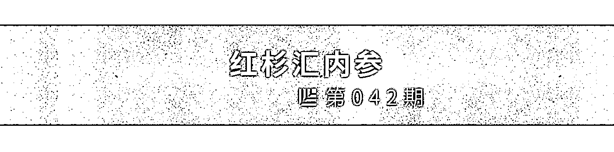
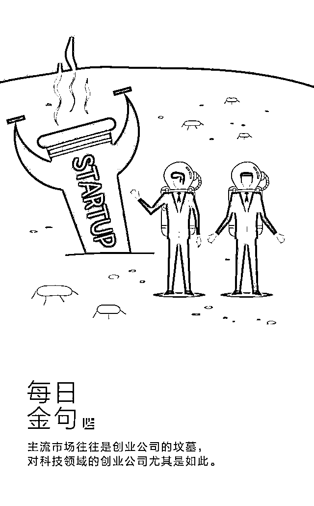
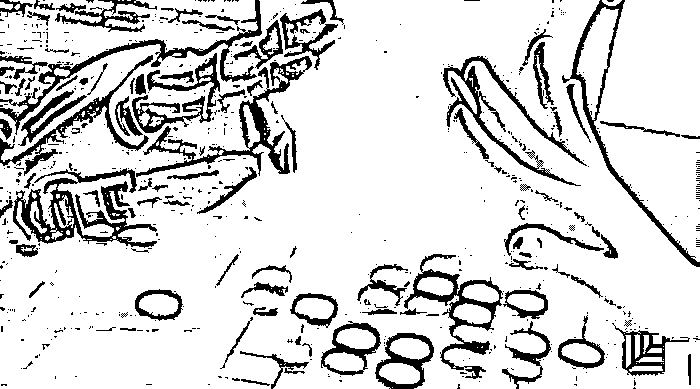
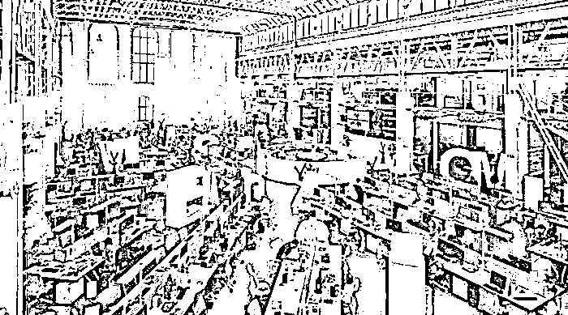
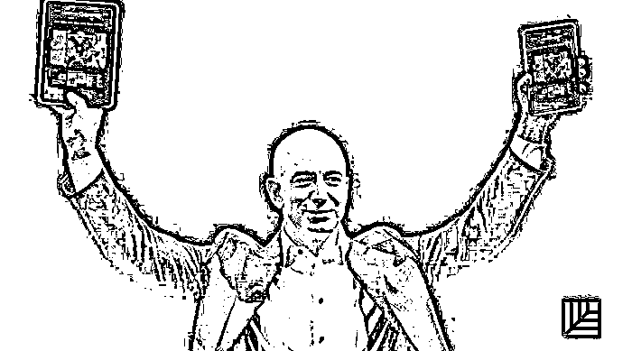

# 爆款遇冷、合伙人分手、现金流断裂……这是一份真诚的创业避雷指南｜红杉汇内参

> 原文：[`mp.weixin.qq.com/s?__biz=MzAwODE5NDg3NQ==&mid=2651223463&idx=1&sn=3cbae8d1ac1f26c707f7d2b11f659bee&chksm=80804bf3b7f7c2e50ae96f37a06c4752faf48e44f5ac5bf912a0ea39fa3540a44676c0170021&scene=21#wechat_redirect`](http://mp.weixin.qq.com/s?__biz=MzAwODE5NDg3NQ==&mid=2651223463&idx=1&sn=3cbae8d1ac1f26c707f7d2b11f659bee&chksm=80804bf3b7f7c2e50ae96f37a06c4752faf48e44f5ac5bf912a0ea39fa3540a44676c0170021&scene=21#wechat_redirect)

[ 编者按 ] 我们经常可以听到初次创业者的糟糕经历。

你和朋友共同创建了一家公司，私下决定五五分成，但有 1 人在 12 个月后离开，其他人继续留下来艰苦奋斗，获利丰厚，那个离开了的人是否仍会得到 50% 的利润？缺少正式协议的情况下，或许就会出现好友撕破脸的惨剧。

还有的公司明明已经走上正轨，正在蒸蒸日上之际，却忽然遭遇现金流短缺。产品等着更新迭代，员工等着发工资，创始人成了热锅上的蚂蚁。

全民爆款是很多创始人的追求，却在现实中频遭打脸。大众根本不懂你的想法？对你的产品太过吹毛求疵？

其实，在创业的路上会碰到很多“怪物”，创业之路就像是一场升级打怪。如果你提前知道这些“怪物”是什么，你躲开它们的机率就会增加。

每期监测和精编中文视野之外的全球高价值情报，为你提供先人一步洞察机会的新鲜资讯，为你提供升级思维方式的深度内容，是为 **[ 红杉汇内参 ]**。

** 内参**

爆款遇冷、合伙人分手、现金流断裂

**这是一份真诚的****创业避雷指南**

综合编译 / 洪杉

成立一家成功的创业公司不容易。

许多事业有成的创业者，在最终创立出一家规模不断扩大且成功盈利的企业前，都先有过数次失败的创业经历。

一定程度上是因为，初次创业者往往会犯下某些损害其公司的重大错误。

90% 的创业公司都以失败告终，所以，要想成功创业，创业者们要对初次创业时大家会常踩的“雷区”有所了解。躲开地雷，才能增加成功创业的机会。

**“饥荒心态”**

过去人们往往认为，如果创业者能想出“改变游戏规则”的点子，那成为百万富翁不过就是时间和具体细节的问题。

这一观点令诸多创业者对自己的想法守口如瓶。他们担心，如果向其他人透露一丁点儿想法或计划，那些人势必会把他们的主意偷走。这就是“饥荒心态”的一个例子——甲要成功就得牺牲乙丙丁的利益（也就是认为这世界就是一场“零和博弈”）。

但是，这恰恰是新公司创业者不应该采取的做法。

创业初期，你需要反馈，很多很多的反馈。与他人分享想法，才有机会让有能力、有经验的人给你指引方向，提供重要的建议，帮你和其他愿意相助的人牵线搭桥，或为你寻找客户。**创业者的文化应该是分享，而不是基于“饥荒心态”的文化。**

而且，在你证明你的想法具有潜力前，没有人会对它们感兴趣。事实上，包括 Facebook、Instagram、PayPal、Shopify、Twitter 和 Youtube 在内，许多成功的创业公司都是脱离了他们原初的想法，经过转变之后，才形成他们现在视若根基的高收益产品或服务。

更重要的是，若想把一个潜在的伟大想法变成大获成功的企业，想法本身远没有高效的执行来得重要。

**低估或错估“现金流”的重要性**

**互联网数据中心 CB Insights 一项研究显示，三分之一的创业公司因现金短缺而亡。** “现金流”是一个常常令不少创业新手有些困惑的重要概念。

投资百科 Investopedia 分别给出“正向现金流”和“负向现金流”的定义：

“现金流是一家公司现金和现金等价物流入和流出的净数量。正向现金流说明公司的流动资产在增加，使其有能力偿还债务、重新投资业务、给股东返本带利、支付各种费用，并能缓冲未来的金融挑战所带来的影响。负向现金流则说明一家公司的流动资产在减少。”

**创业新手往往没有正确理解现金流的动态变化，不懂如何合理地管理现金流。**

创业者首先要意识到，从创立第一天开始，公司就在“烧钱”，每一分每一秒的经营都要花钱。也就是说，公司业绩“蒸蒸日上”的同时现金流却为负向，这是完全有可能的。

因此，一个审慎节约的创业者都应该定期地进行现金流预测，判断公司的“财务健康”状况。始终做到对现金流量胸中有数，而不是没头没脑地乱花钱，这样你会更有机会成功。

**打造适合全民的产品**

创业者试图打造整个世界都为之心动的产品，为了吸引更多顾客，他们可能会不断地改变产品概念，添加新特性作为补充。

这种方法大错特错。要知道，Facebook 最开始也未针对某种大众市场，相反地，只想赢得常青藤名校的学生的青睐——而这是一个很小众的市场。

苹果的 iPhone 针对的是技术怪咖和赶时髦的群体；特斯拉招揽有钱的技术狂热者成为其客户；而 Pinterest 的早期用户少到公司甚至能与绝大多数的用户面对面交流。

**主流市场往往是创业公司的坟墓，对科技领域的创业公司尤其是如此。**

主流客户一般不相信技术：他们寻求安全感、可靠性以及品牌地位。而创业公司往往小问题多多、知名度不高且未经受检验。

**作为创业公司的创立者，你必须集中精力于早期市场——而不是主流市场。**

你的目标应该是：

▨ 修复软件中的漏洞；

▨ 回应初始用户的关切（并赢得他们的心！）；

▨ 以及稳步建立品牌知名度，然后努力瞄准从购物中心走出来的 5 口之家或者在去上瑜伽课途中的中年女性。

**缺乏专注度，注意力分散**

失败的创业公司通常有着一个非常核心的共同之处：创始人最终都没能保持专注。

美国著名创业孵化器 Y Combinator 的联合创始人保罗·格雷汉姆（Paul Graham）坚持认为，像创业公司缺钱最终破产这样的问题，“其根本原因通常都在于缺乏专注度”。他指出，“专注是创业公司的第一要务”。

**作为初次创业者，你必须保持专注，将时间和精力花在最重要的事情上，即研究市场，了解用户，设计最简可行产品，保持增长，扩大规模。**

更实事求是地说，你可以参考史蒂夫・乔布斯（Steve Jobs）在苹果公司的做法。乔布斯重返苹果时，该公司当时在卖很多不同的产品：各种打印机、掌上电脑和游戏机等，但是乔布斯将所有这些通通砍掉，只专注于一款笔记本电脑和一款个人电脑。

** 分不清失败、**

**快速失败与放弃的区别**

埃里克・莱斯（Eric Ries） “精益创业方法论”的横空出世标志着一轮新的失败哲学开始席卷硅谷，并最终传遍西方世界。

至少在最近几年，“快速失败、常常失败” （FFFO）已成为创业圈最流行的信条。

不足为奇的是，许多初次创业者都惧怕失败。其实，你很快就会犯错——而且几乎可以肯定你必定会犯错——那么作为创业者你就需要尽快碰到这些错误，并以此为鉴，回到正确的轨道上。这才是 FFFO 的个中真谛。

说到底，不要害怕尝试，尝试不同的战略，帮助企业发展、营销和发布活动是最重要的。失败时，分析原因，采取相应措施，推动你的创业公司往更高效明智的方向发展。

**选错联合创始人**

**没有签署股东协议**

联合创始人之间的分歧通常是创业公司失败的原因之一或者直接原因。许多初次创业者不重视起草和签署联合创始人协议有很多原因——包括很多创业公司通常就是由几个朋友或是同事一起创建，他们都十分激动或渴望创造与执行一些不一般的事情。

保罗・格拉汉姆（Paul Graham）相当明确地表示，良好的联合创始人关系将支持创业公司取得成功：“创始人之于创业公司，就像地段之于房产一样重要。一间房子，你怎么改都行，就是不能改变它所在的地段。在创业公司中，你可以轻易改变想法，但你很难更换你的联合创始人。创业公司的成功几乎总是与其创始人的良好运作息息相关。”

联合创始人协议是一份“企业所有者（股东）之间的合同，明确规定了共同义务、特权、保护和权利，通常构成企业的章程或规章制度。”

作为初次创业者，花时间去合理起草并签署联合创始人或股东协议十分重要。

这样做之所以必要，至少存在以下两个关键原因：

▨ 它帮助你和合伙人建立清晰公平的指南，比如清楚知道每个人的职责和企业的每一个人能得到多少股份；

▨ 它建立了一个框架，遭遇不幸事件时，即联合创始人关系变僵和（或）你们建立的创业公司最终倒闭的时候，企业可以采取可强制执行的官方行动。

** 情报**

＃下围棋、打德扑只是业余爱好＃

**AI 助力创造性思维**

IBM Watson 公司副总裁兼首席执行官 Rob High 说，AI 并非用来重塑人类思想，它应当用来与人类进行交互，并由此改善人类的创作过程：

▨ **提供个性化的全方位视角。**目前，许多数据并不精确，它无法体现出人的因素，如生活方式、态度和情绪等。新的接口和通信的增长，如一对一消息、微信等交互式渠道，导致“智能数据”兴起。这将帮助企业全方位地了解人才。

▨ **加速创意进程。**企业应当考虑用 AI 处理繁琐、高数据量的工作琐事。电脑使我们有更多的时间思考，专注于更具创造力的任务，这些任务可以产生真正的改变。

▨ **打破全球沟通限制。**如果没有语言障碍和翻译错误阻碍传播速度，AI 或许就能用于加强国际商务间的联系，让人们更广泛地分享创意。

＃连家庭时间都包括在内＃

**这位创始人为何将自己的日程设置为对员工公开**

网贷平台 Funding Circle 美国分公司联合创始人萨姆・霍奇斯的多数行程都被员工所熟知，无论是客户会议、医生预约还是家庭时间。他为什么这样做？

▨ **领导力法则。**“我认为领导力就是关于如何塑造员工的感受。他们是欢欣鼓舞地来工作吗？他们对日复一日的工作依然感到兴奋不已吗？他们能直接把自身工作与公司需求联系起来吗？”

▨ **热衷颁奖。**“我们有两个奖项‘使命感与价值观奖’，每周我们强调一种价值观，轮流表彰五种价值理念。我们还有一个‘小精灵奖’，奖品是一个红色小精灵，意在表彰职责之外另有成就的员工。”

▨ **强调仪式感。**“每位新员工入职时将会有一位伙伴，在全公司面前向大家引荐。然后，再由新员工向大家介绍一个关于自己的奇特或者好玩的故事。”

▨ **开放式办公。**“没有私人办公室，我的座位也在大办公区里。我愿意身处工作之中，却并不在意办公位置。”

▨ **集体午餐。**“每周会为整个办公室集体订餐一次，我会尽可能尝试与团队一起在厨房吃饭或者去屋顶吃饭。此外，每个月还会请新人吃饭。”

＃“你的工作就是毁掉自己的业务”＃

**杰夫•贝佐斯的 9 条金句**

来自《一网打尽》一书：

▨ “从长计议，我们就能完成本来不可能完成的事情。时间决定问题的高度。”

▨ “我的更便宜。”

▨ “零售商有两种：一类是为收取更多费用而努力，另一类是为降低价格而努力的，我们会成为后者。”

▨ “你的工作就是毁掉自己的业务。”贝佐斯给主管亚马逊纸质书发行的斯提夫・凯塞尔下了这样的命令。“毁掉自己”促成数百万的图书数字化，也促使 Kindle 的出现。

▨ “好意的守门人也会阻碍创新的步伐……即使是不太可能的想法也可以试试……许多不可能的想法确实起作用，而社会是多样性的受益者。”

▨ “为了成为一家二千亿美元的公司，我们必须学会如何销售衣服和食物。”

▨ “等你一周后知道你在做什么了再回来……大家做得都不错。”贝佐斯给自己聘请了一位领导力培训教练，并学会指责员工后称赞他们。

▨ “人们对于网络将产生何种冲击依然一无所知，在这样的意义下，今天依然是第一天。”

▨ “让我们与众不同的是：我们是真正的以客户中心，我们是真正以长期为导向，我们真心喜欢发明。大多数公司则不然。”****

** 推荐阅读**

壹

[汇纳科技张宏俊：新零售如何做到高维打击？靠这个](http://mp.weixin.qq.com/s?__biz=MzAwODE5NDg3NQ==&mid=2651223456&idx=1&sn=fb64de2e41656b75fb81844472dd96a1&chksm=80804bf4b7f7c2e2329bdd23ed01551cb6dc6e2e47b7f123006dc02b6fe654ed90ad948208f8&scene=21#wechat_redirect)

贰

[彼得・蒂尔、 埃隆・马斯克……11 位大咖教你用一个提问，解决招聘难题](http://mp.weixin.qq.com/s?__biz=MzAwODE5NDg3NQ==&mid=2651223460&idx=1&sn=2f0da91301a1044ef7b68879d7655828&chksm=80804bf0b7f7c2e68f15a9386595b5232dde93fd62054063d9004fdbdeeeae36bf55d1986337&scene=21#wechat_redirect)

叁

[消除创业倦怠、原地满血复活的 6 个领导力养成大法](http://mp.weixin.qq.com/s?__biz=MzAwODE5NDg3NQ==&mid=2651223434&idx=1&sn=014ba06f1a86d0b42e5b412e7b85f29c&chksm=80804bdeb7f7c2c8f6d872601f2e78aba47496930e04c27e31649c770e270ef9aac176383b45&scene=21#wechat_redirect)

肆

[想成为中国迪士尼，快看漫画陈安妮都做了什么？](http://mp.weixin.qq.com/s?__biz=MzAwODE5NDg3NQ==&mid=2651223443&idx=1&sn=af83d11a604cdd5391c0a5c35ec88bf7&chksm=80804bc7b7f7c2d17832b57a418ca6de1f6ad4801f32a55efc347c7b18cdf35261b5a0731716&scene=21#wechat_redirect)

伍

[反僵化：有些公司活着，但已经死了](http://mp.weixin.qq.com/s?__biz=MzAwODE5NDg3NQ==&mid=2651223447&idx=1&sn=d3a42219d4160241969942dd8c5fbbb7&chksm=80804bc3b7f7c2d520a88881e06ce124a41a3d08521cc7e8cf994bf315ef6efd9822209e07c2&scene=21#wechat_redirect)

