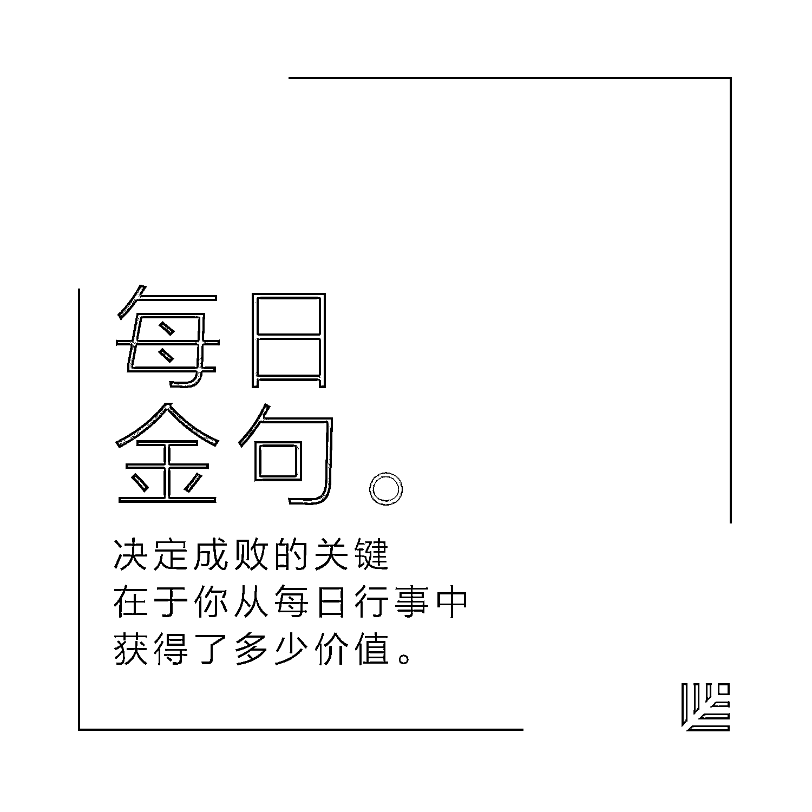
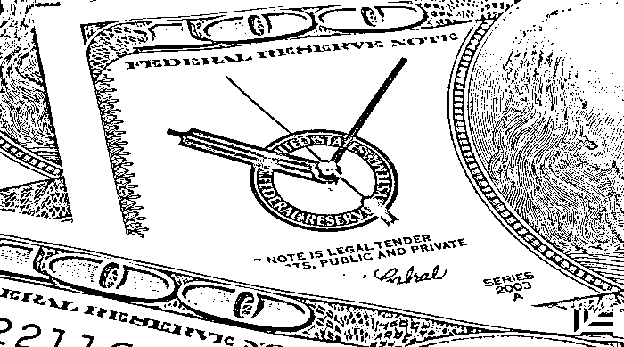

# 你准备好应对一场企业危机了吗？｜红杉汇内参

> 原文：[`mp.weixin.qq.com/s?__biz=MzAwODE5NDg3NQ==&mid=2651223172&idx=1&sn=6fe5ca6893119f5749202949dffbc106&chksm=80804ad0b7f7c3c60debfd4936472cc1fc7b4d1fd2ecb1a686d450eba69d8ed2119a25d8fd5c&scene=21#wechat_redirect`](http://mp.weixin.qq.com/s?__biz=MzAwODE5NDg3NQ==&mid=2651223172&idx=1&sn=6fe5ca6893119f5749202949dffbc106&chksm=80804ad0b7f7c3c60debfd4936472cc1fc7b4d1fd2ecb1a686d450eba69d8ed2119a25d8fd5c&scene=21#wechat_redirect)

[ 编者按 ] 没有人能预测灾难什么时候降临——不过如果知道灾难发生时要做什么的话，你会赢得更多宝贵的救命时间。

有效的危机管理之所以重要，是因为它能帮企业避免遭受应得惩罚和成本之外的更多损害，这就像法庭上辩护律师为公司被告争取最低赔偿额一样。由于应对不当，小火苗酿成大事故，许多企业付出了原本不必要的代价。

危机对于初创企业来说可能危害更大，因为其本身的抗压性和生存韧性还不足。麦肯锡的两位合伙人总结了过往的咨询经验，提出了五个平行解决方案建议：保持组织控制力、稳住股东、化解直接的主要威胁、解决根本问题以及在未来如何恢复元气。推荐一读。

每期监测和精编中文视野之外的全球高价值情报，为你提供先人一步洞察机会的新鲜资讯，为你提供升级思维方式的深度内容，是为** [ 红杉汇内参 ]**。

***********

**【内参】**

你准备好**应对一场**

**企业危机**了吗？

作者：Sanjay Kalavar、Mihir Mysore

**假**设你是一家公司高层，在过去 72 小时内公司遭遇了一场非常严重的危机。利益遭受严重损害，客户叫苦连天，员工生计遭到毁灭性打击，投资者勃然大怒，董事会忙着准备问责。在第一周结束之前，你的公司将会面临重重起诉。

你将会意识到可证实的事实非常少，到处都是各种观点与传言。你甚至都不知道在高层里还能依靠谁。他们当中有些人可能受到了牵连，有些人可能缺乏应对危机的相关经验，或自身性格导致不能成为最佳应对领导人选——内心全是好意，但就是不确定自己能做什么。

外部呢？竞争对手正想尽办法挖走你的客户和员工，激进投资者会谋划一场收购，黑客把你的系统当作目标，媒体则会揪出公司过去犯下的种种错误。**顺便说一句，这些人的怒气，大部分都是直接冲你而来的，并且非常针对个人。**

上述问题不是假设出来的。它们都是我们熟知的企业领袖在近年来遇到的真实危机经历。恼人的是，这些情形比以往更加频繁地出现，破坏力也更强了。

每场危机都有其独特的特点，根源在于特定的企业、管理、法律和商业现实状况。在帮助了大约 150 家企业应对一系列危机之后，麦肯锡发现了危机也有一些明显的模式，企业可以从这些模式里学习一些简单但又最有效的做法，以便在最糟糕的情况下能够更好地应对。

**危机威胁在增长**

有证据显示，越来越多的企业内部事件正转变成全面的企业危机。2010 年到 2017 年间，标题里有“危机”一词的新闻头条，以及福布斯评选出的全球 100 强企业的名字，出现的频率比上个世纪多了 80%。绝大多数行业都受到了不同程度的冲击。例如，美国汽车行业在去年召回了 5300 万辆汽车，2010 年时只有 2000 万辆。

为什么这个问题比以前更严重了呢？

**首先，产品和企业变得更复杂了。**

**其次，股东对公司的期望到了一个新高度。**在社交媒体各种信息的驱动下，消费者比以往更“积极”地去控告或者舍弃一家被认为没有商业道德的公司。

**第三，快速变化的人际关系**让人与人之间的信任度降低，以至于危机发生时大家更倾向于做出利己的本能反应。

**最后，企业运作中过于追求速度**——从交流的快速化到产品研发时间缩短——让危机出现的几率变大。

现在，危机管理已经跟风险管理、收购准备以及安全监管一样重要了。

**五个平行解决方案**

从麦肯锡的经验来看，如果把危机分成“主要威胁”（即相互交织的法律、技术、运作和金融问题，形成了一场危机的核心）和“次要威胁”（即大股东们对主要威胁做出的反应），会有助于更好地理解。最终，企业需要等到主要威胁被解决后才能开始重振，不过，**越早解决次要威胁，越能为企业赢得更多时间。**

当危机发生或将要发生时，最先做出的应对措施包括建立一个跨部门的团队，构建一个关于主要威胁和次要威胁的形势模型，对危机可能演化的方向做出早期判断。这有助于企业迅速做出决定，也是扳回控制权的第一步——可以让明天报纸的头条写得不那么难听，而不仅是对今天的指责被动做出回应。

人们天生容易过度乐观，在危机发生的早期阶段，即使对发展形势的判断只有一半是正确的都非常宝贵，这会为解决下列五大问题提供一个强有力的基础，这些问题分别是保持组织控制力、稳住股东、化解直接的主要威胁、解决根本问题以及在未来如何恢复元气。

**保持组织控制力**

危机发生后，企业运作的日常准则迅速瓦解，建立在信任之上的非正式网络以及外援凌驾在内部的正式汇报架构之上。那些在之前强烈反对现状的人会迅速表达自己的不满，引发一场地盘之争。一些关键高层可能自身受到牵连，无法领导企业作出回应。经理们不再具有达成共识的能力，最终形成运作不灵的组织结构。数十位决策者围桌而坐，却束手无策。

所有这些都解释了，一个有效的危机应对团队为何如此重要。这个团队应该具有在数小时而不是数天内做出和践行决策的能力，还能建立一道“机密之墙”将参与应对危机的相关人士与他人隔绝开来，保护那些无关人士不被影响，继续日常工作。

**企业常犯的一个错误是，选择一个外部专家来领导企业应对危机。**正确的救火队长往往来自公司内部，是最高管理层十分了解和器重的人，是在业内出任过运营职位的人，同时还能轻松应对层次复杂且强大的非正式网络的人。

**稳住股东**

技术类、法律类或是运营上的问题，很少能在危机第一阶段得到解决。在这一阶段，最迫切的任务是平复某些股东的愤怒情绪和过激反应，为问题解决赢得时间。

比如，公司可以采用紧急财务计划来减缓供应商、合作伙伴或是客户的压力，对客户进行信誉赔付，防止它们“叛变”去其它品牌。还有监管部门方面，也需要果断回应。

**一般公司会希望能够有一个大动作，就此扭转势态，但这非常难。**通常情况下有效做法是，和主要股东们分别沟通，提供明确的解决方案来熄灭他们的怒火。

**化解直接的主要威胁**

多数危机（如流行病爆发急需疫苗、油井泄露、尖端技术产业召回产品）的核心问题，是技术或者运营上的挑战。但在危机爆发之时，隐藏事实和问题严重性是可怕的。公司需要立刻着手挖掘并掌握所有事实。

**基本上，初期的解决方案都是没什么用的。**某生产商重设了好几次的截止日期，才终于解决了技术问题，在谈判中就很难再占到优势。另一家公司为解决危机进行了多次尝试，却都在公众视线中以失败告终，信誉受损。

**如果可以的话，最好不要在时间过分设限。**相反，要让技术或者运营团队去“慢慢来，反而比较快”。也就是给他们足够的时间和空间去评估问题的严重程度，设计可能的解决方案，再一一进行系统测试。

另一个常见问题是，技术问题因为比较复杂，最后变成了一个神秘的“黑匣子”。为避免这种情况，应该给技术和运营团队的工作配以适当的同行评议，以及一种“相互质疑的文化”，从而实现制衡，避免官僚主义壁垒。

**解决根本问题**

公司出现重大危机，根本问题往往不是出在技术层面，而是关乎到人（公司文化、决策权、能力等），过程（风险治理、绩效治理、标准设定），体系以及工具（维护程序）。这些层面的问题会渗透整个公司，影响所有人。

有鉴于此，**危机的根本解决通常需要持续好几年，甚至需要在组织结构上做出重大改变。**除病根，必须要设立大规模变革计划，并且越早表明该意图之坚决越好。

吸纳视角客观的新面孔加入董事会，是一种已验证有效的疗法。

**恢复企业元气**

**等到危机尘埃落定，才去关注下一个战略据点、刷新其价值定位，为时太晚，**企业核心竞争力可能已丧失。治病的药要尽早下才能好得彻底，甚至是初期安抚工作一结束就要下。这样，公司才能去思考、评估可能采取的大动作，并且确保有可以利用的资源、人才来实现它。

**CEO 们在危机管理中学会的多半是如何进行危机沟通——但危机沟通只是危机处理这一宏大问题的一部分而已。**

公司管理层和董事会应该考虑的，是明确界定可能会遭受的“黑天鹅”事件是什么。定期进行风险识别，观察所在行业或其他领域的重大危机，并对此进行情境模拟和应对。这样，公司就能以批判的眼光检查自己的各种弱点，并且思考采取何种手段进行弥补。

危机预防仍然非常关键，但是不再足够。如今，商业运作已经变得复杂许多，面对危机的可能性也是空前变大。企业需要提前做好准备，站稳脚跟，能够在最坏的情况中给出有力还击。

*******

**【情报】**

#未来的好工作是……机器人创造的#

**IBM 预测：2020 年对数据科学家的需求会上涨 28%**

IBM 最近与 Burning Glass Technologies、商业高等教育论坛(BHEF)联合发布的报告《数量分析难题：对数据科学技能的需求正以何种方式破坏就业市场》称：

*   对数据科学家、数据开发人员和数据工程师的年需求将在 2020 年**新增近 70 万个**工作岗位。

*   需要机器学习技能的岗位**平均年薪为 11.4 万美元**。起薪为 80265 美元。

*   **59％**的数据科学与分析岗位需求源于金融及保险、专业服务和信息技术行业。

*   最赚钱的分析技能包括 MapReduce、Apache Pig、Machine Learning、Apache Hive 和 Apache Hadoop。

*   在专业服务领域平均**需要 53 天**才能招聘到合适人选，使其成为了最具挑战性的招聘岗位。

*   公司如果不能填补这一空缺，可能会对持续的产品开发和上市策略造成极大影响。

#视时间为最珍贵的商品#

**高效企业家的 12 个日常小习惯**

决定成败的关键在于你从每日行事中获得了多少价值：

*   高效率的一天从补充水分开始。

*   保证锻炼身体的时间。

*   预先准备好清单，设定好目标，安排好电话、会议、饮食、睡眠、服装、锻炼时间、家庭和朋友等事宜。

*   不耻于向他人寻求帮助。

*   抽空自我思考，保持主动性思维，而非被动性思维。

*   参加业余团体，从“商务模式”中释放出来。

*   忽视恶言中伤者。

*   放松自我的时间是神圣不可侵犯的，不可占用。

*   视麻烦为必须学习、面对和征服的东西。

*   将自己定位为“学习者”，寻求同道者的支持。

*   随手记下灵感笔记。

*   认识到能够开怀大笑的重要性。

#用工资买员工时间的模式已行不通#

**95 后改变公司文化的四种方式**

95 后（“Z 一代”）大都将自己视作未来的企业家，即便身为内部员工，他们也渴望向更具灵活性的工作模式转变：

*   **95 后更多成为自由职业者**，有利于以外部视角推动公司创新。

*   公司要**重新审视哪些工作可以外包给自由职业者**，而哪些应内部推动，以反映公司的使命/目标。

*   公司必须加强沟通以适应更强的灵活性，这也**有助于鼓励效率文化**。

*   关于什么是品牌？将有全新含义。大批年轻人在踏上工作岗位之前就开始努力创造其个人社交媒体品牌。**公司必须在一个更大的生态系统环境——一个包括许多在共同价值框架内合作的个人品牌——中考虑其品牌和文化**。

***

**【往期回顾】**

红杉汇内参第 032 期

[从烧钱数百万到七个月内扭亏为盈，](http://mp.weixin.qq.com/s?__biz=MzAwODE5NDg3NQ==&mid=2651223122&idx=1&sn=b990caa2eb4870ce38b7023df8853823&chksm=80804a06b7f7c310fbc5b99409535f5a18b288df6b765b6d9264f3e76ada5720a1a4640e3308&scene=21#wechat_redirect)

[这位创始人如何做到的？](http://mp.weixin.qq.com/s?__biz=MzAwODE5NDg3NQ==&mid=2651223122&idx=1&sn=b990caa2eb4870ce38b7023df8853823&chksm=80804a06b7f7c310fbc5b99409535f5a18b288df6b765b6d9264f3e76ada5720a1a4640e3308&scene=21#wechat_redirect)

红杉汇内参第 031 期

[创业公司如何实现高增长？](http://mp.weixin.qq.com/s?__biz=MzAwODE5NDg3NQ==&mid=2651223072&idx=1&sn=d59f1af3a43bd0945b66333cd630b992&chksm=80804a74b7f7c362ef2127ee20f3fc0de723d8004558c6f28afa96ba9ddfc7e96e848d754d94&scene=21#wechat_redirect)

[这里有 8 位老司机的朴素经验谈](http://mp.weixin.qq.com/s?__biz=MzAwODE5NDg3NQ==&mid=2651223072&idx=1&sn=d59f1af3a43bd0945b66333cd630b992&chksm=80804a74b7f7c362ef2127ee20f3fc0de723d8004558c6f28afa96ba9ddfc7e96e848d754d94&scene=21#wechat_redirect)

红杉汇内参第 030 期

[在创建平台级企业之前，你需要知道的](http://mp.weixin.qq.com/s?__biz=MzAwODE5NDg3NQ==&mid=2651223019&idx=1&sn=5fbf8d7f1118ec0d3f9bdd797d12dd4e&chksm=80804dbfb7f7c4a92f7178dab6aea7bc886bb7af717c2872dedb5f6d13bf4a1179045301c02a&scene=21#wechat_redirect)

