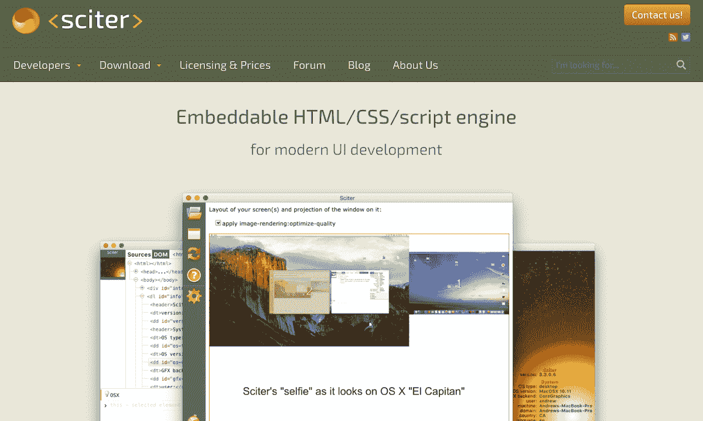
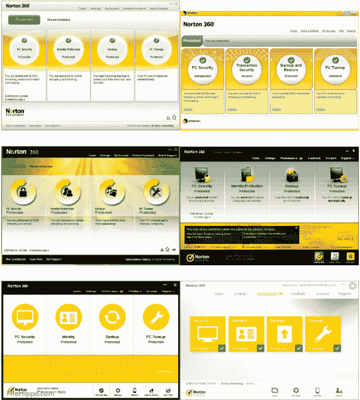

# 作为一名个体企业家，我花了 10 年时间磨练我的产品

> 原文：<https://www.indiehackers.com/interview/10-years-honing-my-product-as-a-solo-entrepreneur-e90fbd89e0>

## 你好！你的背景是什么，你在做什么？

我是 Andrew Fedoniouk，又名“c-smile”，自 1991 年以来，我一直是一名专业软件开发人员。我拥有前苏联一所大学的理学硕士学位。我的正式文凭是“飞行物体的控制系统”，所以我是一名真正的火箭科学家！

Sciter 是一个轻量级的嵌入式 UI 引擎，使用 HTML/CSS 进行 UI 声明。它在概念上接近 WPF，但使用 HTML/CSS 而不是 XAML。它可以在所有桌面平台上运行，包括 Windows、MacOS、Linux，现在也可以在移动平台上运行。Sciter 尽可能多地使用底层操作系统服务和 API——Windows 上的 Direct2D/DirectX 和/或 OpenGL，MacOS 上的 CoreGraphics 或 OpenGL，Linuxes 上的 Cairo 或 OpenGL——使其紧凑。

我在 2005 年的某个时候开始开发 Sciter，作为一个兼职项目，并且在过去的五年里一直全职从事这项工作。

 

## 是什么促使你开始使用 Sciter Engine？

我是 Evernote 的首批开发人员之一，是 Evernote 2.0 版本的渲染器和所见即所得编辑器。笔记本质上是 HTML 文档，这些文档是第一个也是最基本的 Sciter 实现的灵感来源。

在使用 WYSIWYG 编辑器的过程中，我开始考虑重用引擎，不仅是为了编辑，也是为了编辑器本身的 UI——相关的工具栏、对话框等。用 HTML 定义它们似乎是一个自然的选择，所以我用它运行并创建了[HTML layout](https://terrainformatica.com/a-homepage-section/htmlayout/)引擎。HTMLayout 简单紧凑(600k DLL ),只包含 HTML/CSS 布局和呈现代码。

我的第一个主要客户是赛门铁克，2006 年他们开始将该产品用于所有面向客户的产品的用户界面，包括诺顿防病毒软件、诺顿网络安全特警等，极大地推动了该产品的发展。经过这次背书，各大杀毒厂商都加入了“Sciter UI 俱乐部”。

HTMLayout 最初是使用 C/C++构建的，但是在市场上销售一段时间后，这种设置变得不方便了。所以我给引擎添加了脚本——于是 Sciter 诞生了！Sciter 是一个 HTML/CSS UI 引擎，带有定义 UI 流的脚本，比如*点击按钮-展开元素-开始动画-这里*。它允许公司实时跟踪用户界面趋势。正如你在下面看到的，在过去的 10 年里，它帮助诺顿 360 的用户界面发展了很多。

 

## 构建最初的产品需要什么？

在我的职业生涯中，几乎我所有的个人项目都花了九个月的时间进行积极开发——最初的 WYSIWYG 编辑器:九个月，html layout:九个月，向 html layout 添加脚本编译器和 VM 以创建 Sciter:九个月。不管是兼职项目还是全职项目，他们总是要花九个月的时间。这可能是一个完全的巧合，也可能只是我天性中固有的东西。

奇怪的是，我参与了许多其他项目，这些项目都遵循了这一九个月规则。根据我的经验，如果一个项目耗时超过 9 个月，那么它很有可能处于危险之中，无论是因为它不可伸缩，还是团队正在失去动力，等等。

## 你是如何吸引用户和壮大 Sciter Engine 的？

不幸的是，由于英语不是我的第一语言，我不太擅长广告、沟通、内容开发或任何与营销相关的东西。正因为如此，我不得不依赖那些了解我、了解我的工作、或者使用过并验证过该产品的开发人员的口头推荐。所以除了口碑之外，我在广告方面没有做过什么特别的事情，除了 2003 年在 CodeProject 上发表了一篇[文章](https://www.codeproject.com/Articles/4932/WTL-integration-of-Lightweight-HTML-layout-and-ren)。具有讽刺意味的是，我怀疑正是那篇文章吸引了我的第一批大客户，包括赛门铁克、摩托罗拉、惠普等。一旦我被那些大公司咬了一口，就更容易依靠推荐来获得更多的商业机会。

一个单独的开发人员的生产率比一个在大公司工作的开发人员的生产率高几个数量级。

TweetShare

赛门铁克，尤其是他们优秀的 QA 团队，帮助 Sciter 成为现在的样子。我们对他们所做的很多事情都涉及到根据他们的规范构建新的组件和架构片段——这有助于产品的迭代和总体增长。我们按照他们的规格建造了很多东西，我甚至与他们签订了单独的合同。

## 你的商业模式是什么，你是如何增加收入的？

赛特有三个主要的收入来源。我以一次性付款的方式出售 Sciter 许可证。这使得用户有权在他们的应用程序中使用 Sciter 源代码。有几个不同的许可证等级，从极其基本的免费版本(技术上不是许可证，只是以二进制形式访问 Sciter，因为它发布在网站上)到 Enterprise，它包括所有的华而不实的东西，可以由拥有 20 名或更多员工的公司使用。我还出售 Sciter 技术支持和源代码，收取年费。对于一些客户，我有定制开发和咨询的合同。目前，我通过电汇(直接银行对银行)和贝宝支付。

去年，我还通过加拿大政府的 [SR & ED 项目](https://www.canada.ca/en/revenue-agency/services/scientific-research-experimental-development-tax-incentive-program.html)获得了一点奖金，因为 Sciter 的代码符合该项目的条件。

Sciter 过去和现在都是一个完全自负盈亏的项目，我没有使用任何外部资金。月平均收入在 9000 美元左右，考虑到我没有太多运营支出，这已经相当不错了。这一收入水平允许我全职研究它和相关技术。

 

## 你未来的目标是什么？

在财务方面，我希望收入翻倍。温哥华的生活并不便宜:)

目前，我正专注于完成一个手机版的 Sciter。一切就绪后，Sciter 将覆盖所有实际的 GUI 平台，到处都有相同的引擎和相同的 API。我还在做一个我称之为“希格斯”的项目，这是 Sciter 与 Node.js 的结合，它旨在直接替代电子。

## 你面临的最大挑战和克服的障碍是什么？如果你必须重新开始，你会做什么不同的事？

我正在构建、销售和支持 WebKit 和 V8 引擎的替代品，这对于一个人来说不是一个小任务。从一开始，我就意识到我正在进行一个其他公司投入整个团队的巨大项目，但我选择将它视为一个精神挑战而不是技术挑战。我知道我有能力完成这件事，我只需要让自己保持动力和状态。

我选择把独自工作视为一种精神挑战，而不是技术挑战。我知道我有能力完成这件事，我只需要让自己保持动力和状态。

TweetShare

至于我会做的不同的事情，如果我现在重新开始，我会使用 Sciter 中现有的 JS 引擎，而不是设计自己的引擎。然而，当我 10 年前开始构建 Sciter 时，JS 的状况相当糟糕，所以我用类、符号和异步协同程序(async、await、yield)在 Sciter 中设计了一个脚本，同时与 JavaScript 共享运行时。

## 有没有发现什么特别有帮助或者有优势的？

赛门铁克的技术总监克里斯·卡诺西(Chris Canossi)和赛门铁克的整个 UI 团队帮了很大的忙，尤其是在项目的早期阶段。本质上，他们定义了引擎的需求和关键特性。七年前，没有人考虑硬件加速 UI 的需求或 UI 在 4k 显示器上如何播放。他们说服我认真对待硬件加速，这极大地影响了项目。

技术方面，我基本每天都在用 C++和微软 Visual Studio。因为 Visual Studio，Windows 是我的主要开发平台。

在 [Web 超文本应用技术工作组](https://whatwg.org/) HTML5 论坛上的讨论，以及在我作为“特邀专家”参与的 W3C 上的讨论，帮助很大。在 HTML5 最初创建的时候，有大量的想法涌现出来，它为参与构建 HTML/CSS 引擎的开发人员提供了一个富有成效的会议场所。

## 对于刚刚起步的独立黑客，你有什么建议？

我认为有三件事你应该记住。

首先，一个单独的开发人员的生产率比一个在大公司工作的开发人员的生产率高几个数量级。你不必把时间浪费在站着开会或者让你的工作与其他人一致上，你可以简单地自己敏捷地移动。你一个人(甚至你们中的两到三个人)可以轻松胜过大型团队。想想看——几乎所有重大项目都是由一两个开发人员启动的。

第二，我们都是人，因此容易懒惰。为了对抗这种倾向，设定目标让自己保持动力和专注是很重要的。无论是职业目标，财务目标，创造性的努力和副业，或者只是到达一个你真正喜欢你的工作的地方，制定一个计划并每天朝着它努力，这样你就不会陷入常规。

第三，当你开始写代码时，要模块化。如果由于某种原因，你的第一个项目失败了，你就有了下一个项目的基础，你就能更快地完成下一个项目。

## 我们可以去哪里了解更多？

*   [赛特发动机首页](https://sciter.com)，特别是[开发商板块](https://sciter.com/developers/)，以及[大客户名单](https://sciter.com/#customers)

*   这篇关于 CodeProject 的 [Sciter 技术概述文章](https://www.codeproject.com/Articles/859098/Sciter-multiplatform-embeddable-HTML-CSS-scripting)，以及这篇关于 Sciter[10 年之路](https://sciter.com/10-years-road-to-sciter/)的文章

*   此外，请查看 [HTML-NOTEPAD](https://html-notepad.com/) Sciter 技术演示应用程序。我用它编写了这篇文章的所有标记文本！

——[<picture id="ember8106742" class="user-avatar ember-view user-link__avatar"></picture>安德鲁](/c_smile?id=dIX0aa5UM5eHqTuBMehF5dIyU0K3)，赛特引擎创始人

## 想像赛特发动机一样自己创业？

你应该加入独立黑客社区！🤗

我们是几千名创始人，互相帮助建立有利可图的业务和副业。来分享你正在做的事情，并从你的同事那里获得反馈。

还没准备好开始使用你的产品吗？没问题。这个社区是一个认识人、学习和实践的好地方。随意[随便浏览](/)！

——[<picture id="ember8106747" class="user-avatar ember-view user-link__avatar"></picture>柯特兰艾伦](/csallen?id=ibTLPyjwVebnZjMGKvz6ztarnuV2)，独立黑客创始人

40votes