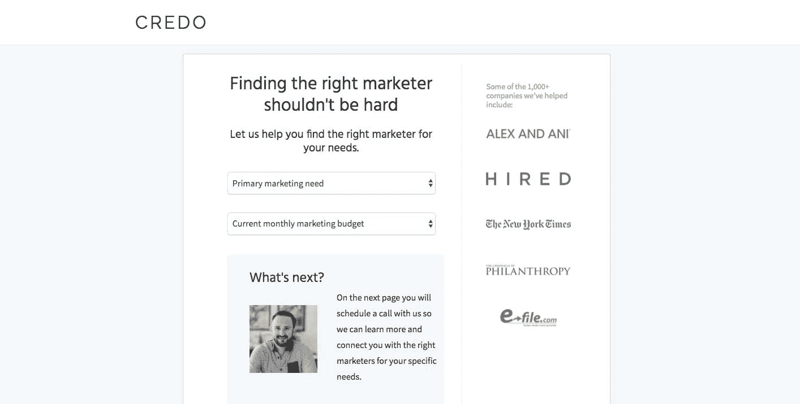
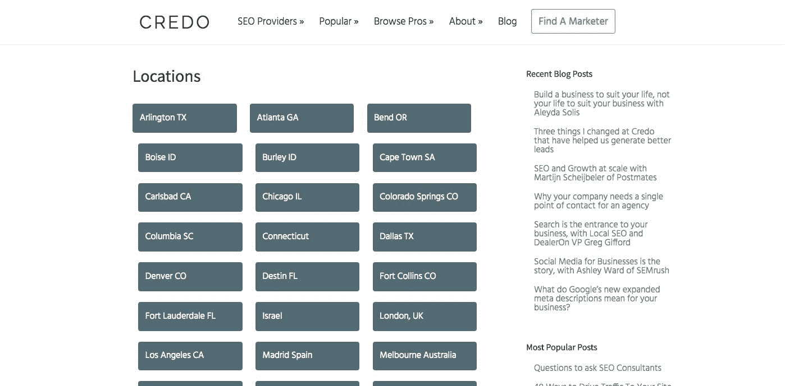
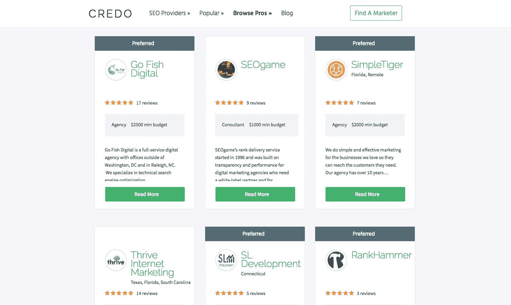

# 每月 25，000 美元将在线企业与增长专家联系起来

> 原文：<https://www.indiehackers.com/interview/25-000-mo-connecting-online-businesses-with-growth-experts-53bd69b52b>

## 你好！你的背景是什么，你在做什么？

嗨，我是约翰·多赫蒂。我是一名企业家、数字营销者和户外运动爱好者，目前正在建立一些公司，最著名的是 [Credo](https://www.getcredo.com/) 。我自 2009 年以来一直从事数字营销，但在大学期间被培训为网络开发人员，还在一家软件公司担任技术支持顾问。

Credo 是一项服务，它将希望增加在线受众的企业与经过审查的机构和顾问联系起来，这些机构和顾问专门从事他们需要的工作和他们经营的业务。它最初于 2013 年推出，在经历了一些职业动荡后，我于 2015 年 9 月开始全职从事这项工作。我们主要帮助每月在搜索引擎优化或数字营销提供商上花费超过 2000 美元的企业。

Credo 从目录开始，然后演变成一个更加自动化的市场，此后又作为一个帮助企业的高接触服务以及一个目录回到了中间。我们有过一些重大的间歇，但其核心信条是为高价值的数字营销项目提供基于订阅的推荐服务。我很高兴能和大家分享我们学到的经验。

Credo 目前每月收入约 25，000 美元。扣除费用，我们在 2017 年的收入约为 356，000 美元。

 

## 是什么促使你开始接触 Credo？

我在 2013 年 2 月开始了我的第一次创业，大约五年前。我在一家代理公司工作时开始做兼职，因为我决定不再做自己的兼职咨询，但有很多企业来找我，希望聘请我为他们提供咨询。

我也有一些朋友雇佣了不好的搜索引擎优化公司，他们的生意因此受到了伤害，所以我决定对此做点什么。我决定建立一个我认识并信任的高质量营销提供商网络，并通过邀请我认识的最好的人来做到这一点。随着时间的推移，这个过程当然已经改变了！

我相信快速运输以获得反馈，然后迭代到已识别问题的正确解决方案。

TweetShare

我通过询问一位营销朋友是否愿意支付我 50 美元介绍一位潜在客户来验证这个想法。他问我的贝宝是什么，三分钟后我的贝宝账户里有了 50 美元。

几年后，我离开了纽约的公司，然后被我在旧金山工作的公司解雇了。我有大约三个月的财务跑道加上我妻子的工资，但我需要很快产生收入。

幸运的是，我早就想看看这家公司会变成什么样子，而被解雇给了我这个机会。短期来看，我利用我在 SEO 和市场营销领域的六年积累的个人关系网获得了一些咨询客户，这给了我一条更长的金融跑道。我也开始了 Credo 产品的工作，这是我用我生疏的 PHP 和 CSS 技能在 WordPress 上创建的，同时也用一些高级插件创建了系统。您不必从头开始编写所有代码！

## 构建最初的产品需要什么？

我采用迭代的方法来构建产品，因为我相信快速交付以获得反馈，然后迭代到正确的解决方案来解决所发现的问题。

第一个产品是一个面向公众的网站，有一些目录和个人用户资料的分类页面，企业可以在那里单独联系列出的机构和顾问。我们当时的商业模式是纯佣金。当一个代理公司关闭一个客户，他们付给我们一个百分比。

第一个真正的 [Credo](https://www.getcredo.com/) 产品实际上是使用 [Gravity Forms](https://www.gravityforms.com/) 和 [GravityView](https://gravityview.co/) 在 WordPress 上建立的市场，它允许你公开展示 Gravity Forms 条目。再加上 [PaidMembershipsPro](https://www.paidmembershipspro.com/) 允许被认可的营销提供商每月向我们付费，我能够创建一个系统，允许企业提交他们的项目，然后发送给从事这项工作的机构和顾问。然后，提供商可以联系企业，试图将他们变成付费客户。

从开始到结束，我和几个承包商开发人员花了三个月才把这个版本上线。我做了大部分工作，但我使用了来自 [Codeable](https://codeable.io/) 的合同开发人员，然后单独构建一些定制功能。我从 Credo 的收入中启动了开发，当时每月大约 3000-5000 美元，并从我做的三个月的咨询工作中支付自己，这给了我另外四个月的财务跑道来开发产品。

 

## 你是如何吸引用户和发展信条的？

在建立了第一个公开个人资料的网站后，我的第一次上线是产品搜索和我自己的专业网络的结合。但老实说，这并没有多大作用，因为我没有明确公司的重点，也没有明确说明我们做什么以及我们为谁做。

最初寻找代理的企业亲自联系我，希望我与他们协商，然后我能够将他们介绍给其他代理，因为我忙于咨询工作。我自己解决了不知道把不适合我的客户送到哪里的问题。

我相信广告是给你已经点燃的火上浇油的好方法，但是你首先需要那把火。

TweetShare

作为一名专业营销人员(尽管不是一名优秀的品牌营销人员)，我采取的方法是通过广告建立受众，而不是试图通过暴力增长。我相信广告是给你已经点燃的火上浇油的好方法，但是你首先需要那把火。

虽然我尝试了许多与广告相关的不同策略，但推动项目和增长最多的四个渠道是:

1.  在 [Credo](https://www.getcredo.com/) 博客上以更大的指南形式提供一致的内容，教育我们试图接触的人(营销经理及以上)。
2.  推广到其他网站以获得推荐流量(这也有链接回我们网站的连锁效应，有助于我们的有机排名和流量)。
3.  SEO。我经常围绕营销主题在其他网站上发布内容，所以这是建立链接和获得推荐流量的好方法。
4.  通过脸书重定向，使人们看到我们的转换页面，但没有转换回该网站。

Credo 网站目前每月约有 20，000 名独立访客和 32，000 次页面浏览量。从 2017 年 1 月到今天，流量已经翻了一倍多，Credo 上创建的项目数量也增长了大约相同的数量。

首先，我一直投资于持续的博客内容，通过 SEO 产生持续的流量。有一段时间，我与一位作家签约为博客创作内容，但它缺乏我想要的品牌影响力，所以我们停止了合作。我们还为房地产和电子商务垂直行业创建了一些大型营销指南。今年，我们计划做更多这样的事情，并以更具战略性的方式进行一些更大的发布，因为我们知道这些工作。

有一段时间，我非常坚持与那些针对我过去认为是竞争对手的网站的“竞争对手”关键词创建博客帖子的人联系。不过，我学到的一件事是，如果有人在寻找“竞争对手”，他们可能会精打细算地购物，而不会像对待一笔好交易那样认真地寻找合适的合作伙伴。因此，虽然这有助于增加转化率和流量，但它可能没有像我希望的那样对业务有所帮助，除了一个推荐合作伙伴。

第三，搜索引擎优化一直是一大驱动力。我认为 SEO 流量有两种方式——一种是直接用于转化的(比如[我的 SEO 代理页面](https://www.getcredo.com/pros/seo/agencies/)),另一种是用于提高转化漏斗中的流量(比如我们的博客)。2017 年 7 月，我发布了一个针对 SEO 的重大更新，其中我和我的开发人员使用多种分类法创建了页面(例如，“SEO agencies”而不仅仅是“SEO”和“agency”)，这有效地将我们推动市场流量所需的页面数量增加了 6 倍。这导致这些页面的流量增长了 3 倍，在一个 50%的业务来自 SEO 的企业中，这在业务中产生了有意义的差异。

最后，广告。正如我提到的，重定目标显示了我们的巨大回报，让离开网站的人回来创建一个项目。在我做出一些改变并瞄准更大数量的项目之前，Quora 是一个很好的转换驱动者。但是其他尝试都失败了，因为我的客户需要在联系我们之前进行多次接触并建立信任。2018 年，我们将对此进行更多调查。

## 你的商业模式是什么，你是如何增加收入的？

我们目前的商业模式是订阅加佣金的混合模式。代理机构和顾问每月付钱给我们，让我们在经过质量审查后，把他们列入服务清单。我们也有一个年度订阅，让他们在目录中列出。

在 [Credo](https://www.getcredo.com/) ，我们已经经历了三种商业模式，目前的模式是前两种的混合。

第一种模式是我提到的纯佣金。我们向一家中介机构推荐，当他们关闭时，我们收到三个月的佣金。当大型项目关闭时，这是非常好的，但收入并不一致，因为我们基本上每三个月更换一次收入，不能真正影响关闭率。

然后我转向了订阅模式，这使我们得以增长，并在最初推出后大约 12 个月和收入模式改变后 4 个月达到了 6 位数的收入。这太棒了，但最终是不可持续的，因为激励措施不一致，我卖给人们的东西没有意义。当我想卖给他们客户的时候，我卖给他们大量的线索。这种模式有很多变动，所以虽然我能够每月增加收入，但我会不断替换变动的收入，然后在此基础上进行构建。这是不可持续的。

目前的订阅加佣金的混合模式对已关闭的项目非常有效。我从理查德·布兰森(Richard Branson)那里学到了保护不利因素(我们的需求每月通过订阅得到满足)和已关闭项目的有利因素。我也清楚地知道如何增加收入，最终是通过在 Credo 上创造更多的观众，然后偶尔带来新的供应商，让我们把工作交给他们。一切都取决于进入系统的足够多的项目。

随着我更换型号，收入时涨时跌。2017 年 5-11 月，软件收入分别为 2.7 万、2.3 万、2 万、2.7 万、2.3 万、2 万。现在它变得更加稳定，并在 12 月和 1 月持续增长。我们的利润率约为 30%-40%，随着我们投资新领域，或者一些客户的付款延迟，有些月份的利润率会更低。我们从未有过无利可图的月份。

 

## 你未来的目标是什么？

我已经为 2018 年加冕了我的[无喧嚣之年](https://www.johnfdoherty.com/2018-year-hustle/)。这意味着在 2018 年期间，我计划不增加我的工作量，而是利用我们拥有的收入来雇佣一个团队，让我们比我自己增长得更快。

不过，我的一些业务目标是将流量和转化率提高两倍，因为这些是我们收入的直接领先指标。我计划通过有针对性的内容营销和推广努力来实现这一目标，我们将利用这些努力扩大媒体报道。

在 2018 年的过程中，我计划不增加我的工作量，而是利用我们拥有的收入来雇佣一个团队，让我们比我自己增长得更快。

TweetShare

2017 年，我学到了很多关于什么可行什么不可行的知识，2018 年是专注和加倍努力的一年。

我的另一个重点是让我们的业务免受竞争对手进入市场的影响。没有哪家企业是真正不受竞争对手影响的，但我有一些定位和提供的想法，应该会让有人带我们长期发展变得非常具有挑战性。

## 你面临的最大挑战和克服的障碍是什么？如果你必须重新开始，你会做什么不同的事？

在过去的两年半时间里，我面临了一些巨大的挑战。太多了，我想我可以写一本关于他们的书。

我学到的最大错误是，在采用新的业务和定价模式之前，没有进行适当的研究和审查。我倾向于快速发货，而不是做研究，这最终使得[信条](https://www.getcredo.com/)的发展比它应该有的要慢。如果我能再做一次，我会花更多的时间与定价专家讨论定价问题，并且会以慢得多的速度推出定价变化。

在 2015 年感恩节的前一天，在我开始为自己工作仅仅两个月后，一个几乎在早期杀死 Credo 的错误被送达了一份侵犯版权的停止令。最糟糕的是他们是对的。我没有与之抗争，而是选择重塑品牌。这花了我大约两个月的时间，最终对我的公司来说是正确的举措，但它把很多必要的注意力从获得最初的市场牵引力上转移开了。在发布之前，我会做更多的版权研究，以确保我没有侵犯任何版权或商标。

最后，我必须学会平衡工作和生活。我在 2016 年初结束了在一个非常具有挑战性的地方，以至于我开始服用情绪补充剂，并看了九个月的治疗师。虽然现在回想起来，这是我做过的最好的事情之一，但完成起来也很有挑战性。

## 有没有发现什么特别有帮助或者有优势的？

我为推动公司发展所做的最好的事情就是承认我并不知道所有的事情，也不需要做所有的事情。我找到了良师益友，他们中的一些人在他们的工作领域是世界上最好的，我付钱给他们，让他们花时间来帮助我。那笔开销已经回报了很多次，我也因此交到了一些好朋友。

我用我生疏的 PHP 和 CSS 技能以及一些高级插件在 WordPress 上创建了这个产品。您不必从头开始编写所有代码！

TweetShare

其次，我做了很多糟糕的决定，但我也一直保持着这样的态度:你失败的唯一方式就是当你放弃的时候。有几次我几乎放弃了，但我还是挺过来了。通过改变商业模式，处理并最终解雇坏客户和一名员工，我一直关注着前进，每天都变得更好。

这就是为什么[信条](https://www.getcredo.com/)今天仍然存在。

## 对于刚刚起步的独立黑客，你有什么建议？

最近有人告诉我:“我尝试了不同的方法在没有任何资本的情况下赚钱，但没有一种方法奏效。我想做直运，不知道，但我只知道基本的东西。任何意见或建议将不胜感激”。

我给他们的建议是这样的:“我的建议——停止阅读所有的数字游牧/技术博客，开始开发人们会付钱给你的技能。一旦你有了这些，然后利用这些来提高你的费率，这样你就可以花同样的钱工作更少的时间，可以花时间做一些类似于直接运输业务的事情。”

停止追逐轻松的钱。那些愿意投入工作成为自己手艺的主人，然后学习如何定位和推销自己的人将会成功。源源不断的“做 Y 的 X 提示”会让你感到不满足，你会在工作中学到更多。

最后，对我影响很大的几本书是本·霍洛维茨的《T4》和《关于艰难事物的艰难事物》，大卫·瑟林的《为胜利而战》，当然还有蒂姆·费里斯的《每周四小时工作制》。我真的没有坚持听任何播客，因为它们花费太多时间，我宁愿阅读。

## 我们可以去哪里了解更多？

你可以通过谷歌搜索我的名字“约翰·多尔蒂”很容易地找到我。我在网上的主要位置是 [Credo](https://www.getcredo.com/) 、[我的个人网站](https://www.johnfdoherty.com)和 [Twitter](https://twitter.com/dohertyjf) 。

我很乐意回答下面评论中的任何问题！我对商业很透明，所以没有什么是不公开的！

——[<picture id="ember8000626" class="user-avatar ember-view user-link__avatar"></picture>约翰·多尔蒂](/dohertyjf?id=BzLfa5KiF2MGsq3g4MKDPsSrK1m1)，信条的创始人

## 想像 Credo 一样建立自己的事业？

你应该加入[独立黑客社区](/)！🤗

我们是几千名创始人，互相帮助建立有利可图的业务和副业。来分享你正在做的事情，并从你的同事那里获得反馈。

还没准备好开始使用你的产品吗？没问题。这个社区是一个认识人、学习和实践的好地方。随意[随便浏览](/)！

——[<picture id="ember8000631" class="user-avatar ember-view user-link__avatar"></picture>考特兰艾伦](/csallen?id=ibTLPyjwVebnZjMGKvz6ztarnuV2)，独立黑客创始人

11votes