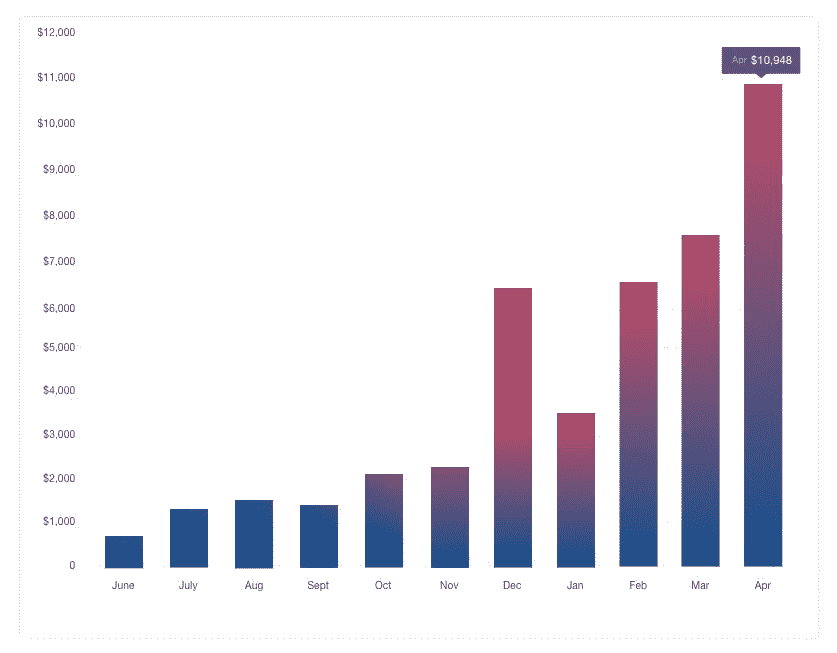

# 幕后看看我们如何增长到每月 10，000 美元

> 原文：<https://www.indiehackers.com/interview/a-behind-the-scenes-look-at-how-were-growing-to-10-000-mo-7e5c0b0115>

## 告诉我们关于你自己和你正在做的事情。

嗨，科特兰，谢谢你邀请我来这里！我叫杰森·斯莱特。我是英国利物浦的一名商科学生和数字营销人员。我现在和我的搭档 Linas Vildziunas 一起经营 CustomFilterz。

我们相遇时，我正在伦敦的一家科技创业公司工作，这是我课程的一部分。今年 3 月，当 Snapchat 发布按需地理过滤器时，我们有了一些商业想法，并正在进行另一个项目。我们很快就看到了小企业的潜力，经过一些研究，我们也发现了它们更多的用途。所以我们马上开始研究 CustomFilterz。

[CustomFilterz](https://customfilterz.com) 是首家提供地理过滤器的机构。(当时我们以“Geo Snapchat Filters”的名字运营，但 Snapchat 的律师不喜欢这个名字，所以我们改了名字。)我们是一家提供全面服务的 Snapchat geofilter 设计和 Snapchat 营销机构。我们的大部分销售额来自私人活动和商业活动的一次性 geofilters，但我们也致力于针对 Snapchat 用户群的小型企业的营销活动。

销售额每个月都在稳步增长，上个月(2016 年 12 月)是迄今为止收入最好的一个月，我们的收入刚刚超过 6500 美元。(更新:截至 2017 年 4 月，我们已经超过了每月 10，000 美元的目标。)

## 你是如何开始使用 CustomFilterz 的？

在意识到目标明确的 geofilters 可能为企业带来的潜力后，我们建立了一个基本网站，看看是否有人会购买。第一次销售花了几周时间，这是一家房地产公司在发布当天使用的地理过滤器。在接下来的几个星期里，更多的销售滚滚而来，我们确信这是有潜力的。

长期以来，我和 Linas 都有全职为自己工作的梦想。我们设定的目标是达到每月 1 万美元的收入，因为这将使我们能够专注于 CustomFilterz。这笔钱将涵盖我们的生活成本和业务成本，还留下一些钱再投资到业务。目标是在未来 6 个月的某个时间开始全职工作于 CustomFilterz。

## 你是怎么找到时间和资金来做这些的？

当我们开始做 [CustomFilterz](https://customfilterz.com) 的时候，我们都在伦敦全职工作。Linas 现在也是，但是我已经在利物浦完成了最后一年的学习。这意味着我们现在只能兼职做这个生意。很难平衡大学生活和经营企业，因为有很多课程和复习以及社交干扰。这往往意味着对许多活动说不，但长期的回报当然值得牺牲。

至于最初的地点，我们花了几周时间在晚上和周末进行规划。从那以后，我们继续投入尽可能多的时间。我们一直靠全职工作的工资养活自己，还没有给自己发工资。起初，我们都投入了少量资金来接触我们的初始客户。我们还申请了我们大学的一项资助计划，获得了 250 英镑。我们将这些投资到谷歌广告中，这有助于建立我们的客户群和设计组合。

## 你是如何吸引用户并发展 CustomFilterz 的？

在 4 月份完成网站后，第一批客户都来自于在脸书小组中手工发帖，给可能感兴趣的公司发电子邮件，以及在论坛和其他社区发帖。我发现一些买卖脸书的团体专注于短期内运作良好的婚礼。

为了锁定商家，我雇佣了一名虚拟助理来获取参加展会的公司的电子邮件地址，并设置了邮件合并来联系他们。我会简单解释我们如何帮助他们，并安排一个电话来讨论细节。这对于更大的销售很有效，在早期帮助很大。

在收到我大学的小 250 奖励后，我们开始测试谷歌和脸书的广告。很长一段时间，我们在竞选中收支平衡，有时还赔钱，因为我们没有经验。随着时间的推移，我们已经完善了广告，他们现在工作得很好。

我们的一个主要关注点一直是 SEO。我们相信，如果有人主动搜索你的产品，他们比看到侵扰性广告时更有可能购买。这更像是一项长期战略，因为到目前为止，它只占我们销售额的一小部分。我们付钱给一个博客写手，让他每周写一篇文章，我们主持一个 Snapchat 影响者问答，我自己也写一些文章。

## 你的营收背后有什么故事？

对于典型的 geofilter 设计，我们收取 49 美元。这包括在 Snapchat 上的 24 小时，所以我们支付费用。这对私人活动，如婚礼和聚会，非常有效。对于企业和营销活动，我们根据他们的需求创建一个定制包。

营销活动对我们来说更有利可图，也更有趣，所以这是我们目前关注的焦点。我们最近才开始吸引营销客户，这反映在以下收入增长中:

通常，我们的利润率在 60-70%左右。主要成本是 Snapchat 费用、PPC 广告和我们的博客。

## 你未来的目标是什么？

我们的主要目标一直是每月赚 10，000 美元，这样我们就可以全职经营业务，并且在出现问题时有一个缓冲垫可以依靠。(更新:在达到 1 万美元后，我们的新目标是每月 2.5 万美元。)经营一家如此依赖另一家企业的企业，在某些方面是有风险的。如果出于任何原因，Snapchat 失去了人气，或者人们对 geofilters 不再感兴趣，我们就必须重新开始。这就是为什么在我们有稳定的收入来源之前，我们会谨慎行事。

另一个问题是，自从我们 4 月份开始以来，无数其他 geofilter 公司也在 Etsy 和 Fiverr 上开始销售。竞争总是在增加，但需求也在增加。挑战在于让我们与众不同，这样我们才能脱颖而出。我们计划完全过渡到 Snapchat 营销，一旦我们开展了更多的活动，并获得了支持它的经验和数据，可能会使用不同的名称。

我们已经测试了部分“产品化”的 geofilters，以了解客户的反应。万圣节前夕，我们提供了一套万圣节主题模板，客户可以从中选择并定制文本以适应他们的活动。测试是成功的，我们将在假期期间重复它，作为一种更省时的创收方法。这将使我们有更多的时间致力于营销活动。

## 如果你必须重新开始，你会做什么不同的事？

如果我必须重新开始，我可能会从一开始就更关注 Snapchat 的营销方面。这个平台仍然有很多潜力和增长机会，所以还不算太晚，但我希望能参与更多的活动，而不是专注于派对和婚礼的一次性设计。

此外，由于我们最初将公司命名为“Geo Snapchat Filters ”,不得不更改名称，这使我们在原域名的搜索引擎优化方面的进展受到了阻碍。

## 你认为你最大的优点是什么？

我们拥有的最大优势之一是我们的技能。Linas 是一名网页开发和设计人员，而我是一名数字营销人员，所以我们拥有启动和发展业务所需的所有技能。我也很幸运地在 Snapchat 营销社区中与其他企业家联系，他们给了我一些很好的建议，帮了我很多。

## 我们可以从哪里了解更多信息？

我在 [CustomFilterz 博客](https://customfilterz.com/blog)上写下了我们每月一万美元的旅程。您可以在那里更深入地了解这一历程，以及我们在这一过程中取得的成功和犯下的错误。

你可以在 twitter [@jasonslaterio](https://twitter.com/jasonslaterio) 和 Linas [@linasv_](https://twitter.com/linasv_) 上关注我。我的邮箱是 [【邮箱保护】](/cdn-cgi/l/email-protection#3852594b5756785b4d4b4c57555e51544c5d4a42165b5755) 。

你也可以在下面留言，我会尽量回复你的！

—[<picture id="ember5202527" class="user-avatar ember-view user-link__avatar"></picture>贾森·斯莱特](/jasonslater?id=oonQFaT53ucu1zHmJDLfRCRCf5a2)，CustomFilterz 的创建者

## 想像 CustomFilterz 一样建立自己的事业？

你应该加入独立黑客社区！🤗

我们是几千名创始人，互相帮助建立有利可图的业务和副业。来分享你正在做的事情，并从你的同事那里获得反馈。

还没准备好开始使用你的产品吗？没问题。这个社区是一个认识人、学习和实践的好地方。随意[随便浏览](/)！

——[<picture id="ember5202532" class="user-avatar ember-view user-link__avatar"></picture>柯特兰艾伦](/csallen?id=ibTLPyjwVebnZjMGKvz6ztarnuV2)，独立黑客创始人

4votes