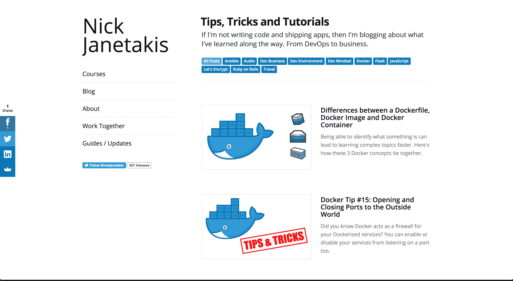
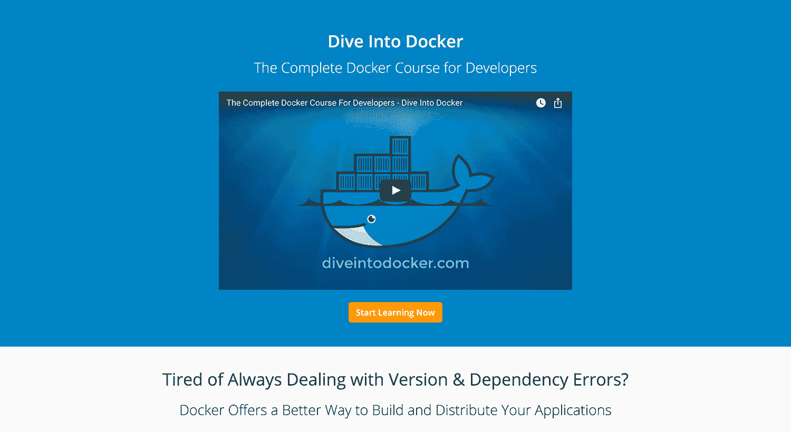
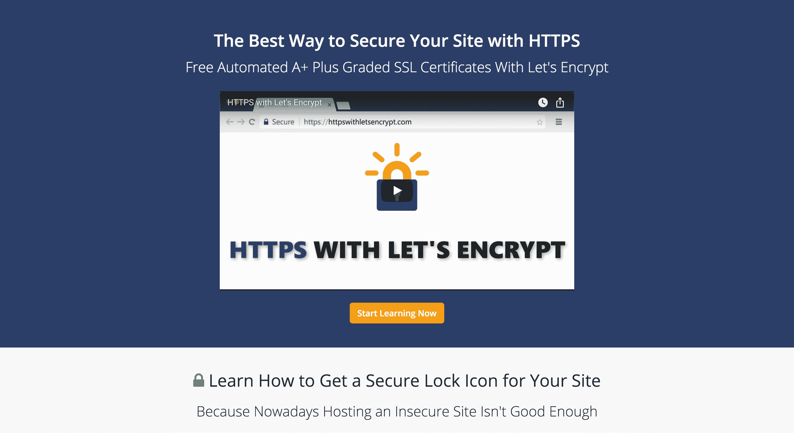
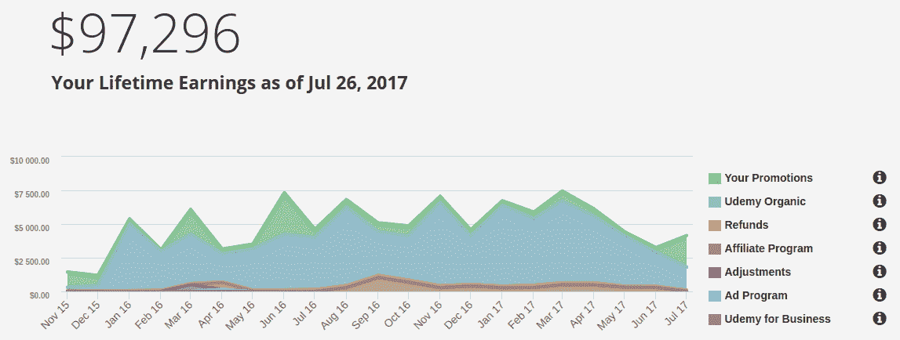

# 制作在线课程的速成课程

> 原文：<https://www.indiehackers.com/interview/a-crash-course-on-what-it-takes-to-produce-online-courses-fb595b82df>

## 你好！你的背景是什么，你在做什么？

大家好，我是 [Nick Janetakis](https://nickjanetakis.com) ，一名自学成才的全栈式 web 开发人员和教师，他更关注 DevOps 方面的事情。

我已经写了大约 20 年的代码，并且大部分时间都在做自由职业者的咨询工作。几年前，我想尝试教授在线课程，现在我把时间集中在编写内容上，但我仍然做自由职业者的工作，也从事自己的兼职项目。

在过去的 18 个月里，我已经教了 20，000 多人关于 Docker 和其他开发人员相关的主题。在整个过程中，我的课程相关收入约为 165，000 美元。每月的明细有点乱。有时是 4000 美元，有时是 15000 美元。

 

## 是什么促使你开始学习在线课程？

我遇到了咨询收入放缓的困境，于是我灵机一动，想出了如何在不申请工作的情况下创造另一种收入来源的方法。很久以前，我就发现自己不适合做传统的朝九晚五的员工，但那是以后的事了。

我通过创建一个为期 30 天、花费 12000 美元的 [Kickstarter](https://www.kickstarter.com) 活动来制作一个[烧瓶](https://buildasaasappwithflask.com/)课程，从而验证了在线课程的想法。对于我为什么特别选择弗拉斯克，没有任何理由。我个人使用它已经有一段时间了，我认为它是一个非常棒的网络框架。

我没有追随者或导师，也不知道自己在做什么——尤其是在为 Kickstarter 进行营销活动的时候。但我很幸运:在竞选活动只剩下几个小时的时候，一位澳大利亚商人几乎支持了整个项目。这是一次为期 30 天的冒险。

你可以说我很幸运……但是如果我什么都没做，这一切就不会发生了。

TweetShare

我的后备计划是即使活动失败也要创建球场，但通过活动取得的成功鼓舞了我的信心，这可能真的会奏效。如果不是因为我新认识的澳大利亚朋友，我不确定我今天还会创造课程。

你可以说我很幸运，我绝对不会否认这一点，但我喜欢认为是你自己创造了自己的运气。这个机会的到来仅仅是因为我把自己置身于危险之中，并采取了某种形式的行动。如果我什么都没做，这一切就不会发生了。

## 最初的课程是怎样组成的？

创建这个球场需要很多技能。我，一个内向的软件开发人员，突然有机会制作一个没有教学经验的视频课程。更糟糕的是，我对音频或视频编辑一无所知。但是，嘿，谁不喜欢好的挑战呢？

我没有自己创业的导师或朋友，所以我不得不从书中学习一切。

TweetShare

说实话，入门没花多少钱。我从朋友那里借了一个麦克风，花 99 美元买了一个 [Camtasia](http://discover.techsmith.com/camtasia-9-brand-try-buy/) 牌照。我现在仍然使用这个程序来录制和编辑视频，但是我已经升级了几次我的麦克风。我贴了一张[最新的硬件和软件](https://nickjanetakis.com/blog/the-tools-i-use)清单，我在我的网站上使用这些东西。

虽然开始并不需要花很多钱，但确实花了很长时间。对于技术课程，您需要创建课程的所有源代码和示例，在多种设备上彻底测试，然后围绕这些内容创建课程计划。

制作第一道菜花了我大约三个月的时间，每周工作 70-80 个小时。我暂停了所有的自由职业工作(除了维护现有的客户),不停地工作直到完成。我甚至完成了 Kickstarter 的最后期限。

我写了大约 90，000 字的脚本来帮助我讲述课程，整合了一个大规模的 4，000+行 Flask 应用程序作为示例应用程序，并准备了所有的幻灯片。这只是工作的一半。另一半是录制和编辑视频。

我仍然为我的[当前课程](https://nickjanetakis.com/courses/)做着几乎相同的事情，但是我已经极大地优化了工作流程，同时极大地提高了生产质量。如今，我可以在大约两个月内完成一门 5 小时的课程，同时工作一半的时间，这让我有时间写更多的博客和从事新的自由职业。

## 你是如何吸引用户和增加流量的？

我最初推出了我的第一门课程，之前没有任何听众。我所做的只是在机会出现时在 Reddit 和黑客新闻上发布回复。我并没有真正推销这门课程。相反，我会给任何提问的人提供高质量的回答，然后在最后提出课程建议，如果他们想深入研究的话。

老实说，我还没有达到拥有自己庞大观众的地步。我的电子邮件名单上只有不到 3000 人，社交粉丝也很少。见鬼，我甚至没有脸书账户。

我所做的就是低着头写博客，这是我过去两年来一直在做的事情。在过去的 6 个月里，我每周发两次帖子。我每个月有大约 12，000 个独立访问者，但是我的博客有很多与我的课程无关的帖子。

制作第一道菜花了我大约三个月的时间，每周工作 70-80 个小时。

TweetShare

例如，我最近的课程， [HTTPS 的《让我们加密》](https://httpswithletsencrypt.com)，以及[的《深入 Docker》](https://diveintodocker.com)，并没有从人们看到的关于[如何为软件开发人员挑选一个好的显示器](https://nickjanetakis.com/blog/how-to-pick-a-good-monitor-for-software-development)的博客帖子中获得太多线索。

最近，我一直试图通过制作更有针对性的免费内容来改善这种情况，比如在任何与 Docker 相关的博客帖子底部的 Docker 电子邮件课程的免费介绍。它在 Docker 访问者感兴趣的主题上免费提供了一些有价值的东西，这自然会导致购买付费课程。

 

那只是最近才增加的，但它显示出了希望。这是一个 5 天的迷你课程，还没有人退订。这也导致了一些销售。

我没有尝试过付费广告——主要是因为我自己是一名软件开发人员，我知道我有多鄙视广告。我有 0.00000001%的可能会考虑通过付费广告购买学习资料。也许我最终会因为这样的偏见而伤害到自己，但我喜欢认为我的心态和其他开发者相似。

总的来说，我每月从我所有的课程中卖出大约 90 份有机拷贝，但这仅仅包括我个人的营销努力，即写博客和在与我的课程相关的论坛上发帖。

这是一个非常长期的方法，如果你自己刚刚开始内容创作，不要期望立竿见影的效果。很可能需要几年时间才能实现。但好的一面是，你可以从第一天开始就通过其他渠道用你的课程创收。

## 你的商业模式是什么，你是如何增加收入的？

目前，我一次性购买每门课程，包括更新和全职支持。(剧情转折:从我开始做这个到现在，我已经回答了将近 4000 个问题了。)

开设课程的一个有趣的副作用是，人们会开始用其他付费机会联系你，比如自由职业和演讲。这是一个很好的组合，自然会带来多种收入来源。

自我推销的有机食品销售额在每月 3000 美元左右，当我推出一门新课程时，销售额会激增。例如，我三个月前发布的 [Dive Into Docker](https://diveintodocker.com) 课程到目前为止已经赚了 22，000 美元，其中大部分发生在第一个月。

《让我们加密吧》中的《潜入码头》和《HTTPS》都是由一个名为《Thinkific》的第三方课程托管后端托管和销售的。现在他们完成了工作，这让我不用花几个月的时间创建自己的托管课程后端。

 

我也使用第三方市场，比如 Udemy T1，来学习我以前的课程。事实上，我最初就是这样开始的。我对他们又爱又恨。一方面，它们为我的课程收入提供了相当大的一块，但另一方面，我的目标之一是建立自己的受众，并消除我对 Udemy 的依赖。这就是为什么我的最新和即将推出的课程不会在那里出售(最有可能:)。

Udemy 的问题是，他们经常以 10 美元的价格出售你的课程，然后拿走 50%。此外，与任何其他市场一样，他们有疯狂的搜索算法来惩罚旧内容，教师对许多事情一无所知。最大的缺点是他们不给你访问自己学生的信息，如电子邮件地址，这实质上是把你锁在他们的围墙花园里。

此外，随着你所在领域的竞争加剧，你可能会突然醒来，发现一门课程从 150 美元/天降到了 20 美元/天，除了开设新的课程，你对此无能为力。

以下是我在 Udemy 上的终生收入:

从这个图表中可以看出，2017 年 3 月，我开始在 Udemy 上损失大量收入，但最终并没有完全亏损。损失的收入现在来自我在 Udemy 之外的自我推销。

在费用方面，我目前每月为[thinkfic](https://www.thinkific.com?sa=c78c0c471f)支付 99 美元，每月为在[数字海洋](https://m.do.co/c/0a14c0d916b3)上托管我的个人网站和课程登陆页面支付 10 美元。Udemy 不收取月费，但他们会收取你收入的 50%。

我在这里学到的最大教训是，使用市场可以在早期给你带来可观的收入，但你几乎是在向魔鬼出卖你的灵魂。如果你从第一天起就有能力独立做事，从长远来看，你可能会过得更好。只要明白风险要高得多，因为在你做出任何东西之前的周转时间可能是几年(或者永远不会)。

## 你未来的目标是什么？

我花了很长时间才发现我真的喜欢创作内容，如果我们生活在一个金钱不重要的世界，我肯定我会免费做这件事。

最终，我只是希望能够在没有任何经济压力或依赖单一地点的情况下环游世界。如果我能做到这一点，同时通过分享我所学到的一切，让其他开发人员的生活变得更轻松，那我会笑逐颜开。对我来说，这就是实现梦想。

我做这个不仅仅是为了钱，但是我承认，我确实幻想过漫游地球，同时每月挣 45，000 美元以上，并且永远不用担心自己或未来家庭的收入。

如果我们在谈论个人目标，我想一边听死亡金属一边探索世界上各种各样的洞穴。当然，我会在一整天的休息时间里回答人们对我的课程的任何问题。).

展望未来，我将继续创造内容，并希望有东西坚持下去。

我知道这不会是一条容易的路，我预见到有两个障碍我需要首先通过:

1.  因为有太多的信息在流动，现在很难在任何事情上获得关注。
2.  我自己。当你花了 300 多个小时在一件事上，你倾注了一切，花了将近半辈子的经验，但它没有得到你希望的结果，这真的会令人沮丧。

## 你面临的最大挑战和克服的障碍是什么？

最大的挑战是低估了制作和销售视频课程的投入。即使你忽略了所有你需要学习的创造课程的新技能，还有它的整个营销方面。

例如，我至少花了 100 个小时研究麦克风，但这比不上我花在学习如何销售产品上的时间。我没有自己创业的导师或朋友，所以我不得不从书中学习一切。我一直在研究和尝试改进。这是一个永无止境的过程，但我很享受。

## 如果你必须重新开始，你会做什么不同的事？

我做的最糟糕的决定是变得懒惰。有 6 个月的时间，我没有制作新的课程，因为我以前的课程在 Udemy 上做得很好，但作为 Udemy 时代的技术课程，它们往往在很长一段时间内得到更差的评级和排名。

我被这一重大时刻弄得措手不及，因为有一天我醒来，意识到我的一门课程从 4.7 的评级和某个特定领域的排名第一的课程下降到 4.2 的评级和页面中间的排名。除了时间以外，什么都没有改变，但是今天这个课程每天的收入比以前少了五分之一。这不是一夜之间发生的，而是我没有足够重视。

还有一个正在进行的斗争，我想知道，“我应该把我的新课程放在 Udemy 上吗？”这真的让它付出了代价。经常处于犹豫不决和不确定的状态是很有压力的。

如果我从第一天开始，在同样的财务状况下，我会走我最初走的路，除了我会花更多的时间学习如何以一种吸引人的、非机器人的方式说话。我花了几门课才达到听起来不那么单调的地步。

从来没有人直截了当地告诉我，我以前的课程讲授得很差，但当我回头看这些课程时，我真的很害怕。甚至比我在最新的“恭喜你完成课程”视频中尝试为 [HTTPS 演唱](https://httpswithletsencrypt.com)时还要难。

## 有没有发现什么特别有帮助或者有优势的？

我试图创造能引起我兴趣的产品。例如，在我录制的课程中，我避免叙述文档和查看玩具示例。

我有 0.00000001%的可能会考虑通过付费广告购买学习资料。

TweetShare

在我的书中，它是“生产就绪”或者什么都没有，所以我的目标是要么解决现实世界的问题，要么让内容变得非常实际，你跟着做，而不是被动地看。

我通常会介绍“刚刚好”的理论，然后做很多事情。在成百上千的评论中，我发现一个共同的趋势是几乎每个人都喜欢这种学习方式。

最后，我已经坚持了几个月的一个习惯是定期发布一些新东西。每周二和周五我都会发布一篇新文章。有时候是详细的教程，有时候是比较小的提示。不管是什么情况，都是有原因的。

## 对于刚刚起步的独立黑客，你有什么建议？

不要把任何事情看得太重，总是把时间和精力花在你能控制的事情上。

例如，如果有人对你的课程留下差评，比如“你的课程是有史以来最糟糕的，你太烂了！”但是接下来，另外 150 个人说这是一次很棒的经历，他们很喜欢，你需要能够刷掉单一的负面评论，并加倍关注对你有用的东西。

训练自己想出不止一个“正确答案”，因为在经营企业或创造任何东西时，都没有单一的正确答案。你可以用十几种不同的方法做事情，它们都可能成功或失败。只要不断测试，用事实来指导你的决定。

不断寻找机会，不要害怕花时间集思广益。例如，当我写下这个答案时，我真的在想*“刚刚回答了所有这些问题，我相信任何有动力的开发者都可以在 60 天内开始从他们的第一个在线课程中获利，而不需要任何预先的观众或付费广告。”*

在这次采访中，我没有隐瞒什么，但我们只是触及了表面(由于时间限制)。如果你对如何在学习我过去两年所学的一切的同时重复这一过程的分步课程感兴趣，那么请通过填写这张[有两个问题的谷歌表格](https://goo.gl/forms/yk4VQFnAjmG5KxZW2)让我知道。如果有足够的兴趣，它很可能是我的下一门课程。(顺便说一句，这是一个预先验证想法的真实例子——而且是凭空出现的！)

同时，这里有两本书是我去年读过的，它们彻底改变了我的想法，让我的生活变得更好:

*   [如何赢得朋友并影响他人](http://amzn.to/2uBqheK)，戴尔·卡耐基著
*   罗杰·冯·奥克的《头部侧面的重击》

## 我们可以去哪里了解更多？

我的[个人网站](https://nickjanetakis.com)包含了一堆关于一般软件开发/DevOps 主题的免费文章和指南，以及我已经发布的[课程列表](https://nickjanetakis.com/courses/)。

你也可以在推特上通过 [@nickjanetakis](https://twitter.com/nickjanetakis) 找到我。顺便过来打个招呼。

最后，如果任何人有任何问题，请在下面的评论中发表，我会尽力回答大家。

又及，特别感谢科特兰和钱宁。他们在培养独立黑客方面做得非常出色，我非常感谢成为这个社区的一员。

——[<picture id="ember8047988" class="user-avatar ember-view user-link__avatar"></picture>尼克贾纳基斯](/nickjanetakis?id=SVA2DOkrTqSglYSZEGS7c84teyS2)《尼克贾纳基斯》的创作者

## 想像尼克·詹纳基斯一样建立自己的事业吗？

你应该加入[独立黑客社区](/)！🤗

我们是几千名创始人，互相帮助建立有利可图的业务和副业。来分享你正在做的事情，并从你的同事那里获得反馈。

还没准备好开始使用你的产品吗？没问题。这个社区是一个认识人、学习和实践的好地方。随意[随便浏览](/)！

——[<picture id="ember8047993" class="user-avatar ember-view user-link__avatar"></picture>考特兰艾伦](/csallen?id=ibTLPyjwVebnZjMGKvz6ztarnuV2)，独立黑客创始人

9votes