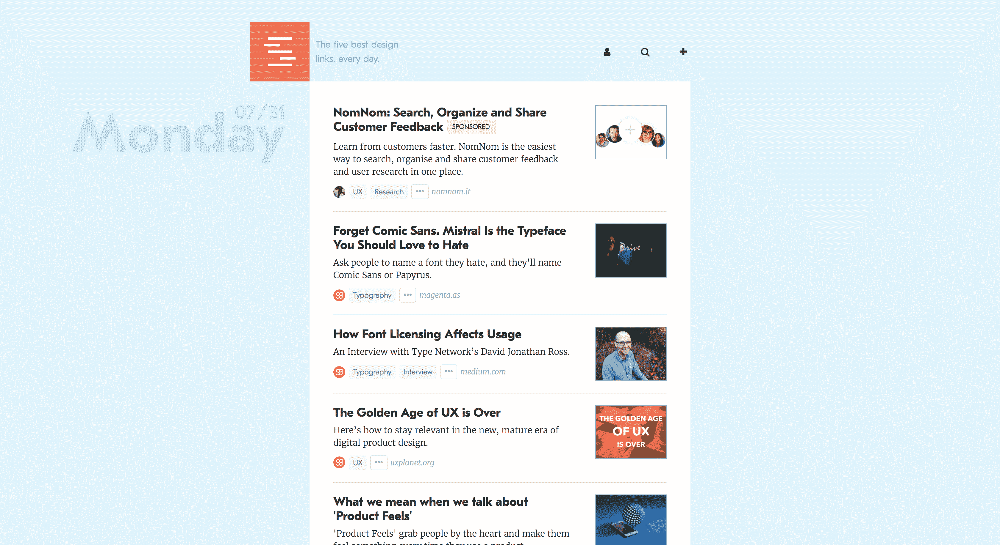
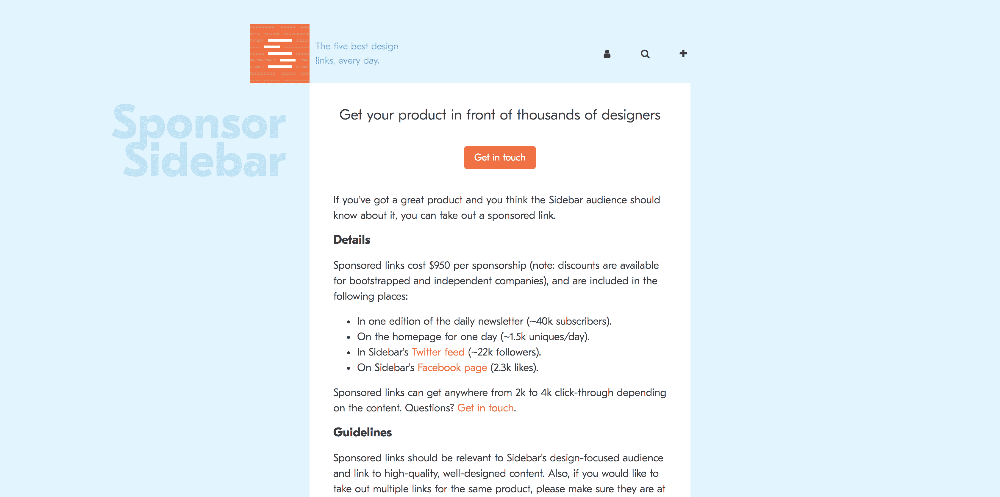

# 一份促进交通的时事通讯成了我最大的收入来源

> 原文：<https://www.indiehackers.com/interview/a-newsletter-for-driving-traffic-became-my-top-revenue-source-232c4174c1>

## 你好！你的背景是什么，你在做什么？

我叫 Sacha Greif，虽然我来自法国巴黎，但我现在住在日本大阪。

我有一个相当折中的背景，因为我有一个计算机科学的学位，但后来我职业生涯的大部分时间都是作为一名自由 UI 设计师度过的。我现在处于中间位置:我花了大部分时间编码，但通常迟早会有设计元素参与到我的所有项目中。

至于[侧边栏](https://sidebar.io/)，是一个每日快讯的手选设计链接。这是一个很好的方式来跟上设计新闻(这是任何设计师工作的重要部分)，而不会被所有的噪音淹没。

Sidebar 有大约 4 万名订户，是我目前的主要收入来源，平均每月从赞助链接中获得 3000 美元。

 

## 是什么促使你开始使用侧边栏？

我最初创建[侧边栏](https://sidebar.io/)是为了给我的一个名为 Folyo 的现已不存在的项目增加流量，fol yo 是众多试图撮合公司和设计师的网站之一。

我通过写一些与开发相关的文章，成功地登上了黑客新闻的顶端，但是我写的关于设计的文章从来没有得到任何关注。因此，侧边栏的最初想法是填充“设计师的黑客新闻”空间。当时，[设计师新闻](https://www.designernews.co/)还不存在。事实上，它碰巧在侧边栏的一个月内推出！

老实说，时事通讯的概念(一天五个链接)是各种各样的“挑逗”版本，一种在我向公众发布帖子、评论、投票等开放网站之前启动观众的方式。

我甚至花时间构建了所有这些额外的功能，但后来我意识到我的 teaser 概念本身做得很好。坦白地说，我害怕公开发布会导致内容质量下降。因此，与其冒险，我决定坚持时事通讯的想法。

## 构建最初的产品需要什么？

构建[侧边栏](https://sidebar.io/)的故事本身非常有趣，因为它将我引向了一条我从未想象过的道路。

与任何新项目一样，第一步是选择一个技术堆栈。我想使用 Node，但对它了解不多(也没有办法外包工作)，所以我招募了一名开发人员，为他们的项目提供我的设计帮助，以换取侧边栏的编码帮助。

然而，这位开发人员在大约一周之后就失踪了，与此同时，一位朋友不约而同地提到了这个名为 [Meteor](http://meteor.com) 的新兴 JavaScript 框架。

几个月内发生了几件事:我对《流星》产生了浓厚的兴趣；我用它来构建侧边栏；我决定开源我所有的工作；最后，我决定把我新获得的知识写成一本关于流星的书，《发现流星》(与[汤姆·科尔曼](https://twitter.com/tmeasday)合著)。

拥抱你的 ADD！如果我太固执…我可能永远不会给边栏的概念一个机会。

TweetShare

本书中的开源应用变成了[望远镜](http://telescopeapp.org)，并最终转化为 [VulcanJS](http://vulcanjs.org) ，一个新的 React & GraphQL 应用构建框架，事实上我正在用它来驱动最新版本的侧边栏。

Discover Meteor 不仅成为最受欢迎的关于 Meteor 的书，而且[还是一个极其赚钱的项目](http://blog.gumroad.com/post/97148570338/discover-meteor-case-study-making-300000-from-a)，比一般的编程书多一个数量级的收入。

因此，就像侧边栏演变出了我推广 Folyo 的愿望一样，VulcanJS 和 Discover Meteor 都是需要学习一个新框架来构建侧边栏的结果。

但是，虽然这些年来我在从事其他项目时可能会忽略侧边栏，但我总是让它继续下去。事实上，自从五年前推出以来，我没有错过一天的链接！

## 你是如何吸引用户并发展侧边栏的？

我在推动[侧边栏](https://sidebar.io/)的用户增长方面做得相当糟糕。自最初的发布高峰以来，过去五年的增长一直相当缓慢，尽管很稳定，但这主要是因为我个人的邮件列表中有大约 5000 封电子邮件。

我每年增加大约 2000 封新邮件，这并不算什么，但当你知道其他流行的设计通讯拥有成千上万的读者时，这也没什么了不起的。

我认为增加简讯读者的困难之一是，与博客不同，简讯本身不是目的地。除非增加新功能，否则时事通讯不会像病毒一样传播或成为头版新闻。更不用说，你可以添加到一个好的 HTML 电子邮件中的功能是有限的。

事实上，我对未来的挑战之一是找到一些可靠的增长战略:无论是创造原创内容(也许是播客？)，建立合作关系，或者尝试广告，我真的想找到一种方法来确保侧边栏保持增长。

## 你的商业模式是什么，你是如何增加收入的？

侧边栏的商业模式非常简单:每周一次，五个链接中的一个将成为赞助链接。换句话说，每月 150 个链接中有 4 个是赞助的，每个赞助花费 950 美元。

我最初收取 250 美元，然后是 400 美元，但即使是 400 美元，我的库存也在 6 个月前就卖光了。因此，大约一年前，我决定提高价格，尽管与以前相比，填补所有空缺有点困难(如你所料)，但总体收入增加了，所以我认为这是一个正确的决定。

 

我的一个遗憾是，较高的价格点往往针对更大的公司，如 Adobe，Hired 等。，这很好，但也取消了许多负担不起的独立开发者和设计师的资格。出于这个原因，我一直在考虑为较小的团队引入“独立折扣”。

我最近还使用 Stripe 实现了完全自动化的链接调度和支付流程，这大大减轻了我的工作量，也确保了我不会忘记收款。

虽然有趣的是，我怀疑当人们不得不通过电子邮件手动联系时，我的转化率可能会更高。毕竟，对于这种规模的购买，你可能想先和一个真正的人交谈。出于这个原因，我正在考虑隐藏我的注册流程，只在第一次邮件联系后才让人们看到它。

## 你未来的目标是什么？

就像我说的，我想探索增加[侧边栏](https://sidebar.io/)注册的方法。

我还刚刚推出了一个求职板，这可能成为另一个收入来源。为了帮助我为它建立一个线索列表，我已经通过 [Upwork](https://www.upwork.com/) 雇佣了一个人来浏览竞争职位公告板，并为我找到最近发布设计职位的所有公司的联系电子邮件。然后，我拿着这份名单浏览了一遍，给每家公司都发了电子邮件，如果他们尝试一下侧边栏上的招聘信息，我会提供折扣。

但现在还早，还没来得及推广，所以没有什么硬性数字。

## 你面临的最大挑战和克服的障碍是什么？

我认为[工具条](https://sidebar.io/)最大的挑战是——讽刺的是——我其他项目的成功。毫无疑问，如果我 100%专注于侧边栏，它会变得更大。

但这并不意味着我有任何遗憾。给 Sidebar 应有的重视还不算太晚，而且我现在也有了一本编程书籍和一个开源框架！

如果你每天一遍又一遍地做这件事，它实际上会变成一个不错的收入来源。

TweetShare

有时候我真的在想，如果我坚持我最初的愿景，把边栏变成一个真正的论坛，而不是仅仅坚持时事通讯，会发生什么。它现在会是一个充满活力、充满爱心的社区，还是一个虐待狂的巢穴？或者更现实一点，一个空空的鬼城？我想我们永远不会知道。

## 对于刚刚起步的独立黑客，你有什么建议？

我想我的主要建议是不要忽略哪怕是最小的想法。每天给人们发送五个链接可能听起来太简单了，永远不会成为一项业务，但如果你每天都这样做，它最终会变成一个不错的收入来源。

另一件事是保持开放的心态——或者，如果你喜欢，拥抱你的 ADD！如果我过于固执地坚持我最初的论坛想法，我可能永远不会给[侧边栏](https://sidebar.io/)的概念一个机会，如果我过于关注侧边栏，我可能会错过一些巨大的机会。

## 我们可以去哪里了解更多？

如果你想了解更多关于我的项目，你可以[查看我的个人网站](http://sachagreif.com)或者[在 Twitter 上关注我](http://twitter.com/sachagreif)。当然，如果你想了解更多，请不要犹豫，在下面留下你的评论。

我还刚刚启动了一个名为 [IndieDojo](http://indiedojo.co) 的全新项目，这是一个今年秋天在日本京都为创业者和独立黑客举办的训练营。这个想法是尝试并教会创业者所有他们需要的软技能，以增加他们成功的机会:设计、品牌、营销、用户获取等。如果这听起来很有趣，不要犹豫去看看，甚至可以申请这个项目！

最后，如果您也想快速构建和启动项目，也可以看看 VulcanJS ！

—[<picture id="ember8107901" class="user-avatar ember-view user-link__avatar"></picture>萨查](/Sacha?id=evSYuYfnWVVaNfEwnSYOXfcPEb23)，侧边栏创建者

## 想像侧边栏一样建立自己的事业？

你应该加入[独立黑客社区](/)！🤗

我们是几千名创始人，互相帮助建立有利可图的业务和副业。来分享你正在做的事情，并从你的同事那里获得反馈。

还没准备好开始使用你的产品吗？没问题。这个社区是一个认识人、学习和实践的好地方。随意[随便浏览](/)！

——[<picture id="ember8107906" class="user-avatar ember-view user-link__avatar"></picture>考特兰艾伦](/csallen?id=ibTLPyjwVebnZjMGKvz6ztarnuV2)，独立黑客创始人

19votes