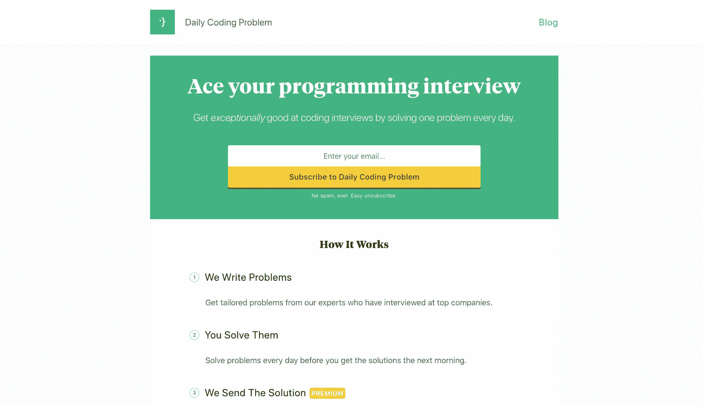
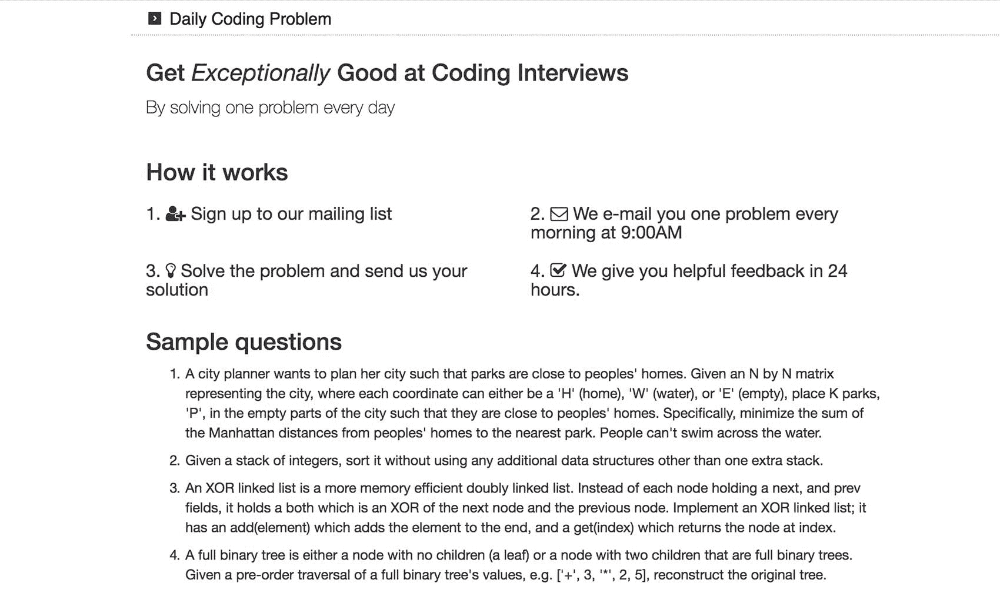
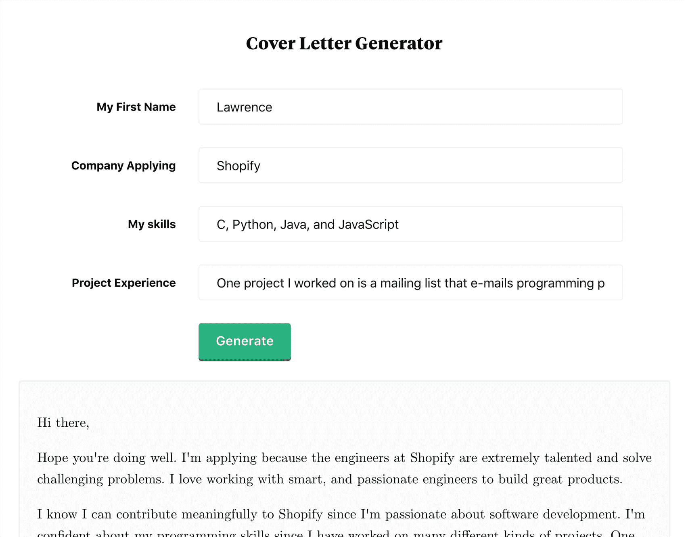

# 避免特性蔓延，发展有利可图的编码时事通讯

> 原文：<https://www.indiehackers.com/interview/avoiding-feature-creep-and-growing-a-profitable-coding-newsletter-a2b57cca87>

## 你好！你的背景是什么，你在做什么？

嗨！我叫劳伦斯，我和我的联合创始人 Jae 一起解决[日常编码问题](https://www.dailycodingproblem.com)。我们的背景是计算机科学，我们在多伦多大学学习。

我们是一个技术面试准备服务，每天发送一个面试编码问题。我们在大学四年级的时候开始解决日常编码问题，但是几个月前才公开发布。从那时起，我们每月的经常性收入已经增长到近 3，000 美元。

 

## 是什么促使你着手解决日常编码问题？

大学高三的时候，我和朋友在准备技术面试。每天，我都会给我们的群聊发送一个“今日面试问题”,我们会争先恐后地完成它。当他们开始收到一些公司的邀请，并认可我的日常面试问题时，我不仅非常高兴，还好奇这是否能成为一门生意。我经历过很多编程面试，甚至接受过一些面试，所以我肯定在这个领域有很多专业知识。

我受到一些事情的启发，尝试了一个邮件列表。一个是你对斯科特的廉价航班的采访，这是一个惊人的和伟大的阅读。第二个是本·汤普森的战略，我非常喜欢。我基本上对订阅时事通讯的状况和盈利能力持乐观态度。那时我还在上学，所以我想我可以利用我的专业知识赚点啤酒钱。现在我们赚租金了！好吧，至少在旧金山以外的地方租房子。

## 构建最初的产品需要什么？

在做简讯之前，我想建立一个完整的平台，有一个在线法官来运行你的代码、社交功能和一堆其他垃圾。相反，为了避免花费数周时间来构建它，我们花了一个晚上来构建一个登录页面来验证我们的产品，并在 Hacker News 上发布。至少可以说，这是最基本的:

 

那并没有得到太多的关注。但是我们开始写博客，并把它们发布在 Hacker News 和 reddit 上(特别是/r/programming 和/r/compsci)。一些受欢迎的网站点击率很高，这就是我们获得首批客户的基本方式。

我们做的最有利的事情是关注速度。

TweetShare

我们确实是从很少的开支开始的。我们用 Heroku，Sendgrid，Netlify 和 Namecheap。我们第一个月大概总共花了不到 50 美元。我们拥有的大部分资源都花在了撰写精彩的问题和解决方案，以及构建发送电子邮件的技术基础设施上。这是我们的成本明细:

*   分条:2.9% + 30 /交易
*   heroku:7 美元/月
*   Sendgrid:每月 10 美元(我们现在有一个更大的计划，每月 80 美元)
*   免费
*   名字便宜:10 美元/年

这似乎是一个很高的利润，但考虑到我们写新问题和解决方案、编辑旧内容和帮助读者的时间，实际上并不多。

## 你是如何吸引用户并解决日常编码问题的？

作为邮件列表的一个好处是，对于困难和有趣的问题，人们倾向于通过转发我们的电子邮件来自然地分享它们。因此，我们已经多次检查了我们的问题列表，以确保问题清晰、简洁、有趣且有帮助。我认为这是值得的:我们现在有更多的用户给我们发邮件讨论问题，这似乎表明他们也会与朋友分享这些问题。

我们吸引用户的另一种方式是通过我们的博客。我们已经发布了关于[面试策略](https://www.dailycodingproblem.com/blog/how-to-formulaically-solve-tree-interview-questions/)、[问题解决技巧](https://www.dailycodingproblem.com/blog/how-to-solve-a-hard-programming-interview-question/)、和[编程概念指南](https://www.dailycodingproblem.com/blog/an-introduction-to-backtracking/)，以及[实际](https://www.dailycodingproblem.com/blog/graph-coloring/) [例子](https://www.dailycodingproblem.com/blog/unival-trees/)[我们的](https://www.dailycodingproblem.com/blog/longest-increasing-subsequence/) [问题](https://www.dailycodingproblem.com/blog/anagram-indices/) [和](https://www.dailycodingproblem.com/blog/staircase-problem/) [解决方案](https://www.dailycodingproblem.com/blog/how-to-find-arbitrage-opportunities-in-python/)。这让我们有了一些有机观众，他们注册了我们的邮件列表。

最后，我们最近一直在尝试的另一个想法是为我们的观众构建有用的工具。最近的一个是我们的[求职信生成器](https://www.dailycodingproblem.com/coverletter)。当我申请工作时，我厌倦了为每个公司写求职信。所以我认为制作一个定制的求职信生成器会很有用(而且有点好笑)。它在产品搜索上获得了 [#2 产品，在/r/cscarerierquestions](https://www.producthunt.com/posts/cover-letter-generator)上获得了 [#1 产品。](https://www.reddit.com/r/cscareerquestions/comments/855maw/i_got_tired_of_writing_cover_letters_so_i_built_a/)

我们的求职信生成器从 reddit 和 Product Hunt 吸引了超过 1 万名独立访问者:

 

## 你的商业模式是什么，你是如何增加收入的？

我们使用免费增值模式。可以订阅，免费获取面试问题。付费订阅每月花费 9 美元(或者如果你承诺一年，每月花费 7.5 美元)，你可以获得每个问题的深入解决方案。

我们马上开始收费，因为我们想做一个可行的生意。当我们最初的一篇博文最终登上《黑客新闻》的头版时，第一天我们就获得了 150 美元的订阅。这就是我们需要的所有验证，我们很快开始实际构建我们的产品和基础设施。

根据 ChartMogul 的数据，以下是我们过去 5 个月的每月经常性收入:

| 月 | 收入 |
| --- | --- |
| 2017 年 11 月 | 235 |
| 2017 年 12 月 | 715 |
| 2018 年 1 月 | 1942 |
| 2018 年 2 月 | 2210 |
| 2018 年 3 月 | 2850 |

我们一直在通过持续营销和改进产品来增加收入。例如，我们注意到，在第三个问题之后，我们的用户倾向于以更高的比率取消订阅。我们研究了一下，意识到这个问题可能太难了，所以我们用一个更简单的问题代替了它，并把那个问题往后移了一点。我认为像这样的小调整有助于减少流失，总的来说，它只是让我们的服务更好。

## 你未来的目标是什么？

我们的目标是继续为我们的读者提供更好的问题和解决方案。我在上面提到了这一点，但由于邮件列表的病毒性质，我认为我们能做的最有效的事情是确保我们的产品是伟大的。为此，我们的每封电子邮件都有一个 CTA 用于反馈。所有用户所要做的就是回复我们的邮件！这让我们可以获得人们不太清楚的问题和解决方案的反馈。

我们还想建立更多有用的工具。它们很有趣，可重复使用，非常适合营销。我们的求职信生成器每天仍然会收到数百个独特的内容，其中一些会变成付费订阅，这很好。

做更多的实验而不是构思，即使是在你认为不一定行得通的事情上。在一天结束的时候，当你真正尝试一些事情并失败的时候，你会学得更好。

TweetShare

我们也在考虑与公司合作，出售广告空间，就像软件工程日报和 T2 的廉价航班一样，或者甚至推荐潜在的候选人。如果你是一家感兴趣的公司，[随时给我们发电子邮件！](/cdn-cgi/l/email-protection#1771786279737265645773767e7b6e7478737e7970676578757b727a3974787a)

## 有没有发现什么特别有帮助或者有优势的？

我们做的最有利的事情是关注速度。在我看来，这意味着知道我们的动机是什么，并做那些事情。虽然我们有大量积压的任务和优先事项，但我们倾向于先做简单的任务。这就建立了快速的胜利，我认为这就建立了动力。

另一个有点相关的想法是快速向客户交付价值。这听起来可能是显而易见的，但我认为这很容易忘记。对于我们这些黑客来说，尝试自动化、降低成本、尝试新技术或过早采取长期举措是非常诱人的。例如，一开始，我们没有自动化，而是通过 Gmail 手动发送电子邮件，因为用户根本不在乎它是否自动化。这也让我们有时间与用户交流，并帮助他们确保我们在构建人们想要的东西。

最后，大幅削减功能范围。这不仅有助于你更快地推出和传递价值，而且有点矛盾地帮助你的产品在客户心目中扎根。每天一个编码题和社交技术面试平台哪个更容易把握？就像那句 UNIX 格言:“做一件事，并把它做好。”

 

## 对于刚刚起步的独立黑客，你有什么建议？

我的一个建议是做更多的实验而不是构思，即使是在你认为不一定会成功的事情上。在一天结束的时候，当你真正尝试一些事情并失败的时候，你会学得更好。你发现真实的事情可能与你期望的大不相同。

另一件事就是发射。当我们发布的时候，只有一个登陆页面，这让我感到非常尴尬，但是这让我们比我建立的任何产品都走得更远，直到它们变得完美，才低调地发布。

写完这篇文章后，我意识到这些听起来很老套，但这完全是真的。所以只要试一试，然后启动它。

## 我们可以去哪里了解更多？

我希望这有所帮助！你可以在这里查看[日常编码问题](https://www.dailycodingproblem.com)和[我们的博客在这里](https://www.dailycodingproblem.com/blog)。也很乐意回答下面评论中的任何问题！

——[<picture id="ember5204063" class="user-avatar ember-view user-link__avatar"></picture>吴](/lawrence?id=tuo0C8FPVYbNcgqKoGwI52RYUh12)【创始人日常编码问题

## 想像日常编码问题一样建立自己的事业？

你应该加入[独立黑客社区](/)！🤗

我们是几千名创始人，互相帮助建立有利可图的业务和副业。来分享你正在做的事情，并从你的同事那里获得反馈。

还没准备好开始使用你的产品吗？没问题。这个社区是一个认识人、学习和实践的好地方。随便去[随便浏览](/)！

——[<picture id="ember5204068" class="user-avatar ember-view user-link__avatar"></picture>考特兰艾伦](/csallen?id=ibTLPyjwVebnZjMGKvz6ztarnuV2)，独立黑客创始人

54votes