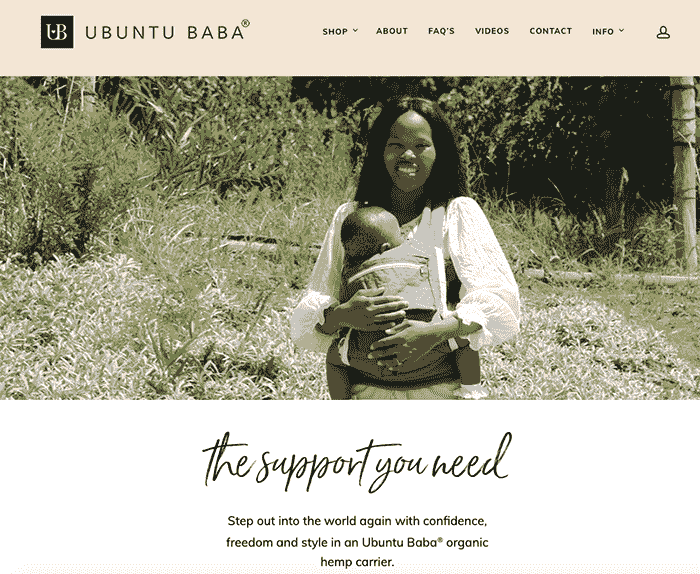
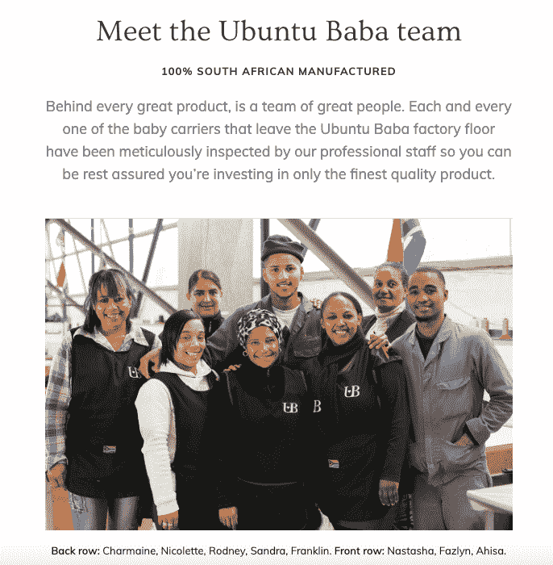

# 成为我自己的第一个客户，并增长到每月 2 万美元

> 原文：<https://www.indiehackers.com/interview/becoming-my-own-first-customer-and-growing-to-20k-per-month-4c2cfd2280>

## 你好！你的背景是什么，你在做什么？

大家好，我是 Shannon McLaughlin，我是 Ubuntu Baba baby carriers 的创始人。我的生意诞生于 2015 年 2 月，就在我儿子出生后 6 个月，出于个人需要，帮助我的宝宝睡更长时间，并作为一个挣扎和不知所措的第一次妈妈有更多的自由。

在我开展这项业务之前，我是一名[自由网页设计师](http://desiredriven.com/)，主要为女性创业公司工作。我非常热衷于用户体验之旅，尤其是在网上购物时，所以这是一次有趣的旅程，启动了我自己的基于产品的业务，并能够将我的知识付诸实践！当我开始创业时，我和一名机械师一起兼职制作我们的婴儿背带。今天，我们有一个由六人组成的全职团队来制造我们的载体，还有一个由六人组成的团队来帮助我经营业务。

 

## 是什么激励你开始使用 Ubuntu Baba？

我从没想到做母亲会是这样一种侮辱。没人告诉我，我的孩子会一周 7 天 24 小时都需要我——真的。我感到完全不知所措，因为我基本上从来没有解放过双手，尤其是在那之前我有过如此独立的创业生活方式。我真的在现实中挣扎。

有一天，一个好朋友来看我，她给了我一个有弹性的包裹，基本上是一个长的有弹性的材料，你可以用它把你的宝宝绑在身上。我对它能帮助我不抱什么希望，但我试了一下，在“穿上”我的孩子的几分钟内，他平静下来并睡着了。

当我简单地把我的宝宝放在我的胸前，让他睡在那里时，我完全被这种神奇的感觉惊呆了。发现育儿艺术为我打开了一个全新的世界。因为它改变了我的生活，所以我想和其他人分享，我成了一个婴儿护理的大力倡导者。

然而，随着我宝宝的成长，我意识到他很快就不再需要弹性包裹，我需要一个更有结构的载体。这就是痛点所在——我找不到任何东西比弹性包装更舒适。所以我开始自己设计一个。

我不知道如何设计一个产品，但幸运的是我知道有人知道——T4，我的父亲。他一生都在制造游戏中，所以我们一起努力开发我脑海中关于完美婴儿背带的想法。

那时，我仍然是一名网页设计师，但却在努力满足服务类工作的所有截止日期。进入产品世界的想法让我非常兴奋！

## 构建最初的产品需要什么？

当我和父亲在工厂开始产品设计过程时，我已经做了很多研究，测试了很多不同的婴儿背带品牌。我有六种不同的款式，还买了很多不同的“透气”面料的样品来试用，并勾画出我脑海中的想法。我的儿子当时三个月大，所以他是我们的小试验品，这当然帮了大忙。

回想起来，我不知道我们是如何设法从头到尾在三个月内完成原型制作的。我有一个三个月大的宝宝，任何一个三个月大的妈妈都会经历某种形式的睡眠不足。但我想一定是我的热情让我精力充沛，让我坚持下去。即使是现在，当我们尝试新的产品创意时，我们甚至需要几周时间才能做出第一个原型。我想这是因为我们现在有了更多的业务。

这是一个有趣的过程，但有时也非常令人沮丧。你脑子里有这样的想法，你知道会很棒，但是执行起来完全是另一回事。我觉得我需要上一堂时装设计课来理解样板制作，因为我对那个世界完全没有经验；最终，我放弃了我不能做所有事情的事实，让父亲在设计过程中起主导作用。我给他我的反馈，然后我们会调整模式，再试一次。

一旦第一个原型完成，我把我的宝宝放在载体中，天哪，我无法停止微笑。几个小时以来，我一直面带微笑。疯狂的那种！

## 你们是如何吸引用户，壮大 Ubuntu 巴巴的？

一旦我对产品的设计感到满意，我想从其他妈妈那里得到一些反馈，以确保它能适用于不同形状和大小的穿着者和婴儿。所以我做了 10 个手提袋，给了我的妈妈朋友们，并征求她们的意见。这个过程确实帮助我完善了产品。在收到他们的反馈时，我也意识到它在传播镇上有一个新的婴儿背带的消息和收集一些令人敬畏的推荐方面是多么有帮助。

这些妈妈会把她们的婴儿背带穿出去，其他妈妈会问她们是从哪里买的。很快，我开始收到潜在客户的电话和短信，询问各种问题。

我在一天之内就建立了一个网站和脸书主页，并开始运作。我创建了一个常见问题页面，用我的 MacBook Air 制作了一些非常基本的视频，然后当人们联系我时，我开始发送这些资源的链接。我会在开普敦及其周边地区找到妈妈聚会小组，然后去演示运营商是如何运作的。不知不觉中，我每天都在购物中心，婴儿放在婴儿车里，我的婴儿车推着所有的箱子，准备和快递一起送出。

我创建了一个基于佣金的系统，我把我的产品寄给全国各地的全职妈妈，然后在网站上列出她们的详细信息，因为我负担不起在婴儿用品店做寄售库存。当人们在 Instagram 上看到一个朋友发布了一张照片或类似的东西后，我们收到了来自全国各地的询问。这个系统运行良好，今天依然如此——拜访一位母亲，喝杯茶，试用产品。当顾客想购买时，他们通过我们的网站购买，而这位全职妈妈在销售中为自己赚取了一大笔佣金。对我来说，放弃佣金但实际上得到报酬是值得的，不像寄售股票模式，这几乎总是成为涉及双方的问题。

下一步是雇人，因为我知道我需要人来成长；处理潜在和现有客户以及我的佣金代理的客户支持，以及努力跟上创建博客帖子、时事通讯、脸书帖子和参加当地会议，已经变得不可持续。

我一直喜欢写作，当我开始在博客上分享我作为母亲的真实生活经历时，我认为这变得非常有用。这些帖子通过我们的邮件列表和脸书被发送到世界各地——其中相当一部分帖子获得了很大的吸引力，为网站带来了更多的客户。那几天我看到了明显的峰值。

很难谈论增长，因为每个企业的发展历程都大不相同，并且都与产品的特性和目标受众有关。但我也认为这对我有利。作为一个苦苦挣扎的新妈妈，我是自己的顾客。因为我利用自己的个人故事建立了自己的品牌，所以我的目标客户能够产生共鸣。我愿意谈论做母亲的艰辛，所以其他人也想和我聊天，分享他们的故事。

与非竞争对手的类似品牌合作也是一个不错的策略——我们在创业的前两年进行了许多合作，现在仍然如此。我们保持它的相关性和趣味性，并总是获得许多新的追随者，并在这些时期看到我们的销售高峰。

发展品牌是一项艰苦的工作；没有捷径，我认为这就是人们失望的原因。他们看着一个几年前就成功的品牌，认为“我能做到”，然后就推出了，但他们没有意识到，除非你相信你的产品真的会有所作为，并且你愿意为此而努力，否则你就没有精力或耐力来满足需求。

没有最终的目标可以达成。这是一个不断学习、旋转、回溯、犯错误、赔钱、推动突破并使之成功的旅程。我目前在这个行业的第五年，现在才开始鸟瞰它是如何走到这一步的。这是一个疯狂的旅程，但我喜欢它。

分析瘫痪比冒险和失败更糟糕，这实际上是学习。

TweetShare

## 你的商业模式是什么，你是如何增加收入的？

我的商业模式是将尽可能多的人引向我们的网站进行购买。那是因为这是最不赚钱的路线。这也是收集客户数据并将一次性购买者转变为终身购买者的最可行途径；然后，我们可以建立一种关系，让他们觉得自己是我们品牌的一部分。

有人问“但是既然是婴儿背带，不是只需要买一次吗？”当然，但是我们实际上有两个阶段的婴儿背带:一个是婴儿用的，一个是学步用的。购买的妈妈们也有需要婴儿背带的朋友。我们有一位客户从我们这里购买了八个托架，许多人购买该产品作为礼物送给朋友或作为婴儿送礼会的礼物。

我们还有我上面提到的基于佣金的模式。这仅占我们销售额的百分之五，但是那些顾客得到的服务水平是满意度的来源。没有多少企业在这样的个人基础上提供这种水平的客户互动，所以这些客户离开时会感到受到重视和赞赏，他们将这种体验传递给其他人，并在社交媒体上分享他们对我们品牌的[反馈。](https://www.facebook.com/pg/ubuntubaba/reviews/)

对于在线支付处理，我们提供了几个选项:

1.  信用卡
2.  银行汇款
3.  快照扫描(二维码)
4.  Payflex(六周免息)

我记得当我第一次开始的时候，我不敢相信有那么多人会选择银行转账而不是信用卡；但是因为我们还不是一个知名品牌，顾客们对输入他们的信用卡信息很谨慎。这种情况已经发生了变化，信用卡选项成为了首选，但在推出之前有一点值得注意——尽量不要将信用卡支付作为默认选项。

作为一家南非制造商，我们面临的最大挑战是跟上需求，并试图估计手头需要多少库存以及原材料。这实际上已经对我们的销售产生了影响。我们的产品由有机大麻材料制成，需要从中国进口——可能需要 12 周才能到达。你可以在下图中看到一些明显的下降，这是我们自发布以来的销售历史。这些下跌代表了我们手头库存混乱，因为我们没有足够的面料而无法供应的时候。

 

今天，我们对业务有了更多的了解，可以预测和计划潜在的即将到来的高峰，以及影响我们的客户在颜色方面的购买选择。如果我们缺少布料，这有助于引导他们朝一个方向走，而不是另一个方向——有趣的东西！

## 你未来的目标是什么？

我总是暗暗梦想 Ubuntu Baba 会成为一个全球品牌，我们会像一些我喜欢的、带给我灵感的国际婴儿服饰品牌一样出名。这既令人兴奋又令人害怕，但我相信我能实现它。

然而，我对这个行业的真正目标是帮助新妈妈们处理做母亲带来的焦虑和困难，并继续分享育儿的好处，以及我如何真正相信它可以改变我们抚养孩子的方式。它只是放大了养育中的爱因素，允许父母在孩子身边做更多的事情，这为你如何长期养育孩子定下了基调。我喜欢这样。

在商业方面，我确实有更多的产品想法，希望在 2019 年推出其中至少一个。在过去的一年里，我一直致力于一个新的想法，并遇到了大量的产品开发问题。这很难，因为我在这个项目上投入了如此多的精力。为该产品创建发布活动是如此令人兴奋，但我厌倦了这种被迫的开发方式。我无法让它工作(这并不意味着我永远不会推出它)，我可以感觉到它开始影响我的个人生活，所以我决定让它休息。也许我会在 2020 年重游。

你脑子里有这样的想法，你知道会很棒，但是执行起来完全是另一回事。

TweetShare

## 你面临的最大挑战和克服的障碍是什么？如果你必须重新开始，你会做什么不同的事？

最大的障碍是[伍尔沃斯的传奇](https://shannonmarymac.co.za/dear-woolworths-you-have-some-explaining-to-do/)。长话短说(这是一篇很长的博文)南非最大的零售商之一公然抄袭了我的婴儿提篮的设计和概念，并开始在他们的店里以三分之一的低价出售，因为它是中国制造的。我们确实感觉受到了打击。

我们的客户感到困惑，尤其是当社交媒体上出现我们“以比我们的销售价格低得多的价格向零售商供货”的消息时。当然那不是真的，我们*不是他们的制造商。这是旅途中压力最大的时候，我们工厂的员工都以为会失业。*

尽管这是一次非常耗费精力的经历，但也令人难以置信地充满力量。就我个人而言，那段时间我成长了很多，因为我承受了巨大的压力，以及我是如何被抛入公众视线的。我的焦虑水平很高，但我很高兴现在它发生了。整个经历带来了很多好处；该零售商随后将所有剩余库存捐赠给资源不足的母亲。

我不喜欢希望改变过去，因为我发现所有的“错误”都很有用。然而，如果我能回到过去，我会更想知道如何管理一个团队。一旦一个企业发展到一定阶段，它就开始需要更多的人，而成为“老板”对我来说并不是天生的。这是一个陌生的地方，我必须很快熟悉它。

有这么多关于创业和开展业务的信息，但没有太多关于如何从一个创业者转变为企业主的信息。如果有的话，我还没怎么接触过。

所以如果你有什么建议给我，我很乐意知道....像一个真正的企业家一样，利用这次面试获取更多的学习资料！；)

 

## 有没有发现什么特别有帮助或者有优势的？

对我来说，有导师来激发我的想法，或者仅仅是与他们交流，这已经很了不起了。我的导师大多是 50 岁以上的商人，令人惊讶的是，他们的一些老派商业方式在我们的千禧年网络文化中仍然有绝对的意义。任何人都可以成为导师——几个月前，我和一位我刚刚认识的不可思议的女性进行了一次简短的聊天，在这么短的时间里，我从她那里获得了如此的智慧。好像她直觉上知道我想听什么。随时准备开始一段对话，即使是和一个陌生人。你永远不知道会发生什么！

我也是一个敢于冒险的人(这在过去给我带来了很大的麻烦)，这教会了我很多东西，如果不是我的天性，我是不会学到这些东西的。分析瘫痪比冒险和失败更糟糕，这实际上是学习。

## 对于刚刚起步的独立黑客，你有什么建议？

我刚刚开始意识到，作为一名企业家，意味着要比以前更正直地照顾生活的所有其他方面。每一分钟都很重要，生命不应该被虚度(尽管事实往往如此！).努力与朋友和家人共度美好时光，做自己喜欢的事情。否则有什么意义？我最近才开始努力掌握自己的时间，这对我很有帮助，让我感觉到我想要的感觉，而不是一直紧张、焦虑和疲惫。

## 我们可以去哪里了解更多？

我最喜欢的地方是我们的 Instagram 页面，因为它太美了。您可以在 ubuntubaba.com 的[访问我们的网站。我们在 ubmamatribe.com](https://ubuntubaba.com/)发表关于[成为母亲](https://ubmamatribe.com/category/motherhood/)、第四个四个月以及两者之间一切事情的诚实博客帖子。要与我个人取得联系，你可以给我发一封电子邮件或者关注我在 shannonmarymac.co.za 的博客。

非常高兴回答任何人对我的任何问题，非常感谢独立黑客，我感到很幸运能够被特别报道。这很有趣。大爱。xx

——[<picture id="ember5275301" class="user-avatar ember-view user-link__avatar"></picture>香农·麦克劳林](/ShannonMaryMac?id=MWPChHCzlGUCKd6OTsqVhEA7wsD3)，Ubuntu Baba 创始人

## 想像乌班图巴巴一样建立自己的事业？

你应该加入[独立黑客社区](/)！🤗

我们是几千名创始人，互相帮助建立有利可图的业务和副业。来分享你正在做的事情，并从你的同事那里获得反馈。

还没准备好开始使用你的产品吗？没问题。这个社区是一个认识人、学习和实践的好地方。随意[随便浏览](/)！

—[<picture id="ember5275306" class="user-avatar ember-view user-link__avatar"></picture>考特兰艾伦](/csallen?id=ibTLPyjwVebnZjMGKvz6ztarnuV2)，独立黑客创始人

24votes