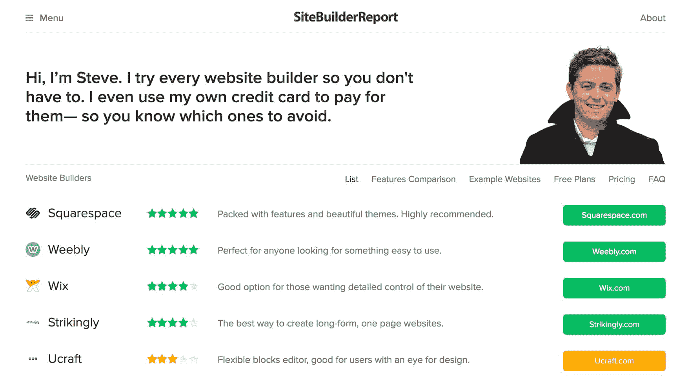
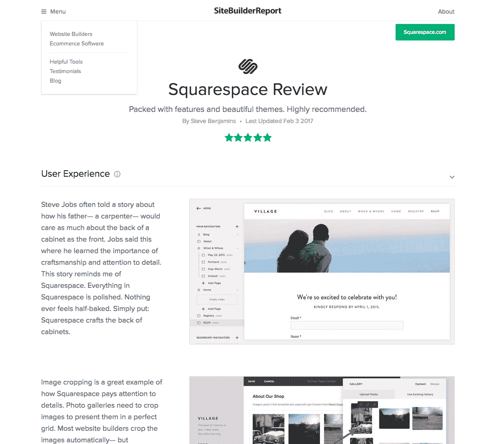

# 击败竞争对手，建立一个 4 万美元/月的评论网站

> 原文：<https://www.indiehackers.com/interview/besting-the-competition-and-building-a-40k-mo-review-site-f2bf1023f0>

## 你好！你的背景是什么，你在做什么？

嗨，我是史蒂夫·本杰明。我是多伦多的一名设计师和开发商。五年前，我决定推出自己的网站建设者(像 [Squarespace](http://www.squarespace.com) 、 [Wix](http://www.wix.com) )。

可惜我推出的建站器失败了。它失败了，因为已经有太多的网站建设者。没有人需要另一个网站建设者。他们需要的是有人告诉他们，哪些网站建设者是好的，哪些是坏的。

于是我开始[建站报告](https://www.sitebuilderreport.com)。《网站建设者报告》对网站建设者进行了深入的评论——就像《断线钳》中的[一样，但是是针对网站建设者的。在过去的两年中，Site Builder Report 的月平均收入为 44，000 美元。](http://thewirecutter.com/)

## 是什么促使你开始使用 Site Builder Report？

我刚搬到多伦多，害怕找工作。我当时在日记中写道:

*“刚刚和【某设计机构】的联合创始人又喝了一杯咖啡。又一次，我很难表达我在寻找什么...事实上，我只是不想在中介公司工作。我想建立自己的公司。这是我一直想做的事情。”*

所以那个夏天，我决定不去工作——相反，我会利用这个夏天推出一系列产品，看看它们中有没有能坚持下来的。我的目标是每月从这些项目中获得 4000 美元，以完全养活自己。(我当时在做自由职业养活自己。)

事后看来，我发起的一些项目似乎很愚蠢。[图片中的加拿大](http://www.canadainpictures.com/)在加拿大的目的地进行摄影旅行。我希望通过 Adsense 产生大量的流量并赚钱。它没有去任何地方。

从我还是个孩子的时候起，我就一直有副业……大多数副业都失败了，但也有一些成功了。

TweetShare

其他想法有一些希望。我创建了橡树主题，一个出售定制主题的网站。不幸的是，设计主题的工作量很大，但销售额只有几百美元。

但是在所有的项目中，最有希望的是[网站建设报告](https://www.sitebuilderreport.com)。到了 11 月，我在日记中写道:

*“网站建设者报告真的开始有回报了。看起来 11 月份有机会超过每月 350 美元的收入。谁知道它会走向何方。”*

## 构建最初的产品需要什么？

虽然我用 Rails 设计了网站并编写了一个自定义 CMS，但我仍然认为最重要的事情一直是社论。

我现在已经写了数百篇(严肃地)关于网站建设者和电子商务软件的评论。这是无聊的工作。但是在写了几年评论之后，你会形成一个相当有见识的视角。这个星球上有多少人花了数百个小时尝试不同的网站建设者？这种知情的观点是[网站建设者报告](https://www.sitebuilderreport.com)的核心——这是我提供给读者的价值。

(为什么不用网站构建器做网站构建器报告？我相信网站建设者最适合特定的用例。例如，虽然我不用网站生成器来做网站生成器报告，但我会用 [Squarespace](http://www.squarespace.com) 来做我乐队的网站。)

 

## 你是如何吸引用户和扩大网站建设报告的？

SEO。句号。

[如果你在谷歌搜索*最佳网站建设者*，网站建设者报告](https://www.sitebuilderreport.com)会出现在第一位。如果你搜索*网站建设者*，它会排在第三位。这意味着它经常击败 [GoDaddy](http://www.godaddy.com) 和[Wix](http://www.wix.com)——拥有数千万美元广告支出的公司。

选择一个搜索量大的市场，然后走极端……为搜索这些关键词的人创造价值。

TweetShare

那么为什么 Site Builder Report 排名那么高呢？老实说，我不知道。不要相信任何一个说 SEO 很有把握的人。

我尝试了很多很多事情来提升 SEO:我做了无数的内容营销和链接推广，我创办了一本杂志，我建立了一个流行的免费图片搜索引擎来吸引链接，等等。但对我来说，哪一个因素决定了结果并不明显。

最后，我的 SEO 建议很简单:(1)选择一个搜索量大的市场，(2)努力为搜索这些关键词的人创造价值。

## 你的商业模式是什么，你是如何增加收入的？

当读者根据我的评论选择一家网站建设商时，我就获得了代销商佣金。(几乎每个网站建设商都有加盟计划。)

我刚开始时担心读者会不信任这种安排。但实际上这并不是一个大问题。事实上，读者问我点击哪些链接，以确保我得到我的佣金。老实说，对我商业模式的负面评价更有可能来自像[黑客新闻](https://news.ycombinator.com)这样的社区，而不是来自我的读者。

不同的网站建设商支付不同的佣金。例如，WebsiteBuilder.com 支付的佣金是我推荐的网站建设商的 4 倍。但我不会让这影响我的评论。事实上，我一直对那家公司非常不满。

我认为读者对废话有第六感，能嗅出前后矛盾的地方。从长远来看，投资为读者创造价值要好得多。不仅如此，这也是正确的做法。[网站建设者报告](https://www.sitebuilderreport.com)已经赚了比我需要的更多的钱。我的读者不只是浏览量，他们是真实的人。我不想让他们用劣质软件。

## 你未来的目标是什么，你打算如何实现它们？

我对[网站建设者报告](https://www.sitebuilderreport.com)没有远大的目标。我只是想在一个适度的目标上不断提高:帮助读者选择一个网站建设者。举几个例子来说明我的意思:

*   我花了几年时间才确定了一种有效的审查模式。[现在我想我已经答对了](https://www.sitebuilderreport.com/website-builders/review/squarespace)。我甚至想出了一个 9 个月后更新评论的时间表，所以没有什么是过时的。
*   我用自己的信用卡测试每个建筑商的取消政策，以揭露不正当行为。
*   我有一个[定价计算器](https://www.sitebuilderreport.com/website-builders/pricing-chart)，显示随着时间的推移，你将为每个网站建设者支付多少。不幸的是，网站建设领域的定价并不总是透明的。
*   我做[客户支持响应时间测试](https://www.sitebuilderreport.com/blog/how-long-does-it-take-saas-companies-to-reply-to-support-emails)。

所有这些改进都需要花时间和精力去搞清楚——但对我来说，它们是有趣和令人兴奋的。我喜欢测试和修补新想法。

人们偶尔会建议我将 Site Builder 报告扩展到新的类别，但我不感兴趣。我发现很难衡量这篇社论。相反，我一直在做一个名为 [Wise Buyer](https://www.wisebuyer.com) 的新项目，在这个项目中，我通过与成千上万名现实生活中的用户交谈，对软件进行客户满意度评级。到目前为止，明智的买家还没有网站建设者报告那样成功，但我会继续努力。

 

## 你面临的最大挑战是什么？你克服的障碍？

早期，是钱。我没有钱。一旦我开始每月挣 4000 美元(CDN)，我就觉得自己很富有。从那以后一切都变得容易了。

现在我最大的障碍都是 SEO 相关的。例如，2015 年 7 月，我设计了一个没有图像压缩的新审查系统。哎呀。我没有注意到我的评论加载速度有多慢，但是谷歌注意到了——他们惩罚了我，流量直线下降。从那以后我已经修复了图像压缩(我推荐 [IMGix](https://www.imgix.com/) ！)而且排名一直在提升。

## 你最大的优势是什么？有什么特别有用的吗？

后知后觉的把点点滴滴串联起来，很搞笑。我想到了两件事:

当我上高中时，我以 12，000 美元卖掉了一个为 MSN Messenger 共享自定义表情符号的网站。那个网站之所以成功，是因为它在谷歌上被列为“msn 情感”(当时常见的“表情符号”的误译)。那次经历告诉我，你可以通过 SEO 获得真正的收入。

开始吧。当你有东西给人看的时候，你就可以谈论它。

TweetShare

此外(正如我在这次采访的介绍中简单提到的)，我花了 4 个月的时间尝试建立我自己的网站建设者，但失败了。这让我对这个行业有了一些了解，或者至少有了一些看法。

否则我认为运气总是起作用的。我从小就有副业。我卖山寨 NBA 球衣，我卖 DVD，我开了一家固定收费的房地产上市公司，还有更多。大多数企业都失败了，但也有少数成功了。这向我表明，成功或失败并不是预先注定的。你真的只能尝试一些东西，然后期待最好的结果。命运偏爱勇敢的人，对吗？

## 对于刚刚起步的独立黑客，你有什么建议？

创业不是理论上的。这是一种练习。这是你做的事。甚至不要谈论创业——这些谈话很容易变成放纵的幻想。开始吧。当你有东西要给人看时，你就可以谈论它。

我也在想，是不是最好避开那些美化创业的媒体。如果你发现自己正在阅读一篇配有埃文·斯皮格尔或马克·扎克伯格的精美照片的文章，请关闭标签。你不需要那种英雄崇拜在你脑子里游来游去。我总是想起[一位图书出版商](https://medium.com/@stevebenjamins/business-books-are-about-escapism-and-fantasy-just-like-romance-novels-6c2daebaaf49)关于人们为什么购买商业书籍的这句话:

*“所有证据表明，商业书籍实际上不是关于学习，而是关于逃避现实，就像爱情小说一样。商业书籍是关于想象自己成功，而不是让自己成功。”*

所以跳过企业家色情。更好的方法是阅读像《独立黑客》这样的出版物，它们关注真实的故事和你能理解的策略。

## 我们可以去哪里了解更多？

您可以直接进入[站点构建器报告](https://www.sitebuilderreport.com):)

我还经营 [Village](https://www.itsonvillage.com) (关于多伦多的每周时事通讯)和 [Wise Buyer](https://www.wisebuyer.com) (软件买家指南)。在业余时间，我让[独奏](http://www.stevebenjamins.com/)和[在乐队](https://www.listentobamboo.com)中演奏。你也可以在推特上找到我[。](https://twitter.com/stevebenjamins)

评论里有什么问我，乐意分享:)

—[<picture id="ember5267505" class="user-avatar ember-view user-link__avatar"></picture>sitebuilderreport](/sitebuilderreport?id=hbtmIEpJlSOjFfmad7aNSLbgVmo1)，网站建设者报告的创建者

## 想建立自己的业务像网站建设者报告？

你应该加入独立黑客社区！🤗

我们是几千名创始人，互相帮助建立有利可图的业务和副业。来分享你正在做的事情，并从你的同事那里获得反馈。

还没准备好开始使用你的产品吗？没问题。这个社区是一个认识人、学习和实践的好地方。随意[随便浏览](/)！

——[<picture id="ember5267510" class="user-avatar ember-view user-link__avatar"></picture>柯特兰艾伦](/csallen?id=ibTLPyjwVebnZjMGKvz6ztarnuV2)，独立黑客创始人

44votes