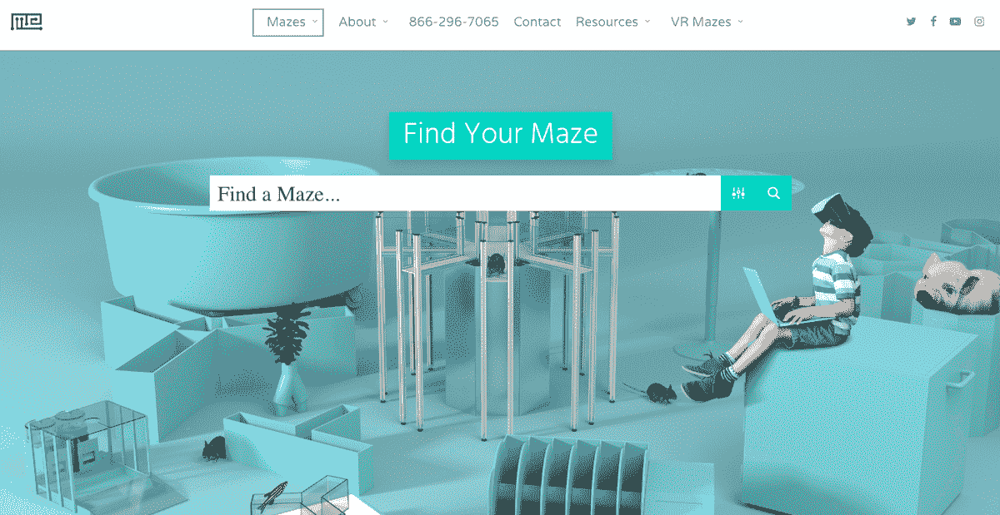
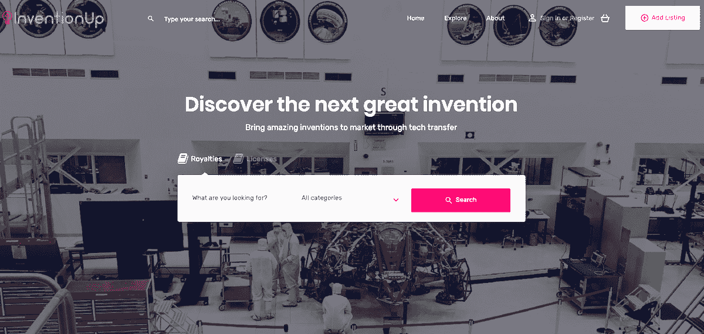

# 不顾学生的债务，将硬件产品提升到 7 位数

> 原文：<https://www.indiehackers.com/interview/bootstrapping-a-hardware-product-to-7-figures-despite-student-debt-b1cfa0b14b>

## 你好！你的背景是什么，你在做什么？

你好！我叫韩曙·何，是马萨诸塞州总医院和布莱根妇女医院的住院医师和急救医生。我也是一个科学创业者，我的主要项目叫[品行科学](https://conductscience.com/)。

科学研究需要最好的工具以获得最准确的结果，而指导科学的目的是用更好的工具促进更好的科学研究。行为科学[组成了一个科学网站网络](https://conductscience.com/overview/)，它们合作为科学和医学创造工具。我们网络中的每个组织都开发自己独特的工具，我们会全程提供帮助，并将他们的工具推向市场。

以我们在 [Qolty](https://qolty.com/) 的数字健康专家为例。Qolty 的研究人员开发了一款应用程序来帮助监测抑郁症的症状，这有可能帮助许多人。但向其他科学家出售科学工具是一项众所周知的棘手任务，一个团队自己可能只能做这么多，以将他们的工具推广到各个实验室，而不会耗尽他们的资源，或者在追逐销售和增长时不得不将业务的不同部分放在次要位置。在行为科学网络的支持下，这款应用可以覆盖更多的实验室，并最终覆盖更广泛的受众，而不会有太大的压力。

我们也研究迷宫！不是你传统的高大的绿色迷宫，而是可以容纳啮齿动物的结构，能够自动监控它们的每一个行为。啮齿动物迷宫通常是观察和理解新药或其他心理实验对行为的影响的关键。我是自动化的忠实粉丝，它是改善科学的一种手段。因为所有可靠的科学研究都必须是可复制的，所以在所有实验室中使用一致的技术和实践对于科学过程来说是至关重要的，并且应该被鼓励和公开，以确保可靠的研究。在[迷宫工程师](https://mazeengineers.com/)，我们开发了自动化迷宫，它将人为错误的几率降至最低，从而提高了科学的可靠性。

到目前为止，500 多所大学、军事机构和制药公司都有行为科学课程。我们提供广泛的技术，包括前面提到的迷宫和数字健康监测器，还有立体定位手术设备和[医学术语翻译应用](https://qolty.com/doctorlingo-translations/)。我们的主要目标只是帮助科学家更好地“指导科学”。

 

## 是什么促使你开始研究行为科学？

首先，我是一名科学家。我的专业领域之一是神经科学及其相关研究。例如，为了准确了解一种新药如何增强小鼠的空间学习和记忆，最重要的测试是[莫里斯水迷宫](https://mazeengineers.com/portfolio/morris-water-maze/)。这是一个迷宫，老鼠在游泳池中游泳，寻找一个隐藏的平台，测试它导航位置线索的能力。

在过去运行实验时，可靠的工具很难获得。神经科学依赖于检测大脑化学或神经元放电模式中最微小的变化，我发现科学界可用的通用工具不能满足它。我喜欢完全准确的结果，并决定自己创造工具，让我更接近这个目标。但是我不想仅仅改进我自己的研究，我想为整个社区的科学家提供伟大的迷宫，所以它成长为迷宫工程师。

在创作过程中，我与其他科学家合作，他们帮助我对技术方面有所了解，这是我完善医学和科学背景所需要的。我也有一些网页设计和数字营销的经验，这有助于建立网站。

当然，值得强调的是，当时我是一名医学院学生，这意味着我欠了不少债。在缓解我自己的经济困难的同时，帮助科学界的前景非常令人振奋。

## 为 Maze 工程师构建初始产品的过程是怎样的，这个过程是如何发展的？

当我开始研究如何改进各个实验室已经在使用的东西时，我发现的一个更常见的问题是迷宫没有得到很好的优化，经常在奇怪的地方或一些啮齿动物不会光顾的多余空间区域安装螺钉。因为每个实验都是不同的，我们没有一个主要的产品或预制的范围。迷宫工程师为实验和将使用它的科学家定制每个迷宫，并专注于制造完全适合实验的高效迷宫。

为此，我与一个由科学家、医生和工程师组成的伟大团队合作。定制每个迷宫是一项耗时的任务，需要许多不同的技能，我很感激我有一个完整的团队支持我，帮助我确切地展示我如何可视化每个创作。迷宫在哪里建造取决于它们的相对复杂性——一些项目在他们自己的工厂交给我们的技术团队，而另一些则在我们自己购买的制造空间中创建。

我总是建议把你的消费者的幸福放在任何个人利润之上，并确保你的商业想法来自一个真正想要帮助他人的地方。

TweetShare

目前最大的挑战是运输。我们不是在谈论装箱一本书或一双鞋，每个迷宫都可能非常脆弱，并包含许多昂贵的设备。我们尽最大努力确保在运输过程中没有任何损坏，并尽快消除任何报告的缺陷。无论何时缺陷出现，我们都要回去重新设计，以避免将来出现同样的失败，这可能会非常昂贵，尤其是当一切都是引导的时候。

也许与直觉相反，我的主要商业哲学之一是将类似的公司视为合作者和潜在的合作伙伴，而不是竞争对手。与另一家制造动物行为监控设备的公司 Noldus 合作，让我们有机会创造出更好的产品，最终造福科学界和整个科学。新迷宫的设计过程可能需要很长时间，与专家合作可以成倍地加快这个过程。一旦设计确定下来，制造过程通常只需要一周左右的时间。

 

## 你是如何吸引用户和发展行为科学的？

由于行为科学网络是一个如此独特的实体，这个问题一般来说有点难以回答。

我从这个过程中学到的一点是，你不能指望所有的客户都通过广告点击来获得。有机交通很重要。我最初在付费广告上投入了大量资金，但并没有真正看到巨大的投资回报。当我们开始写更多的研究文章时，事情开始好转，这些文章吸引了人们，并提供了产品之外的价值。我们还对网站进行了一点改造，这也提高了流量。网站和我们的内容现在是我们流量的主要来源。

特别是在迷宫工程师这个案例中，我在数字营销方面的背景帮了大忙，因为它让我可以毫不费力地建立一个相当不错的网站。我跳过了戏剧发布会，而是专注于与尽可能多的人和组织建立联系，以增加流量。在这方面，我们与其他设备工程师 Noldus 的合作是无价的。我们还采访了一些高知名度的科学杂志，如[《自然》](https://www.nature.com/)，讨论自动化迷宫背后的科学。这种宣传让更多的客户和更多的科学家意识到定制迷宫技术的价值，这导致了我们今天的成就。

从像 Qolty 这样的数字信息软件到通过 [SimianLabs](https://simianlabs.com/) 开发的虚拟现实工具，我们只是试图为科学界正在讨论的问题不断提供解决方案。这种方法支撑了我们的增长。

| 月 | 用户 |
| --- | --- |
| 2018 年 1 月 | 2934 |
| 2018 年 5 月 | 5657 |
| 18 年 9 月 | 6356 |
| 2018 年 12 月 | 11203 |

科学是一个艰难的女主人。我们可以做所有我们想做的活动和营销，但最终，我们还是要做出科学准确的好产品。我们不能依靠明亮的灯光、铃铛和哨子或者未来某个时候闪亮的新功能的承诺来生存。我们真的很努力地工作来满足科学的期望，这是值得的，在像大卫·摩根的《学习和认知的本质》这样的书中提到了。

## 你的商业模式是什么，你是如何增加收入的？

Maze Engineers 与整个行为科学网络的精神气质相同。我们帮助实现迷宫设计，然后代表设计它们的研究者销售迷宫。你可以在这里看看这种类型的合作是如何运作的[。](https://mazeengineers.com/Partnerships/)

行为科学基本上是一个平台，让学者们将他们的想法付诸实践，并与科学界分享。他们带着产品来找我们，我们为他们营销产品。这是一种让科学界能够接触到伟大设备的方式，否则这仍然只是某人头脑中的一个想法。

记得谈谈你的公司。人们需要知道你在做什么。

TweetShare

我们主要通过合作开发产品、销售产品以及通过技术转让与开发者和发明者分享收入来赚钱。我们为大学创造了真正独特的知识产权合同，同时也在开发一个市场，让学者们在[发明 Up](https://inventionup.com/) 做同样的事情。我们通过与研究人员分享收入，而不是接受许可协议(这是学术界的标准做法)，为开发过程添加了一个创新的调整。收入共享对每个人来说都是双赢的:它将像我们这样的制造商的风险降至最低，也提高了科学的可行性，因为发明不需要达到崇高的收入目标来实现收支平衡或繁荣。这就像一个科学的 Etsy 商店！

由于我们处理的是如此昂贵的设备，我们总是需要收取服务费。商业和科学实验没有太大的不同，你只需要继续重复已经被证明有效的过程。在这方面，收费是获得认可的重要途径。你应该以这种方式测试你业务的每一个方面，运行测试，找出什么是有效的，什么是无效的，为什么，以及如何优化你的成功。以这种方式思考我的生意，真的影响了我如何做出最大的决定。

 

## 你未来的目标是什么？

真的，我们只是想帮助科学家与投资于同一领域的企业家和小公司配对。帮助促进好的发明和其他研究的转移是一个真正的科学家乐意实现的唯一目标。

## 有没有发现什么特别有帮助或者有优势的？你有什么技能或者外界影响对你有帮助吗？

训练自己用贝叶斯思维来处理情况，帮助我在创造工具和建立行为科学以及追求医生职业生涯的同时，保持理性并做出更好的决定。

[贝叶斯概率](https://en.wikipedia.org/wiki/Bayesian_probability)是一个基于数学的原理，但我们不需要在这里进入任何复杂的东西。这完全是基于你所得到的新证据的力量来修正你的信念。如果你有 70%的把握认为一个新的啮齿动物学习模型比以前的模型更准确，那么任何支持旧模型的新证据都应该被考虑，你的信心水平也应该被修正。

我认为在你的决策过程中整合统计数据和概率对于成为更好的企业家非常有用。贝叶斯思维促使我考虑我不会考虑的可能性，并帮助我记住事物通常不是二元的。例如，如果有一个我认为比基线成功可能性高 10 倍的场景，我经常回忆棒球统计数据——如果我的基线是 3%，那么这可能意味着有 30%的成功机会。虽然这意味着失败的几率是 70%，但 30%仍然是很好的机会，所以我要争取。这样考虑问题，即使我失败了，我仍然做出了正确的决定。

我还注意到，我的临床方法论与我从事行为科学工作的方式有很多相似之处。在医疗环境中，我在紧急情况下做的第一件事是提供一个高灵敏度的测试。高灵敏度测试是一种检测疾病标记是否存在的测试，但可能会得到一些错误的标记。即使它在后端提供了一些额外的工作来消除假阳性，它也保证了您正在寻找的疾病不会被遗漏。

我不能错过心脏病发作——这在急诊科是一大禁忌——所以我们进行了肌钙蛋白测试。如果你心脏病发作，这种肌钙蛋白酶会在你的血液中。然而，它可能存在还有其他原因。剧烈运动还会增加血液中的肌钙蛋白，肾脏问题也会增加肌钙蛋白。但我宁愿有假阳性也不愿有假阴性(你心脏病发作，我没发现)。

在评估用于行为科学的新设备时，这是一种非常有用的心态。当我们创造产品时，非常重要的一点是，我们提出的问题要涵盖任何可能的问题，甚至可能会抛出一些额外的问题作为回报。

例如，在自动化迷宫的开发中，理论上，门移动方式的最小变化都会破坏正在使用的迷宫。因此，所有的决策都分为两个部分:第一阶段是高灵敏度，这意味着尽可能多地发现问题，甚至是那些最终可能无关紧要或无关紧要的问题。然后，在检测到所有问题之后，我们进入高特异性的第二阶段。这意味着识别最明显的问题，并高度关注这些问题，我们现在可以做到这一点，因为我们已经通过高敏感度探索和/或消除了所有的小事。

 

## 对于刚刚起步的独立黑客，你有什么建议？

我总是建议把你的消费者的幸福放在任何个人利润之上，并确保你的商业想法来自一个真正想要帮助他人的地方。如果你做到了，成功自然会到来。记得谈谈你的公司。人们需要知道你在做什么。

我激励自己为顾客提供尽可能好的服务的一个方法是通过自我激励。维持我自己的收入，而不是接受外部风险资本的投资，有助于我 100%专注于取悦我的客户和合作伙伴。我不必担心每年将我的利润乘以一个确定的数字来取悦投资者。当然，你选择的路径取决于你的商业模式。

## 我们可以去哪里了解更多？

如果您是一名医生或研究人员，希望更好地了解患者数据，并希望利用数字健康监测工具，您可以访问我们的网站 [Qolty](https://qolty.com/) 。如果你是研究硬件的科学家，请访问我们的[迷宫工程师](https://mazeengineers.com/)。

如果你想了解知识产权合同是如何运作的，请到[来。](https://inventionup.com/)

如果你有兴趣以任何身份参与行为科学，或者想了解更多，请访问我们的[https://conductscience.com/work/](https://conductscience.com/work/)。

请随时在评论区给我留下一些评论或问题！

——[<picture id="ember8119201" class="user-avatar ember-view user-link__avatar"></picture>【韩曙】](/ShuhanHe?id=P6tgYpRHyWXoQEhNeeusayOyTBy2)【迷宫工程师创始人

## 想像迷宫工程师一样建立自己的事业？

你应该加入独立黑客社区！🤗

我们是几千名创始人，互相帮助建立有利可图的业务和副业。来分享你正在做的事情，并从你的同事那里获得反馈。

还没准备好开始使用你的产品吗？没问题。这个社区是一个认识人、学习和实践的好地方。随意[随便浏览](/)！

——[<picture id="ember8119206" class="user-avatar ember-view user-link__avatar"></picture>柯特兰艾伦](/csallen?id=ibTLPyjwVebnZjMGKvz6ztarnuV2)，独立黑客创始人

14votes