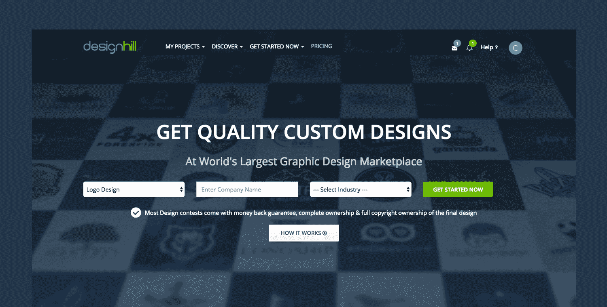
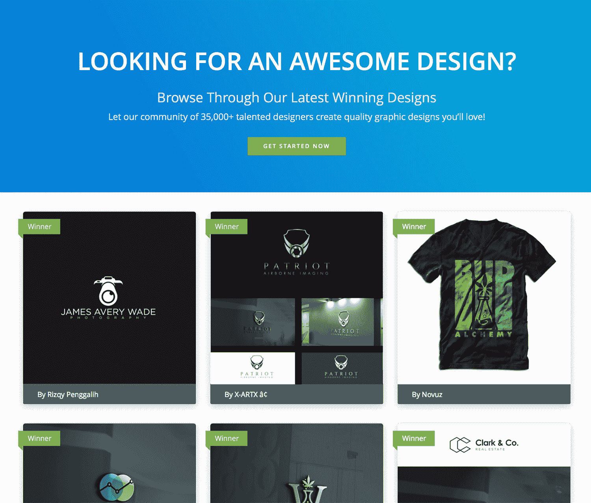
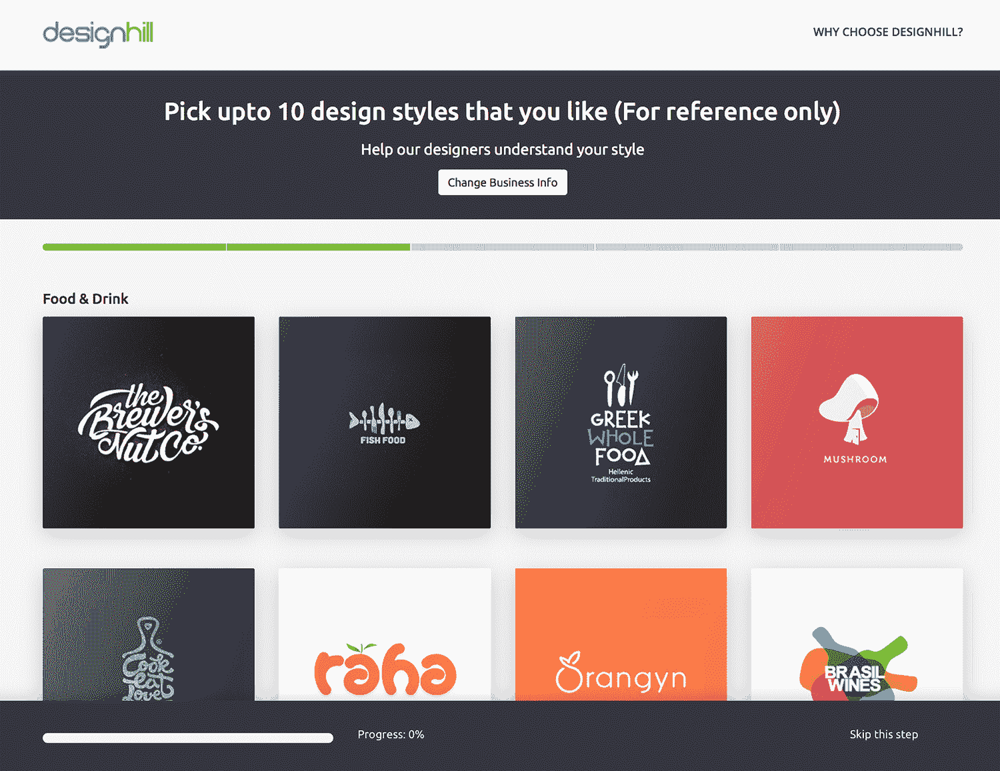

# 通过与客户交谈，将市场规模扩大到 130 万美元

> 原文：<https://www.indiehackers.com/interview/bootstrapping-a-marketplace-to-1-3m-by-talking-to-customers-30e2842ef2>

## 你好！你的背景是什么，你在做什么？

你好，我是瓦伦·阿格沃尔。我是一名计算机科学工程师，早期我曾是一名自由平面设计师。我也是我的第一个“真正的”产品 [Designhill](http://www.designhill.com/?offercode=IH15&affiliate_id=courtland&affiliate_number=30671) 的创始人。2014 年 10 月，我和我的兄弟 Rahul Aggarwal 一起开始了这个项目。

Designhill 是一个完整的在线平面设计平台，面向小型企业，包括中小企业、医生、律师、摄影师、房地产公司、科技创业公司、夫妻店等。我们以可承受的价格帮助他们解决任何平面设计需求，例如[标志设计](http://www.designhill.com/logo-design?offercode=IH15&affiliate_id=courtland&affiliate_number=30671)，他们企业的完整品牌标识，网站设计，宣传册设计，以及更多选项。

我们启动了业务，在短短 14 个月内达到了神奇的 100 万美元 ARR 数字。我们目前的增长率为 21%，我们的目标是在下一年内增长 10 倍。

到今天为止，我们已经有了一个由来自 52 个国家的 38，000 多名平面设计师组成的令人敬畏的社区，我们已经帮助了成千上万的企业主满足了他们的平面设计需求。

 

## 你是怎么想出设计山这个主意的？是什么激励你开始的？

我开始从事自由设计是因为我个人面临的挑战，也是因为我意识到了我的客户所面临的问题。作为一名自由设计师，我在许多平台上寻找好的自由职业机会，但我面临许多问题:

*   **曝光**——很难找到新客户。
*   真诚——找到能按时付款并根据我付出的努力支付报酬的客户是一个挑战。
*   **安全性** —我如何保护我的付款并确保我按时收到付款？

我还注意到，我的大多数客户都面临许多类似的问题:

*   质量设计师很难找到。
*   **交货**经常没有按时发生。
*   对许多客户来说，负担能力是一个问题。
*   有限数量的设计和修改是可用的。
*   设计中的通用性也受到了限制。
*   职业精神很难事先核实。
*   发现新的设计师很困难。

为了解决自由设计师和设计寻求者面临的所有这些问题，我们决定建立一个开放和创新的众包市场。

因为我做了几年的自由职业者，我已经知道设计师的痛点。为了在买家端进行验证，我问了我过去的许多客户，他们是否对这种设计服务的方法感兴趣，他们的反应非常积极。我们甚至和一些设计师和朋友(作为客户)一起测试了这个平台，每个人都喜欢这个想法！

创造一个真正为大众解决问题的产品，而不仅仅是存在于你脑袋里的问题。

TweetShare

很明显，我们计划建造的东西是有需求的，下一步是弄清楚如何建造产品和瞄准我们的潜在客户。我们在 2015 年 4 月推出了测试版，并在 2015 年 10 月左右全面上线。

## 构建最初的产品需要什么？(时间、金钱、技术等。)

由于 Designhill 是一家自助企业，我们的资金来自我们的个人储蓄和家庭支持。我们必须从第一天开始就向客户收费，因为我们必须支付设计师的工作报酬。

我们从一个由四名开发人员组成的小团队开始，但是说实话，我们的第一批员工并不是最好的选择。我们很快意识到招聘是一个挑战。但与此同时，我们用 PHP 编写了代码，并花了大约 4-5 个月的时间推出了第一个测试版。

在服务器端，我们使用许多 AWS 服务，包括 EC2、RDS、CDN、SES 和 Elasticache。我强烈建议迁移到 AWS 以获得最佳性能，因为它易于扩展且非常经济实惠。

我们还依赖许多工具来顺利运行，如 Customer.io(细分电子邮件)、Hotjar(分析)、Ahrefs 和 Moz(搜索引擎优化和竞争对手研究)、Zopim Chat(支持)、Trello、Google Apps 等等。

## 你用什么营销策略来发展你的业务？

在 Designhill，我们尝试了书中所有可能的营销策略。有些效果很好，有些则不然。每个企业都是不同的，每个策略可能会给企业带来不同的结果。

原生广告可能是我们用过的最有成效和影响力的广告形式。没有人想听你谈论你的生意，而且一直支付广告费用实在是太贵了。然而，创建富含研究和事实的值得分享的内容是接触潜在客户的最佳和最有效的方式。此外，它对你的 SEO 有很大的帮助，所以我们把 60-70%的时间放在这个营销渠道上。

像其他市场一样，我们面临着先有鸡还是先有蛋的问题...

TweetShare

获得正确的搜索引擎优化对我们来说是一个巨大的挑战。有机排名是非常艰难的。老实说，我们最初不明白 SEO 是如何工作的，也没有人真正知道算法是如何工作的。然而，我们*确实*知道像我们这样的企业需要依靠谷歌才能做好。我们最终意识到，我们必须创造出独一无二的、高质量的、极具共享性的内容。这对我们来说是一个巨大的成功，帮助提升了我们在谷歌上的排名，也提升了我们的品牌:

*   我们的微型网站[著名商标及其隐藏含义的互动指南](https://www.designhill.com/interactive-guide/famous-logos-hidden-meanings)已经在 100 多个网站上推出，如 Creativebloq 和 DesignTaxi。它已经产生了超过 18，000 个社交分享和 100，000+的浏览量。
*   我们的另一个微型网站，影响创业成功的因素[，已经在超过 35 个网站上出现，包括福布斯和 Business.com。它已经产生了超过 5000 次社交分享和超过 50000 次页面浏览量。](http://www.designhill.com/infographics/factors-that-influence-startup-success)
*   我们还做了一个名为[的互动测试，你是哪种类型的企业家？它出现在福布斯、DesignTaxi 和 50 多个其他网站上，浏览量超过 8 万次。](http://www.designhill.com/quiz/what-type-of-entrepreneur-are-you)
*   我们甚至为企业创建了互动指南，指导他们如何使用已经被许多人分享和使用的 [Twitter](http://www.designhill.com/interactive-guide/how-to-use-twitter) 、[脸书](http://www.designhill.com/interactive-guide/how-to-use-facebook)和 [LinkedIn](http://www.designhill.com/interactive-guide/how-to-use-linkedin) 。

这些微型网站、指南和测验帮助我们有机地进行排名，并获得大量流量。因此，我们避免了聘请公关公司的高成本(我个人认为公关系统已经崩溃了)，同时获得了大量的报道，提升了我们的品牌。

| 月 | 会议 | 浏览量 |
| --- | --- | --- |
| 六月 | 57382 | 665561 |
| 七月 | 57995 | 575649 |
| 八月 | 57102 | 538336 |
| 九月 | 62303 | 622496 |
| 十月 | 77198 | 745221 |
| 十一月 | 84591 | 767661 |
| 十二月 | 101962 | 948918 |
| 一月 | 134583 | 1168660 |

我们使用各种形式的社交媒体渠道，每种渠道都有不同的用途:脸书非常适合社区建设和吸引设计师。Twitter 非常适合拓展和内容营销。Google Plus 非常适合将你的内容编入索引和查找连接。LinkedIn 更多的是一个专业网络，我们通过 LinkedIn Pulse 来推广我们的内容。

我们广泛使用的另一件事是论坛和问答网站上的帖子。这是吸引客户和推动业务的一个很好的媒介，因为它们吸引了很多真正有购买意图的实际客户。

发送跟进邮件(基于客户档案和细分)对转化潜在客户和获得回头客大有帮助。绝对是大家要重点关注的。

最后，伙伴关系听起来很棒，但以我的经验来看，很少能带来真正的价值。在合作关系中，你需要两家公司都积极主动地向用户推销对方，但这很少发生。仅仅在合作伙伴的网站上有一个链接是没有多大帮助的。

## 独立黑客社区成员 [channingallen](/user/channingallen) 问道:你是如何发展双边市场的双方的？

像其他市场一样，我们面临着先有鸡还是先有蛋的问题。我们必须在供应端找到合适数量的设计师，他们能够满足我们客户的所有设计需求。同时，我们必须确保他们提供高质量、准时的交付，并能够依靠 Designhill 作为固定的收入来源。

在买方方面，我们必须让我们的潜在客户相信我们是一家可信的企业，因为我们是一家印度初创公司，我们的大多数客户来自美国、澳大利亚、英国和加拿大。这需要时间，但是今天如果你查看任何一个评测网站，比如[可信公司](http://trustedcompany.com/in/designhill.com-reviews)、[可信飞行员](http://trustpilot.com/review/designhill.com)等等。你会看到我们以前的客户对我们的评价。

我们从建立一个小型设计师社区开始。没有设计师，我们根本无法解决任何问题，因此，在接近潜在客户之前，找到至少几个优秀的设计师对我们的业务至关重要。在客户端，我们从朋友和家人开始。他们是我们的早期用户，他们很乐意尝试我们的服务，并给了我们一些真实的反馈。

[

设计内容获奖者展示。](http://www.designhill.com/award-winning-designs?offercode=IH15&affiliate_id=courtland&affiliate_number=30671) 

## 你的商业模式是如何运作的？你的营收背后有什么故事？

迄今为止，我们提供三种不同类型的服务。第一种是**通过竞赛**众包。客户可以发布一个竞赛，多个设计师按照提供的概要提交设计来参与。它是这样工作的:

1.  作为客户，通过我们直观的入职流程提交您的设计简介。
2.  [挑选一个套餐](http://www.designhill.com/launch?offercode=IH15&affiliate_id=courtland&affiliate_number=30671)开始你的竞赛。
3.  你会在 7 天内得到 50+的设计。
4.  通过星级评定、评论和私信提供反馈。
5.  选择你最喜欢的设计，你会收到原始文件。

我们的第二项服务是**一对一自由职业项目**。客户可以在我们的设计师作品集目录中搜索，挑选他们喜欢的，并根据他们自己的条件开始一对一的项目。

最后，我们有一个**现成的商标商店**，在那里你可以购买精选的商标。有时间限制的客户如果想立即寻找设计，可以从我们的 logo 商店的精选 logo 列表中购买。

上个月(2017 年 1 月)，我们突破了 100 万美元的 ARR 大关。我们的收入每个月都在高速增长(21%)，我们希望在 12 个月后达到 1000 万美元。

我发现获得一个客户是一个非常漫长的过程。如果你的潜在客户打算在你的产品上花一分钱，他们必须 100%相信你的产品能解决他们的问题。他们会把你和你的竞争对手进行比较，查看评论，看看以前的客户怎么说，权衡利弊，然后做出决定。

与您的客户交流。说话。说话。说话。永远不要停止这样做。

TweetShare

如果在他们第一次与你的网站互动和实际购买你的产品之间出现任何问题，你最终会失去一个客户。因此，除了打造产品，我们还创造了品牌价值，完善了我们的渠道。由于降低了流失率、改进了入职流程并执行了大量 A/B 测试，我们的收入有所增长。

每次你做一件事都会产生影响。这可能是积极的影响，也可能是消极的影响。它可能会让你的转化率增加 1%或 10%，也可能会减少 50%。为了获得增量收益，你必须分析你的行为并监控其效果。要么坚持变更，要么返回，或者根据您的分析修改新的变更。然后你再做一遍。一遍又一遍，一遍又一遍，一遍又一遍，永不停止。

[

今天的客户入职流程。](http://www.designhill.com/launch/brand-identity/visual-style?offercode=IH15&affiliate_id=courtland&affiliate_number=30671) 

## 你未来的目标是什么，你将如何实现它们？

我们的最终目标是，当有人考虑采购平面设计时(无论是哪一种)，他们脑海中闪现的是 [Designhill](http://www.designhill.com/?offercode=IH15&affiliate_id=courtland&affiliate_number=30671) 这个名字。在线平面设计行业发展速度非常快，比线下平面设计行业快得多，在这个领域仍然没有“谷歌”或“亚马逊”。我们希望*拥有*设计空间。

我们计划在今年的某个时候推出一个多语言/多币种的网站，这应该会改变游戏规则。虽然我们的总部在印度，但我们是一个全球平台，所以我们需要以当地语言和货币在每个国家开展业务。一旦我们成功实现了这一点，我们应该有一个更广泛的足迹和存在。

## 如果你必须从头开始，你会有什么不同的做法？

Designhill 是我们制造的第一个实际产品，多年来我们面临了许多挑战。从雇佣错误的人，到雇佣过多的人，再到因为我们最初的产品有问题而失去客户。我们等了太久才推出产品，甚至在某些时候不得不完全重写。我们为这些错误付出的时间比金钱多，但我认为这是一次很棒的经历，教会了我们很多东西。

如果我必须重新开始，我会更快地启动，让合适的人加入我们的团队，并更加专注于企业的核心价值。我说的“核心价值”指的是推动业务的因素，如客户的入职流程，以及其他使人们易于使用网站的工具/功能。

例如，我们投入了大量时间来建立设计师级别、订阅等。我们本可以很容易地在相当长的一段时间内避免做这些事情，因为它们并不那么重要。知道什么是重要的，什么是不重要的是至关重要的，这样你就可以把你的时间、精力和资金用在正确的方向上。

## 你最大的优势是什么？什么帮助最大？

我认为我们最大的优势之一是我们的地理位置。我们的总部设在印度，因此，我们能够通过实时聊天和电子邮件提供全天候的客户支持。由于我们不是传统的数字机构，而是一家技术/数字公司，我们知道为我们的客户提供全天候支持将会有所作为，事实也的确如此。

这种额外的人际互动帮助我们成长得更快，并使我们从竞争对手中脱颖而出。不仅如此，它还给我们提供了大量来自用户的实时反馈，我们可以从中学习。从长远来看，任何能够提供出色客户服务的企业都会产生非常积极的影响。

## 对于刚刚起步的独立黑客，你有什么建议？

这是我们的第一个实际产品，所以我们的学习曲线很长，是的，我们在这个过程中犯了很多错误:

*   **明智地雇用**——我认为在你决定开始开发产品之前，花时间找到合适的团队是非常重要的。我们犯了没有招聘好员工的错误，我们付出了时间。也许如果我们花更多的时间组建合适的团队，我们就能更快地推出我们的产品。
*   **即将推出** —不要等着创造完美的产品，因为那是不存在的。尽快推出你的 MVP，尽可能多地收集反馈。迭代和实验越多，学习和进步就越快。

*   **解决一个真正的问题**——创造一个真正为大众解决问题的产品，而不仅仅是存在于你头脑中的问题。为你的客户制造产品，而不是为你自己。
*   **与你的客户交谈** —交谈。说话。说话。永远不要停止这样做。你和顾客谈得越多，你就越能理解他们的问题。
*   **验证您的产品** —创建一个 MVP，尽快推出您的产品，并验证您的早期采用者是否需要它。
*   **打造可扩展的产品** —你不会想花费数年时间打造只为少数人服务的产品，这样你很快就会发现很难找到新客户。

至于阅读，我推荐埃里克·里斯的《精益创业》和彼得·泰尔的《零比一》。但最重要的是，走出去，开始做点什么吧！

## 我们可以去哪里了解更多？

*   网址:[http://www.designhill.com](http://www.designhill.com)
*   博客:[http://www.designhill.com/blog](http://www.designhill.com/blog)
*   推特: [@designhilldh](https://twitter.com/designhilldh)
*   脸书:[设计希尔德](https://www.facebook.com/designhilldh)
*   查询: [【邮件保护】](/cdn-cgi/l/email-protection#7b080e0b0b14090f3b1f1e08121c151312171755181416)
*   合作关系: [【邮件受保护】](/cdn-cgi/l/email-protection#40302132342e253233282930330024253329272e28292c2c6e232f2d)

如果你想和我联系，可以[发邮件给我](/cdn-cgi/l/email-protection#9aecfbe8eff4dafeffe9f3fdf4f2f3f6f6b4f9f5f7)或者在 Twitter 上关注我( [@varun3](https://twitter.com/varun3) )。你也可以在下面留言，我会尽量回复你的！

—[<picture id="ember5298963" class="user-avatar ember-view user-link__avatar"></picture>Varun Aggarwal](/VarunAggarwal?id=designhill-owner)【design hill】的创作者

## 想像 Designhill 一样建立自己的事业？

你应该加入独立黑客社区！🤗

我们是几千名创始人，互相帮助建立有利可图的业务和副业。来分享你正在做的事情，并从你的同事那里获得反馈。

还没准备好开始使用你的产品吗？没问题。这个社区是一个认识人、学习和实践的好地方。随意[随便浏览](/)！

——[<picture id="ember5298968" class="user-avatar ember-view user-link__avatar"></picture>柯特兰艾伦](/csallen?id=ibTLPyjwVebnZjMGKvz6ztarnuV2)，独立黑客创始人

7votes