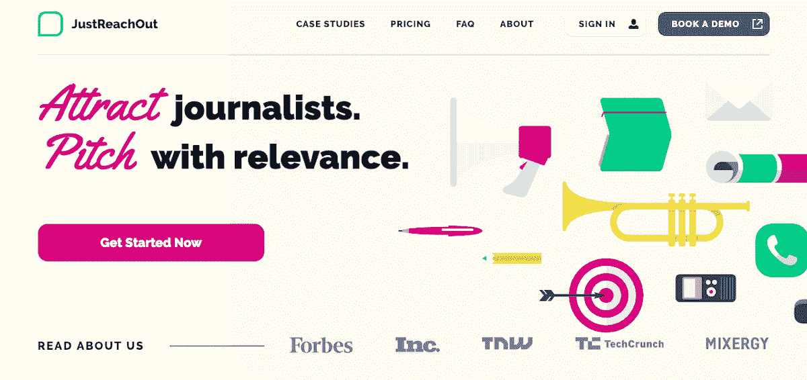
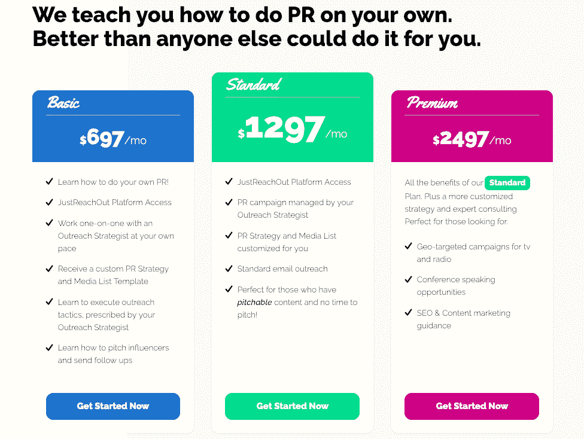
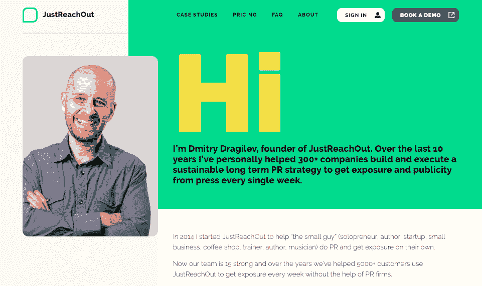

# 推出 SaaS 填补关键市场空白

> 原文：<https://www.indiehackers.com/interview/bootstrapping-a-saas-to-fill-a-key-market-gap-e0d3dc5bb7>

## 你好！你的背景是什么，你在做什么？

我的名字是德米特里·德拉吉列夫，我是一名企业家，一名打破个人记录的粉丝，一名丈夫和父亲，一名莫斯科本地人，以前是一名舞厅舞蹈演员。

如今，人们很容易把我们这些创办公司的人归为一类，他们都有一些共同的特征——播客爱好者、喜欢蓝色、身体健康、精神饱满、无意成为运动休闲模特、拥有特权、全明星厨师。但实际上，我们和其他人一样独特。我们只是在一个私人频道谈论如何让彼此看起来不那么像。(开玩笑。)

我的背景是，我的整个职业生涯都在技术领域工作，甚至在此之前，我在高中时作为一家参数技术公司的 QA 实习生获得了重大突破。我的叔叔和婶婶在那里做工程师，所以当我意识到我需要帮助我的妈妈和支持我的家庭时，他们把接力棒传给了我。成长是艰难的。我 11 岁的时候，我们从俄罗斯一个寒冷多雪的地方搬到了新罕布什尔州一个寒冷多雪的地方。我的祖父母、我的母亲、我的小妹妹和我移民了，而我的父亲决定留在莫斯科，固执地认为这将是一种更轻松、更好的生活方式。

我在大学里学的是计算机科学，后来我成了一名软件工程师，为飞行计划开发软件，供军方驾驶 C5 和 C130s 飞机使用。我喜欢我的秘密身份，作为一个没有任何经济责任的单身男人，我感到非常成功。虽然媒体确实抓住了它；他们开始诗意地讲述创业成功的优点，创业的魅力强度...它真的和我说话了。我对市场营销以及我的分析技能如何规划公司的发展方向产生了兴趣。因此，我最终上了商学院，并在一家初创公司 Crossloop 找到了一份工作。从那以后，我在初创公司的各种营销岗位上工作，对早期阶段的公司在营销和公关方面面临的挑战有了更清晰的认识。

[https://fast.wistia.net/embed/iframe/r8kdf43w6p?videoFoam=true](https://fast.wistia.net/embed/iframe/r8kdf43w6p?videoFoam=true)

当初创公司寻求媒体时，我看到了代理模式的一个根本缺陷。首先，外联策略已经过时。第二，他们过去使用的策略，现在仍然经常使用，对于创业客户来说很难学习和复制。不要介意，对于大多数仍在寻求展示其概念证明的自举型小企业来说，这大大超出了预算。

因此，我建立了一个公关软件平台 [JustReachOut](https://justreachout.io/) ，这个平台的目的是在公司的初期和早期放大它们的声音，不管它们有多混乱。今天，JustReachOut 支持企业家和营销人员，他们正在寻求个性化他们的外联工作，瞄准最相关的记者和博客，完善他们的推销写作技能，并通常更好地了解如何将公关元素纳入整体营销战略——因为在筒仓中操作您的公关，内容和搜索引擎优化策略远不如将其放在一个屋檐下有效。该平台专注于公关研究和推广，并正在发展，以包括更多的自动化指导，以便您可以边走边学。

自 2014 年公司成立以来，我们已经拥有超过 5000 名用户。这其中不可思议的是，PR 这么辛苦；对于我们的许多客户来说，这感觉像是一个极其昂贵的实验，却发现他们真的没有时间来完成这项任务。在我们拥挤的媒体环境中，你的知名度和权威至关重要。如果你能产生引人注目的想法，将其转化为你的观众会从(最近清扫的)地板上舔下来的内容，成功地推销这个故事，并建立正确的社区或渠道来培养这种兴趣，你会看到人们乞求更多。我们已经成功地与许多人合作，他们愿意学习如何做自己的公关，他们知道这将是一个艰难的过程。这比将这些职责外包给一家代理公司要难，但从长远来看，这更有效，更真实，而且测试东西和打破关于什么是可推销的流行想法更有趣。

 

## 是什么促使你开始使用 JustReachOut.io？

当我第一次注意到公关总是作为一种事后的想法被加到我的工作描述中时，我是作为一名营销人员和顾问在公司内部工作的。当竞争对手出现在 TechCrunch 上时，或者当一个大型活动没有满座时，或者每当其他更紧迫的事情出现停顿时，这对创始人来说突然变得很重要。我看到创始人们不断挣扎，权衡是选择保留一家豪华公关公司，还是聘请一名全职员工来处理此事，同时也无法理解公关可能会产生复合效应。一旦我开始从数字营销领域拓展，进入被称为增长黑客的领域，我就开始涉足公关。我想，数字营销人员拥有所有这些工具来帮助他们分析他们的活动，为什么没有一个工具来教你如何做公关，做研究和拓展，磨练相关性和个性化，并包括活动指导和监控？

我坚持不懈地将价值和简单完美结合。

TweetShare

我建立了一个平台的基本版本。但在我创建它之前，我在波士顿的 meetups 上得到了其他营销人员的支持，当时我就住在那里。我甚至让人们在发布前为工具付费。我会在一张纸上勾勒出我的想法，并向营销部门的其他人征求反馈，直到我开始得到相当于“是的，我愿意为此付钱”的回应。不断地从别人那里得到反馈，把它融入我的草图，一次又一次地展示给他们，这就是我赢得第一批顾客的方法。我坚持不懈地将价值和简单完美结合。

我离开了我那多产的咨询业务，以便有更多的时间去发展 JustReachOut。不久之后，我的妻子科里正式加入 JustReachOut，负责公司的发展和运营。我总是专注于检查我的待办事项清单上的项目，而科里更擅长框架、流程和梦幻般的战略愿景。她还大力参与了我们去年进行的网站重新设计和复制检查，使事情(用她的话说)更具包容性，更少忧郁。我从她那里学到了很多关于品牌、写作的知识，以及我们的文化是如何扭曲的，这要感谢每天渗透到我们媒体中的父权制的系统性影响。因此，虽然教会我们的企业家和营销人员如何建立权威和信誉至关重要，但在 JustReachOut，我们也努力提高人们对如何在媒体上展示公司和个人的公平竞争的认识。

## 构建最初的产品需要什么？

我在这篇博文中记录了我在[的早期时光，并在 2015/2016 年左右开始销售这款应用，甚至在它还没有建成之前！我拼凑自己的开发技能，直到我不能建立一个可行的原型。然后我带来了一个朋友，他慷慨地承担了构建初始产品的任务，看看我们是否能以最少的时间投入让它起步。我的朋友有一份全职工作，而我的工作是让我的咨询客户开心，所以 JustReachOut 在早期只是一个副业。](https://www.criminallyprolific.com/pitch-sell-your-app/)

我将咨询所得投入到下一阶段的 JustReachOut 开发中，引进了一个沉默的合作伙伴，他提供了一群非常有才华的工程师和产品经理。我们改进了搜索引擎的功能和拓展能力，并开始更多地关注教客户如何做自己的公关。

客户提出了许多添加新功能的请求，随着时间的推移，我学会了观察这些请求，并评估它们如何适应交付价值和帮助所有客户更好或更快获得结果的更大难题。有时我们会得到很好的想法和建议，但如果它们不符合开发的范围，我们不能因为在电子邮件中建立字数统计而分心，因为这只会让我们慢下来。

## 你是如何吸引用户并发展壮大 JustReachOut.io 的？

2017 年，我与诺亚·卡根(Noah Kagan)的 AppSumo 合作，我们以疯狂的折扣价捆绑了 JustReachOut。我的目标是获得更多的客户，它做到了。当时，我的平台上有大约 400 名付费用户。一夜之间，通过与 AppSumo 捆绑，我能够带来超过 2k 的新客户！我以为我挖到了金子。我又做了一笔 Appsumo 交易，多赚了 2000 多万！我很快就注册了一个 Zendesk 账户，戴上了客户支持的帽子，工作到深夜，回答了一大堆公关问题。

在快速成长的过程中，我从这个练习中学到了一些惨痛的教训。这个工具本身不足以支持人们进行公关活动，因为他们不知道自己在做什么，也不知道为什么要这么做。此外，更传统的公关方法是给记者、博客、有影响力的人发电子邮件；然而，JustReachOut 是为一种完全不同的公关活动而设计的。我们注重质量而不是数量，缩小联系最相关的人和出版物的范围，在简短的推介中提出增值主张，并经常分析结果，以便您知道何时调整您的方法。我们的外展策略往往对长期活动更有效，在这些活动中，你希望获得持续的报道，而不是在引人注目的出版物中迅速获得成功。

去年，我们踩下刹车，将我们独有的 SaaS 模式转变为现在包含服务和支持的模式。这对我们来说是一个游戏规则的改变。我们告别了大量不适合我们的客户，这样我们就可以为从我们的产品中获益最多的客户提供更大的价值。我们获得了一个新的机会来研究最适合特定情况的最佳战术和战略，记录教学过程，并提供一个更加定制化但可扩展的产品，更好地指导人们完成学习过程。

源自小公司的故事和产品需要敏捷，并快速调整策略。

TweetShare

我们的时事通讯有一个强大的订户列表，所以我们偶尔会回访，询问人们是否需要公关方面的帮助。我们目前没有做任何脸书广告，但我们可能会在不久的将来再次运行一些。我主要写作、在会议上发言、做关于公关策略的播客采访，以及宣传活动的成功取决于:

1.  你必须投入到实验过程中的时间
2.  你可以带来的内容、资产或想法。如果你的内容被认为是“可推销的”，我们可以教你如何推销。如果你的内容不是“可推销的”，你还有很多工作要做。

随着我们加大努力推出更强大的自助服务选项，我们第一次将注意力转向营销工作。过去，我在市场营销方面做得不多，至少没有高度针对性的营销活动，但现在我比几年前更有信心 JustReachOut 可以帮助支持营销人员的公关工作。

| 年 | 收入 |
| --- | --- |
| 2015 | 15000 |
| 2016 | 70000 |
| 2017 | 300000 |
| 2018 | 380000 |

你可以看到，最初几年的收入和流量数字反映了这是一项兼职工作，然后随着我投入更多时间和增加团队成员，工作变得更有成效。

| 年 | 访问者 |
| --- | --- |
| 2015 | 100 |
| 2016 | 200 |
| 2017 | 1500 |
| 2018 | 2700 |
| 2019 | 3000 |

## 你的商业模式是什么，你是如何增加收入的？

今天，我们不仅仅是一家软件公司。我们与一个优秀的外联团队合作，他们要么教我们的客户如何做自己的公关，要么代表客户进行研究和外联。由于我们告别了许多自助服务客户，我们用薪酬更高的全方位服务客户取代了他们。这种方法是一个临时的解决方案，为我们提供了稳定的$30k 的 MRR。这给了我们改善入职体验所需的喘息空间，同时保持运营额外精益。

 

## 你未来的目标是什么？

在接下来的一年里，我希望 JustReachOut 能够帮助 500 名新客户利用我们的平台开展自己的公关活动，了解实现其目标的最有效策略，研究记者和出版物，并无缝地开展外联活动。我们将在今年推出一个新的改进的自助服务计划，该计划将吸引更广泛的市场，这些市场希望按照自己的节奏、自己的时间学习，并让他们的团队中有内容营销人才来帮助他们迅速起步。

## 你面临的最大挑战和克服的障碍是什么？如果你必须重新开始，你会做什么不同的事？

事后看来，我可能会做一些不同的事情，当然。但不多。我热衷于测试事物并从过程中学习，即使最终会影响时间表或预算。最大的挑战是从非公关的角度学习公关。我处理公关的方式与领先的机构不同，因为我希望以不同于大型跨国企业集团的方式来扩展自己的业务或客户的业务。源自小公司的故事和产品需要敏捷，并快速调整策略。

## 有没有发现什么特别有帮助或者有优势的？

我喜欢有一个相当规律和可预测的时间表。我知道我的基本生存需要什么——吃饭的时间，锻炼的时间，和家人在一起的时间，整整八小时的睡眠，以及放松和充电的时间。我把它写进我的日历，这样它就会发生，然后让其他的事情顺其自然。不知何故一切都完成了。

没有任何一本书、播客或程序是我成功的法宝。有一群支持我的朋友和同事——我很了解他们，他们也很了解我——真的减轻了当父母时创业的压力。

## 对于刚刚起步的独立黑客，你有什么建议？

如果你想通过公关在你的观众中建立威信，有很多不同的方法。尽早测试不同的公关策略并围绕你的专业知识建立一个强大的社区是不会错的。知道你想联系谁，并专注于与他们建立关系，在他们有知识漏洞的地方提供支持。

我们的影响力取决于我们对自己能力的想象。要对你的生活产生更大的影响，首先要有一个我们希望别人如何看待我们的愿景，然后据此行动。

TweetShare

对于任何一个开始自举并寻找一些原始和真实的体验的人来说，我真的很喜欢阅读兰德·菲什金的 [Lost and Founder](https://smile.amazon.com/dp/0241290929/ref=cm_sw_em_r_mt_dp_U_EN2RCbVH07NPD) 。短短几十年前，很少有企业家——如果有的话——对公司发展的财务、情感和战略问题如此开放。今天，在创业和技术领域，分享成长和失败的轨迹是司空见惯的，但兰德的风格提供了这样一种个人观点，我想我更喜欢他故事中人性的一面。

 

## 我们可以去哪里了解更多？

当人们弥留之际，他们从不为没有花足够的时间在办公室或没有赚足够的钱而表示遗憾。通常，人们希望他们能够更好地管理一段关系，或者对社会或社区产生更大的影响。我们的影响力取决于我们对自己能力的想象。要对你的生活产生更大的影响，首先要有一个我们希望别人如何看待我们的愿景，然后据此行动。公关运作也是如此，我们想象出你想要产生的影响，以及你要与你的观众分享的价值，然后我们帮助你定义什么样的努力将帮助你实现它。

如果你还没有考虑过你的公司或你的品牌如何影响你的观众，我鼓励你这样做。无论你是免费提供所有的建议，还是决定花时间和金钱进行基础培训，这样你就可以通过适当的公关介绍让你的品牌开花结果，引人注目的内容和专业知识的潜在影响在我们这个令人分心的世界中至关重要。学习如何使用正确的公关策略来传播消息变得非常重要。有兴趣了解更多信息吗？查看[https://justreachout.io/](https://justreachout.io/)和[订阅我们的时事通讯](https://blog.justreachout.io/)，将公关故事和经验发送到您的收件箱！

有哪些关于 PR 的问题可以为你解答？把它们写在下面的评论里，我发誓我会回复的。

—[<picture id="ember8120794" class="user-avatar ember-view user-link__avatar"></picture>德米特里·德拉吉列夫](/dmitryprdude?id=A6bhFqyWAkXU4fjrL4S13veqX5m2)【justrach out . io 创始人

## 想像 JustReachOut.io 一样建立自己的事业？

你应该加入[独立黑客社区](/)！🤗

我们是几千名创始人，互相帮助建立有利可图的业务和副业。来分享你正在做的事情，并从你的同事那里获得反馈。

还没准备好开始使用你的产品吗？没问题。这个社区是一个认识人、学习和实践的好地方。随意[随便浏览](/)！

—[<picture id="ember8120799" class="user-avatar ember-view user-link__avatar"></picture>考特兰艾伦](/csallen?id=ibTLPyjwVebnZjMGKvz6ztarnuV2)，独立黑客创始人

20votes