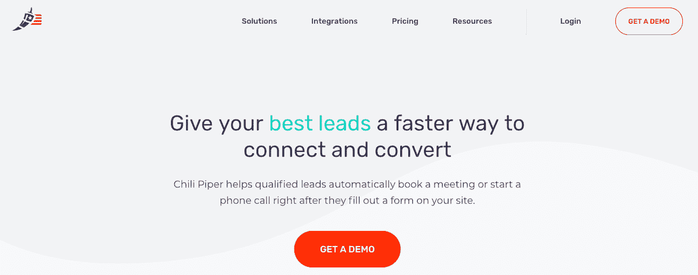

# 三年内从创意到 200 万美元的 ARR

> 原文：<https://www.indiehackers.com/interview/bootstrapping-from-idea-to-2mm-arr-in-three-years-19d713eebe>

## 你好！你的背景是什么，你在做什么？

大家好，我是 Nicolas Vandenberghe，是一名连续创业者。[辣椒派](https://www.chilipiper.com)是我的第四次创业。我在法国出生并长大，上世纪 90 年代中期来到美国，进入斯坦福商学院(Stanford Business School)，在那里我爱上了科技创业。

Chili Piper 是 B2B 公司的高级调度平台。我们的核心产品 Concierge 解决了销售渠道中的一个简单问题。

到目前为止，当潜在买家填写表格时，他们通常会在页面上显示“谢谢，有人会很快联系你”，让他们不知道谁会在什么时候给他们打电话。不再是了。Concierge 实时获取表单数据，确定潜在客户的资格，为潜在客户找到最佳代表，并立即触发呼叫或展示日历，为每个人提供更好的体验。这个系统和它产生的更好的体验通常会提高 50%的转化率。

我们的 MRR 运行率为 25 万美元，并且每年都在翻倍，因此我们的目标是在未来 12 个月内实现 50 万美元的 MRR。

 

## 是什么促使你开始接触辣椒派？

我写了一篇关于此事的[博文](https://www.chilipiper.com/blog/story-behind-chili-piper/)。我曾是一家电信公司的首席信息官，前任首席信息官与 Oracle 企业应用达成了为期五年的协议，但 Oracle 拒绝根据我们的实际(缺乏)使用情况调整条款。这与基于云的创业公司为让客户满意和成功所做的努力形成了鲜明对比。我清楚地认识到，销售和客户关系管理必须从根本上改变，以反映从创业领域渗透出来的新的关系动态。

与此同时，我观察了我们自己的销售代表如何努力采用我们的 CRM 工具 Salesforce。等式的两端都失败了，显然是时候使用新一代数字工具来帮助销售人员更好地与买家互动了。

我所在的电信公司失去了运营执照，我认为这是命运给我的信号，让我重新创业。与此同时，我的妻子阿丽娜是 UX 设计的专家，她已经厌倦了彭博和皮尔逊这样的公司的企业生活，所以我们一起跳槽了！

我们决定从一个狭窄的焦点开始:日程安排。旧金山的一家 SaaS 公司带着一个问题找到我们；潜在客户团队需要花 7 分钟时间来安排会议，这让他们非常头疼——找到合适的代表，检查她是否有空，制作邀请函，并与潜在客户确认。我们参加了 SaaStr 会议，询问公司是否有同样的问题，大多数公司都有。所以我们创造了一个解决方案，将这 7 分钟变成 20 秒内的 3 次点击。不出所料，这是一个立竿见影的效果，仅仅六个月后我们就实现了现金盈余。

我们还研究了通过使用智能算法来自动化数据捕获(联系人、电子邮件、会议),以消除销售代表的琐碎数据输入工作。但是几家初创公司有同样的想法，Salesforce 买了其中两家，所以感觉有点太拥挤了。

## 构建最初的产品需要什么？

最初的团队只有两名工程师和一名测试人员，所以我们总共有五个人。我妻子和我资助了最初的几个月。

如今，如果你有合适的人才，使用合适的工具，软件可以被非常快速地开发出来，而我们肯定两者都有。我们的两位创始工程师在建造东西时拥有超能力。他们在前端选择了 React.js，后端选择了 Scala。他们花了四个月的时间来构建第一个产品，并且他们两个能够在接下来的两年里执行我们的路线图。

你不需要团队；你只需要一两个最优秀的人。不要和解。他们是最终将你的想法带入市场的人。

TweetShare

为了决定这个路线图，我们有一个非常清晰的决策过程:每个新特性会给我们带来多少额外的收入。这使我们能够启动超过 15 名员工和 200 万美元的 ARR。在那个阶段，就在最近，我们引进了外部资本，雇佣了更多的工程师来加速我们的发展。

## 你是如何吸引用户并种植辣椒的？

我自己完成了第一笔 100 万美元的收入，主要是通过面对面的交流。我参加了每一次行业聚会和会议。辣椒派是做日程安排的，所以我在 iPhone 上有辣椒派的链接。我会去和人们交谈，当场确认他们的资格，并谈论他们的日程安排问题。然后我建议我们开个会讨论我们的解决方案，拿出我的电话，说“我们现在就安排吧，你带手机了吗？”每个人都带着他们的手机，每个人的手机上都有他们的日历。每个活动最多可预订 15 个演示。

这是一个不寻常的方法，现在有这么多的工具来群发邮件给毫无防备的潜在客户，但我的策略更有针对性和目的性。我们的目标是首先与要求最严格，因此也是最有影响力的公司签约。这就是我们如何关闭温室，广场，Twilio，Intuit，等等。这产生了大量的内向兴趣，足以证明我们雇佣第一个客户经理的合理性。

这就是所谓的“牛眼”营销策略。在每个行业，都有一些核心影响者。沟通以同心圆的形式传播，从这些核心影响者向外围联系最少的参与者传播。通过瞄准这些核心影响者，公司可以以低得多的成本传播其信息。

我们没有在广告或公关等传统营销上花任何钱。相反，我们雇用了客户成功代表，并专注于让所有这些关键客户达到绿色健康状态。几乎一半的新收入来自这些客户的扩张，形成了一个漂亮的滚雪球效应。

## 你的商业模式是什么，你是如何增加收入的？

我们的商业模式非常简单；它都是基于订阅的。我们向每个用户收费(每月 25 美元)，外加特殊功能的平台访问费，如礼宾或贸易展览管理(每月 200 至 500 美元)。

与竞争对手相比，相对于我们带来的价值，我们的定价非常合理。这种有竞争力的价格使我们能够采取无折扣政策；每个客户为每个用户支付相同的费用。这与我们基于信任和透明的销售新世界的愿景非常一致。它在缩短我们的销售周期和建立我们的品牌方面非常有效。

我们在 2016 年的第一年 ARR 就达到了 30 万美元，到 2017 年底，凭借我之前解释的牛眼战略，我们的 ARR 达到了 100 万美元。从那以后，我们转向了更传统的企业销售模式，雇佣销售代表并开展潜在客户创造活动。这让我们在 2018 年底达到了$2M，现在我们有望再翻一番。

回过头来看，如果我们像我们这个领域的大多数公司那样利用外部资本，我们本可以发展得更快。但是自举帮助我们培养了纪律性和动力，并创造了一种有望长期发展的文化。

展望未来，我们还将推出一些解决方案的免费版本。免费增值模式实际上很难实现，这就是为什么我们花了很长时间才实现，但如果做得好，它会非常强大。关键成分是病毒成分。至少，免费的服务或产品需要产生口碑。在我们的特殊情况下，提供免费版本给我们带来了圣杯:直接的产品展示。根据产品的性质，我们的客户让他们的客户使用我们的日程安排工具进行预订。因此，我们看到了这方面的巨大潜力，并期待着它将我们带向何方。

 

## 你未来的目标是什么？

我们看到了为面向客户的团队开发未来数字工具的巨大机会。像 Hubspot 这样的公司在我们这个领域已经成长到数十亿美元的估值，事情才刚刚开始。我们是长期的，包括有朝一日上市。

为了实现这一目标，我们在研发上投入了大量资金。我们正在开发新的创新产品。我们的核心价值观是“帮助、创新、快乐”——天哪，我们真开心！

## 你面临的最大挑战和克服的障碍是什么？如果你必须重新开始，你会做什么不同的事？

发展到 15 名员工和 200 万美元的 ARR 非常具有挑战性——企业家精神不适合胆小的人。一开始我不得不自己出资支付我们的工资。一旦有了钱，你就想雇佣更多的人来保持增长，所以从定义上来说，你总是处在钱用完的边缘。

创业不适合胆小的人。

TweetShare

我们的成功在于非常专注和独特。我们挑选了一个只有我们能解决的特殊问题；没有直接竞争的选择。这使我们能够制定无折扣政策，从而使我们在市场上享有很高的声誉。

回过头来看，我们本可以收取更多的费用。低估价格是企业家中非常常见的错误。我强烈建议总是尝试以高价格开始，即使最后你不得不降低价格。

## 有没有发现什么特别有帮助或者有优势的？

我们拥有独特的竞争优势:我们建立了与完全分布式团队合作的流程和文化。这使我们能够在世界任何地方雇佣最优秀的人才。我们在 28 个城市和 12 个国家拥有 32 名员工。我们的小星球愿景是未来之路。

自举帮助我们培养了纪律和动力，并创造了一种有望长期发展的文化。

TweetShare 

## 对于刚刚起步的独立黑客，你有什么建议？

我去年以 4 分 01 秒跑完了纽约市马拉松。获胜者以 2 分 10 秒跑完。所以世界上最好的职业跑步者的速度大约是我这个业余选手的两倍。

在软件开发中，世界上最好的专业人员比一般的业余人员要快 200 倍。因此，我对科技相关企业家的建议是:从这些 200 倍的软件天才中找一个！你不需要团队；你只需要一两个最优秀的人。不要和解。他们是最终将你的想法带入市场的人。

## 我们可以去哪里了解更多？

您可以访问 [Chili Piper](https://www.chilipiper.com) 并尝试 Concierge 直接在我们的网站上向我们预订演示！

——[<picture id="ember5273194" class="user-avatar ember-view user-link__avatar"></picture>尼古拉斯·范登堡](/NicolasChili?id=EI4NyHY74ReYMmeXSpfs0nI6NfZ2)，辣椒派创始人

## 想像辣椒派一样建立自己的事业吗？

你应该加入独立黑客社区！🤗

我们是几千名创始人，互相帮助建立有利可图的业务和副业。来分享你正在做的事情，并从你的同事那里获得反馈。

还没准备好开始使用你的产品吗？没问题。这个社区是一个认识人、学习和实践的好地方。随意[随便浏览](/)！

——[<picture id="ember5273199" class="user-avatar ember-view user-link__avatar"></picture>柯特兰艾伦](/csallen?id=ibTLPyjwVebnZjMGKvz6ztarnuV2)，独立黑客创始人

17votes