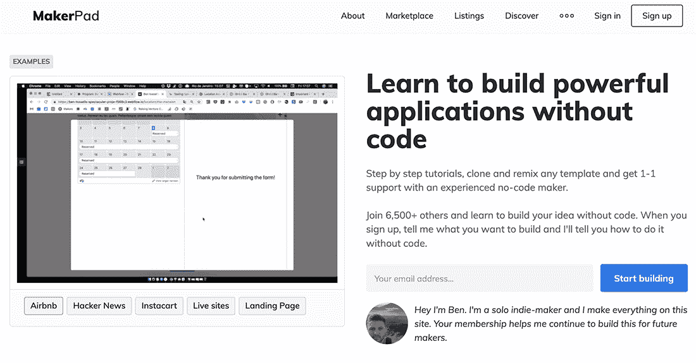
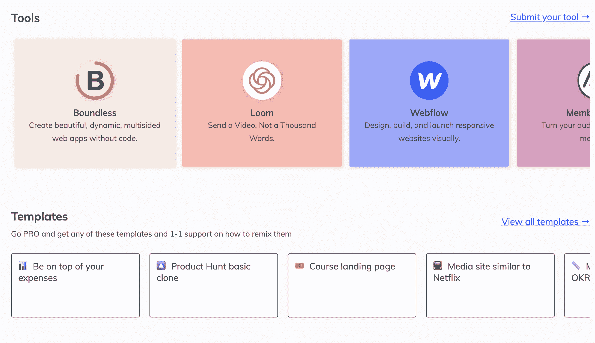

# 没有一行代码就启动了我的“一个人的公司”

> 原文：<https://www.indiehackers.com/interview/bootstrapping-my-company-of-one-without-a-line-of-code-9d19bf8b6c>

## 你好！你的背景是什么，你在做什么？

嘿，我是 Ben Tossell，我在运营一个名为 [Makerpad](https://makerpad.co/) 的小型副业项目，我在那里教人们如何不用代码来构建项目和工作流。我的“日常工作”是 [Earnest Capital](https://earnestcapital.com/) 的平台负责人，这是一种为创业者提供的另类融资模式。在 Makerpad 和 Earnest 之前，我曾领导产品搜索社区。

Makerpad 有教程、模板和交易来教别人如何建造东西。该社区包括来自各种背景和经历的人(24%是工程师！).2019 年 1 月至 4 月，Makerpad 的收入每月都在增长，目前为约 22K 美元/月(截至 2019 年 7 月)。

 

## 是什么促使你开始使用 Makerpad？

当我在 Product Hunt 工作的时候，我会看到这么多的工具发布。他们中的许多人可以帮助像我一样没有技术背景的人实际上*建立*一些东西。我开始修修补补，得到了制造者 bug。我最终推出了 30 个左右没有代码的产品，并以“没有代码”的人而出名。

当我离开 Product Hunt 时，我想知道我能做些什么来建立自己的事业。我到处做一些咨询和客户工作，以保持头脑清醒；后来，我在 IH 偶然看到一些经营电影放映业务的人的采访。

这引起了我的兴趣，而且这些业务产生了相当可观的收入。我想我可以做一些类似的事情，不用代码就能构建东西。我给一些订阅者发了电子邮件，告诉他们我正在做的事情，我让一些人立即付费(按月付费，每周发布新的截屏)。

简而言之，这部分真的与我无关。我试图在我的朋友穆巴拉克的帮助下建立“下一阶段”。我不断推动建立一个平台，然后建立这个东西和另一个东西。然后尝试向公司销售产品(这与最初的想法相去甚远)。事情变得一团糟，很明显没有什么是真正有效的，但我在抓救命稻草。

2018 年底，我开始重新评估我想要什么，我想经营什么样的企业，以及我希望它如何运作。我读了保罗·贾维斯的《一个人的公司》并决定剥离一切，专注于做得更少。其结果是 Makerpad。

| 月 | 收入 |
| --- | --- |
| 2018 年 7 月 | 38 |
| 18 年 8 月 | 2878 |
| 18 年 9 月 | 708 |
| 18 年 10 月 | 1075 |
| 11 月 18 日 | 3358 |
| 18 年 12 月 | 1138 |
| 19 年 1 月 | 3615 |
| 19 年 2 月 | 6850 |
| 19 年 3 月 | 13233 |
| 19 年 4 月 | 27654 |
| 19 年 5 月 | 19880 |
| 19 年 6 月 | 22145 |

## 构建最初的产品需要什么？

我的新重点是少做——所以这正是我所做的。

我在几个小时内建立了一个 Webflow 网站和一些密码保护的页面和教程页面。就是这样。我使用 Carrd 建立了一个单独的网站，这样我就可以轻松地接受 Stripe 支付，然后使用 Convertkit 发送我的欢迎电子邮件等。我使用 Airtable 作为我的数据库，并使用 Zapier 将所有的工具缝合在一起以实现自动化。看不到一行代码。:)

然后我开始制作一些教程。截屏业务比我想象的要困难得多，制作最终视频要花很长时间，所以我决定尝试用文字截屏。压力更小，花费的时间更少，而且我可以很快获得教程并发表。

没有太大的变化，这是故意的。我建立了这个平台，这样，如果会员数量翻倍，我就不会花费双倍的时间和成本。这正是它一直以来的样子。我已经开始为 Earnest Capital 工作，但 Makerpad 是为我打造的，所以我可以每周投入尽可能多的时间。

当需要或者我想测试什么的时候，我已经创建了更多的特性。该网站现在使用 MemberStack 来处理 Webflow 上的适当成员和配置文件，我们有一个松散的社区。我在网站上添加了这些模板，所以会员可以直接给我发信息，然后发到他们的账户上。

它完全是以每月不到 100 美元的运行成本启动的。

我审视自己正在做的那些不赚钱、不容易或者不能帮助用户的事情，我会重新思考这个过程。

TweetShare

## 你们是如何吸引用户，壮大 Makerpad 的？

对 Makerpad 来说有点奇怪的一件事是，无论我是否赚钱，我都会在没有代码的情况下进行实验和构建。我有一份热爱的工作，但 Makerpad 更像是一种乐趣。最终，我希望更多的人认识到他们不需要编码就能构建一些东西。这是我极力想传达的信息。

整个“吸引用户和增长”的事情对我来说不是一个大的焦点。不久前，我确实推出了一个产品搜索，但我甚至没有衡量它做得有多好。我在[Makerpad.co/open](Makerpad.co/open)公开了所有的统计数据，所以你可以看到什么时候发布(大峰值)。我想在发布日那天我已经绕过了 3K 的参观者。

我所做的主要是在推特上发布我所做的事情，以及它做了什么/如何做的一些细节。然后我会链接到网站和教程。我有一份大约有 6500 人订阅的时事通讯。我希望每周把我做的新东西发出去，但是如果我没有太多东西可以分享，我就不发了！我希望电子邮件的质量超过数量。

| 月 | 浏览量 |
| --- | --- |
| 18 年 10 月 | 13 |
| 11 月 18 日 | 3263 |
| 18 年 12 月 | 2443 |
| 19 年 1 月 | 13271 |
| 19 年 2 月 | 24289 |
| 19 年 3 月 | 30927 |
| 19 年 4 月 | 31085 |
| 19 年 5 月 | 39610 |
| 19 年 6 月 | 46280 |

Makerpad 目前有 152 名付费会员，但可能有近 300 名专业会员。这是因为我给科技和其他社区的女性提供了一些免费账户。

我不做任何新闻，公关，客座博文，内容营销，甚至 SEO。我知道这是我应该考虑的事情，但是 Makerpad 很有趣，我只想做我喜欢的事情。

Makerpad 的一个巨大且不断增长的部分是 [marketplace](https://www.makerpad.co/marketplace) ,在这里我列出了我推荐的工具，用于人们可能想要构建的某些类型的东西。我现在已经开始接触一些公司，将教育内容整合在一起，帮助非技术人员建立一些东西。到目前为止，已经有五家公司同意了，教程正在进行中，当它们发布的时候，我非常兴奋地大喊。

 

## 你的商业模式是什么，你是如何增加收入的？

我向会员收取 169 美元的终身会员费。我选择终生模型而不是每月模型的原因是，当我尝试我以前的想法时，每个月必须为用户创造那么多新价值的压力是巨大的。对我来说，每周尝试让新用户每月支付 19 美元并不是一个健康的状况。如果有人抱着可以在注册的第一周内获得全部 169 美元价值的心态来，那在我看来就更好了。

我还向市场上的公司页面和教育内容合作的公司收费。这是我最近决定做的事情，我认为这将是 Makerpad 模型的一个巨大部分(如果不是大部分的话)。当然，我完全从 [Lynne Tye 在 IH](https://www.indiehackers.com/podcast/086-lynne-tye-of-key-values) 的采访中窃取了这个想法，在那里，公司付费拥有他们自己的关键价值页面，她与他们合作制作内容。这就是我目前正在用 Makerpad 做的事情。

我一直认为，在感觉合适的基础上制定价格点，所以这就是我如何得出目前 169 美元的价格点。

我专门使用 Stripe，因为我只是在寻求方便和自动化。

找几个你可以成为朋友的人，他们也可以帮你理清头绪，让你重新考虑你的选择。

TweetShare

## 你未来的目标是什么？

我没有很大的目标，因为我认为，首先，我的收入目标已经超过了我对 Makerpad 几个月后的预期。我希望达到 30 万美元/年，但不能以不得不雇人、在网站上花更多时间等为代价。如果我能做到的话，我会把它归类为一个附带项目的巨大里程碑。

最后，我很乐意教尽可能多的人不用代码来构建。我认为这也是一个很难设定的目标。

## 你面临的最大挑战和克服的障碍是什么？如果你必须重新开始，你会做什么不同的事？

由于 Makerpad 是我的“重新开始”，我对它目前的进展非常满意。总是有更多我可以做的，但我一直对自己很严格，努力不让它进入我的大脑，让我做我不想做的事情。

我列出了我希望 Makerpad 如何工作的清单，并不时地重新审视它。我审视自己所做的不赚钱、不容易或者不能帮助用户的事情，我会重新思考这个过程。

## 有没有发现什么特别有帮助或者有优势的？

实际上，采访、播客、文章、书籍等等都是噪音。(是的，我在这里得到了讽刺。)但我认为，只需要这些内容中的一两条，就能真正与你对话，让你思考自己在做什么。

保罗·贾维斯的公司对我来说很棒。我不会假装书中的一切都令人大开眼界，但它真的让我大吃一惊，让我意识到，“这就是我想要做的，这就是我想要建立它的方式。”

听听 Lynne 在 IH 的播客，了解她是如何建立我一直在寻找的那种类型的企业的，也很有帮助。我们现在是朋友，她时不时在 Whatsapp 上给我打个电话，这很有帮助。

找几个你可以成为朋友的人，他们也可以帮你理清头绪，让你重新考虑你的选择。你只需要几个。太多了，你就完了。

无代码运动是我没有选择进入的必要的东西；我只是不想编码。我的观点一直是，我想建立[在此插入新的想法]，它可以像一个“Airbnb”一样。考虑到这一点，我不想花九个月的时间学习不同的编程语言来构建一个平庸的版本。可能永远都行不通！所以我宁愿找到能让我达到 80%的工具。我用 Webflow、Airtable 和 Zapier 创建了一个 Airbnb 克隆版，这是 Makerpad 上点击率最高的教程。

随着越来越多的人看到它的力量，无代码似乎越来越成为主流。许多技术人员看到了在没有任何技术瑕疵的情况下构建和验证某些东西的好处。但我看不到这一点，因为你要么在代码团队，要么在非代码团队。使用最适合你的。

## 对于刚刚起步的独立黑客，你有什么建议？

弄清楚你真正想要经营的企业类型。日复一日，或周复一周，它看起来像什么？你想如何度过你的大部分时间？你希望有 50 个客户的企业看起来怎么样？100?500?你*到底想从中得到什么？这是你想每年花不到 5000 美元就能得到 30 万美元的东西吗？还是真的想走创业/风投这条路？认真思考这个问题，真实地面对自己。我觉得很多人都做了假设，没有充分考虑。*

## 我们可以去哪里了解更多？

你可以在 Twitter [@bentossell](https://twitter.com/bentossell) 和 maker pad[Makerpad.co](https://www.makerpad.co)找到我。

请随意问我问题，或者更好的是，如果你有一个想法，但不知道如何在没有代码的情况下构建它，请告诉我，我会尽力推荐你应该开始使用的工具。

—[<picture id="ember8002952" class="user-avatar ember-view user-link__avatar"></picture>本·托塞尔](/bentossell?id=fOQ0exqnB5UmndRl8bgGAortnbt1)，Makerpad 的联合创始人

## 想像 Makerpad 一样建立自己的事业？

你应该加入独立黑客社区！🤗

我们是几千名创始人，互相帮助建立有利可图的业务和副业。来分享你正在做的事情，并从你的同事那里获得反馈。

还没准备好开始使用你的产品吗？没问题。这个社区是一个认识人、学习和实践的好地方。随意[随便浏览](/)！

——[<picture id="ember8002957" class="user-avatar ember-view user-link__avatar"></picture>柯特兰艾伦](/csallen?id=ibTLPyjwVebnZjMGKvz6ztarnuV2)，独立黑客创始人

56votes