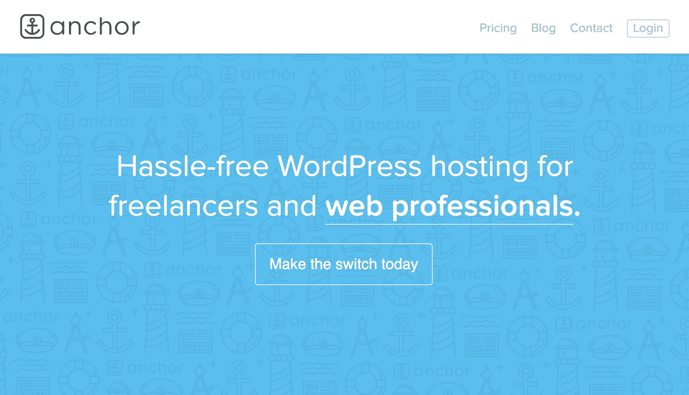
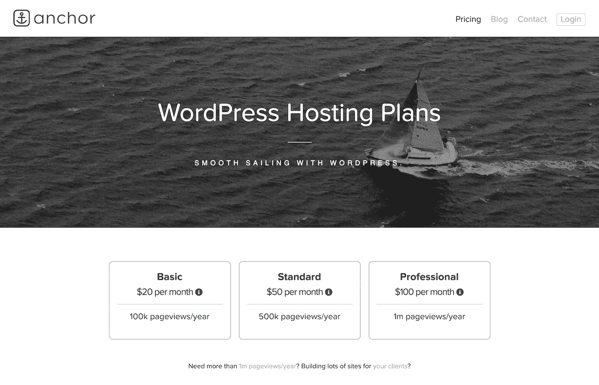
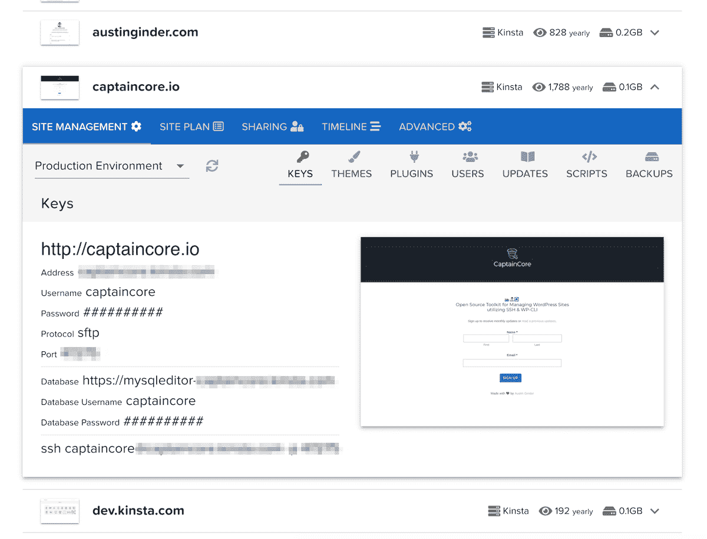

# 将我的白日梦变成每月 2 万美元的生意

> 原文：<https://www.indiehackers.com/interview/bootstrapping-my-daydream-into-a-20k-month-business-70a2c06da1>

## 你好！你的背景是什么，你在做什么？

嗨，我叫奥斯汀·金德。我是宾夕法尼亚州兰开斯特的一名网站开发人员。我运营[主播托管](https://anchor.host)，为[的网络专业人士](https://anchor.host/wordpress-hosting-web-professionals/)提供无障碍的 WordPress 托管服务。我通过使用其他托管服务提供商来做到这一点，比如 [Kinsta](https://kinsta.com/) ，并捆绑了我喜欢称之为 WordPress 维护要点的东西，意思是每个 WordPress 网站都需要的基本维护服务。不多也不少。

我一直对技术感兴趣。高中期间，我在放学后做兼职，在暑假期间，我修理和制造电脑，建立电脑网络，编程等等。我的第一份全职工作是在我叔叔的电脑商店工作，为当地的小企业提供 IT 支持服务。另外，我开始为小企业建立 WordPress 网站，这很快占据了大部分晚上和周末的时间。2010 年 7 月，我决定辞掉工作，开始为自己工作，从那以后，我一直全职为自己工作。

我在五年前推出了主播主持，但这是一个非常缓慢的过程，并弄清楚应该关注什么。刚满 34 岁的我，感觉是时候做这个采访了。在过去的几周里，我一直处于自我反省的状态，公开透明是我的核心价值观。本着这种精神，所有运行 Anchor Hosting 的代码都是完全开源的。

作为一名独立开发者，我目前为 900 多个 WordPress 网站提供托管服务，平均月收入为 19，750 美元。

 

## 是什么激励你开始做主播？

2007 年初，当我还在做全职工作的时候，我就有了虚拟主机的想法。虽然它在其他方面并不起眼，但这个时刻仍然让我记忆犹新。一天晚上，我开车去见一位客户，像开车的人一样沉思着，心想:“我真的想做 IT 支持工作吗？还是我想做点新的？为什么不是虚拟主机？”当时，我白天全职为小企业客户提供 IT 支持，晚上和周末，我也会为自己的住宅客户做同样的工作。别误会，我热爱我的工作。我只是觉得追求一些不同的东西来增加情趣不会有什么坏处。

转变到一个新的、相对未知的领域在很多方面都是有帮助的。学习新的东西既有挑战性又很有趣，但是，重要的是，当我要辞职的时候，这意味着我可以很好地工作。事实上，我的雇主给他们所有的联系人发了一封电子邮件，解释说我正在开创自己的事业，并宣传我新的网络开发追求。

虽然我一直有做虚拟主机的总体想法，但我花了几年时间才真正弄清楚它到底是什么样子，以及如何实现它。起初，这仅仅意味着我建立的任何 WordPress 网站都需要客户和我一起托管——我对此很固执，这也是我的网站提案的一部分。如果客户不想让我主持，我就不会接这个项目。在开发 WordPress 网站几年后，我得出结论，开发网站是一种非常糟糕的网络托管业务。在好的一年里，我只能浏览大约 20 个新网站。

2014 年，我创建了主播主持。我拿下了我目前的网站，上面列有我的网络开发服务，换成了托管网站，并从主播开发更名为主播托管。那时，我 25%的收入来自虚拟主机，75%来自网络开发。我给所有的联系人发了一封电子邮件，告知他们新的业务名称，并让他们知道我计划在未来几年减少网络开发人员的工作，从而引入了主播托管。

我不认为收入或客户数量是成功的标志。真正重要的是建造实际解决问题的东西。

TweetShare

我一直觉得提供商提供的虚拟主机和小企业需要的之间有很大的差距。我觉得缩小这个差距最简单的方法就是在中间安插一个像我这样的 web 开发人员来填补这些差距。我没有成为一名系统管理员，而是利用了其他托管平台，这使我能够专注于解决直接影响小型企业客户的问题。

## 构建最初的产品需要什么？

一开始，我只是在转售 WordPress 主机。没有产品——我就是产品。我经常认为我早期的主机服务是“无面板”主机的替代方案。不需要主持人小组，只需要我处理所有的技术部分，比如网站迁移、网站监控、DNS/域名管理、WordPress 安全更新和修复。我强大的技术支持背景非常有帮助。我对 WordPress 维护更新非常积极，这有助于在问题变成问题之前解决很多问题。

这些年来，我已经把我的客户从 [MediaTemple](https://mediatemple.net/) 过渡到 [WP Engine](https://wpengine.com/) ，现在又过渡到 [Kinsta](https://kinsta.com/) 。作为一个主机经销商，我可以保持客观，只是选择我认为最适合我的客户的主机。我不局限于任何特定的公司。事实上，我通常一次利用几个提供商，充分利用每个提供商的优势。

直到 2018 年初，我才正式开始开发自己的 WordPress 管理工具包，这是我今天如何经营业务的核心部分。为了开始，这些花哨的自动化或脚本都不是必需的。

## 你是如何吸引用户和培养主播的？

加入兰开斯特的[糖果厂](https://candyissweet.com/)，一个合作空间是巨大的。我是通过第一次 [WordPress Lancaster Meetup](https://www.meetup.com/WordPress-Lancaster/events/55152212/) 被介绍到联合工作空间的，Meetup 和联合工作空间都极大地扩展了我的人脉。糖果工厂非常需要网络开发人员。我发现自己被其他为客户制作 WordPress 网站的牛人所包围，并最终和他们一起工作在他们项目的各种技术部分。当我把注意力从网站开发转移到虚拟主机上时，这些关系中的大部分最终都把他们客户的网站带到了虚拟主机上。

主播通过口口相传发展起来。几乎所有新的主机客户都是通过与网页设计者、网页开发者和代理商的现有关系而来的。我发现大部分人都用网站创建者推荐的主机来托管他们的 WordPress 网站。正因为如此，我没有花任何时间或精力对客户进行营销或广告，而是专注于吸引网页设计师、网页开发人员和代理商，他们会有机地向我推荐客户。

以有节制的速度增长可以让您与您的企业一起成长。

TweetShare

我每周都在[主播的博客](https://anchor.host/blog/)上发帖。通过坚持写作，我被迫不断学习、成长，并追求新的技能和兴趣。如果我没有什么可写的，那么我可能没有做什么太令人兴奋的事情。虽然少数开发人员是通过博客找到我的，但大多数人是通过口口相传认识我的。因此，我的大部分客户都来自我所在的地区。

这是一件好事，有机增长一直在工作，因为我讨厌销售。我不做广告，也不打算做广告。我发现，我通过个人推荐获得的客户比那些通过链接或其他方式偶然进入我的网站的客户质量高得多，所以我没有专注于广告，而是努力帮助人们，建立关系，并尽可能提供最好的托管服务。

幸运的是，在 WordPress 社区有很多回馈的方式。这些年来，我帮助组织并在 [WordCamp Lancaster](https://twitter.com/WordCampLanc) 上发言，领导了许多 [WordPress Lancaster 聚会](https://www.meetup.com/WordPress-Lancaster/)，并参加了 [WP-CLI](https://make.wordpress.org/cli/handbook/contributing/) 。每当参加会议或聚会时，我总是在寻找帮助他人和回报他人的方法，我看不到这种增长策略会很快改变。

## 你的商业模式是什么，你是如何增加收入的？

我通过出售按月或按年订阅的主机方案来赚钱。就是这样。我没有转售或贴白标的选择。我没有附属计划或伙伴关系。我没有任何合同或利润分成。我从来不搞促销或打折。如果一个机构想和我合作，他们只需要让我根据我的一个计划旋转每个网站，然后从那里开始，简单明了。没有报名流程，只需[给我发邮件](https://anchor.host/contact/)。

 

我发现大多数机构最终提供虚拟主机是出于必要，而不是因为他们想或喜欢处理与主机相关的技术问题。我帮助代理公司节省时间，为他们的客户处理托管和技术问题，让他们专注于实际建设网站。由于经纪公司工作的性质，主播的增长会呈爆发式增长。我接手的每个机构可能有 20 个、50 个或 100 多个现有网站需要迁移。

自从接待了第二个顾客后，我一直在赚钱。我把我的第一批虚拟主机客户放在一个 MediaTemple 网格账户上，尽管每月支付 20 美元，而且只有两个客户，我还是盈利了。第一个客户每月支付我 20 美元，这足够支付托管费用，所以第二个托管客户是纯利润。诀窍是慢慢适应，同时通过一份全职工作或其他咨询服务获得报酬。从我宣布主播托管到我完全被网络托管支撑，已经过去了三年。

虽然这些年来虚拟主机的成本变化很大，但我发现不管我托管了多少网站，我的业务都存在相同的基本故障。对于我卖出的每个月 20 美元的基本计划，大约一半涵盖了我的原始托管费用，而另一半涵盖了我的时间和精力。除此之外，还有很多东西，像域名和其他插件，我收取的费用非常接近他们的成本，并捆绑了主机计划，以方便使用。这意味着，总的来说，我的利润很低。目前，我估计大约有 1000 个网站可以轻松维持一名员工，但是，我看不出为什么这个比例不能通过更好的工具来提高，以减少对技术支持的需求。

| 年 | 收入 |
| --- | --- |
| 2013 | 6100 |
| 2014 | 38500 |
| 2015 | 78500 |
| 2016 | 127500 |
| 2017 | 189000 |
| 2018 | 222000 |

## 你未来的目标是什么？

CaptainCore 是一个我正在开发的[开源](https://github.com/CaptainCore/) WordPress 管理工具包。这是我的客户登录主播后台时看到的。它仍处于开发早期，还没有准备好正式发布，但我会在 Github 上发布[每月的进度更新](https://captaincore.io/email-updates/)并上传所有内容。

技术支持是一个永远不会消失的创可贴，除非有人首先花时间和精力来解决为什么需要技术支持。CaptainCore 是这种追求，也是主播主持的未来。这是为我自己构建更好工具的一次尝试，也是让我的客户自己做更多事情的一次尝试。💪

我不认为收入或客户数量是成功的标志。对我来说，真正重要的是构建实际解决问题的东西。如果通过软件开发，我能够用我一半的支持时间支持相同数量的客户，那么我会认为我正在做的事情是一个巨大的成功。

我是开放网络的忠实支持者。对于每一行专有代码，都将进行开源复制。代码是为了我们独特的目的而自由共享和改编的，我不想经营一家销售专有软件的公司。相反，我想要一个通过销售基于软件的技术支持来维持的企业，这些软件可以免费提供给其他人使用，并根据他们的意愿进行定制。我相信很多 WordPress 维护的毛边，只会通过开源的解决方案来解决。

提供有用支持的人，永远有赚钱的机会。如果我写的任何代码对他人有所帮助，那么我所做的一切都是完全值得的。

 

## 你面临的最大挑战和克服的障碍是什么？如果你必须重新开始，你会做什么不同的事？

老实说，我的个人生活比我在创业过程中遇到的任何事情都更具挑战性。我有意地接受了这个挑战，因为我和妻子在扩大我们的家庭的同时，开始在寄养系统中收养孩子。在三年的时间内，我们从没有孩子到有了六个孩子，三个是亲生的，三个是寄养的。这是一个漫长的过程，但最终，我们收养了每一个通过寄养来到我们家的孩子。

工作只是我在将寄养家庭引入我的家庭生活的混乱中所做的事情。有趣的是，尽管我们的家庭生活越来越多地占用我越来越多的时间，我还是设法完成了同样多的工作。在某种程度上，在我的个人生活中鞭策自己，拓展自己的极限，迫使我在仅有的一点时间里，高效地专注于我的事业。

重新开始，我想我会写更多。写作是我最近几年才养成的习惯。回头看看我刚开始工作时的想法会很有趣，但我没有太多开始主持之前的东西。我大部分时间都是在单调的工作模式下制作 WordPress 网站。

## 有没有发现什么特别有帮助或者有优势的？

首先，每个人都应该读一读迈克尔·葛伯的《重温电子神话》。这本书提供的见解帮助我从一个刚刚在企业工作的人转变为一个正在经营企业的人。有一段时间，我觉得我的副业没有什么帮助，也没有把它们看作是建立企业的大机器中的一个小组件。但事实证明，我的许多副业项目，包括我认为无关紧要的项目，都带来了实实在在的好处，比如更高效的网站备份、更好的网站监控和更快的网站迁移等等。

我妻子非常支持我。时机也很完美。我们刚结婚时，我开始考虑自己创业，因为那时我们没有孩子要抚养，所以风险很小。她鼓励我去争取。谢谢你[凯茜](https://austinandcathy.com/)给我追求梦想的自由。你太棒了！🏅

你要记住，生活不仅仅是你一个人的事。有一个平衡。有时我是追求梦想的人，而有时我支持我妻子的追求。实际上，这意味着我们每个人都需要在家庭角色和短期内如何看待我们的未来方面保持灵活。我妻子和我会经常花时间一起梦想我们的未来。这些异想天开的小时刻是至关重要的，因为它给了我们每个人不受任何阻碍地进行头脑风暴的空间，并共同建设一个我们都可以自豪的未来。

## 对于刚刚起步的独立黑客，你有什么建议？

如果你不知道自己在做什么，我会说这完全没问题。对我来说，我只是有一个大致的方向和一个巨大的愿望去做一些自己的事情。我不知道我在做什么。当我第一次辞职时，我尝试了各种各样的方向——从零开始定制 WordPress 站点，托管 WordPress 站点，以及开发定制的 Ruby on Rails 应用程序。更不用说我写的、但从未抽出时间去做的应用创意的整个笔记本了。

当你被迫使用你现有的资源来制造东西时，效率的世界就产生了。

TweetShare

这是完全正常的。我最终找到了答案，但是很慢，而且经过了大量的尝试和错误。我热爱我所做的事情，每天都非常兴奋。每个人都有可以贡献的东西，一个自己可以解决的痛点，哪怕是自己的痛点。

对资助说不。我是 100%自力更生的，从来没有打算拿别人的钱。当你被迫使用你现有的资源来制造东西时，效率的世界就产生了。如果我想加速增长，我总是可以投资营销和广告，但只有当我准备好并能够维持这种类型的增长时。以有节制的速度增长可以让您与您的企业一起成长。

## 我们可以去哪里了解更多？

你可以在推特上找到我。我每周在[主播⚓](https://anchor.host) 的博客上写文章，每月更新 [CaptainCore](https://captaincore.io) 的内容。如果你只是想打个招呼，请随时问我以下任何问题或伸出手来。

—[<picture id="ember8116751" class="user-avatar ember-view user-link__avatar"></picture>奥斯汀·金德](/austinginder?id=IHK0T08L8GfLCAuHW6tVpxbVl663)【主播主持创始人

## 想像主播主持一样自己创业？

你应该加入[独立黑客社区](/)！🤗

我们是几千名创始人，互相帮助建立有利可图的业务和副业。来分享你正在做的事情，并从你的同事那里获得反馈。

还没准备好开始使用你的产品吗？没问题。这个社区是一个认识人、学习和实践的好地方。随意[随便浏览](/)！

—[<picture id="ember8116756" class="user-avatar ember-view user-link__avatar"></picture>考特兰艾伦](/csallen?id=ibTLPyjwVebnZjMGKvz6ztarnuV2)，独立黑客创始人

39votes