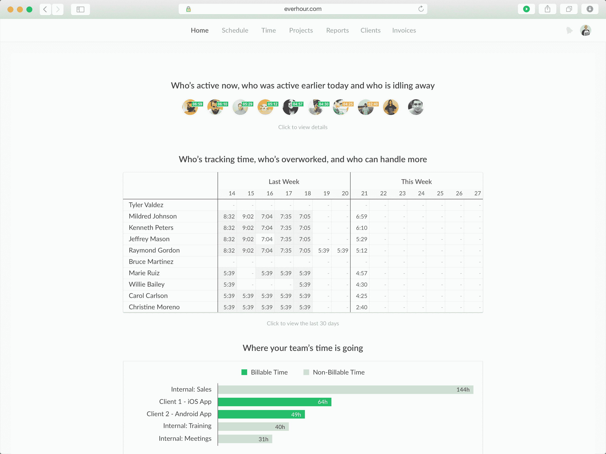
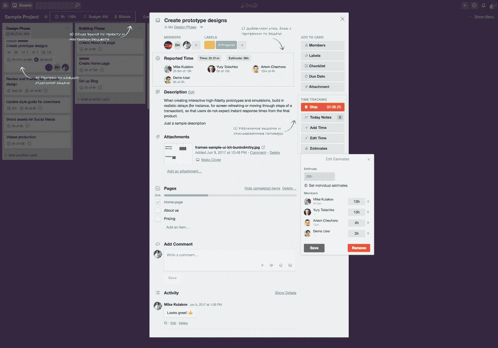
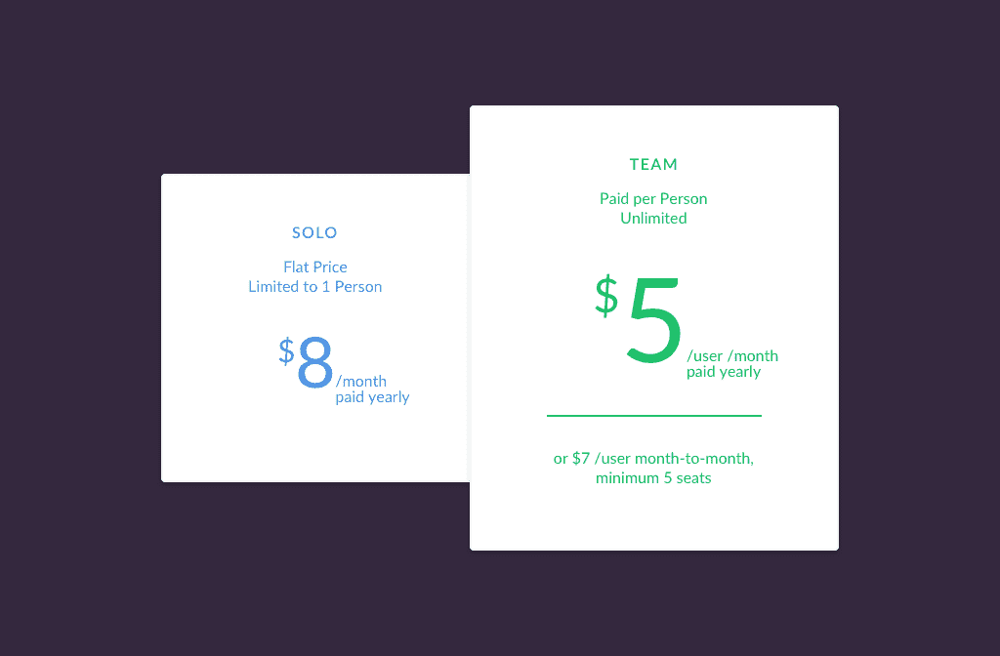
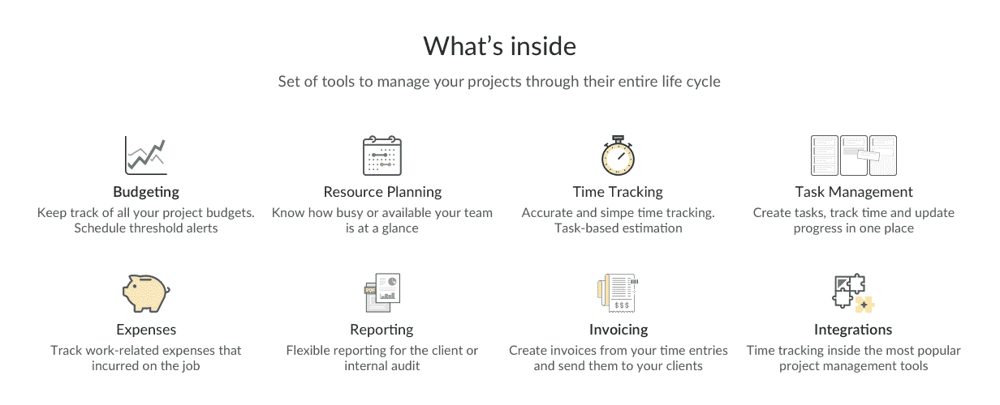

# 将我的副业项目发展成 140 万美元的 SaaS 业务

> 原文：<https://www.indiehackers.com/interview/bootstrapping-my-side-project-into-a-1-4mm-saas-business-b19daa40c6>

## 你好！你的背景是什么，你在做什么？

我叫迈克·库拉科夫。我是一名来自白俄罗斯的 IT 企业家、高管和前工程师。

2010 年，我创办了我的第一家公司，Weavora。这是一个小型网络开发机构，与企业合作，帮助他们开发产品和服务的应用程序。几年后，我们考虑推出一款 SaaS 产品——[ever hour](https://everhour.com/)——weavera 的部分利润被再投资到它的开发中。

截至今天，我们有来自 70 个国家的 2300 多个付费团队。我们的客户最喜欢的是我们如何流畅地集成到第三方项目管理系统中。假设你的团队使用体式，你所有的任务都在那里，工作人员也在那里。为什么不断地在体式和时间追踪器之间转换？为什么要重复数据？取而代之的是，每小时连接一次体式，在那里记录时间。我们整合了 Asana、Basecamp、Trello、吉拉、GitHub 等等。

我们在 2015 年 9 月收到了我们的第一个付费客户，从那以后一直在稳步增长，没有任何外部投资，只有一个七人的小团队。本月，Everhour 的票房突破了 140 万美元大关。

 

## 是什么促使你开始使用 Everhour？

我们花了一段时间才想出该做什么，但我们一直想打造一个产品。

Everhour 的理念源于我们在 Weavora 的内部需求。我们从事外包项目，需要根据实际花费的时间向客户报告并开具发票。起初，我们使用现有的工具，但很快意识到我们可以提供更好的东西。

我们从第一手经验中非常清楚这个问题，可以自己测试产品，不断调整和改进它。此外，时间跟踪和时间管理是几乎所有业务的基础，向潜在客户解释起来相当简单，并且可以用一年内不会过时的解决方案来解决。

另一个重要的推动因素是我们商业模式的转变。从事外包项目肯定比盈利产品更容易组织，但多年来我们逐渐看到了一些负面影响。你经常面临截止日期，不是项目的所有方面都取决于你或在你的控制之内，工作也不稳定——当一个项目结束时，你永远不知道要多久才能找到一个新的。没有正在进行的项目意味着现金的减少，就像有人去度假，因为假期而慢下来，等等。很烦。

最后但并非最不重要的一点是，SaaS 让你在保持小规模的同时扩大规模。

## 构建最初的产品需要什么？

我经常被问到我们产品的技术堆栈。在我看来，这不是很重要。我们做出了一个选择，以我们的员工和他们的专业知识为出发点来制造产品。使用你有经验和自信的工具是很重要的。当你有成百上千的付费客户，并试图解决服务器上难以理解的问题时，你可能不会考虑最新的趋势。或许同样重要的是找到一位杰出的联合创始人/首席技术官。我很幸运有一个。

一些好的想法需要时间来成熟。

TweetShare

2013 年 6 月，我们做出了第一个 MVP，开始使用。不久之后，我们将它免费公之于众。当时，我们仍然不确定这是否是一个好产品，需要外界的反馈。在我们有神奇的“啊哈！”之前，有多个支点瞬间。有关我们流程的更多信息，您可以阅读这篇关于[我们如何找到适合](https://medium.com/everhour/our-story-a353023f1c5c)市场的产品的文章。

2015 年 9 月，我们决定更有意识地开始开发该产品，并雇佣了专门的人员，取消了免费版本，引入了付费计划。从那以后，我们每年都以超过 100%的速度增长。

Everhour 是作为一个附带项目开始的。每当有机会的时候，我们就在项目之间的间隙工作。如今，很难说我们在 Everhour 上投入了多少时间和金钱，因为开发已经持续了很长时间，我们只是偶尔参与。此外，我不认为这个应用程序目前是一个成品。它在不断地发展和迭代，即使是现在，我们也有未来几年的想法。

 

## 你是如何吸引用户并持续增长的？

在提出产品想法后，我们立即开始吸引人们来我们的未来项目，这样当我们推出时，我们已经有客户了。为了简单起见，我们创建了一个非常简单的“即将推出”页面。当页面准备好了，我们把它提交给 Beta List 和几个目录。这让我们在发布后就有了大约 1500-2000 名早期用户。

我们还在 Reddit、StumbleUpon、Google Adwords、Twitter 和脸书上测试了付费广告。不便宜，但是见效快！它在测试假设方面工作得很好。就长期吸引付费客户而言，这要看情况。到目前为止，我们还不能使这个过程有效，很可能是因为我们的无常。这些渠道不会一蹴而就，需要做大量的工作来研究、设计、测试、不断优化你的文案和登陆页面，需要多个专用资源。如果支票金额较低(低于 50 美元)，这就更具挑战性了。

最有效的三个策略是整合、合作伙伴目录列表、撰写 SEO 文章和口碑传播(由于不断的产品改进)。尤其是合作伙伴目录产生了高质量的流量。

## 你的商业模式是什么，你是如何增加收入的？

我们从付费订阅中赚钱。

最初，我们开始按团队套餐计费(1 个用户= 7 美元/月，2-5 个用户= 19 美元/月，6-15 个用户= 39 美元/月，以此类推)。这样做的好处是在软件包中添加或删除成员时没有比例。不利的一面是转换的代价。如果一个客户有 15 个用户，他们会感到满意，觉得他们的钱花得值，尽管当人们在高端用户群中管理团队时，我们的利润会减少。只要客户再增加一个会员，价格就会大幅上涨，他们会立即给我们写信，要求打折。作为一家公司，你不能从现有的客户群中成长。

在第二个版本中，我们开始对每个用户单独收费。我们还尝试按功能(高级与基本)划分计划，但没有足够的升级来证明不同层的合理性。最后我们退了钱，给大家换了一个方案。

 

年度订阅在各方面都很有效。他们增加你的现金流大约 15%的 MRR。对于客户来说，这是一个节省和减少发票数量的机会。对你来说，这是终身价值的增加和增长的前期资金。

我们使用 Stripe 作为支付网关，到目前为止非常满意。它通过在支付失败时发送电子邮件和在关键时刻重试卡来自动恢复可能不成功的支付。另一个很棒的功能是 Stripe 如何处理过期的卡。如果您的客户从他们的银行获得一张新卡(或者号码或有效期改变)，他们必须手动重新添加它。有了 Stripe，即使银行更换了实体卡，他们的卡也能继续使用。Stripe 直接与卡网络配合使用，因此您的客户可以不间断地继续使用您的服务。对于经常性支付的 SaaS 企业非常有利。

每个 SaaS 产品都应该跟踪关键指标，如 MRR、收入增长、流失率等。我们使用 [ProfitWell](https://www.profitwell.com/) ，我强烈推荐它。

## 你未来的目标是什么？

杰森·弗里德说得好，“你最好在前进的过程中用一千个小的输入来驾驶这艘船，而不是提前做几个大动作。”按照这种风气，我们尽量不为超长期的未来制定硬性的计划。

我们目前关注的领域:

*   后端的扩展改进
*   招聘。不再是多面手了
*   基于客户反馈的一长串功能改进

 

## 你面临的最大挑战和克服的障碍是什么？如果你必须重新开始，你会做什么不同的事？

老实说，我不会改变什么。我们从每一个错误和每一个决定中吸取了教训，无论是好是坏。而一些好的想法需要时间来成熟。

我认为最大的挑战是将我们外包项目的工作与我们自己的产品开发结合起来。很难找到时间来完成这一切，也很难看到隧道尽头的曙光。我们必须在当前项目、与现有客户的沟通以及产品开发和营销上投入相同的时间。没有办法把所有的事情都安排在一个正常的工作日里，我们不得不加班来弥补。有时会令人沮丧。主要的问题是找出如何集中我们的工作，避免陷入混乱或放弃。

自举的好处是，它迫使你更快地启动，并在深入研究之前验证你的假设。

TweetShare

像我们这样的企业往往没有其他选择，只能依靠自力更生和生活方式的改变来维持运转。时间追踪并不是一个性感的话题。尽管我们正在解决一个重要的问题，但我们并没有拯救世界。因此，顶级新闻资源(TechCrunch、Mashable 等。)对我们并不感兴趣。同样，投资者也不认为美国是一个好的退出渠道。不管怎样，实现盈利是必须的，所以你要做你必须做的。要么这样，要么失败。

自举的好处是，它迫使你更快地启动，并在深入研究之前验证你的假设。花自己的钱让你对成本更加小心，并(希望)迫使你分清轻重缓急。

## 有没有发现什么特别有帮助或者有优势的？

就产品推广而言，构建整合并在合作伙伴名录上上市是我们所能做出的最佳决策。Asana 或 Basecamp 都在他们的网站上有一个整合部分，你可以在那里发布关于你的产品的信息，这可以为你的网站带来大量的流量。

除此之外，如果你的集成是有用的，并且为他们的用户增强了他们的产品，你就使他们的产品更好，并且让他们的用户和他们呆得更久。来自合作伙伴目录的销售线索转化率约为 30%，因此这是一个双赢的局面。

我强烈推荐使用你自己的产品。这可以快速而廉价地向你展示你的产品是否物有所值，并让你对用户体验有非常宝贵的洞察力。综合测试有时会检测不出严重的问题。

## 对于刚刚起步的独立黑客，你有什么建议？

你的产品应该有明显的优势，你应该尽快弄清楚那是什么。在我们的例子中，它是我们嵌入第三方工具的方式。我们没有免费计划，与竞争对手相比功能更少，没有移动应用程序，等等。，但许多用户仍然更喜欢我们。为什么？因为我们做了一件非常非常好的事情。这就是我们的优势所在。

寻找对你所有新特性的批评，并试着从各种来源中寻找。争议服务于完美的事业。

TweetShare

不要试图让每个新功能都尽善尽美。最好简化你的产品，快速发布，展示给你的客户，收集他们的反馈，然后改进。寻找对你所有新特性的批评，并试着从各种来源中寻找。争议服务于完美的事业。

尽早开始在热门网站如 Capterra 或 G2crowd 上收集正面反馈。在准备一篇文章时，一些博主会根据这些网站上的评论和/或人气来决定包含哪些产品，因此积极的存在可以对潜在的免费广告和流量产生下游影响。

不要以任何方式追逐交通。确保你在不同目录中的简介是相关的，你的博客内容是可操作的和独特的。少即是新的多。

## 我们可以去哪里了解更多？

点击了解更多关于 Everhour [的信息。](https://everhour.com/)

你可以查看我在[我的媒体](https://medium.com/@citizenblr)中涉及的其他话题。如果时间允许，我尽我所能分享我的经历。

如果任何人有任何问题，请留下评论，我很乐意帮忙。感谢阅读。

——[<picture id="ember8113241" class="user-avatar ember-view user-link__avatar"></picture>迈克·库拉科夫](/evermike?id=RmKzjUbsH7e9PtXeomtC0Yxp4az1)【ever hour】创始人

## 想像 Everhour 一样建立自己的事业？

你应该加入[独立黑客社区](/)！🤗

我们是几千名创始人，互相帮助建立有利可图的业务和副业。来分享你正在做的事情，并从你的同事那里获得反馈。

还没准备好开始使用你的产品吗？没问题。这个社区是一个认识人、学习和实践的好地方。随意[随便浏览](/)！

——[<picture id="ember8113246" class="user-avatar ember-view user-link__avatar"></picture>考特兰艾伦](/csallen?id=ibTLPyjwVebnZjMGKvz6ztarnuV2)，独立黑客创始人

94votes